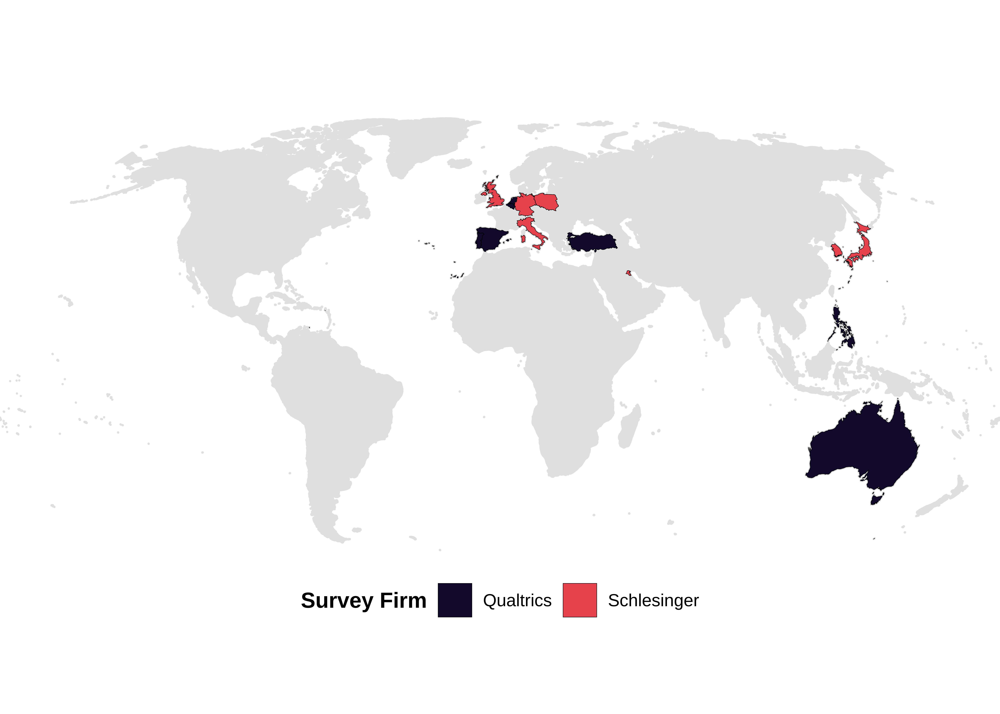
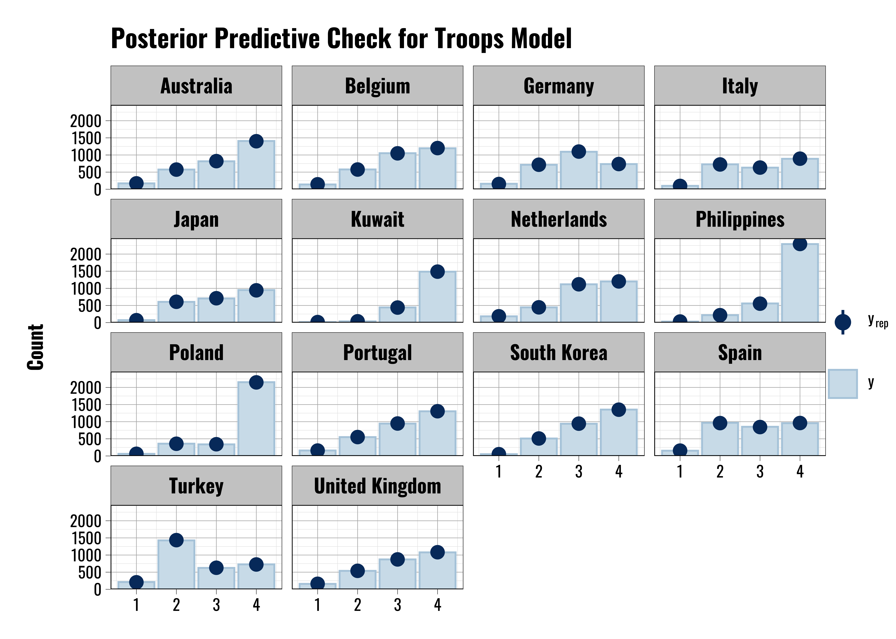
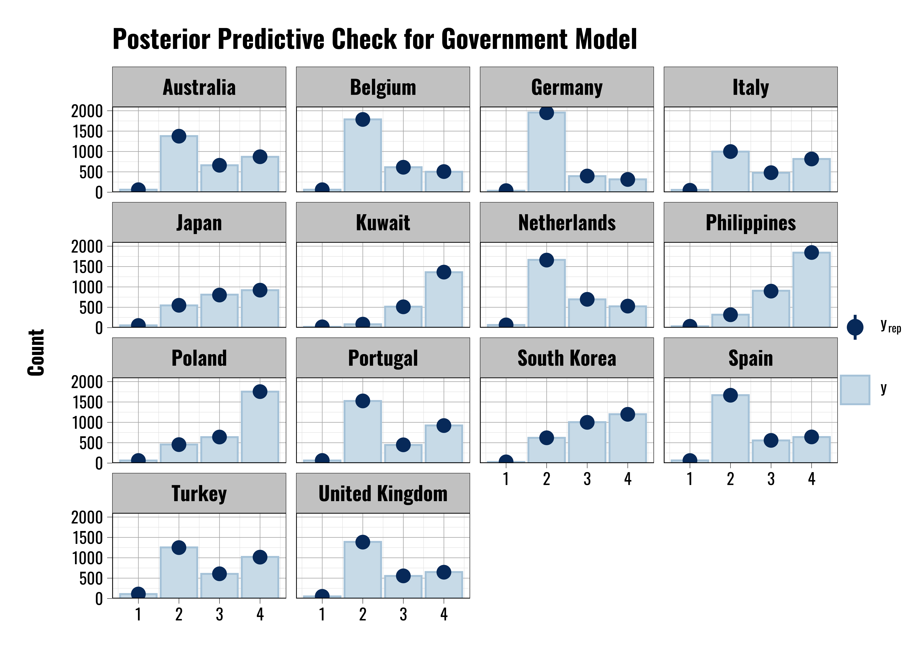

# Deployments and Contact {#contact-benefits}

This chapter contains supplementary information on the chapter exploring how contact and benefits relate to individual attitudes.

## Survey Information

1 - Country Abbreviation (iso3c). \
Uses the ISO3C abbreviation format.
  
  Values:
  
  AUS - Australia \
  BEL - Belgium \
  GMY - Germany \
  ITA - Italy \
  JPN - Japan \
  KUW - Kuwait \
  NTH - Netherlands \
  PHI - Philippines \
  POL - Poland \
  POR - Portugal \
  ROK - South Korea \
  SPN - Spain \
  TUR - Turkey \
  UKG - United Kingdom \
    
2 - Language
  
  The language the respondent took the survey in.
  
  Values:
  
  1 - English \
  2 - Dutch \
  3 - French \
  4 - German \
  5 - Italian \
  6 - Japanese \
  7 - Arabic \
  8 - Tagalog \
  9 - Polish \
  10 - Portuguese \
  11 - Korean \
  12 - Spanish \
  13 - Turkish \
    
### Dependent Variables

This subsection shows the available responses for the three questions that serve as the basis for our dependent variables. Please note that we recode these variables when we estimate our categorical logit models. For our primary models we collapse the six original categories down into four: 1) Positive views, 2) Negative views, 3) Neutral views, and 4) Don’t know/Decline to answer. This approach has a couple of advantages. First, while we prefer to collect data at a fine-grained level, we have little empirical or theoretical basis for evaluating the substantive difference between the "Somewhat" and "Very" categories. However, there is a clearer and more meaningful distinction between positive and negative views. Second, the simpler saves us a considerable amount of time given the computational intensity of the multilevel categorical models, which we discuss more below.

3 - Question: US Military Presence (troops_1) \
"In general, what is your opinion of the presence of American military forces in (respondent’s country)?"
  
  Values:
  
  1 - Don’t know/decline to answer \
  2 - Very favorable \
  3 - Somewhat favorable \
  4 - Neutral \
  5 - Somewhat unfavorable \
  6 - Very unfavorable \

4 - Question: American Government (american_gov) \
  "In general, what is your opinion of the American government?"
  
  Values:
  
  1 - Don’t know/decline to answer  \
  2 - Very favorable \
  3 - Somewhat favorable \
  4 - Neutral \
  5 - Somewhat unfavorable  \
  6 - Very unfavorable \

5 - Question: American People (american_people) \
  "In general, what is your opinion of the American people?"
  
  Values:
  
  1 - Don’t know/decline to answer \
  2 - Very favorable \
  3 - Somewhat favorable \
  4 - Neutral \
  5 - Somewhat unfavorable \
  6 - Very unfavorable \
    
    

### Independent Variables

These variables represent either data coded automatically by our survey services or questions we asked the respondents. Note that almost all of these variables are treated as categorical/factor variables when estimating the models, and that the category numbers do not denote treatment as a continuous measure.

6 - Question: Direct Contact with US Military (contact_pers) \
"Have you personally had direct contact with a member of the American military in (respondent’s country)?"
  
  Values:
  
  1 - Yes \
  2 - No \
  3 - Don’t know/Decline to answer \

7 - Question: Family Contact with US Military (contact_nonpers) \
"Has a member of your family or close friend had direct contact with a member of the American military stationed in (respondent’s country)?"
  
  Values:
  
  1 - Yes \
  2 - No \
  3 - Don’t know/Decline to answer \

8 - Question: Economic benefit US Military (benefit_pers) \
"Have you personally received a direct economic benefit from the American military presence in (respondent’s country)? Examples include employment by the US military, employment by a con- tractor that does business with the US military, or ownership/employment at a business that frequently serves US military personnel."
  
  Values:
  
  1 - Yes \
  2 - No \
  3 - Don’t know/Decline to answer \

9 - Question: Family Economic Benefit US Military (benefit_nonpers) \
"Has a member of your family or close friend received a direct economic benefit from the American military presence in (respondent’s country)? Examples include employment by the US military, employment by a contractor that does business with the US military, or ownership/employment at a business that frequently serves US military personnel."
  
  Values:
  
  1 - Yes \
  2 - No \
  3 - Don’t know/Decline to answer \

10 - Question: Gender \
What is your gender?
  
  Values:
  
  1 - Male \
  2 - Female \
  3 - Non-binary \
  4 - None of the above \

11 - Question: Minority \
Do you identify as a racial, ethnic, or religious minority?
  
  Values:
  
  1 - Yes \
  2 - No \
  3 - Decline to Answer \
    
12 - Question: Education \
How many years of formal education have you completed? Values: 0-99999
*Note: Given a number of extreme outliers resulting from the open form/self-coding process we used in our surveys, we truncate the education variable in our analysis at 25 years when we estimate our models to eliminate extreme outliers. This covers up to 9 years of graduate education.*

13 - Question: Age \
What is your age? Values: 0-99999

14 - Question: Income - Schmeidl (incomesm) \
What is your total household income during the past 12 months?
This question had six response categories for each of the six countries, which is the following. All categories are combined as 1-6 in the data. We recommend combining categories 5 and 6 to represent the upper income bracket to match the quintile distributions from the Qualtrics survey. 

  Values:

  1 - Bottom Bracket  \
  2 - 2nd Bracket \
  3 - 3rd Bracket \
  4 - 4th Bracket \
  5 - 5th Bracket  \
  6 - Top Bracket \

United Kingdom: 

1 - <£20,000 \
2 - £20,000 - <£35,000  \
3 - £35,000 - <£50,000  \
4 - £50,000 - <£75,000  \
5 - £75,000 - <£100,000  \
6 - >£100,000 \

Germany:

1 - <20.000e \
2 - 20.000e - 29.999e  \
3 - 30.000e - 39.999e  \
4 - 40.000e - 49.999e  \
5 - 50.000e - 59.000e  \
6 - >60.000e \

Italy:

1 - <20.000e \
2 - 20.000e - 29.999e  \
3 - 30.000e - 39.999e  \
4 - 40.000e - 49.999e  \
5 - 50.000e - 59.000e  \
6 - >60.000e \

Kuwait:
1 - <3000 KWD
2 - 3 000 - less than 6 000 KWD
3 - 6 000 - less than 12 000 KWD 
4 - 12 000 - less than 18 000 KWD 
5 - 18 000 - less than 24000 KWD 
6 - >24000 KWD

Japan:

1 - <2 million yen \
2 - 2 million yen - less than 4 million yen \
3 - 4 million yen - less than 7 million yen \
4 - 7 million yen - less than 10 million yen  \
5 - 10 million yen - less than 15 million yen  \
6 - >15 million yen \

South Korea

1 - <25 million KRW \
2 - 25 million - less than 35 million KRW  \
3 - 35 million - less than 45 million KRW  \
4 - 45 million - less than 60 million KRW  \
5 - 60 million - less than 80 million KRW  \
6 - >80 million KRW \

15 - Question: Religion \
What is your religion, if any?
  
  Values:
  
  1 - Christianity (Protestant) 2 - Catholicism \
  3 - Islam \
  4 - Agnostic/Atheist \
  5 - Hinduism 6 - Buddhism 7 - Shinto \
  8 - Judaism \
  9 - Mormonism 10 - Local religion \
  11 - Other: \
  12 - Decline to Answer \

16 - Question: Religion Other (religionother) \
Open text responses for the Other bracket option in the previous question. \
Value Range: Free-form text.

17 - Question: Political Views (ideology) \
"People often talk about political issues and views in terms of a "left" and "right" spectrum. Using the following scale, where would you place yourself in terms of political views?"

  Values:

  1 - 1 - LEFT  \
  2 - 2 \
  3 - 3 \
  4 - 4 \
  5 - 5 \
  6 - 6 \
  7 - 7 \
  8 - 8 \
  9 - 9 \
  10 - 10 - RIGHT \

18 - Question: Favor Democracy (demgov) \
"In general, how important is it to you that you live under a democratic government?"

  Values:

  1 - Very important \
  2 - Somewhat important \
  3 - Neutral \
  4 - Not important \
  5 - Don’t know/decline to answer \

19 - Question: US Influence (Amount) (american_inf_1) \
" In your opinion, how much influence does the United States have in (respondent’s country)?"
  
  Values:
  
  1 - A lot \
  2 - Some \
  3 - A little \
  4 - None \
  5 - Don’t know/Decline to answer \

20 - Question: US Influence (Quality) (american_inf_2) \
"In your opinion, the influence that the United States has in (respondent’s country) is. . . "
  
  Values:
  
  1 - Very positive  \
  2 - Positive \
  3 - Neither Positive nor Negative 4 - Negative \
  5 - Very Negative \
  6 - Don’t know/Decline to answer \

## Survey Coverage 

Figure \@ref{fig:survey-coverage} shows the countries included in our analysis and help to illustrate the geographic coverage of our survey. Our initial rules for inclusion were based on a count of the countries that had an average of $\geq100$ U.S. military personnel per year deployed within their borders since 1990. This yielded a fairly large initial sample of 34 countries. From this list we further identified the countries that had average annual deployment levels $\geq$ 10,000 U.S. military personnel (the United Kingdom, Germany, Italy, South Korea, and Japan). We added Kuwait to this list as the value fell just below the 10,000 threshold. From there we proceeded to include other countries where the U.S. military presence was likely to be large enough to elicit a reaction from the public, thereby providing the variation we need the conduct our survey. We also focused on countries where the U.S. military had a historically notable presence, or cases that were of contemporary relevance. 

For example, the average value for the Philippines is only 1,042 but the the long historical presence of U.S. military facilities in the Philippines, as well as that country's status as a former colony, makes it an attractive case. Alternatively,  Poland has an average score of 28 U.S. personnel since 1990, but with recent Russian aggression and the increase in U.S. personnel deployed to Poland, this is a case that is of great contemporary relevance for our analysis as it will help us to look at attitudes towards U.S. military personnel in a country that does not have a long-term history of hosting such deployments. 

Other cases, like Belgium, Spain, the Netherlands, and Portugal allow us to assess variation in attitudes among countries that share a relatively similar geographic and political history, as well as countries who all belong to NATO. Further, countries like Portugal provide us with an opportunity to explore how variation in the type of U.S. military personnel affects attitudes, as it receives mostly Navy personnel as compared to the Army-heavy deployments in countries Germany. 

Finally, there is a notable lack of countries represented in Africa and South America. This is for a couple of reasons. First, the only country in South America with a notable history of hosting U.S. military personnel is Panama. However, this is largely due to a brief spike in deployments following the U.S. invasion. In general, most Latin American countries have not played host to large long-term deployments in the way that countries in Europe and the Asia-Pacific region have. Those deployments that do occur in Latin America are generally short-term military exercises that tend to occur outside of the public's view. Though there is some limited interaction with the public during some of these deployments, it is not of the same frequency or intensity as in other cases. Members of our team have addressed the effects of these types of deployments in other work, but we have opted to exclude them from our current survey effort so as to focus on other cases with a history of hosting larger deployments over long periods of time. 

However, we have conducted fieldwork in two Latin American countries as a part of this project---Panama and Peru. Panama is of clear historic importance given both the Canal and the U.S. invasion in 1989; Peru has hosted multiple rounds of military exercises conducted by the U.S. military in conjunction with other partner countries throughout Latin American on an annual basis. In each case we interviewed U.S. military personnel, local politicians, journalists, and policymakers in an effort to better understand the nature of the U.S. military's activities in these countries, as well as how the U.S. military relates to the host-state public. Given the smaller and more episodic nature of the deployments, we believe these interviews were a more effective approach for covering Latin America than the use of large-N surveys.

Similarly, U.S. longer-term deployments in Africa are relatively new, but most are still relatively small in scale. None of the countries on our base list counting those that averaged $\geq$ 100 personnel per year were in Africa. Furthermore, those that are currently in Africa tend to be oriented towards military training and counter-terror operations. Unlike the larger deployments in Western Europe, these deployments are smaller and more focused in purpose, and do not tend to interact with the host-state population in the ways that deployments in other regions historically have.

## Descriptive Information

(\#fig:survey-map)Map of countries included in the survey. Color coding indicates which survey firm fielded the surveys in a given country.

Summary statistics detailing breakdown of views.

One detail that we wanted to convey in the book was just how out of step views of the US government often are compared with views of US military personnel and the American people. Figure \@ref(fig:gov-gap) shows these differences by showing the percent of people in each country who responded with a favorable or unfavorable view of the group listed on the X axis. 

(\#fig:gov-gap)Favorable and Unfavorable views of US actors. Categories aggregated to favorable and unfavorable based on a response of 'Somewhat' or 'Very'.

For more detail how the countries vary in terms of reported forms of contact and benefits, Table \@ref(tab:contact-benefits-summary) shows the proportion of people responding "Yes" in each country when asked about their contact experience or whether they receive personal economic benefits from a US military presence, or if they know someone who receives such an economic benefit.

<table class="table" style="font-size: 11px; margin-left: auto; margin-right: auto;">
<caption style="font-size: initial !important;">(\#tab:contact-benefits-summary)Breakdown of the proportion of individuals who responded 'Yes' to key contact and benefit questions in each country.</caption>
 <thead>
  <tr>
   <th style="text-align:left;"> Country </th>
   <th style="text-align:right;"> Personal Contact </th>
   <th style="text-align:right;"> Personal Benefits </th>
   <th style="text-align:right;"> Network Contact </th>
   <th style="text-align:right;"> Network Benefits </th>
  </tr>
 </thead>
<tbody>
  <tr>
   <td style="text-align:left;"> Australia </td>
   <td style="text-align:right;"> 0.106 </td>
   <td style="text-align:right;"> 0.049 </td>
   <td style="text-align:right;"> 0.109 </td>
   <td style="text-align:right;"> 0.049 </td>
  </tr>
  <tr>
   <td style="text-align:left;"> Belgium </td>
   <td style="text-align:right;"> 0.100 </td>
   <td style="text-align:right;"> 0.060 </td>
   <td style="text-align:right;"> 0.118 </td>
   <td style="text-align:right;"> 0.068 </td>
  </tr>
  <tr>
   <td style="text-align:left;"> Germany </td>
   <td style="text-align:right;"> 0.251 </td>
   <td style="text-align:right;"> 0.049 </td>
   <td style="text-align:right;"> 0.246 </td>
   <td style="text-align:right;"> 0.072 </td>
  </tr>
  <tr>
   <td style="text-align:left;"> Italy </td>
   <td style="text-align:right;"> 0.092 </td>
   <td style="text-align:right;"> 0.046 </td>
   <td style="text-align:right;"> 0.115 </td>
   <td style="text-align:right;"> 0.067 </td>
  </tr>
  <tr>
   <td style="text-align:left;"> Japan </td>
   <td style="text-align:right;"> 0.084 </td>
   <td style="text-align:right;"> 0.033 </td>
   <td style="text-align:right;"> 0.080 </td>
   <td style="text-align:right;"> 0.033 </td>
  </tr>
  <tr>
   <td style="text-align:left;"> Kuwait </td>
   <td style="text-align:right;"> 0.328 </td>
   <td style="text-align:right;"> 0.337 </td>
   <td style="text-align:right;"> 0.345 </td>
   <td style="text-align:right;"> 0.345 </td>
  </tr>
  <tr>
   <td style="text-align:left;"> Netherlands </td>
   <td style="text-align:right;"> 0.084 </td>
   <td style="text-align:right;"> 0.062 </td>
   <td style="text-align:right;"> 0.093 </td>
   <td style="text-align:right;"> 0.076 </td>
  </tr>
  <tr>
   <td style="text-align:left;"> Philippines </td>
   <td style="text-align:right;"> 0.143 </td>
   <td style="text-align:right;"> 0.154 </td>
   <td style="text-align:right;"> 0.192 </td>
   <td style="text-align:right;"> 0.217 </td>
  </tr>
  <tr>
   <td style="text-align:left;"> Poland </td>
   <td style="text-align:right;"> 0.118 </td>
   <td style="text-align:right;"> 0.094 </td>
   <td style="text-align:right;"> 0.156 </td>
   <td style="text-align:right;"> 0.082 </td>
  </tr>
  <tr>
   <td style="text-align:left;"> Portugal </td>
   <td style="text-align:right;"> 0.096 </td>
   <td style="text-align:right;"> 0.052 </td>
   <td style="text-align:right;"> 0.127 </td>
   <td style="text-align:right;"> 0.063 </td>
  </tr>
  <tr>
   <td style="text-align:left;"> South Korea </td>
   <td style="text-align:right;"> 0.159 </td>
   <td style="text-align:right;"> 0.046 </td>
   <td style="text-align:right;"> 0.175 </td>
   <td style="text-align:right;"> 0.079 </td>
  </tr>
  <tr>
   <td style="text-align:left;"> Spain </td>
   <td style="text-align:right;"> 0.096 </td>
   <td style="text-align:right;"> 0.040 </td>
   <td style="text-align:right;"> 0.102 </td>
   <td style="text-align:right;"> 0.060 </td>
  </tr>
  <tr>
   <td style="text-align:left;"> Turkey </td>
   <td style="text-align:right;"> 0.117 </td>
   <td style="text-align:right;"> 0.113 </td>
   <td style="text-align:right;"> 0.128 </td>
   <td style="text-align:right;"> 0.126 </td>
  </tr>
  <tr>
   <td style="text-align:left;"> United Kingdom </td>
   <td style="text-align:right;"> 0.137 </td>
   <td style="text-align:right;"> 0.071 </td>
   <td style="text-align:right;"> 0.143 </td>
   <td style="text-align:right;"> 0.080 </td>
  </tr>
</tbody>
</table>

## Supplemental Information on Models

### Variables and Model Specifications

In the main text of the book we present the findings from a number of different models. We provide additional information here detailing the specifications of these different models, including data sources and transformations.

The opinion data we use come from a three-year long series of public opinion surveys conducted across 14 different countries. These data were collected using a research grant from the United States Department of Defense's Minerva Research Initiative. All of the individual-level variables we use in the analysis are from this original data set. With the exception of the outcome variables we use to assess attitudes towards different U.S. actors, all of the variables used in the models retain their original forms as described in the survey. The outcome variables are condensed into general categories indicating whether or not respondents express a 1) positive, 2) negative, 3) neutral, or 4) don't know/decline to answer response. We used the first year of these data in our earlier research on the subject (see @Allen2020) We provide more details in the main text.

We also use a variety of country-level variables in our models, described below. 

First, we measure the respondent's country's level of democracy using data from the Varieties of Democracy Project [@VDemV111; @Vdemcodebook2021]. Specifically, we use the `v2x_polyarchy` variable. This variable is a composite of other indicator variables that code various aspects of a country's democratic performance. This variable runs from 0 to 1 with higher values indicating more democratic countries and lower values indicating less democratic countries. 

Second, we also include variables that measure the country's total population and its gross domestic product (GDP). We obtain these data from the World Bank's World Development Indicators dataset using the `{wbstats}` software package for R [@wdidata2021; @piburn2020]. Specifically, we use the SP.POP.TOTL and NY.GDP.MKTP.KD variables. 

Third, we include measures of the number of U.S. military personnel deployed to the host country in a given year. To generate these values we use data obtained from the `{troopdata}` software package for R [@allenflynnmartinezmachain2022]. These data originally come from the Defense Manpower Data Center and were initially compiled by @Kane2004.

Fourth, we include a count of the number of U.S. military bases within each region of the host country. We generate these variables using data from David Vine [Vine2015] contained in the `{troopdata}` package. We used the `{raster}` software package in R [@hijmans2022] to generate shapefiles using the Database of Global Administrative Areas (GADM) [@GADM2021]. We then use the `{sp}` software package to check for overlap between base locations and administrative regions. We then take the sum of the base locations that fall within each administrative area.

When running our models we use a standardized version of each of these variables. Specifically, this means that each value is divided by two standard deviations. While this can offer a number of benefits in interpreting variables (see @Gelman2008) this approach also provides computational advantages by rescaling the predictor variables and reducing the variability in their range.

### Further Discussions from Chapter 3

Before moving on to the next section, Figure \ref{fig:priorcomparison} compares the prior probability distributions used in our models, which represent our beliefs about the relationship between contact and perceptions using only 2018 the data from our previous research, to the posterior distributions, which represent the our beliefs about the relationship between our key variables, given our full sample of data.[@Allen2020] This figure can help us understand how much our findings have changed as a result of including two additional years of surveys in our analysis. The larger points represent the prior values, and the smaller ones represent the posterior estimates from the models in this chapter. The different colors of the points correspond to the respondents' assessments of the US military, government, and people. The overall structure of the figure is similar to that of Figure \ref{fig:coefplot1}, but to streamline the presentation and focus on the most relevant quantities, we only include the values corresponding to the ``yes'' responses for the contact and benefit variables. 

In general, the results of our current analysis largely reflect the results of the previous analysis. The priors and posteriors for the positive and negative responses are reasonably close to one another. When we focus only on the positive and negative response categories, we see that in roughly two-thirds of the coefficient estimates, the current analysis produces slightly smaller coefficient estimates than in our previous study. To put it differently, in many cases, the addition of the new data appears to have pulled the coefficients in towards 0, producing smaller absolute values of the estimates. In the remaining cases, the updated estimates are roughly equivalent to the prior values or larger. However, these differences are fairly small across the board.

Where we see greater levels of divergence, it tends to be in the estimates of the "don't know/decline" response categories. Further, in these cases, the current analysis generally produces smaller coefficient values for this response category. A smaller coefficient indicates that, across the different contact\index{contact} and benefit questions, individuals who respond "yes" to these questions are less different from those who responded "no" when giving a "don't know/decline" response than our first analysis suggested.

### Prior Specification Tables

<table class="table" style="font-size: 11px; margin-left: auto; margin-right: auto;">
<caption style="font-size: initial !important;">(\#tab:prior-info-troops)Priors specifications for Troops contact models.</caption>
 <thead>
  <tr>
   <th style="text-align:left;position: sticky; top:0; background-color: #FFFFFF;"> prior </th>
   <th style="text-align:left;position: sticky; top:0; background-color: #FFFFFF;"> class </th>
   <th style="text-align:left;position: sticky; top:0; background-color: #FFFFFF;"> coef </th>
   <th style="text-align:left;position: sticky; top:0; background-color: #FFFFFF;"> group </th>
   <th style="text-align:left;position: sticky; top:0; background-color: #FFFFFF;"> resp </th>
   <th style="text-align:left;position: sticky; top:0; background-color: #FFFFFF;"> dpar </th>
   <th style="text-align:left;position: sticky; top:0; background-color: #FFFFFF;"> nlpar </th>
   <th style="text-align:left;position: sticky; top:0; background-color: #FFFFFF;"> lb </th>
   <th style="text-align:left;position: sticky; top:0; background-color: #FFFFFF;"> ub </th>
   <th style="text-align:left;position: sticky; top:0; background-color: #FFFFFF;"> source </th>
  </tr>
 </thead>
<tbody>
  <tr>
   <td style="text-align:left;"> normal(0,3) </td>
   <td style="text-align:left;"> Intercept </td>
   <td style="text-align:left;">  </td>
   <td style="text-align:left;">  </td>
   <td style="text-align:left;">  </td>
   <td style="text-align:left;"> mudk </td>
   <td style="text-align:left;">  </td>
   <td style="text-align:left;">  </td>
   <td style="text-align:left;">  </td>
   <td style="text-align:left;"> default </td>
  </tr>
  <tr>
   <td style="text-align:left;"> normal(0,3) </td>
   <td style="text-align:left;"> Intercept </td>
   <td style="text-align:left;">  </td>
   <td style="text-align:left;">  </td>
   <td style="text-align:left;">  </td>
   <td style="text-align:left;"> muneg </td>
   <td style="text-align:left;">  </td>
   <td style="text-align:left;">  </td>
   <td style="text-align:left;">  </td>
   <td style="text-align:left;"> default </td>
  </tr>
  <tr>
   <td style="text-align:left;"> normal(0,3) </td>
   <td style="text-align:left;"> Intercept </td>
   <td style="text-align:left;">  </td>
   <td style="text-align:left;">  </td>
   <td style="text-align:left;">  </td>
   <td style="text-align:left;"> mupos </td>
   <td style="text-align:left;">  </td>
   <td style="text-align:left;">  </td>
   <td style="text-align:left;">  </td>
   <td style="text-align:left;"> default </td>
  </tr>
  <tr>
   <td style="text-align:left;"> lkj_corr_cholesky(1) </td>
   <td style="text-align:left;"> L </td>
   <td style="text-align:left;">  </td>
   <td style="text-align:left;">  </td>
   <td style="text-align:left;">  </td>
   <td style="text-align:left;">  </td>
   <td style="text-align:left;">  </td>
   <td style="text-align:left;">  </td>
   <td style="text-align:left;">  </td>
   <td style="text-align:left;"> default </td>
  </tr>
  <tr>
   <td style="text-align:left;">  </td>
   <td style="text-align:left;"> L </td>
   <td style="text-align:left;">  </td>
   <td style="text-align:left;"> country </td>
   <td style="text-align:left;">  </td>
   <td style="text-align:left;">  </td>
   <td style="text-align:left;">  </td>
   <td style="text-align:left;">  </td>
   <td style="text-align:left;">  </td>
   <td style="text-align:left;"> default </td>
  </tr>
  <tr>
   <td style="text-align:left;"> normal(0,2) </td>
   <td style="text-align:left;"> b </td>
   <td style="text-align:left;">  </td>
   <td style="text-align:left;">  </td>
   <td style="text-align:left;">  </td>
   <td style="text-align:left;"> mudk </td>
   <td style="text-align:left;">  </td>
   <td style="text-align:left;">  </td>
   <td style="text-align:left;">  </td>
   <td style="text-align:left;"> default </td>
  </tr>
  <tr>
   <td style="text-align:left;"> normal(-0.16,0.17) </td>
   <td style="text-align:left;"> b </td>
   <td style="text-align:left;"> age25to34years </td>
   <td style="text-align:left;">  </td>
   <td style="text-align:left;">  </td>
   <td style="text-align:left;"> mudk </td>
   <td style="text-align:left;">  </td>
   <td style="text-align:left;">  </td>
   <td style="text-align:left;">  </td>
   <td style="text-align:left;">  </td>
  </tr>
  <tr>
   <td style="text-align:left;"> normal(-0.41,0.17) </td>
   <td style="text-align:left;"> b </td>
   <td style="text-align:left;"> age35to44years </td>
   <td style="text-align:left;">  </td>
   <td style="text-align:left;">  </td>
   <td style="text-align:left;"> mudk </td>
   <td style="text-align:left;">  </td>
   <td style="text-align:left;">  </td>
   <td style="text-align:left;">  </td>
   <td style="text-align:left;">  </td>
  </tr>
  <tr>
   <td style="text-align:left;"> normal(-0.36,0.18) </td>
   <td style="text-align:left;"> b </td>
   <td style="text-align:left;"> age45to54years </td>
   <td style="text-align:left;">  </td>
   <td style="text-align:left;">  </td>
   <td style="text-align:left;"> mudk </td>
   <td style="text-align:left;">  </td>
   <td style="text-align:left;">  </td>
   <td style="text-align:left;">  </td>
   <td style="text-align:left;">  </td>
  </tr>
  <tr>
   <td style="text-align:left;"> normal(-0.75,0.19) </td>
   <td style="text-align:left;"> b </td>
   <td style="text-align:left;"> age55to64years </td>
   <td style="text-align:left;">  </td>
   <td style="text-align:left;">  </td>
   <td style="text-align:left;"> mudk </td>
   <td style="text-align:left;">  </td>
   <td style="text-align:left;">  </td>
   <td style="text-align:left;">  </td>
   <td style="text-align:left;">  </td>
  </tr>
  <tr>
   <td style="text-align:left;"> normal(-0.98,0.23) </td>
   <td style="text-align:left;"> b </td>
   <td style="text-align:left;"> ageAge65orolder </td>
   <td style="text-align:left;">  </td>
   <td style="text-align:left;">  </td>
   <td style="text-align:left;"> mudk </td>
   <td style="text-align:left;">  </td>
   <td style="text-align:left;">  </td>
   <td style="text-align:left;">  </td>
   <td style="text-align:left;">  </td>
  </tr>
  <tr>
   <td style="text-align:left;"> normal(-0.56,0.3) </td>
   <td style="text-align:left;"> b </td>
   <td style="text-align:left;"> american_inf_1Alittle </td>
   <td style="text-align:left;">  </td>
   <td style="text-align:left;">  </td>
   <td style="text-align:left;"> mudk </td>
   <td style="text-align:left;">  </td>
   <td style="text-align:left;">  </td>
   <td style="text-align:left;">  </td>
   <td style="text-align:left;">  </td>
  </tr>
  <tr>
   <td style="text-align:left;"> normal(-0.25,0.3) </td>
   <td style="text-align:left;"> b </td>
   <td style="text-align:left;"> american_inf_1Alot </td>
   <td style="text-align:left;">  </td>
   <td style="text-align:left;">  </td>
   <td style="text-align:left;"> mudk </td>
   <td style="text-align:left;">  </td>
   <td style="text-align:left;">  </td>
   <td style="text-align:left;">  </td>
   <td style="text-align:left;">  </td>
  </tr>
  <tr>
   <td style="text-align:left;"> normal(0.55,0.32) </td>
   <td style="text-align:left;"> b </td>
   <td style="text-align:left;"> american_inf_1DontknowDdeclinetoanswer </td>
   <td style="text-align:left;">  </td>
   <td style="text-align:left;">  </td>
   <td style="text-align:left;"> mudk </td>
   <td style="text-align:left;">  </td>
   <td style="text-align:left;">  </td>
   <td style="text-align:left;">  </td>
   <td style="text-align:left;">  </td>
  </tr>
  <tr>
   <td style="text-align:left;"> normal(-0.13,0.29) </td>
   <td style="text-align:left;"> b </td>
   <td style="text-align:left;"> american_inf_1Some </td>
   <td style="text-align:left;">  </td>
   <td style="text-align:left;">  </td>
   <td style="text-align:left;"> mudk </td>
   <td style="text-align:left;">  </td>
   <td style="text-align:left;">  </td>
   <td style="text-align:left;">  </td>
   <td style="text-align:left;">  </td>
  </tr>
  <tr>
   <td style="text-align:left;"> normal(2.12,0.18) </td>
   <td style="text-align:left;"> b </td>
   <td style="text-align:left;"> american_inf_2DontknowDdeclinetoanswer </td>
   <td style="text-align:left;">  </td>
   <td style="text-align:left;">  </td>
   <td style="text-align:left;"> mudk </td>
   <td style="text-align:left;">  </td>
   <td style="text-align:left;">  </td>
   <td style="text-align:left;">  </td>
   <td style="text-align:left;">  </td>
  </tr>
  <tr>
   <td style="text-align:left;"> normal(0.33,0.15) </td>
   <td style="text-align:left;"> b </td>
   <td style="text-align:left;"> american_inf_2Negative </td>
   <td style="text-align:left;">  </td>
   <td style="text-align:left;">  </td>
   <td style="text-align:left;"> mudk </td>
   <td style="text-align:left;">  </td>
   <td style="text-align:left;">  </td>
   <td style="text-align:left;">  </td>
   <td style="text-align:left;">  </td>
  </tr>
  <tr>
   <td style="text-align:left;"> normal(0.24,0.18) </td>
   <td style="text-align:left;"> b </td>
   <td style="text-align:left;"> american_inf_2Positive </td>
   <td style="text-align:left;">  </td>
   <td style="text-align:left;">  </td>
   <td style="text-align:left;"> mudk </td>
   <td style="text-align:left;">  </td>
   <td style="text-align:left;">  </td>
   <td style="text-align:left;">  </td>
   <td style="text-align:left;">  </td>
  </tr>
  <tr>
   <td style="text-align:left;"> normal(0.64,0.28) </td>
   <td style="text-align:left;"> b </td>
   <td style="text-align:left;"> american_inf_2Verynegative </td>
   <td style="text-align:left;">  </td>
   <td style="text-align:left;">  </td>
   <td style="text-align:left;"> mudk </td>
   <td style="text-align:left;">  </td>
   <td style="text-align:left;">  </td>
   <td style="text-align:left;">  </td>
   <td style="text-align:left;">  </td>
  </tr>
  <tr>
   <td style="text-align:left;"> normal(0.48,0.41) </td>
   <td style="text-align:left;"> b </td>
   <td style="text-align:left;"> american_inf_2Verypositive </td>
   <td style="text-align:left;">  </td>
   <td style="text-align:left;">  </td>
   <td style="text-align:left;"> mudk </td>
   <td style="text-align:left;">  </td>
   <td style="text-align:left;">  </td>
   <td style="text-align:left;">  </td>
   <td style="text-align:left;">  </td>
  </tr>
  <tr>
   <td style="text-align:left;">  </td>
   <td style="text-align:left;"> b </td>
   <td style="text-align:left;"> basecount_z </td>
   <td style="text-align:left;">  </td>
   <td style="text-align:left;">  </td>
   <td style="text-align:left;"> mudk </td>
   <td style="text-align:left;">  </td>
   <td style="text-align:left;">  </td>
   <td style="text-align:left;">  </td>
   <td style="text-align:left;"> default </td>
  </tr>
  <tr>
   <td style="text-align:left;"> normal(0.34,0.23) </td>
   <td style="text-align:left;"> b </td>
   <td style="text-align:left;"> benefit_nonpersDontknowDdeclinetoanswer </td>
   <td style="text-align:left;">  </td>
   <td style="text-align:left;">  </td>
   <td style="text-align:left;"> mudk </td>
   <td style="text-align:left;">  </td>
   <td style="text-align:left;">  </td>
   <td style="text-align:left;">  </td>
   <td style="text-align:left;">  </td>
  </tr>
  <tr>
   <td style="text-align:left;"> normal(-0.47,0.46) </td>
   <td style="text-align:left;"> b </td>
   <td style="text-align:left;"> benefit_nonpersYes </td>
   <td style="text-align:left;">  </td>
   <td style="text-align:left;">  </td>
   <td style="text-align:left;"> mudk </td>
   <td style="text-align:left;">  </td>
   <td style="text-align:left;">  </td>
   <td style="text-align:left;">  </td>
   <td style="text-align:left;">  </td>
  </tr>
  <tr>
   <td style="text-align:left;"> normal(0.44,0.24) </td>
   <td style="text-align:left;"> b </td>
   <td style="text-align:left;"> benefit_persDontknowDdeclinetoanswer </td>
   <td style="text-align:left;">  </td>
   <td style="text-align:left;">  </td>
   <td style="text-align:left;"> mudk </td>
   <td style="text-align:left;">  </td>
   <td style="text-align:left;">  </td>
   <td style="text-align:left;">  </td>
   <td style="text-align:left;">  </td>
  </tr>
  <tr>
   <td style="text-align:left;"> normal(-0.43,0.43) </td>
   <td style="text-align:left;"> b </td>
   <td style="text-align:left;"> benefit_persYes </td>
   <td style="text-align:left;">  </td>
   <td style="text-align:left;">  </td>
   <td style="text-align:left;"> mudk </td>
   <td style="text-align:left;">  </td>
   <td style="text-align:left;">  </td>
   <td style="text-align:left;">  </td>
   <td style="text-align:left;">  </td>
  </tr>
  <tr>
   <td style="text-align:left;"> normal(-0.7,0.28) </td>
   <td style="text-align:left;"> b </td>
   <td style="text-align:left;"> contact_nonpersDontknowDdeclinetoanswer </td>
   <td style="text-align:left;">  </td>
   <td style="text-align:left;">  </td>
   <td style="text-align:left;"> mudk </td>
   <td style="text-align:left;">  </td>
   <td style="text-align:left;">  </td>
   <td style="text-align:left;">  </td>
   <td style="text-align:left;">  </td>
  </tr>
  <tr>
   <td style="text-align:left;"> normal(-0.66,0.31) </td>
   <td style="text-align:left;"> b </td>
   <td style="text-align:left;"> contact_nonpersYes </td>
   <td style="text-align:left;">  </td>
   <td style="text-align:left;">  </td>
   <td style="text-align:left;"> mudk </td>
   <td style="text-align:left;">  </td>
   <td style="text-align:left;">  </td>
   <td style="text-align:left;">  </td>
   <td style="text-align:left;">  </td>
  </tr>
  <tr>
   <td style="text-align:left;"> normal(0.56,0.29) </td>
   <td style="text-align:left;"> b </td>
   <td style="text-align:left;"> contact_persDontknowDdeclinetoanswer </td>
   <td style="text-align:left;">  </td>
   <td style="text-align:left;">  </td>
   <td style="text-align:left;"> mudk </td>
   <td style="text-align:left;">  </td>
   <td style="text-align:left;">  </td>
   <td style="text-align:left;">  </td>
   <td style="text-align:left;">  </td>
  </tr>
  <tr>
   <td style="text-align:left;"> normal(-0.71,0.37) </td>
   <td style="text-align:left;"> b </td>
   <td style="text-align:left;"> contact_persYes </td>
   <td style="text-align:left;">  </td>
   <td style="text-align:left;">  </td>
   <td style="text-align:left;"> mudk </td>
   <td style="text-align:left;">  </td>
   <td style="text-align:left;">  </td>
   <td style="text-align:left;">  </td>
   <td style="text-align:left;">  </td>
  </tr>
  <tr>
   <td style="text-align:left;">  </td>
   <td style="text-align:left;"> b </td>
   <td style="text-align:left;"> ed_z </td>
   <td style="text-align:left;">  </td>
   <td style="text-align:left;">  </td>
   <td style="text-align:left;"> mudk </td>
   <td style="text-align:left;">  </td>
   <td style="text-align:left;">  </td>
   <td style="text-align:left;">  </td>
   <td style="text-align:left;"> default </td>
  </tr>
  <tr>
   <td style="text-align:left;">  </td>
   <td style="text-align:left;"> b </td>
   <td style="text-align:left;"> gdp_z </td>
   <td style="text-align:left;">  </td>
   <td style="text-align:left;">  </td>
   <td style="text-align:left;"> mudk </td>
   <td style="text-align:left;">  </td>
   <td style="text-align:left;">  </td>
   <td style="text-align:left;">  </td>
   <td style="text-align:left;"> default </td>
  </tr>
  <tr>
   <td style="text-align:left;"> normal(0.08,0.11) </td>
   <td style="text-align:left;"> b </td>
   <td style="text-align:left;"> genderFemale </td>
   <td style="text-align:left;">  </td>
   <td style="text-align:left;">  </td>
   <td style="text-align:left;"> mudk </td>
   <td style="text-align:left;">  </td>
   <td style="text-align:left;">  </td>
   <td style="text-align:left;">  </td>
   <td style="text-align:left;">  </td>
  </tr>
  <tr>
   <td style="text-align:left;"> normal(-79.98,60.28) </td>
   <td style="text-align:left;"> b </td>
   <td style="text-align:left;"> genderNonMbinary </td>
   <td style="text-align:left;">  </td>
   <td style="text-align:left;">  </td>
   <td style="text-align:left;"> mudk </td>
   <td style="text-align:left;">  </td>
   <td style="text-align:left;">  </td>
   <td style="text-align:left;">  </td>
   <td style="text-align:left;">  </td>
  </tr>
  <tr>
   <td style="text-align:left;"> normal(0.08,0.98) </td>
   <td style="text-align:left;"> b </td>
   <td style="text-align:left;"> genderNoneoftheabove </td>
   <td style="text-align:left;">  </td>
   <td style="text-align:left;">  </td>
   <td style="text-align:left;"> mudk </td>
   <td style="text-align:left;">  </td>
   <td style="text-align:left;">  </td>
   <td style="text-align:left;">  </td>
   <td style="text-align:left;">  </td>
  </tr>
  <tr>
   <td style="text-align:left;">  </td>
   <td style="text-align:left;"> b </td>
   <td style="text-align:left;"> ideology_z </td>
   <td style="text-align:left;">  </td>
   <td style="text-align:left;">  </td>
   <td style="text-align:left;"> mudk </td>
   <td style="text-align:left;">  </td>
   <td style="text-align:left;">  </td>
   <td style="text-align:left;">  </td>
   <td style="text-align:left;"> default </td>
  </tr>
  <tr>
   <td style="text-align:left;">  </td>
   <td style="text-align:left;"> b </td>
   <td style="text-align:left;"> income.5.cat21M40% </td>
   <td style="text-align:left;">  </td>
   <td style="text-align:left;">  </td>
   <td style="text-align:left;"> mudk </td>
   <td style="text-align:left;">  </td>
   <td style="text-align:left;">  </td>
   <td style="text-align:left;">  </td>
   <td style="text-align:left;"> default </td>
  </tr>
  <tr>
   <td style="text-align:left;">  </td>
   <td style="text-align:left;"> b </td>
   <td style="text-align:left;"> income.5.cat41M60% </td>
   <td style="text-align:left;">  </td>
   <td style="text-align:left;">  </td>
   <td style="text-align:left;"> mudk </td>
   <td style="text-align:left;">  </td>
   <td style="text-align:left;">  </td>
   <td style="text-align:left;">  </td>
   <td style="text-align:left;"> default </td>
  </tr>
  <tr>
   <td style="text-align:left;">  </td>
   <td style="text-align:left;"> b </td>
   <td style="text-align:left;"> income.5.cat61M80% </td>
   <td style="text-align:left;">  </td>
   <td style="text-align:left;">  </td>
   <td style="text-align:left;"> mudk </td>
   <td style="text-align:left;">  </td>
   <td style="text-align:left;">  </td>
   <td style="text-align:left;">  </td>
   <td style="text-align:left;"> default </td>
  </tr>
  <tr>
   <td style="text-align:left;">  </td>
   <td style="text-align:left;"> b </td>
   <td style="text-align:left;"> income.5.cat81M100% </td>
   <td style="text-align:left;">  </td>
   <td style="text-align:left;">  </td>
   <td style="text-align:left;"> mudk </td>
   <td style="text-align:left;">  </td>
   <td style="text-align:left;">  </td>
   <td style="text-align:left;">  </td>
   <td style="text-align:left;"> default </td>
  </tr>
  <tr>
   <td style="text-align:left;">  </td>
   <td style="text-align:left;"> b </td>
   <td style="text-align:left;"> minorityDeclinetoanswer </td>
   <td style="text-align:left;">  </td>
   <td style="text-align:left;">  </td>
   <td style="text-align:left;"> mudk </td>
   <td style="text-align:left;">  </td>
   <td style="text-align:left;">  </td>
   <td style="text-align:left;">  </td>
   <td style="text-align:left;"> default </td>
  </tr>
  <tr>
   <td style="text-align:left;"> normal(-0.28,0.28) </td>
   <td style="text-align:left;"> b </td>
   <td style="text-align:left;"> minorityYes </td>
   <td style="text-align:left;">  </td>
   <td style="text-align:left;">  </td>
   <td style="text-align:left;"> mudk </td>
   <td style="text-align:left;">  </td>
   <td style="text-align:left;">  </td>
   <td style="text-align:left;">  </td>
   <td style="text-align:left;">  </td>
  </tr>
  <tr>
   <td style="text-align:left;">  </td>
   <td style="text-align:left;"> b </td>
   <td style="text-align:left;"> pop_z </td>
   <td style="text-align:left;">  </td>
   <td style="text-align:left;">  </td>
   <td style="text-align:left;"> mudk </td>
   <td style="text-align:left;">  </td>
   <td style="text-align:left;">  </td>
   <td style="text-align:left;">  </td>
   <td style="text-align:left;"> default </td>
  </tr>
  <tr>
   <td style="text-align:left;"> normal(0.06,0.39) </td>
   <td style="text-align:left;"> b </td>
   <td style="text-align:left;"> religBuddhism </td>
   <td style="text-align:left;">  </td>
   <td style="text-align:left;">  </td>
   <td style="text-align:left;"> mudk </td>
   <td style="text-align:left;">  </td>
   <td style="text-align:left;">  </td>
   <td style="text-align:left;">  </td>
   <td style="text-align:left;">  </td>
  </tr>
  <tr>
   <td style="text-align:left;"> normal(0.25,0.19) </td>
   <td style="text-align:left;"> b </td>
   <td style="text-align:left;"> religCatholicism </td>
   <td style="text-align:left;">  </td>
   <td style="text-align:left;">  </td>
   <td style="text-align:left;"> mudk </td>
   <td style="text-align:left;">  </td>
   <td style="text-align:left;">  </td>
   <td style="text-align:left;">  </td>
   <td style="text-align:left;">  </td>
  </tr>
  <tr>
   <td style="text-align:left;">  </td>
   <td style="text-align:left;"> b </td>
   <td style="text-align:left;"> religChristianityprotestant </td>
   <td style="text-align:left;">  </td>
   <td style="text-align:left;">  </td>
   <td style="text-align:left;"> mudk </td>
   <td style="text-align:left;">  </td>
   <td style="text-align:left;">  </td>
   <td style="text-align:left;">  </td>
   <td style="text-align:left;"> default </td>
  </tr>
  <tr>
   <td style="text-align:left;"> normal(0.07,0.22) </td>
   <td style="text-align:left;"> b </td>
   <td style="text-align:left;"> religDeclinetoanswer </td>
   <td style="text-align:left;">  </td>
   <td style="text-align:left;">  </td>
   <td style="text-align:left;"> mudk </td>
   <td style="text-align:left;">  </td>
   <td style="text-align:left;">  </td>
   <td style="text-align:left;">  </td>
   <td style="text-align:left;">  </td>
  </tr>
  <tr>
   <td style="text-align:left;"> normal(0.24,0.73) </td>
   <td style="text-align:left;"> b </td>
   <td style="text-align:left;"> religHinduism </td>
   <td style="text-align:left;">  </td>
   <td style="text-align:left;">  </td>
   <td style="text-align:left;"> mudk </td>
   <td style="text-align:left;">  </td>
   <td style="text-align:left;">  </td>
   <td style="text-align:left;">  </td>
   <td style="text-align:left;">  </td>
  </tr>
  <tr>
   <td style="text-align:left;"> normal(0.21,0.31) </td>
   <td style="text-align:left;"> b </td>
   <td style="text-align:left;"> religIslam </td>
   <td style="text-align:left;">  </td>
   <td style="text-align:left;">  </td>
   <td style="text-align:left;"> mudk </td>
   <td style="text-align:left;">  </td>
   <td style="text-align:left;">  </td>
   <td style="text-align:left;">  </td>
   <td style="text-align:left;">  </td>
  </tr>
  <tr>
   <td style="text-align:left;"> normal(1.05,0.61) </td>
   <td style="text-align:left;"> b </td>
   <td style="text-align:left;"> religJudaism </td>
   <td style="text-align:left;">  </td>
   <td style="text-align:left;">  </td>
   <td style="text-align:left;"> mudk </td>
   <td style="text-align:left;">  </td>
   <td style="text-align:left;">  </td>
   <td style="text-align:left;">  </td>
   <td style="text-align:left;">  </td>
  </tr>
  <tr>
   <td style="text-align:left;"> normal(-0.66,0.69) </td>
   <td style="text-align:left;"> b </td>
   <td style="text-align:left;"> religLocal </td>
   <td style="text-align:left;">  </td>
   <td style="text-align:left;">  </td>
   <td style="text-align:left;"> mudk </td>
   <td style="text-align:left;">  </td>
   <td style="text-align:left;">  </td>
   <td style="text-align:left;">  </td>
   <td style="text-align:left;">  </td>
  </tr>
  <tr>
   <td style="text-align:left;">  </td>
   <td style="text-align:left;"> b </td>
   <td style="text-align:left;"> religLocalreligion </td>
   <td style="text-align:left;">  </td>
   <td style="text-align:left;">  </td>
   <td style="text-align:left;"> mudk </td>
   <td style="text-align:left;">  </td>
   <td style="text-align:left;">  </td>
   <td style="text-align:left;">  </td>
   <td style="text-align:left;"> default </td>
  </tr>
  <tr>
   <td style="text-align:left;"> normal(-80.74,61.19) </td>
   <td style="text-align:left;"> b </td>
   <td style="text-align:left;"> religMormonism </td>
   <td style="text-align:left;">  </td>
   <td style="text-align:left;">  </td>
   <td style="text-align:left;"> mudk </td>
   <td style="text-align:left;">  </td>
   <td style="text-align:left;">  </td>
   <td style="text-align:left;">  </td>
   <td style="text-align:left;">  </td>
  </tr>
  <tr>
   <td style="text-align:left;"> normal(-0.02,0.22) </td>
   <td style="text-align:left;"> b </td>
   <td style="text-align:left;"> religOther </td>
   <td style="text-align:left;">  </td>
   <td style="text-align:left;">  </td>
   <td style="text-align:left;"> mudk </td>
   <td style="text-align:left;">  </td>
   <td style="text-align:left;">  </td>
   <td style="text-align:left;">  </td>
   <td style="text-align:left;">  </td>
  </tr>
  <tr>
   <td style="text-align:left;"> normal(0.09,0.21) </td>
   <td style="text-align:left;"> b </td>
   <td style="text-align:left;"> religProtestant </td>
   <td style="text-align:left;">  </td>
   <td style="text-align:left;">  </td>
   <td style="text-align:left;"> mudk </td>
   <td style="text-align:left;">  </td>
   <td style="text-align:left;">  </td>
   <td style="text-align:left;">  </td>
   <td style="text-align:left;">  </td>
  </tr>
  <tr>
   <td style="text-align:left;"> normal(-79.93,60.96) </td>
   <td style="text-align:left;"> b </td>
   <td style="text-align:left;"> religShinto </td>
   <td style="text-align:left;">  </td>
   <td style="text-align:left;">  </td>
   <td style="text-align:left;"> mudk </td>
   <td style="text-align:left;">  </td>
   <td style="text-align:left;">  </td>
   <td style="text-align:left;">  </td>
   <td style="text-align:left;">  </td>
  </tr>
  <tr>
   <td style="text-align:left;">  </td>
   <td style="text-align:left;"> b </td>
   <td style="text-align:left;"> troops_crime_persDontknowDdeclinetoanswer </td>
   <td style="text-align:left;">  </td>
   <td style="text-align:left;">  </td>
   <td style="text-align:left;"> mudk </td>
   <td style="text-align:left;">  </td>
   <td style="text-align:left;">  </td>
   <td style="text-align:left;">  </td>
   <td style="text-align:left;"> default </td>
  </tr>
  <tr>
   <td style="text-align:left;">  </td>
   <td style="text-align:left;"> b </td>
   <td style="text-align:left;"> troops_crime_persYes </td>
   <td style="text-align:left;">  </td>
   <td style="text-align:left;">  </td>
   <td style="text-align:left;"> mudk </td>
   <td style="text-align:left;">  </td>
   <td style="text-align:left;">  </td>
   <td style="text-align:left;">  </td>
   <td style="text-align:left;"> default </td>
  </tr>
  <tr>
   <td style="text-align:left;">  </td>
   <td style="text-align:left;"> b </td>
   <td style="text-align:left;"> troops_z </td>
   <td style="text-align:left;">  </td>
   <td style="text-align:left;">  </td>
   <td style="text-align:left;"> mudk </td>
   <td style="text-align:left;">  </td>
   <td style="text-align:left;">  </td>
   <td style="text-align:left;">  </td>
   <td style="text-align:left;"> default </td>
  </tr>
  <tr>
   <td style="text-align:left;"> normal(0,2) </td>
   <td style="text-align:left;"> b </td>
   <td style="text-align:left;">  </td>
   <td style="text-align:left;">  </td>
   <td style="text-align:left;">  </td>
   <td style="text-align:left;"> muneg </td>
   <td style="text-align:left;">  </td>
   <td style="text-align:left;">  </td>
   <td style="text-align:left;">  </td>
   <td style="text-align:left;"> default </td>
  </tr>
  <tr>
   <td style="text-align:left;"> normal(0.21,0.1) </td>
   <td style="text-align:left;"> b </td>
   <td style="text-align:left;"> age25to34years </td>
   <td style="text-align:left;">  </td>
   <td style="text-align:left;">  </td>
   <td style="text-align:left;"> muneg </td>
   <td style="text-align:left;">  </td>
   <td style="text-align:left;">  </td>
   <td style="text-align:left;">  </td>
   <td style="text-align:left;">  </td>
  </tr>
  <tr>
   <td style="text-align:left;"> normal(0.03,0.1) </td>
   <td style="text-align:left;"> b </td>
   <td style="text-align:left;"> age35to44years </td>
   <td style="text-align:left;">  </td>
   <td style="text-align:left;">  </td>
   <td style="text-align:left;"> muneg </td>
   <td style="text-align:left;">  </td>
   <td style="text-align:left;">  </td>
   <td style="text-align:left;">  </td>
   <td style="text-align:left;">  </td>
  </tr>
  <tr>
   <td style="text-align:left;"> normal(-0.19,0.1) </td>
   <td style="text-align:left;"> b </td>
   <td style="text-align:left;"> age45to54years </td>
   <td style="text-align:left;">  </td>
   <td style="text-align:left;">  </td>
   <td style="text-align:left;"> muneg </td>
   <td style="text-align:left;">  </td>
   <td style="text-align:left;">  </td>
   <td style="text-align:left;">  </td>
   <td style="text-align:left;">  </td>
  </tr>
  <tr>
   <td style="text-align:left;"> normal(-0.2,0.1) </td>
   <td style="text-align:left;"> b </td>
   <td style="text-align:left;"> age55to64years </td>
   <td style="text-align:left;">  </td>
   <td style="text-align:left;">  </td>
   <td style="text-align:left;"> muneg </td>
   <td style="text-align:left;">  </td>
   <td style="text-align:left;">  </td>
   <td style="text-align:left;">  </td>
   <td style="text-align:left;">  </td>
  </tr>
  <tr>
   <td style="text-align:left;"> normal(-0.08,0.12) </td>
   <td style="text-align:left;"> b </td>
   <td style="text-align:left;"> ageAge65orolder </td>
   <td style="text-align:left;">  </td>
   <td style="text-align:left;">  </td>
   <td style="text-align:left;"> muneg </td>
   <td style="text-align:left;">  </td>
   <td style="text-align:left;">  </td>
   <td style="text-align:left;">  </td>
   <td style="text-align:left;">  </td>
  </tr>
  <tr>
   <td style="text-align:left;"> normal(-0.51,0.18) </td>
   <td style="text-align:left;"> b </td>
   <td style="text-align:left;"> american_inf_1Alittle </td>
   <td style="text-align:left;">  </td>
   <td style="text-align:left;">  </td>
   <td style="text-align:left;"> muneg </td>
   <td style="text-align:left;">  </td>
   <td style="text-align:left;">  </td>
   <td style="text-align:left;">  </td>
   <td style="text-align:left;">  </td>
  </tr>
  <tr>
   <td style="text-align:left;"> normal(-0.04,0.17) </td>
   <td style="text-align:left;"> b </td>
   <td style="text-align:left;"> american_inf_1Alot </td>
   <td style="text-align:left;">  </td>
   <td style="text-align:left;">  </td>
   <td style="text-align:left;"> muneg </td>
   <td style="text-align:left;">  </td>
   <td style="text-align:left;">  </td>
   <td style="text-align:left;">  </td>
   <td style="text-align:left;">  </td>
  </tr>
  <tr>
   <td style="text-align:left;"> normal(-0.99,0.25) </td>
   <td style="text-align:left;"> b </td>
   <td style="text-align:left;"> american_inf_1DontknowDdeclinetoanswer </td>
   <td style="text-align:left;">  </td>
   <td style="text-align:left;">  </td>
   <td style="text-align:left;"> muneg </td>
   <td style="text-align:left;">  </td>
   <td style="text-align:left;">  </td>
   <td style="text-align:left;">  </td>
   <td style="text-align:left;">  </td>
  </tr>
  <tr>
   <td style="text-align:left;"> normal(-0.34,0.17) </td>
   <td style="text-align:left;"> b </td>
   <td style="text-align:left;"> american_inf_1Some </td>
   <td style="text-align:left;">  </td>
   <td style="text-align:left;">  </td>
   <td style="text-align:left;"> muneg </td>
   <td style="text-align:left;">  </td>
   <td style="text-align:left;">  </td>
   <td style="text-align:left;">  </td>
   <td style="text-align:left;">  </td>
  </tr>
  <tr>
   <td style="text-align:left;"> normal(0.42,0.17) </td>
   <td style="text-align:left;"> b </td>
   <td style="text-align:left;"> american_inf_2DontknowDdeclinetoanswer </td>
   <td style="text-align:left;">  </td>
   <td style="text-align:left;">  </td>
   <td style="text-align:left;"> muneg </td>
   <td style="text-align:left;">  </td>
   <td style="text-align:left;">  </td>
   <td style="text-align:left;">  </td>
   <td style="text-align:left;">  </td>
  </tr>
  <tr>
   <td style="text-align:left;"> normal(1.15,0.07) </td>
   <td style="text-align:left;"> b </td>
   <td style="text-align:left;"> american_inf_2Negative </td>
   <td style="text-align:left;">  </td>
   <td style="text-align:left;">  </td>
   <td style="text-align:left;"> muneg </td>
   <td style="text-align:left;">  </td>
   <td style="text-align:left;">  </td>
   <td style="text-align:left;">  </td>
   <td style="text-align:left;">  </td>
  </tr>
  <tr>
   <td style="text-align:left;"> normal(-0.28,0.1) </td>
   <td style="text-align:left;"> b </td>
   <td style="text-align:left;"> american_inf_2Positive </td>
   <td style="text-align:left;">  </td>
   <td style="text-align:left;">  </td>
   <td style="text-align:left;"> muneg </td>
   <td style="text-align:left;">  </td>
   <td style="text-align:left;">  </td>
   <td style="text-align:left;">  </td>
   <td style="text-align:left;">  </td>
  </tr>
  <tr>
   <td style="text-align:left;"> normal(1.96,0.13) </td>
   <td style="text-align:left;"> b </td>
   <td style="text-align:left;"> american_inf_2Verynegative </td>
   <td style="text-align:left;">  </td>
   <td style="text-align:left;">  </td>
   <td style="text-align:left;"> muneg </td>
   <td style="text-align:left;">  </td>
   <td style="text-align:left;">  </td>
   <td style="text-align:left;">  </td>
   <td style="text-align:left;">  </td>
  </tr>
  <tr>
   <td style="text-align:left;"> normal(-0.2,0.24) </td>
   <td style="text-align:left;"> b </td>
   <td style="text-align:left;"> american_inf_2Verypositive </td>
   <td style="text-align:left;">  </td>
   <td style="text-align:left;">  </td>
   <td style="text-align:left;"> muneg </td>
   <td style="text-align:left;">  </td>
   <td style="text-align:left;">  </td>
   <td style="text-align:left;">  </td>
   <td style="text-align:left;">  </td>
  </tr>
  <tr>
   <td style="text-align:left;">  </td>
   <td style="text-align:left;"> b </td>
   <td style="text-align:left;"> basecount_z </td>
   <td style="text-align:left;">  </td>
   <td style="text-align:left;">  </td>
   <td style="text-align:left;"> muneg </td>
   <td style="text-align:left;">  </td>
   <td style="text-align:left;">  </td>
   <td style="text-align:left;">  </td>
   <td style="text-align:left;"> default </td>
  </tr>
  <tr>
   <td style="text-align:left;"> normal(-0.38,0.18) </td>
   <td style="text-align:left;"> b </td>
   <td style="text-align:left;"> benefit_nonpersDontknowDdeclinetoanswer </td>
   <td style="text-align:left;">  </td>
   <td style="text-align:left;">  </td>
   <td style="text-align:left;"> muneg </td>
   <td style="text-align:left;">  </td>
   <td style="text-align:left;">  </td>
   <td style="text-align:left;">  </td>
   <td style="text-align:left;">  </td>
  </tr>
  <tr>
   <td style="text-align:left;"> normal(-0.46,0.18) </td>
   <td style="text-align:left;"> b </td>
   <td style="text-align:left;"> benefit_nonpersYes </td>
   <td style="text-align:left;">  </td>
   <td style="text-align:left;">  </td>
   <td style="text-align:left;"> muneg </td>
   <td style="text-align:left;">  </td>
   <td style="text-align:left;">  </td>
   <td style="text-align:left;">  </td>
   <td style="text-align:left;">  </td>
  </tr>
  <tr>
   <td style="text-align:left;"> normal(-0.32,0.2) </td>
   <td style="text-align:left;"> b </td>
   <td style="text-align:left;"> benefit_persDontknowDdeclinetoanswer </td>
   <td style="text-align:left;">  </td>
   <td style="text-align:left;">  </td>
   <td style="text-align:left;"> muneg </td>
   <td style="text-align:left;">  </td>
   <td style="text-align:left;">  </td>
   <td style="text-align:left;">  </td>
   <td style="text-align:left;">  </td>
  </tr>
  <tr>
   <td style="text-align:left;"> normal(-0.44,0.19) </td>
   <td style="text-align:left;"> b </td>
   <td style="text-align:left;"> benefit_persYes </td>
   <td style="text-align:left;">  </td>
   <td style="text-align:left;">  </td>
   <td style="text-align:left;"> muneg </td>
   <td style="text-align:left;">  </td>
   <td style="text-align:left;">  </td>
   <td style="text-align:left;">  </td>
   <td style="text-align:left;">  </td>
  </tr>
  <tr>
   <td style="text-align:left;"> normal(0.04,0.16) </td>
   <td style="text-align:left;"> b </td>
   <td style="text-align:left;"> contact_nonpersDontknowDdeclinetoanswer </td>
   <td style="text-align:left;">  </td>
   <td style="text-align:left;">  </td>
   <td style="text-align:left;"> muneg </td>
   <td style="text-align:left;">  </td>
   <td style="text-align:left;">  </td>
   <td style="text-align:left;">  </td>
   <td style="text-align:left;">  </td>
  </tr>
  <tr>
   <td style="text-align:left;"> normal(0.16,0.12) </td>
   <td style="text-align:left;"> b </td>
   <td style="text-align:left;"> contact_nonpersYes </td>
   <td style="text-align:left;">  </td>
   <td style="text-align:left;">  </td>
   <td style="text-align:left;"> muneg </td>
   <td style="text-align:left;">  </td>
   <td style="text-align:left;">  </td>
   <td style="text-align:left;">  </td>
   <td style="text-align:left;">  </td>
  </tr>
  <tr>
   <td style="text-align:left;"> normal(-0.1,0.22) </td>
   <td style="text-align:left;"> b </td>
   <td style="text-align:left;"> contact_persDontknowDdeclinetoanswer </td>
   <td style="text-align:left;">  </td>
   <td style="text-align:left;">  </td>
   <td style="text-align:left;"> muneg </td>
   <td style="text-align:left;">  </td>
   <td style="text-align:left;">  </td>
   <td style="text-align:left;">  </td>
   <td style="text-align:left;">  </td>
  </tr>
  <tr>
   <td style="text-align:left;"> normal(0.25,0.12) </td>
   <td style="text-align:left;"> b </td>
   <td style="text-align:left;"> contact_persYes </td>
   <td style="text-align:left;">  </td>
   <td style="text-align:left;">  </td>
   <td style="text-align:left;"> muneg </td>
   <td style="text-align:left;">  </td>
   <td style="text-align:left;">  </td>
   <td style="text-align:left;">  </td>
   <td style="text-align:left;">  </td>
  </tr>
  <tr>
   <td style="text-align:left;">  </td>
   <td style="text-align:left;"> b </td>
   <td style="text-align:left;"> ed_z </td>
   <td style="text-align:left;">  </td>
   <td style="text-align:left;">  </td>
   <td style="text-align:left;"> muneg </td>
   <td style="text-align:left;">  </td>
   <td style="text-align:left;">  </td>
   <td style="text-align:left;">  </td>
   <td style="text-align:left;"> default </td>
  </tr>
  <tr>
   <td style="text-align:left;">  </td>
   <td style="text-align:left;"> b </td>
   <td style="text-align:left;"> gdp_z </td>
   <td style="text-align:left;">  </td>
   <td style="text-align:left;">  </td>
   <td style="text-align:left;"> muneg </td>
   <td style="text-align:left;">  </td>
   <td style="text-align:left;">  </td>
   <td style="text-align:left;">  </td>
   <td style="text-align:left;"> default </td>
  </tr>
  <tr>
   <td style="text-align:left;"> normal(-0.1,0.06) </td>
   <td style="text-align:left;"> b </td>
   <td style="text-align:left;"> genderFemale </td>
   <td style="text-align:left;">  </td>
   <td style="text-align:left;">  </td>
   <td style="text-align:left;"> muneg </td>
   <td style="text-align:left;">  </td>
   <td style="text-align:left;">  </td>
   <td style="text-align:left;">  </td>
   <td style="text-align:left;">  </td>
  </tr>
  <tr>
   <td style="text-align:left;"> normal(-0.62,0.76) </td>
   <td style="text-align:left;"> b </td>
   <td style="text-align:left;"> genderNonMbinary </td>
   <td style="text-align:left;">  </td>
   <td style="text-align:left;">  </td>
   <td style="text-align:left;"> muneg </td>
   <td style="text-align:left;">  </td>
   <td style="text-align:left;">  </td>
   <td style="text-align:left;">  </td>
   <td style="text-align:left;">  </td>
  </tr>
  <tr>
   <td style="text-align:left;"> normal(-0.37,0.76) </td>
   <td style="text-align:left;"> b </td>
   <td style="text-align:left;"> genderNoneoftheabove </td>
   <td style="text-align:left;">  </td>
   <td style="text-align:left;">  </td>
   <td style="text-align:left;"> muneg </td>
   <td style="text-align:left;">  </td>
   <td style="text-align:left;">  </td>
   <td style="text-align:left;">  </td>
   <td style="text-align:left;">  </td>
  </tr>
  <tr>
   <td style="text-align:left;">  </td>
   <td style="text-align:left;"> b </td>
   <td style="text-align:left;"> ideology_z </td>
   <td style="text-align:left;">  </td>
   <td style="text-align:left;">  </td>
   <td style="text-align:left;"> muneg </td>
   <td style="text-align:left;">  </td>
   <td style="text-align:left;">  </td>
   <td style="text-align:left;">  </td>
   <td style="text-align:left;"> default </td>
  </tr>
  <tr>
   <td style="text-align:left;">  </td>
   <td style="text-align:left;"> b </td>
   <td style="text-align:left;"> income.5.cat21M40% </td>
   <td style="text-align:left;">  </td>
   <td style="text-align:left;">  </td>
   <td style="text-align:left;"> muneg </td>
   <td style="text-align:left;">  </td>
   <td style="text-align:left;">  </td>
   <td style="text-align:left;">  </td>
   <td style="text-align:left;"> default </td>
  </tr>
  <tr>
   <td style="text-align:left;">  </td>
   <td style="text-align:left;"> b </td>
   <td style="text-align:left;"> income.5.cat41M60% </td>
   <td style="text-align:left;">  </td>
   <td style="text-align:left;">  </td>
   <td style="text-align:left;"> muneg </td>
   <td style="text-align:left;">  </td>
   <td style="text-align:left;">  </td>
   <td style="text-align:left;">  </td>
   <td style="text-align:left;"> default </td>
  </tr>
  <tr>
   <td style="text-align:left;">  </td>
   <td style="text-align:left;"> b </td>
   <td style="text-align:left;"> income.5.cat61M80% </td>
   <td style="text-align:left;">  </td>
   <td style="text-align:left;">  </td>
   <td style="text-align:left;"> muneg </td>
   <td style="text-align:left;">  </td>
   <td style="text-align:left;">  </td>
   <td style="text-align:left;">  </td>
   <td style="text-align:left;"> default </td>
  </tr>
  <tr>
   <td style="text-align:left;">  </td>
   <td style="text-align:left;"> b </td>
   <td style="text-align:left;"> income.5.cat81M100% </td>
   <td style="text-align:left;">  </td>
   <td style="text-align:left;">  </td>
   <td style="text-align:left;"> muneg </td>
   <td style="text-align:left;">  </td>
   <td style="text-align:left;">  </td>
   <td style="text-align:left;">  </td>
   <td style="text-align:left;"> default </td>
  </tr>
  <tr>
   <td style="text-align:left;">  </td>
   <td style="text-align:left;"> b </td>
   <td style="text-align:left;"> minorityDeclinetoanswer </td>
   <td style="text-align:left;">  </td>
   <td style="text-align:left;">  </td>
   <td style="text-align:left;"> muneg </td>
   <td style="text-align:left;">  </td>
   <td style="text-align:left;">  </td>
   <td style="text-align:left;">  </td>
   <td style="text-align:left;"> default </td>
  </tr>
  <tr>
   <td style="text-align:left;"> normal(0.1,0.18) </td>
   <td style="text-align:left;"> b </td>
   <td style="text-align:left;"> minorityYes </td>
   <td style="text-align:left;">  </td>
   <td style="text-align:left;">  </td>
   <td style="text-align:left;"> muneg </td>
   <td style="text-align:left;">  </td>
   <td style="text-align:left;">  </td>
   <td style="text-align:left;">  </td>
   <td style="text-align:left;">  </td>
  </tr>
  <tr>
   <td style="text-align:left;">  </td>
   <td style="text-align:left;"> b </td>
   <td style="text-align:left;"> pop_z </td>
   <td style="text-align:left;">  </td>
   <td style="text-align:left;">  </td>
   <td style="text-align:left;"> muneg </td>
   <td style="text-align:left;">  </td>
   <td style="text-align:left;">  </td>
   <td style="text-align:left;">  </td>
   <td style="text-align:left;"> default </td>
  </tr>
  <tr>
   <td style="text-align:left;"> normal(-0.52,0.16) </td>
   <td style="text-align:left;"> b </td>
   <td style="text-align:left;"> religBuddhism </td>
   <td style="text-align:left;">  </td>
   <td style="text-align:left;">  </td>
   <td style="text-align:left;"> muneg </td>
   <td style="text-align:left;">  </td>
   <td style="text-align:left;">  </td>
   <td style="text-align:left;">  </td>
   <td style="text-align:left;">  </td>
  </tr>
  <tr>
   <td style="text-align:left;"> normal(-0.45,0.1) </td>
   <td style="text-align:left;"> b </td>
   <td style="text-align:left;"> religCatholicism </td>
   <td style="text-align:left;">  </td>
   <td style="text-align:left;">  </td>
   <td style="text-align:left;"> muneg </td>
   <td style="text-align:left;">  </td>
   <td style="text-align:left;">  </td>
   <td style="text-align:left;">  </td>
   <td style="text-align:left;">  </td>
  </tr>
  <tr>
   <td style="text-align:left;">  </td>
   <td style="text-align:left;"> b </td>
   <td style="text-align:left;"> religChristianityprotestant </td>
   <td style="text-align:left;">  </td>
   <td style="text-align:left;">  </td>
   <td style="text-align:left;"> muneg </td>
   <td style="text-align:left;">  </td>
   <td style="text-align:left;">  </td>
   <td style="text-align:left;">  </td>
   <td style="text-align:left;"> default </td>
  </tr>
  <tr>
   <td style="text-align:left;"> normal(-0.33,0.12) </td>
   <td style="text-align:left;"> b </td>
   <td style="text-align:left;"> religDeclinetoanswer </td>
   <td style="text-align:left;">  </td>
   <td style="text-align:left;">  </td>
   <td style="text-align:left;"> muneg </td>
   <td style="text-align:left;">  </td>
   <td style="text-align:left;">  </td>
   <td style="text-align:left;">  </td>
   <td style="text-align:left;">  </td>
  </tr>
  <tr>
   <td style="text-align:left;"> normal(-0.21,0.47) </td>
   <td style="text-align:left;"> b </td>
   <td style="text-align:left;"> religHinduism </td>
   <td style="text-align:left;">  </td>
   <td style="text-align:left;">  </td>
   <td style="text-align:left;"> muneg </td>
   <td style="text-align:left;">  </td>
   <td style="text-align:left;">  </td>
   <td style="text-align:left;">  </td>
   <td style="text-align:left;">  </td>
  </tr>
  <tr>
   <td style="text-align:left;"> normal(0.34,0.18) </td>
   <td style="text-align:left;"> b </td>
   <td style="text-align:left;"> religIslam </td>
   <td style="text-align:left;">  </td>
   <td style="text-align:left;">  </td>
   <td style="text-align:left;"> muneg </td>
   <td style="text-align:left;">  </td>
   <td style="text-align:left;">  </td>
   <td style="text-align:left;">  </td>
   <td style="text-align:left;">  </td>
  </tr>
  <tr>
   <td style="text-align:left;"> normal(-0.64,0.61) </td>
   <td style="text-align:left;"> b </td>
   <td style="text-align:left;"> religJudaism </td>
   <td style="text-align:left;">  </td>
   <td style="text-align:left;">  </td>
   <td style="text-align:left;"> muneg </td>
   <td style="text-align:left;">  </td>
   <td style="text-align:left;">  </td>
   <td style="text-align:left;">  </td>
   <td style="text-align:left;">  </td>
  </tr>
  <tr>
   <td style="text-align:left;"> normal(-0.36,0.3) </td>
   <td style="text-align:left;"> b </td>
   <td style="text-align:left;"> religLocal </td>
   <td style="text-align:left;">  </td>
   <td style="text-align:left;">  </td>
   <td style="text-align:left;"> muneg </td>
   <td style="text-align:left;">  </td>
   <td style="text-align:left;">  </td>
   <td style="text-align:left;">  </td>
   <td style="text-align:left;">  </td>
  </tr>
  <tr>
   <td style="text-align:left;">  </td>
   <td style="text-align:left;"> b </td>
   <td style="text-align:left;"> religLocalreligion </td>
   <td style="text-align:left;">  </td>
   <td style="text-align:left;">  </td>
   <td style="text-align:left;"> muneg </td>
   <td style="text-align:left;">  </td>
   <td style="text-align:left;">  </td>
   <td style="text-align:left;">  </td>
   <td style="text-align:left;"> default </td>
  </tr>
  <tr>
   <td style="text-align:left;"> normal(0.02,0.84) </td>
   <td style="text-align:left;"> b </td>
   <td style="text-align:left;"> religMormonism </td>
   <td style="text-align:left;">  </td>
   <td style="text-align:left;">  </td>
   <td style="text-align:left;"> muneg </td>
   <td style="text-align:left;">  </td>
   <td style="text-align:left;">  </td>
   <td style="text-align:left;">  </td>
   <td style="text-align:left;">  </td>
  </tr>
  <tr>
   <td style="text-align:left;"> normal(-0.15,0.11) </td>
   <td style="text-align:left;"> b </td>
   <td style="text-align:left;"> religOther </td>
   <td style="text-align:left;">  </td>
   <td style="text-align:left;">  </td>
   <td style="text-align:left;"> muneg </td>
   <td style="text-align:left;">  </td>
   <td style="text-align:left;">  </td>
   <td style="text-align:left;">  </td>
   <td style="text-align:left;">  </td>
  </tr>
  <tr>
   <td style="text-align:left;"> normal(-0.41,0.11) </td>
   <td style="text-align:left;"> b </td>
   <td style="text-align:left;"> religProtestant </td>
   <td style="text-align:left;">  </td>
   <td style="text-align:left;">  </td>
   <td style="text-align:left;"> muneg </td>
   <td style="text-align:left;">  </td>
   <td style="text-align:left;">  </td>
   <td style="text-align:left;">  </td>
   <td style="text-align:left;">  </td>
  </tr>
  <tr>
   <td style="text-align:left;"> normal(-0.39,0.49) </td>
   <td style="text-align:left;"> b </td>
   <td style="text-align:left;"> religShinto </td>
   <td style="text-align:left;">  </td>
   <td style="text-align:left;">  </td>
   <td style="text-align:left;"> muneg </td>
   <td style="text-align:left;">  </td>
   <td style="text-align:left;">  </td>
   <td style="text-align:left;">  </td>
   <td style="text-align:left;">  </td>
  </tr>
  <tr>
   <td style="text-align:left;">  </td>
   <td style="text-align:left;"> b </td>
   <td style="text-align:left;"> troops_crime_persDontknowDdeclinetoanswer </td>
   <td style="text-align:left;">  </td>
   <td style="text-align:left;">  </td>
   <td style="text-align:left;"> muneg </td>
   <td style="text-align:left;">  </td>
   <td style="text-align:left;">  </td>
   <td style="text-align:left;">  </td>
   <td style="text-align:left;"> default </td>
  </tr>
  <tr>
   <td style="text-align:left;">  </td>
   <td style="text-align:left;"> b </td>
   <td style="text-align:left;"> troops_crime_persYes </td>
   <td style="text-align:left;">  </td>
   <td style="text-align:left;">  </td>
   <td style="text-align:left;"> muneg </td>
   <td style="text-align:left;">  </td>
   <td style="text-align:left;">  </td>
   <td style="text-align:left;">  </td>
   <td style="text-align:left;"> default </td>
  </tr>
  <tr>
   <td style="text-align:left;">  </td>
   <td style="text-align:left;"> b </td>
   <td style="text-align:left;"> troops_z </td>
   <td style="text-align:left;">  </td>
   <td style="text-align:left;">  </td>
   <td style="text-align:left;"> muneg </td>
   <td style="text-align:left;">  </td>
   <td style="text-align:left;">  </td>
   <td style="text-align:left;">  </td>
   <td style="text-align:left;"> default </td>
  </tr>
  <tr>
   <td style="text-align:left;"> normal(0,2) </td>
   <td style="text-align:left;"> b </td>
   <td style="text-align:left;">  </td>
   <td style="text-align:left;">  </td>
   <td style="text-align:left;">  </td>
   <td style="text-align:left;"> mupos </td>
   <td style="text-align:left;">  </td>
   <td style="text-align:left;">  </td>
   <td style="text-align:left;">  </td>
   <td style="text-align:left;"> default </td>
  </tr>
  <tr>
   <td style="text-align:left;"> normal(-0.08,0.09) </td>
   <td style="text-align:left;"> b </td>
   <td style="text-align:left;"> age25to34years </td>
   <td style="text-align:left;">  </td>
   <td style="text-align:left;">  </td>
   <td style="text-align:left;"> mupos </td>
   <td style="text-align:left;">  </td>
   <td style="text-align:left;">  </td>
   <td style="text-align:left;">  </td>
   <td style="text-align:left;">  </td>
  </tr>
  <tr>
   <td style="text-align:left;"> normal(-0.06,0.09) </td>
   <td style="text-align:left;"> b </td>
   <td style="text-align:left;"> age35to44years </td>
   <td style="text-align:left;">  </td>
   <td style="text-align:left;">  </td>
   <td style="text-align:left;"> mupos </td>
   <td style="text-align:left;">  </td>
   <td style="text-align:left;">  </td>
   <td style="text-align:left;">  </td>
   <td style="text-align:left;">  </td>
  </tr>
  <tr>
   <td style="text-align:left;"> normal(-0.15,0.09) </td>
   <td style="text-align:left;"> b </td>
   <td style="text-align:left;"> age45to54years </td>
   <td style="text-align:left;">  </td>
   <td style="text-align:left;">  </td>
   <td style="text-align:left;"> mupos </td>
   <td style="text-align:left;">  </td>
   <td style="text-align:left;">  </td>
   <td style="text-align:left;">  </td>
   <td style="text-align:left;">  </td>
  </tr>
  <tr>
   <td style="text-align:left;"> normal(0.06,0.09) </td>
   <td style="text-align:left;"> b </td>
   <td style="text-align:left;"> age55to64years </td>
   <td style="text-align:left;">  </td>
   <td style="text-align:left;">  </td>
   <td style="text-align:left;"> mupos </td>
   <td style="text-align:left;">  </td>
   <td style="text-align:left;">  </td>
   <td style="text-align:left;">  </td>
   <td style="text-align:left;">  </td>
  </tr>
  <tr>
   <td style="text-align:left;"> normal(0.22,0.1) </td>
   <td style="text-align:left;"> b </td>
   <td style="text-align:left;"> ageAge65orolder </td>
   <td style="text-align:left;">  </td>
   <td style="text-align:left;">  </td>
   <td style="text-align:left;"> mupos </td>
   <td style="text-align:left;">  </td>
   <td style="text-align:left;">  </td>
   <td style="text-align:left;">  </td>
   <td style="text-align:left;">  </td>
  </tr>
  <tr>
   <td style="text-align:left;"> normal(0.02,0.17) </td>
   <td style="text-align:left;"> b </td>
   <td style="text-align:left;"> american_inf_1Alittle </td>
   <td style="text-align:left;">  </td>
   <td style="text-align:left;">  </td>
   <td style="text-align:left;"> mupos </td>
   <td style="text-align:left;">  </td>
   <td style="text-align:left;">  </td>
   <td style="text-align:left;">  </td>
   <td style="text-align:left;">  </td>
  </tr>
  <tr>
   <td style="text-align:left;"> normal(0.5,0.17) </td>
   <td style="text-align:left;"> b </td>
   <td style="text-align:left;"> american_inf_1Alot </td>
   <td style="text-align:left;">  </td>
   <td style="text-align:left;">  </td>
   <td style="text-align:left;"> mupos </td>
   <td style="text-align:left;">  </td>
   <td style="text-align:left;">  </td>
   <td style="text-align:left;">  </td>
   <td style="text-align:left;">  </td>
  </tr>
  <tr>
   <td style="text-align:left;"> normal(-0.29,0.23) </td>
   <td style="text-align:left;"> b </td>
   <td style="text-align:left;"> american_inf_1DontknowDdeclinetoanswer </td>
   <td style="text-align:left;">  </td>
   <td style="text-align:left;">  </td>
   <td style="text-align:left;"> mupos </td>
   <td style="text-align:left;">  </td>
   <td style="text-align:left;">  </td>
   <td style="text-align:left;">  </td>
   <td style="text-align:left;">  </td>
  </tr>
  <tr>
   <td style="text-align:left;"> normal(0.15,0.17) </td>
   <td style="text-align:left;"> b </td>
   <td style="text-align:left;"> american_inf_1Some </td>
   <td style="text-align:left;">  </td>
   <td style="text-align:left;">  </td>
   <td style="text-align:left;"> mupos </td>
   <td style="text-align:left;">  </td>
   <td style="text-align:left;">  </td>
   <td style="text-align:left;">  </td>
   <td style="text-align:left;">  </td>
  </tr>
  <tr>
   <td style="text-align:left;"> normal(-0.18,0.17) </td>
   <td style="text-align:left;"> b </td>
   <td style="text-align:left;"> american_inf_2DontknowDdeclinetoanswer </td>
   <td style="text-align:left;">  </td>
   <td style="text-align:left;">  </td>
   <td style="text-align:left;"> mupos </td>
   <td style="text-align:left;">  </td>
   <td style="text-align:left;">  </td>
   <td style="text-align:left;">  </td>
   <td style="text-align:left;">  </td>
  </tr>
  <tr>
   <td style="text-align:left;"> normal(-0.4,0.07) </td>
   <td style="text-align:left;"> b </td>
   <td style="text-align:left;"> american_inf_2Negative </td>
   <td style="text-align:left;">  </td>
   <td style="text-align:left;">  </td>
   <td style="text-align:left;"> mupos </td>
   <td style="text-align:left;">  </td>
   <td style="text-align:left;">  </td>
   <td style="text-align:left;">  </td>
   <td style="text-align:left;">  </td>
  </tr>
  <tr>
   <td style="text-align:left;"> normal(1.17,0.06) </td>
   <td style="text-align:left;"> b </td>
   <td style="text-align:left;"> american_inf_2Positive </td>
   <td style="text-align:left;">  </td>
   <td style="text-align:left;">  </td>
   <td style="text-align:left;"> mupos </td>
   <td style="text-align:left;">  </td>
   <td style="text-align:left;">  </td>
   <td style="text-align:left;">  </td>
   <td style="text-align:left;">  </td>
  </tr>
  <tr>
   <td style="text-align:left;"> normal(-0.61,0.17) </td>
   <td style="text-align:left;"> b </td>
   <td style="text-align:left;"> american_inf_2Verynegative </td>
   <td style="text-align:left;">  </td>
   <td style="text-align:left;">  </td>
   <td style="text-align:left;"> mupos </td>
   <td style="text-align:left;">  </td>
   <td style="text-align:left;">  </td>
   <td style="text-align:left;">  </td>
   <td style="text-align:left;">  </td>
  </tr>
  <tr>
   <td style="text-align:left;"> normal(1.8,0.14) </td>
   <td style="text-align:left;"> b </td>
   <td style="text-align:left;"> american_inf_2Verypositive </td>
   <td style="text-align:left;">  </td>
   <td style="text-align:left;">  </td>
   <td style="text-align:left;"> mupos </td>
   <td style="text-align:left;">  </td>
   <td style="text-align:left;">  </td>
   <td style="text-align:left;">  </td>
   <td style="text-align:left;">  </td>
  </tr>
  <tr>
   <td style="text-align:left;">  </td>
   <td style="text-align:left;"> b </td>
   <td style="text-align:left;"> basecount_z </td>
   <td style="text-align:left;">  </td>
   <td style="text-align:left;">  </td>
   <td style="text-align:left;"> mupos </td>
   <td style="text-align:left;">  </td>
   <td style="text-align:left;">  </td>
   <td style="text-align:left;">  </td>
   <td style="text-align:left;"> default </td>
  </tr>
  <tr>
   <td style="text-align:left;"> normal(-0.2,0.15) </td>
   <td style="text-align:left;"> b </td>
   <td style="text-align:left;"> benefit_nonpersDontknowDdeclinetoanswer </td>
   <td style="text-align:left;">  </td>
   <td style="text-align:left;">  </td>
   <td style="text-align:left;"> mupos </td>
   <td style="text-align:left;">  </td>
   <td style="text-align:left;">  </td>
   <td style="text-align:left;">  </td>
   <td style="text-align:left;">  </td>
  </tr>
  <tr>
   <td style="text-align:left;"> normal(0.54,0.12) </td>
   <td style="text-align:left;"> b </td>
   <td style="text-align:left;"> benefit_nonpersYes </td>
   <td style="text-align:left;">  </td>
   <td style="text-align:left;">  </td>
   <td style="text-align:left;"> mupos </td>
   <td style="text-align:left;">  </td>
   <td style="text-align:left;">  </td>
   <td style="text-align:left;">  </td>
   <td style="text-align:left;">  </td>
  </tr>
  <tr>
   <td style="text-align:left;"> normal(-0.26,0.17) </td>
   <td style="text-align:left;"> b </td>
   <td style="text-align:left;"> benefit_persDontknowDdeclinetoanswer </td>
   <td style="text-align:left;">  </td>
   <td style="text-align:left;">  </td>
   <td style="text-align:left;"> mupos </td>
   <td style="text-align:left;">  </td>
   <td style="text-align:left;">  </td>
   <td style="text-align:left;">  </td>
   <td style="text-align:left;">  </td>
  </tr>
  <tr>
   <td style="text-align:left;"> normal(-0.09,0.13) </td>
   <td style="text-align:left;"> b </td>
   <td style="text-align:left;"> benefit_persYes </td>
   <td style="text-align:left;">  </td>
   <td style="text-align:left;">  </td>
   <td style="text-align:left;"> mupos </td>
   <td style="text-align:left;">  </td>
   <td style="text-align:left;">  </td>
   <td style="text-align:left;">  </td>
   <td style="text-align:left;">  </td>
  </tr>
  <tr>
   <td style="text-align:left;"> normal(0.13,0.13) </td>
   <td style="text-align:left;"> b </td>
   <td style="text-align:left;"> contact_nonpersDontknowDdeclinetoanswer </td>
   <td style="text-align:left;">  </td>
   <td style="text-align:left;">  </td>
   <td style="text-align:left;"> mupos </td>
   <td style="text-align:left;">  </td>
   <td style="text-align:left;">  </td>
   <td style="text-align:left;">  </td>
   <td style="text-align:left;">  </td>
  </tr>
  <tr>
   <td style="text-align:left;"> normal(0.21,0.09) </td>
   <td style="text-align:left;"> b </td>
   <td style="text-align:left;"> contact_nonpersYes </td>
   <td style="text-align:left;">  </td>
   <td style="text-align:left;">  </td>
   <td style="text-align:left;"> mupos </td>
   <td style="text-align:left;">  </td>
   <td style="text-align:left;">  </td>
   <td style="text-align:left;">  </td>
   <td style="text-align:left;">  </td>
  </tr>
  <tr>
   <td style="text-align:left;"> normal(-0.4,0.2) </td>
   <td style="text-align:left;"> b </td>
   <td style="text-align:left;"> contact_persDontknowDdeclinetoanswer </td>
   <td style="text-align:left;">  </td>
   <td style="text-align:left;">  </td>
   <td style="text-align:left;"> mupos </td>
   <td style="text-align:left;">  </td>
   <td style="text-align:left;">  </td>
   <td style="text-align:left;">  </td>
   <td style="text-align:left;">  </td>
  </tr>
  <tr>
   <td style="text-align:left;"> normal(0.58,0.1) </td>
   <td style="text-align:left;"> b </td>
   <td style="text-align:left;"> contact_persYes </td>
   <td style="text-align:left;">  </td>
   <td style="text-align:left;">  </td>
   <td style="text-align:left;"> mupos </td>
   <td style="text-align:left;">  </td>
   <td style="text-align:left;">  </td>
   <td style="text-align:left;">  </td>
   <td style="text-align:left;">  </td>
  </tr>
  <tr>
   <td style="text-align:left;">  </td>
   <td style="text-align:left;"> b </td>
   <td style="text-align:left;"> ed_z </td>
   <td style="text-align:left;">  </td>
   <td style="text-align:left;">  </td>
   <td style="text-align:left;"> mupos </td>
   <td style="text-align:left;">  </td>
   <td style="text-align:left;">  </td>
   <td style="text-align:left;">  </td>
   <td style="text-align:left;"> default </td>
  </tr>
  <tr>
   <td style="text-align:left;">  </td>
   <td style="text-align:left;"> b </td>
   <td style="text-align:left;"> gdp_z </td>
   <td style="text-align:left;">  </td>
   <td style="text-align:left;">  </td>
   <td style="text-align:left;"> mupos </td>
   <td style="text-align:left;">  </td>
   <td style="text-align:left;">  </td>
   <td style="text-align:left;">  </td>
   <td style="text-align:left;"> default </td>
  </tr>
  <tr>
   <td style="text-align:left;"> normal(-0.05,0.05) </td>
   <td style="text-align:left;"> b </td>
   <td style="text-align:left;"> genderFemale </td>
   <td style="text-align:left;">  </td>
   <td style="text-align:left;">  </td>
   <td style="text-align:left;"> mupos </td>
   <td style="text-align:left;">  </td>
   <td style="text-align:left;">  </td>
   <td style="text-align:left;">  </td>
   <td style="text-align:left;">  </td>
  </tr>
  <tr>
   <td style="text-align:left;"> normal(-0.41,0.41) </td>
   <td style="text-align:left;"> b </td>
   <td style="text-align:left;"> genderNonMbinary </td>
   <td style="text-align:left;">  </td>
   <td style="text-align:left;">  </td>
   <td style="text-align:left;"> mupos </td>
   <td style="text-align:left;">  </td>
   <td style="text-align:left;">  </td>
   <td style="text-align:left;">  </td>
   <td style="text-align:left;">  </td>
  </tr>
  <tr>
   <td style="text-align:left;"> normal(-1.46,0.7) </td>
   <td style="text-align:left;"> b </td>
   <td style="text-align:left;"> genderNoneoftheabove </td>
   <td style="text-align:left;">  </td>
   <td style="text-align:left;">  </td>
   <td style="text-align:left;"> mupos </td>
   <td style="text-align:left;">  </td>
   <td style="text-align:left;">  </td>
   <td style="text-align:left;">  </td>
   <td style="text-align:left;">  </td>
  </tr>
  <tr>
   <td style="text-align:left;">  </td>
   <td style="text-align:left;"> b </td>
   <td style="text-align:left;"> ideology_z </td>
   <td style="text-align:left;">  </td>
   <td style="text-align:left;">  </td>
   <td style="text-align:left;"> mupos </td>
   <td style="text-align:left;">  </td>
   <td style="text-align:left;">  </td>
   <td style="text-align:left;">  </td>
   <td style="text-align:left;"> default </td>
  </tr>
  <tr>
   <td style="text-align:left;">  </td>
   <td style="text-align:left;"> b </td>
   <td style="text-align:left;"> income.5.cat21M40% </td>
   <td style="text-align:left;">  </td>
   <td style="text-align:left;">  </td>
   <td style="text-align:left;"> mupos </td>
   <td style="text-align:left;">  </td>
   <td style="text-align:left;">  </td>
   <td style="text-align:left;">  </td>
   <td style="text-align:left;"> default </td>
  </tr>
  <tr>
   <td style="text-align:left;">  </td>
   <td style="text-align:left;"> b </td>
   <td style="text-align:left;"> income.5.cat41M60% </td>
   <td style="text-align:left;">  </td>
   <td style="text-align:left;">  </td>
   <td style="text-align:left;"> mupos </td>
   <td style="text-align:left;">  </td>
   <td style="text-align:left;">  </td>
   <td style="text-align:left;">  </td>
   <td style="text-align:left;"> default </td>
  </tr>
  <tr>
   <td style="text-align:left;">  </td>
   <td style="text-align:left;"> b </td>
   <td style="text-align:left;"> income.5.cat61M80% </td>
   <td style="text-align:left;">  </td>
   <td style="text-align:left;">  </td>
   <td style="text-align:left;"> mupos </td>
   <td style="text-align:left;">  </td>
   <td style="text-align:left;">  </td>
   <td style="text-align:left;">  </td>
   <td style="text-align:left;"> default </td>
  </tr>
  <tr>
   <td style="text-align:left;">  </td>
   <td style="text-align:left;"> b </td>
   <td style="text-align:left;"> income.5.cat81M100% </td>
   <td style="text-align:left;">  </td>
   <td style="text-align:left;">  </td>
   <td style="text-align:left;"> mupos </td>
   <td style="text-align:left;">  </td>
   <td style="text-align:left;">  </td>
   <td style="text-align:left;">  </td>
   <td style="text-align:left;"> default </td>
  </tr>
  <tr>
   <td style="text-align:left;">  </td>
   <td style="text-align:left;"> b </td>
   <td style="text-align:left;"> minorityDeclinetoanswer </td>
   <td style="text-align:left;">  </td>
   <td style="text-align:left;">  </td>
   <td style="text-align:left;"> mupos </td>
   <td style="text-align:left;">  </td>
   <td style="text-align:left;">  </td>
   <td style="text-align:left;">  </td>
   <td style="text-align:left;"> default </td>
  </tr>
  <tr>
   <td style="text-align:left;"> normal(0.04,0.16) </td>
   <td style="text-align:left;"> b </td>
   <td style="text-align:left;"> minorityYes </td>
   <td style="text-align:left;">  </td>
   <td style="text-align:left;">  </td>
   <td style="text-align:left;"> mupos </td>
   <td style="text-align:left;">  </td>
   <td style="text-align:left;">  </td>
   <td style="text-align:left;">  </td>
   <td style="text-align:left;">  </td>
  </tr>
  <tr>
   <td style="text-align:left;">  </td>
   <td style="text-align:left;"> b </td>
   <td style="text-align:left;"> pop_z </td>
   <td style="text-align:left;">  </td>
   <td style="text-align:left;">  </td>
   <td style="text-align:left;"> mupos </td>
   <td style="text-align:left;">  </td>
   <td style="text-align:left;">  </td>
   <td style="text-align:left;">  </td>
   <td style="text-align:left;"> default </td>
  </tr>
  <tr>
   <td style="text-align:left;"> normal(0.04,0.14) </td>
   <td style="text-align:left;"> b </td>
   <td style="text-align:left;"> religBuddhism </td>
   <td style="text-align:left;">  </td>
   <td style="text-align:left;">  </td>
   <td style="text-align:left;"> mupos </td>
   <td style="text-align:left;">  </td>
   <td style="text-align:left;">  </td>
   <td style="text-align:left;">  </td>
   <td style="text-align:left;">  </td>
  </tr>
  <tr>
   <td style="text-align:left;"> normal(0.12,0.09) </td>
   <td style="text-align:left;"> b </td>
   <td style="text-align:left;"> religCatholicism </td>
   <td style="text-align:left;">  </td>
   <td style="text-align:left;">  </td>
   <td style="text-align:left;"> mupos </td>
   <td style="text-align:left;">  </td>
   <td style="text-align:left;">  </td>
   <td style="text-align:left;">  </td>
   <td style="text-align:left;">  </td>
  </tr>
  <tr>
   <td style="text-align:left;">  </td>
   <td style="text-align:left;"> b </td>
   <td style="text-align:left;"> religChristianityprotestant </td>
   <td style="text-align:left;">  </td>
   <td style="text-align:left;">  </td>
   <td style="text-align:left;"> mupos </td>
   <td style="text-align:left;">  </td>
   <td style="text-align:left;">  </td>
   <td style="text-align:left;">  </td>
   <td style="text-align:left;"> default </td>
  </tr>
  <tr>
   <td style="text-align:left;"> normal(-0.15,0.12) </td>
   <td style="text-align:left;"> b </td>
   <td style="text-align:left;"> religDeclinetoanswer </td>
   <td style="text-align:left;">  </td>
   <td style="text-align:left;">  </td>
   <td style="text-align:left;"> mupos </td>
   <td style="text-align:left;">  </td>
   <td style="text-align:left;">  </td>
   <td style="text-align:left;">  </td>
   <td style="text-align:left;">  </td>
  </tr>
  <tr>
   <td style="text-align:left;"> normal(-0.11,0.26) </td>
   <td style="text-align:left;"> b </td>
   <td style="text-align:left;"> religHinduism </td>
   <td style="text-align:left;">  </td>
   <td style="text-align:left;">  </td>
   <td style="text-align:left;"> mupos </td>
   <td style="text-align:left;">  </td>
   <td style="text-align:left;">  </td>
   <td style="text-align:left;">  </td>
   <td style="text-align:left;">  </td>
  </tr>
  <tr>
   <td style="text-align:left;"> normal(-0.25,0.15) </td>
   <td style="text-align:left;"> b </td>
   <td style="text-align:left;"> religIslam </td>
   <td style="text-align:left;">  </td>
   <td style="text-align:left;">  </td>
   <td style="text-align:left;"> mupos </td>
   <td style="text-align:left;">  </td>
   <td style="text-align:left;">  </td>
   <td style="text-align:left;">  </td>
   <td style="text-align:left;">  </td>
  </tr>
  <tr>
   <td style="text-align:left;"> normal(0.06,0.25) </td>
   <td style="text-align:left;"> b </td>
   <td style="text-align:left;"> religJudaism </td>
   <td style="text-align:left;">  </td>
   <td style="text-align:left;">  </td>
   <td style="text-align:left;"> mupos </td>
   <td style="text-align:left;">  </td>
   <td style="text-align:left;">  </td>
   <td style="text-align:left;">  </td>
   <td style="text-align:left;">  </td>
  </tr>
  <tr>
   <td style="text-align:left;"> normal(-0.16,0.26) </td>
   <td style="text-align:left;"> b </td>
   <td style="text-align:left;"> religLocal </td>
   <td style="text-align:left;">  </td>
   <td style="text-align:left;">  </td>
   <td style="text-align:left;"> mupos </td>
   <td style="text-align:left;">  </td>
   <td style="text-align:left;">  </td>
   <td style="text-align:left;">  </td>
   <td style="text-align:left;">  </td>
  </tr>
  <tr>
   <td style="text-align:left;">  </td>
   <td style="text-align:left;"> b </td>
   <td style="text-align:left;"> religLocalreligion </td>
   <td style="text-align:left;">  </td>
   <td style="text-align:left;">  </td>
   <td style="text-align:left;"> mupos </td>
   <td style="text-align:left;">  </td>
   <td style="text-align:left;">  </td>
   <td style="text-align:left;">  </td>
   <td style="text-align:left;"> default </td>
  </tr>
  <tr>
   <td style="text-align:left;"> normal(0.16,0.74) </td>
   <td style="text-align:left;"> b </td>
   <td style="text-align:left;"> religMormonism </td>
   <td style="text-align:left;">  </td>
   <td style="text-align:left;">  </td>
   <td style="text-align:left;"> mupos </td>
   <td style="text-align:left;">  </td>
   <td style="text-align:left;">  </td>
   <td style="text-align:left;">  </td>
   <td style="text-align:left;">  </td>
  </tr>
  <tr>
   <td style="text-align:left;"> normal(-0.12,0.11) </td>
   <td style="text-align:left;"> b </td>
   <td style="text-align:left;"> religOther </td>
   <td style="text-align:left;">  </td>
   <td style="text-align:left;">  </td>
   <td style="text-align:left;"> mupos </td>
   <td style="text-align:left;">  </td>
   <td style="text-align:left;">  </td>
   <td style="text-align:left;">  </td>
   <td style="text-align:left;">  </td>
  </tr>
  <tr>
   <td style="text-align:left;"> normal(0.19,0.09) </td>
   <td style="text-align:left;"> b </td>
   <td style="text-align:left;"> religProtestant </td>
   <td style="text-align:left;">  </td>
   <td style="text-align:left;">  </td>
   <td style="text-align:left;"> mupos </td>
   <td style="text-align:left;">  </td>
   <td style="text-align:left;">  </td>
   <td style="text-align:left;">  </td>
   <td style="text-align:left;">  </td>
  </tr>
  <tr>
   <td style="text-align:left;"> normal(-0.1,0.41) </td>
   <td style="text-align:left;"> b </td>
   <td style="text-align:left;"> religShinto </td>
   <td style="text-align:left;">  </td>
   <td style="text-align:left;">  </td>
   <td style="text-align:left;"> mupos </td>
   <td style="text-align:left;">  </td>
   <td style="text-align:left;">  </td>
   <td style="text-align:left;">  </td>
   <td style="text-align:left;">  </td>
  </tr>
  <tr>
   <td style="text-align:left;">  </td>
   <td style="text-align:left;"> b </td>
   <td style="text-align:left;"> troops_crime_persDontknowDdeclinetoanswer </td>
   <td style="text-align:left;">  </td>
   <td style="text-align:left;">  </td>
   <td style="text-align:left;"> mupos </td>
   <td style="text-align:left;">  </td>
   <td style="text-align:left;">  </td>
   <td style="text-align:left;">  </td>
   <td style="text-align:left;"> default </td>
  </tr>
  <tr>
   <td style="text-align:left;">  </td>
   <td style="text-align:left;"> b </td>
   <td style="text-align:left;"> troops_crime_persYes </td>
   <td style="text-align:left;">  </td>
   <td style="text-align:left;">  </td>
   <td style="text-align:left;"> mupos </td>
   <td style="text-align:left;">  </td>
   <td style="text-align:left;">  </td>
   <td style="text-align:left;">  </td>
   <td style="text-align:left;"> default </td>
  </tr>
  <tr>
   <td style="text-align:left;">  </td>
   <td style="text-align:left;"> b </td>
   <td style="text-align:left;"> troops_z </td>
   <td style="text-align:left;">  </td>
   <td style="text-align:left;">  </td>
   <td style="text-align:left;"> mupos </td>
   <td style="text-align:left;">  </td>
   <td style="text-align:left;">  </td>
   <td style="text-align:left;">  </td>
   <td style="text-align:left;"> default </td>
  </tr>
  <tr>
   <td style="text-align:left;"> gamma(1, 1) </td>
   <td style="text-align:left;"> sd </td>
   <td style="text-align:left;">  </td>
   <td style="text-align:left;">  </td>
   <td style="text-align:left;">  </td>
   <td style="text-align:left;"> mudk </td>
   <td style="text-align:left;">  </td>
   <td style="text-align:left;"> 0 </td>
   <td style="text-align:left;">  </td>
   <td style="text-align:left;"> default </td>
  </tr>
  <tr>
   <td style="text-align:left;"> gamma(1, 1) </td>
   <td style="text-align:left;"> sd </td>
   <td style="text-align:left;">  </td>
   <td style="text-align:left;">  </td>
   <td style="text-align:left;">  </td>
   <td style="text-align:left;"> muneg </td>
   <td style="text-align:left;">  </td>
   <td style="text-align:left;"> 0 </td>
   <td style="text-align:left;">  </td>
   <td style="text-align:left;"> default </td>
  </tr>
  <tr>
   <td style="text-align:left;"> gamma(1, 1) </td>
   <td style="text-align:left;"> sd </td>
   <td style="text-align:left;">  </td>
   <td style="text-align:left;">  </td>
   <td style="text-align:left;">  </td>
   <td style="text-align:left;"> mupos </td>
   <td style="text-align:left;">  </td>
   <td style="text-align:left;"> 0 </td>
   <td style="text-align:left;">  </td>
   <td style="text-align:left;"> default </td>
  </tr>
  <tr>
   <td style="text-align:left;"> gamma(1, 1) </td>
   <td style="text-align:left;"> sd </td>
   <td style="text-align:left;">  </td>
   <td style="text-align:left;"> country </td>
   <td style="text-align:left;">  </td>
   <td style="text-align:left;"> mudk </td>
   <td style="text-align:left;">  </td>
   <td style="text-align:left;">  </td>
   <td style="text-align:left;">  </td>
   <td style="text-align:left;"> default </td>
  </tr>
  <tr>
   <td style="text-align:left;">  </td>
   <td style="text-align:left;"> sd </td>
   <td style="text-align:left;"> Intercept </td>
   <td style="text-align:left;"> country </td>
   <td style="text-align:left;">  </td>
   <td style="text-align:left;"> mudk </td>
   <td style="text-align:left;">  </td>
   <td style="text-align:left;">  </td>
   <td style="text-align:left;">  </td>
   <td style="text-align:left;"> default </td>
  </tr>
  <tr>
   <td style="text-align:left;"> gamma(1, 1) </td>
   <td style="text-align:left;"> sd </td>
   <td style="text-align:left;">  </td>
   <td style="text-align:left;"> country </td>
   <td style="text-align:left;">  </td>
   <td style="text-align:left;"> muneg </td>
   <td style="text-align:left;">  </td>
   <td style="text-align:left;">  </td>
   <td style="text-align:left;">  </td>
   <td style="text-align:left;"> default </td>
  </tr>
  <tr>
   <td style="text-align:left;">  </td>
   <td style="text-align:left;"> sd </td>
   <td style="text-align:left;"> Intercept </td>
   <td style="text-align:left;"> country </td>
   <td style="text-align:left;">  </td>
   <td style="text-align:left;"> muneg </td>
   <td style="text-align:left;">  </td>
   <td style="text-align:left;">  </td>
   <td style="text-align:left;">  </td>
   <td style="text-align:left;"> default </td>
  </tr>
  <tr>
   <td style="text-align:left;"> gamma(1, 1) </td>
   <td style="text-align:left;"> sd </td>
   <td style="text-align:left;">  </td>
   <td style="text-align:left;"> country </td>
   <td style="text-align:left;">  </td>
   <td style="text-align:left;"> mupos </td>
   <td style="text-align:left;">  </td>
   <td style="text-align:left;">  </td>
   <td style="text-align:left;">  </td>
   <td style="text-align:left;"> default </td>
  </tr>
  <tr>
   <td style="text-align:left;">  </td>
   <td style="text-align:left;"> sd </td>
   <td style="text-align:left;"> Intercept </td>
   <td style="text-align:left;"> country </td>
   <td style="text-align:left;">  </td>
   <td style="text-align:left;"> mupos </td>
   <td style="text-align:left;">  </td>
   <td style="text-align:left;">  </td>
   <td style="text-align:left;">  </td>
   <td style="text-align:left;"> default </td>
  </tr>
</tbody>
</table>

<table class="table" style="font-size: 11px; margin-left: auto; margin-right: auto;">
<caption style="font-size: initial !important;">(\#tab:prior-info-gov)Priors specifications for Government contact models.</caption>
 <thead>
  <tr>
   <th style="text-align:left;position: sticky; top:0; background-color: #FFFFFF;"> prior </th>
   <th style="text-align:left;position: sticky; top:0; background-color: #FFFFFF;"> class </th>
   <th style="text-align:left;position: sticky; top:0; background-color: #FFFFFF;"> coef </th>
   <th style="text-align:left;position: sticky; top:0; background-color: #FFFFFF;"> group </th>
   <th style="text-align:left;position: sticky; top:0; background-color: #FFFFFF;"> resp </th>
   <th style="text-align:left;position: sticky; top:0; background-color: #FFFFFF;"> dpar </th>
   <th style="text-align:left;position: sticky; top:0; background-color: #FFFFFF;"> nlpar </th>
   <th style="text-align:left;position: sticky; top:0; background-color: #FFFFFF;"> lb </th>
   <th style="text-align:left;position: sticky; top:0; background-color: #FFFFFF;"> ub </th>
   <th style="text-align:left;position: sticky; top:0; background-color: #FFFFFF;"> source </th>
  </tr>
 </thead>
<tbody>
  <tr>
   <td style="text-align:left;"> normal(0,3) </td>
   <td style="text-align:left;"> Intercept </td>
   <td style="text-align:left;">  </td>
   <td style="text-align:left;">  </td>
   <td style="text-align:left;">  </td>
   <td style="text-align:left;"> mudk </td>
   <td style="text-align:left;">  </td>
   <td style="text-align:left;">  </td>
   <td style="text-align:left;">  </td>
   <td style="text-align:left;"> default </td>
  </tr>
  <tr>
   <td style="text-align:left;"> normal(0,3) </td>
   <td style="text-align:left;"> Intercept </td>
   <td style="text-align:left;">  </td>
   <td style="text-align:left;">  </td>
   <td style="text-align:left;">  </td>
   <td style="text-align:left;"> muneg </td>
   <td style="text-align:left;">  </td>
   <td style="text-align:left;">  </td>
   <td style="text-align:left;">  </td>
   <td style="text-align:left;"> default </td>
  </tr>
  <tr>
   <td style="text-align:left;"> normal(0,3) </td>
   <td style="text-align:left;"> Intercept </td>
   <td style="text-align:left;">  </td>
   <td style="text-align:left;">  </td>
   <td style="text-align:left;">  </td>
   <td style="text-align:left;"> mupos </td>
   <td style="text-align:left;">  </td>
   <td style="text-align:left;">  </td>
   <td style="text-align:left;">  </td>
   <td style="text-align:left;"> default </td>
  </tr>
  <tr>
   <td style="text-align:left;"> lkj_corr_cholesky(1) </td>
   <td style="text-align:left;"> L </td>
   <td style="text-align:left;">  </td>
   <td style="text-align:left;">  </td>
   <td style="text-align:left;">  </td>
   <td style="text-align:left;">  </td>
   <td style="text-align:left;">  </td>
   <td style="text-align:left;">  </td>
   <td style="text-align:left;">  </td>
   <td style="text-align:left;"> default </td>
  </tr>
  <tr>
   <td style="text-align:left;">  </td>
   <td style="text-align:left;"> L </td>
   <td style="text-align:left;">  </td>
   <td style="text-align:left;"> country </td>
   <td style="text-align:left;">  </td>
   <td style="text-align:left;">  </td>
   <td style="text-align:left;">  </td>
   <td style="text-align:left;">  </td>
   <td style="text-align:left;">  </td>
   <td style="text-align:left;"> default </td>
  </tr>
  <tr>
   <td style="text-align:left;"> normal(0,2) </td>
   <td style="text-align:left;"> b </td>
   <td style="text-align:left;">  </td>
   <td style="text-align:left;">  </td>
   <td style="text-align:left;">  </td>
   <td style="text-align:left;"> mudk </td>
   <td style="text-align:left;">  </td>
   <td style="text-align:left;">  </td>
   <td style="text-align:left;">  </td>
   <td style="text-align:left;"> default </td>
  </tr>
  <tr>
   <td style="text-align:left;"> normal(-0.17,0.26) </td>
   <td style="text-align:left;"> b </td>
   <td style="text-align:left;"> age25to34years </td>
   <td style="text-align:left;">  </td>
   <td style="text-align:left;">  </td>
   <td style="text-align:left;"> mudk </td>
   <td style="text-align:left;">  </td>
   <td style="text-align:left;">  </td>
   <td style="text-align:left;">  </td>
   <td style="text-align:left;">  </td>
  </tr>
  <tr>
   <td style="text-align:left;"> normal(0.09,0.25) </td>
   <td style="text-align:left;"> b </td>
   <td style="text-align:left;"> age35to44years </td>
   <td style="text-align:left;">  </td>
   <td style="text-align:left;">  </td>
   <td style="text-align:left;"> mudk </td>
   <td style="text-align:left;">  </td>
   <td style="text-align:left;">  </td>
   <td style="text-align:left;">  </td>
   <td style="text-align:left;">  </td>
  </tr>
  <tr>
   <td style="text-align:left;"> normal(0.1,0.26) </td>
   <td style="text-align:left;"> b </td>
   <td style="text-align:left;"> age45to54years </td>
   <td style="text-align:left;">  </td>
   <td style="text-align:left;">  </td>
   <td style="text-align:left;"> mudk </td>
   <td style="text-align:left;">  </td>
   <td style="text-align:left;">  </td>
   <td style="text-align:left;">  </td>
   <td style="text-align:left;">  </td>
  </tr>
  <tr>
   <td style="text-align:left;"> normal(0.05,0.27) </td>
   <td style="text-align:left;"> b </td>
   <td style="text-align:left;"> age55to64years </td>
   <td style="text-align:left;">  </td>
   <td style="text-align:left;">  </td>
   <td style="text-align:left;"> mudk </td>
   <td style="text-align:left;">  </td>
   <td style="text-align:left;">  </td>
   <td style="text-align:left;">  </td>
   <td style="text-align:left;">  </td>
  </tr>
  <tr>
   <td style="text-align:left;"> normal(-0.17,0.35) </td>
   <td style="text-align:left;"> b </td>
   <td style="text-align:left;"> ageAge65orolder </td>
   <td style="text-align:left;">  </td>
   <td style="text-align:left;">  </td>
   <td style="text-align:left;"> mudk </td>
   <td style="text-align:left;">  </td>
   <td style="text-align:left;">  </td>
   <td style="text-align:left;">  </td>
   <td style="text-align:left;">  </td>
  </tr>
  <tr>
   <td style="text-align:left;"> normal(-1.63,0.42) </td>
   <td style="text-align:left;"> b </td>
   <td style="text-align:left;"> american_inf_1Alittle </td>
   <td style="text-align:left;">  </td>
   <td style="text-align:left;">  </td>
   <td style="text-align:left;"> mudk </td>
   <td style="text-align:left;">  </td>
   <td style="text-align:left;">  </td>
   <td style="text-align:left;">  </td>
   <td style="text-align:left;">  </td>
  </tr>
  <tr>
   <td style="text-align:left;"> normal(-0.98,0.38) </td>
   <td style="text-align:left;"> b </td>
   <td style="text-align:left;"> american_inf_1Alot </td>
   <td style="text-align:left;">  </td>
   <td style="text-align:left;">  </td>
   <td style="text-align:left;"> mudk </td>
   <td style="text-align:left;">  </td>
   <td style="text-align:left;">  </td>
   <td style="text-align:left;">  </td>
   <td style="text-align:left;">  </td>
  </tr>
  <tr>
   <td style="text-align:left;"> normal(0.14,0.38) </td>
   <td style="text-align:left;"> b </td>
   <td style="text-align:left;"> american_inf_1DontknowDdeclinetoanswer </td>
   <td style="text-align:left;">  </td>
   <td style="text-align:left;">  </td>
   <td style="text-align:left;"> mudk </td>
   <td style="text-align:left;">  </td>
   <td style="text-align:left;">  </td>
   <td style="text-align:left;">  </td>
   <td style="text-align:left;">  </td>
  </tr>
  <tr>
   <td style="text-align:left;"> normal(-0.82,0.35) </td>
   <td style="text-align:left;"> b </td>
   <td style="text-align:left;"> american_inf_1Some </td>
   <td style="text-align:left;">  </td>
   <td style="text-align:left;">  </td>
   <td style="text-align:left;"> mudk </td>
   <td style="text-align:left;">  </td>
   <td style="text-align:left;">  </td>
   <td style="text-align:left;">  </td>
   <td style="text-align:left;">  </td>
  </tr>
  <tr>
   <td style="text-align:left;"> normal(2.05,0.25) </td>
   <td style="text-align:left;"> b </td>
   <td style="text-align:left;"> american_inf_2DontknowDdeclinetoanswer </td>
   <td style="text-align:left;">  </td>
   <td style="text-align:left;">  </td>
   <td style="text-align:left;"> mudk </td>
   <td style="text-align:left;">  </td>
   <td style="text-align:left;">  </td>
   <td style="text-align:left;">  </td>
   <td style="text-align:left;">  </td>
  </tr>
  <tr>
   <td style="text-align:left;"> normal(0.38,0.29) </td>
   <td style="text-align:left;"> b </td>
   <td style="text-align:left;"> american_inf_2Negative </td>
   <td style="text-align:left;">  </td>
   <td style="text-align:left;">  </td>
   <td style="text-align:left;"> mudk </td>
   <td style="text-align:left;">  </td>
   <td style="text-align:left;">  </td>
   <td style="text-align:left;">  </td>
   <td style="text-align:left;">  </td>
  </tr>
  <tr>
   <td style="text-align:left;"> normal(-0.05,0.27) </td>
   <td style="text-align:left;"> b </td>
   <td style="text-align:left;"> american_inf_2Positive </td>
   <td style="text-align:left;">  </td>
   <td style="text-align:left;">  </td>
   <td style="text-align:left;"> mudk </td>
   <td style="text-align:left;">  </td>
   <td style="text-align:left;">  </td>
   <td style="text-align:left;">  </td>
   <td style="text-align:left;">  </td>
  </tr>
  <tr>
   <td style="text-align:left;"> normal(1.49,0.47) </td>
   <td style="text-align:left;"> b </td>
   <td style="text-align:left;"> american_inf_2Verynegative </td>
   <td style="text-align:left;">  </td>
   <td style="text-align:left;">  </td>
   <td style="text-align:left;"> mudk </td>
   <td style="text-align:left;">  </td>
   <td style="text-align:left;">  </td>
   <td style="text-align:left;">  </td>
   <td style="text-align:left;">  </td>
  </tr>
  <tr>
   <td style="text-align:left;"> normal(1.01,0.46) </td>
   <td style="text-align:left;"> b </td>
   <td style="text-align:left;"> american_inf_2Verypositive </td>
   <td style="text-align:left;">  </td>
   <td style="text-align:left;">  </td>
   <td style="text-align:left;"> mudk </td>
   <td style="text-align:left;">  </td>
   <td style="text-align:left;">  </td>
   <td style="text-align:left;">  </td>
   <td style="text-align:left;">  </td>
  </tr>
  <tr>
   <td style="text-align:left;">  </td>
   <td style="text-align:left;"> b </td>
   <td style="text-align:left;"> basecount_z </td>
   <td style="text-align:left;">  </td>
   <td style="text-align:left;">  </td>
   <td style="text-align:left;"> mudk </td>
   <td style="text-align:left;">  </td>
   <td style="text-align:left;">  </td>
   <td style="text-align:left;">  </td>
   <td style="text-align:left;"> default </td>
  </tr>
  <tr>
   <td style="text-align:left;"> normal(0.07,0.3) </td>
   <td style="text-align:left;"> b </td>
   <td style="text-align:left;"> benefit_nonpersDontknowDdeclinetoanswer </td>
   <td style="text-align:left;">  </td>
   <td style="text-align:left;">  </td>
   <td style="text-align:left;"> mudk </td>
   <td style="text-align:left;">  </td>
   <td style="text-align:left;">  </td>
   <td style="text-align:left;">  </td>
   <td style="text-align:left;">  </td>
  </tr>
  <tr>
   <td style="text-align:left;"> normal(-0.57,0.49) </td>
   <td style="text-align:left;"> b </td>
   <td style="text-align:left;"> benefit_nonpersYes </td>
   <td style="text-align:left;">  </td>
   <td style="text-align:left;">  </td>
   <td style="text-align:left;"> mudk </td>
   <td style="text-align:left;">  </td>
   <td style="text-align:left;">  </td>
   <td style="text-align:left;">  </td>
   <td style="text-align:left;">  </td>
  </tr>
  <tr>
   <td style="text-align:left;"> normal(0.24,0.32) </td>
   <td style="text-align:left;"> b </td>
   <td style="text-align:left;"> benefit_persDontknowDdeclinetoanswer </td>
   <td style="text-align:left;">  </td>
   <td style="text-align:left;">  </td>
   <td style="text-align:left;"> mudk </td>
   <td style="text-align:left;">  </td>
   <td style="text-align:left;">  </td>
   <td style="text-align:left;">  </td>
   <td style="text-align:left;">  </td>
  </tr>
  <tr>
   <td style="text-align:left;"> normal(0.44,0.41) </td>
   <td style="text-align:left;"> b </td>
   <td style="text-align:left;"> benefit_persYes </td>
   <td style="text-align:left;">  </td>
   <td style="text-align:left;">  </td>
   <td style="text-align:left;"> mudk </td>
   <td style="text-align:left;">  </td>
   <td style="text-align:left;">  </td>
   <td style="text-align:left;">  </td>
   <td style="text-align:left;">  </td>
  </tr>
  <tr>
   <td style="text-align:left;"> normal(0.29,0.33) </td>
   <td style="text-align:left;"> b </td>
   <td style="text-align:left;"> contact_nonpersDontknowDdeclinetoanswer </td>
   <td style="text-align:left;">  </td>
   <td style="text-align:left;">  </td>
   <td style="text-align:left;"> mudk </td>
   <td style="text-align:left;">  </td>
   <td style="text-align:left;">  </td>
   <td style="text-align:left;">  </td>
   <td style="text-align:left;">  </td>
  </tr>
  <tr>
   <td style="text-align:left;"> normal(0.05,0.37) </td>
   <td style="text-align:left;"> b </td>
   <td style="text-align:left;"> contact_nonpersYes </td>
   <td style="text-align:left;">  </td>
   <td style="text-align:left;">  </td>
   <td style="text-align:left;"> mudk </td>
   <td style="text-align:left;">  </td>
   <td style="text-align:left;">  </td>
   <td style="text-align:left;">  </td>
   <td style="text-align:left;">  </td>
  </tr>
  <tr>
   <td style="text-align:left;"> normal(-0.28,0.39) </td>
   <td style="text-align:left;"> b </td>
   <td style="text-align:left;"> contact_persDontknowDdeclinetoanswer </td>
   <td style="text-align:left;">  </td>
   <td style="text-align:left;">  </td>
   <td style="text-align:left;"> mudk </td>
   <td style="text-align:left;">  </td>
   <td style="text-align:left;">  </td>
   <td style="text-align:left;">  </td>
   <td style="text-align:left;">  </td>
  </tr>
  <tr>
   <td style="text-align:left;"> normal(0,0.38) </td>
   <td style="text-align:left;"> b </td>
   <td style="text-align:left;"> contact_persYes </td>
   <td style="text-align:left;">  </td>
   <td style="text-align:left;">  </td>
   <td style="text-align:left;"> mudk </td>
   <td style="text-align:left;">  </td>
   <td style="text-align:left;">  </td>
   <td style="text-align:left;">  </td>
   <td style="text-align:left;">  </td>
  </tr>
  <tr>
   <td style="text-align:left;">  </td>
   <td style="text-align:left;"> b </td>
   <td style="text-align:left;"> ed_z </td>
   <td style="text-align:left;">  </td>
   <td style="text-align:left;">  </td>
   <td style="text-align:left;"> mudk </td>
   <td style="text-align:left;">  </td>
   <td style="text-align:left;">  </td>
   <td style="text-align:left;">  </td>
   <td style="text-align:left;"> default </td>
  </tr>
  <tr>
   <td style="text-align:left;">  </td>
   <td style="text-align:left;"> b </td>
   <td style="text-align:left;"> gdp_z </td>
   <td style="text-align:left;">  </td>
   <td style="text-align:left;">  </td>
   <td style="text-align:left;"> mudk </td>
   <td style="text-align:left;">  </td>
   <td style="text-align:left;">  </td>
   <td style="text-align:left;">  </td>
   <td style="text-align:left;"> default </td>
  </tr>
  <tr>
   <td style="text-align:left;"> normal(-0.1,0.16) </td>
   <td style="text-align:left;"> b </td>
   <td style="text-align:left;"> genderFemale </td>
   <td style="text-align:left;">  </td>
   <td style="text-align:left;">  </td>
   <td style="text-align:left;"> mudk </td>
   <td style="text-align:left;">  </td>
   <td style="text-align:left;">  </td>
   <td style="text-align:left;">  </td>
   <td style="text-align:left;">  </td>
  </tr>
  <tr>
   <td style="text-align:left;"> normal(1.7,0.93) </td>
   <td style="text-align:left;"> b </td>
   <td style="text-align:left;"> genderNonMbinary </td>
   <td style="text-align:left;">  </td>
   <td style="text-align:left;">  </td>
   <td style="text-align:left;"> mudk </td>
   <td style="text-align:left;">  </td>
   <td style="text-align:left;">  </td>
   <td style="text-align:left;">  </td>
   <td style="text-align:left;">  </td>
  </tr>
  <tr>
   <td style="text-align:left;"> normal(-79.93,60.03) </td>
   <td style="text-align:left;"> b </td>
   <td style="text-align:left;"> genderNoneoftheabove </td>
   <td style="text-align:left;">  </td>
   <td style="text-align:left;">  </td>
   <td style="text-align:left;"> mudk </td>
   <td style="text-align:left;">  </td>
   <td style="text-align:left;">  </td>
   <td style="text-align:left;">  </td>
   <td style="text-align:left;">  </td>
  </tr>
  <tr>
   <td style="text-align:left;">  </td>
   <td style="text-align:left;"> b </td>
   <td style="text-align:left;"> ideology_z </td>
   <td style="text-align:left;">  </td>
   <td style="text-align:left;">  </td>
   <td style="text-align:left;"> mudk </td>
   <td style="text-align:left;">  </td>
   <td style="text-align:left;">  </td>
   <td style="text-align:left;">  </td>
   <td style="text-align:left;"> default </td>
  </tr>
  <tr>
   <td style="text-align:left;">  </td>
   <td style="text-align:left;"> b </td>
   <td style="text-align:left;"> income.5.cat21M40% </td>
   <td style="text-align:left;">  </td>
   <td style="text-align:left;">  </td>
   <td style="text-align:left;"> mudk </td>
   <td style="text-align:left;">  </td>
   <td style="text-align:left;">  </td>
   <td style="text-align:left;">  </td>
   <td style="text-align:left;"> default </td>
  </tr>
  <tr>
   <td style="text-align:left;">  </td>
   <td style="text-align:left;"> b </td>
   <td style="text-align:left;"> income.5.cat41M60% </td>
   <td style="text-align:left;">  </td>
   <td style="text-align:left;">  </td>
   <td style="text-align:left;"> mudk </td>
   <td style="text-align:left;">  </td>
   <td style="text-align:left;">  </td>
   <td style="text-align:left;">  </td>
   <td style="text-align:left;"> default </td>
  </tr>
  <tr>
   <td style="text-align:left;">  </td>
   <td style="text-align:left;"> b </td>
   <td style="text-align:left;"> income.5.cat61M80% </td>
   <td style="text-align:left;">  </td>
   <td style="text-align:left;">  </td>
   <td style="text-align:left;"> mudk </td>
   <td style="text-align:left;">  </td>
   <td style="text-align:left;">  </td>
   <td style="text-align:left;">  </td>
   <td style="text-align:left;"> default </td>
  </tr>
  <tr>
   <td style="text-align:left;">  </td>
   <td style="text-align:left;"> b </td>
   <td style="text-align:left;"> income.5.cat81M100% </td>
   <td style="text-align:left;">  </td>
   <td style="text-align:left;">  </td>
   <td style="text-align:left;"> mudk </td>
   <td style="text-align:left;">  </td>
   <td style="text-align:left;">  </td>
   <td style="text-align:left;">  </td>
   <td style="text-align:left;"> default </td>
  </tr>
  <tr>
   <td style="text-align:left;">  </td>
   <td style="text-align:left;"> b </td>
   <td style="text-align:left;"> minorityDeclinetoanswer </td>
   <td style="text-align:left;">  </td>
   <td style="text-align:left;">  </td>
   <td style="text-align:left;"> mudk </td>
   <td style="text-align:left;">  </td>
   <td style="text-align:left;">  </td>
   <td style="text-align:left;">  </td>
   <td style="text-align:left;"> default </td>
  </tr>
  <tr>
   <td style="text-align:left;"> normal(-0.26,0.34) </td>
   <td style="text-align:left;"> b </td>
   <td style="text-align:left;"> minorityYes </td>
   <td style="text-align:left;">  </td>
   <td style="text-align:left;">  </td>
   <td style="text-align:left;"> mudk </td>
   <td style="text-align:left;">  </td>
   <td style="text-align:left;">  </td>
   <td style="text-align:left;">  </td>
   <td style="text-align:left;">  </td>
  </tr>
  <tr>
   <td style="text-align:left;">  </td>
   <td style="text-align:left;"> b </td>
   <td style="text-align:left;"> pop_z </td>
   <td style="text-align:left;">  </td>
   <td style="text-align:left;">  </td>
   <td style="text-align:left;"> mudk </td>
   <td style="text-align:left;">  </td>
   <td style="text-align:left;">  </td>
   <td style="text-align:left;">  </td>
   <td style="text-align:left;"> default </td>
  </tr>
  <tr>
   <td style="text-align:left;"> normal(0.14,0.55) </td>
   <td style="text-align:left;"> b </td>
   <td style="text-align:left;"> religBuddhism </td>
   <td style="text-align:left;">  </td>
   <td style="text-align:left;">  </td>
   <td style="text-align:left;"> mudk </td>
   <td style="text-align:left;">  </td>
   <td style="text-align:left;">  </td>
   <td style="text-align:left;">  </td>
   <td style="text-align:left;">  </td>
  </tr>
  <tr>
   <td style="text-align:left;"> normal(0.56,0.33) </td>
   <td style="text-align:left;"> b </td>
   <td style="text-align:left;"> religCatholicism </td>
   <td style="text-align:left;">  </td>
   <td style="text-align:left;">  </td>
   <td style="text-align:left;"> mudk </td>
   <td style="text-align:left;">  </td>
   <td style="text-align:left;">  </td>
   <td style="text-align:left;">  </td>
   <td style="text-align:left;">  </td>
  </tr>
  <tr>
   <td style="text-align:left;">  </td>
   <td style="text-align:left;"> b </td>
   <td style="text-align:left;"> religChristianityprotestant </td>
   <td style="text-align:left;">  </td>
   <td style="text-align:left;">  </td>
   <td style="text-align:left;"> mudk </td>
   <td style="text-align:left;">  </td>
   <td style="text-align:left;">  </td>
   <td style="text-align:left;">  </td>
   <td style="text-align:left;"> default </td>
  </tr>
  <tr>
   <td style="text-align:left;"> normal(0.86,0.34) </td>
   <td style="text-align:left;"> b </td>
   <td style="text-align:left;"> religDeclinetoanswer </td>
   <td style="text-align:left;">  </td>
   <td style="text-align:left;">  </td>
   <td style="text-align:left;"> mudk </td>
   <td style="text-align:left;">  </td>
   <td style="text-align:left;">  </td>
   <td style="text-align:left;">  </td>
   <td style="text-align:left;">  </td>
  </tr>
  <tr>
   <td style="text-align:left;"> normal(0.63,0.81) </td>
   <td style="text-align:left;"> b </td>
   <td style="text-align:left;"> religHinduism </td>
   <td style="text-align:left;">  </td>
   <td style="text-align:left;">  </td>
   <td style="text-align:left;"> mudk </td>
   <td style="text-align:left;">  </td>
   <td style="text-align:left;">  </td>
   <td style="text-align:left;">  </td>
   <td style="text-align:left;">  </td>
  </tr>
  <tr>
   <td style="text-align:left;"> normal(0.52,0.44) </td>
   <td style="text-align:left;"> b </td>
   <td style="text-align:left;"> religIslam </td>
   <td style="text-align:left;">  </td>
   <td style="text-align:left;">  </td>
   <td style="text-align:left;"> mudk </td>
   <td style="text-align:left;">  </td>
   <td style="text-align:left;">  </td>
   <td style="text-align:left;">  </td>
   <td style="text-align:left;">  </td>
  </tr>
  <tr>
   <td style="text-align:left;"> normal(1.8,0.66) </td>
   <td style="text-align:left;"> b </td>
   <td style="text-align:left;"> religJudaism </td>
   <td style="text-align:left;">  </td>
   <td style="text-align:left;">  </td>
   <td style="text-align:left;"> mudk </td>
   <td style="text-align:left;">  </td>
   <td style="text-align:left;">  </td>
   <td style="text-align:left;">  </td>
   <td style="text-align:left;">  </td>
  </tr>
  <tr>
   <td style="text-align:left;"> normal(1.43,0.61) </td>
   <td style="text-align:left;"> b </td>
   <td style="text-align:left;"> religLocal </td>
   <td style="text-align:left;">  </td>
   <td style="text-align:left;">  </td>
   <td style="text-align:left;"> mudk </td>
   <td style="text-align:left;">  </td>
   <td style="text-align:left;">  </td>
   <td style="text-align:left;">  </td>
   <td style="text-align:left;">  </td>
  </tr>
  <tr>
   <td style="text-align:left;">  </td>
   <td style="text-align:left;"> b </td>
   <td style="text-align:left;"> religLocalreligion </td>
   <td style="text-align:left;">  </td>
   <td style="text-align:left;">  </td>
   <td style="text-align:left;"> mudk </td>
   <td style="text-align:left;">  </td>
   <td style="text-align:left;">  </td>
   <td style="text-align:left;">  </td>
   <td style="text-align:left;"> default </td>
  </tr>
  <tr>
   <td style="text-align:left;"> normal(-77.41,61.07) </td>
   <td style="text-align:left;"> b </td>
   <td style="text-align:left;"> religMormonism </td>
   <td style="text-align:left;">  </td>
   <td style="text-align:left;">  </td>
   <td style="text-align:left;"> mudk </td>
   <td style="text-align:left;">  </td>
   <td style="text-align:left;">  </td>
   <td style="text-align:left;">  </td>
   <td style="text-align:left;">  </td>
  </tr>
  <tr>
   <td style="text-align:left;"> normal(0.38,0.39) </td>
   <td style="text-align:left;"> b </td>
   <td style="text-align:left;"> religOther </td>
   <td style="text-align:left;">  </td>
   <td style="text-align:left;">  </td>
   <td style="text-align:left;"> mudk </td>
   <td style="text-align:left;">  </td>
   <td style="text-align:left;">  </td>
   <td style="text-align:left;">  </td>
   <td style="text-align:left;">  </td>
  </tr>
  <tr>
   <td style="text-align:left;"> normal(0.19,0.38) </td>
   <td style="text-align:left;"> b </td>
   <td style="text-align:left;"> religProtestant </td>
   <td style="text-align:left;">  </td>
   <td style="text-align:left;">  </td>
   <td style="text-align:left;"> mudk </td>
   <td style="text-align:left;">  </td>
   <td style="text-align:left;">  </td>
   <td style="text-align:left;">  </td>
   <td style="text-align:left;">  </td>
  </tr>
  <tr>
   <td style="text-align:left;"> normal(1.96,0.95) </td>
   <td style="text-align:left;"> b </td>
   <td style="text-align:left;"> religShinto </td>
   <td style="text-align:left;">  </td>
   <td style="text-align:left;">  </td>
   <td style="text-align:left;"> mudk </td>
   <td style="text-align:left;">  </td>
   <td style="text-align:left;">  </td>
   <td style="text-align:left;">  </td>
   <td style="text-align:left;">  </td>
  </tr>
  <tr>
   <td style="text-align:left;">  </td>
   <td style="text-align:left;"> b </td>
   <td style="text-align:left;"> troops_crime_persDontknowDdeclinetoanswer </td>
   <td style="text-align:left;">  </td>
   <td style="text-align:left;">  </td>
   <td style="text-align:left;"> mudk </td>
   <td style="text-align:left;">  </td>
   <td style="text-align:left;">  </td>
   <td style="text-align:left;">  </td>
   <td style="text-align:left;"> default </td>
  </tr>
  <tr>
   <td style="text-align:left;">  </td>
   <td style="text-align:left;"> b </td>
   <td style="text-align:left;"> troops_crime_persYes </td>
   <td style="text-align:left;">  </td>
   <td style="text-align:left;">  </td>
   <td style="text-align:left;"> mudk </td>
   <td style="text-align:left;">  </td>
   <td style="text-align:left;">  </td>
   <td style="text-align:left;">  </td>
   <td style="text-align:left;"> default </td>
  </tr>
  <tr>
   <td style="text-align:left;">  </td>
   <td style="text-align:left;"> b </td>
   <td style="text-align:left;"> troops_z </td>
   <td style="text-align:left;">  </td>
   <td style="text-align:left;">  </td>
   <td style="text-align:left;"> mudk </td>
   <td style="text-align:left;">  </td>
   <td style="text-align:left;">  </td>
   <td style="text-align:left;">  </td>
   <td style="text-align:left;"> default </td>
  </tr>
  <tr>
   <td style="text-align:left;"> normal(0,2) </td>
   <td style="text-align:left;"> b </td>
   <td style="text-align:left;">  </td>
   <td style="text-align:left;">  </td>
   <td style="text-align:left;">  </td>
   <td style="text-align:left;"> muneg </td>
   <td style="text-align:left;">  </td>
   <td style="text-align:left;">  </td>
   <td style="text-align:left;">  </td>
   <td style="text-align:left;"> default </td>
  </tr>
  <tr>
   <td style="text-align:left;"> normal(-0.19,0.1) </td>
   <td style="text-align:left;"> b </td>
   <td style="text-align:left;"> age25to34years </td>
   <td style="text-align:left;">  </td>
   <td style="text-align:left;">  </td>
   <td style="text-align:left;"> muneg </td>
   <td style="text-align:left;">  </td>
   <td style="text-align:left;">  </td>
   <td style="text-align:left;">  </td>
   <td style="text-align:left;">  </td>
  </tr>
  <tr>
   <td style="text-align:left;"> normal(-0.15,0.1) </td>
   <td style="text-align:left;"> b </td>
   <td style="text-align:left;"> age35to44years </td>
   <td style="text-align:left;">  </td>
   <td style="text-align:left;">  </td>
   <td style="text-align:left;"> muneg </td>
   <td style="text-align:left;">  </td>
   <td style="text-align:left;">  </td>
   <td style="text-align:left;">  </td>
   <td style="text-align:left;">  </td>
  </tr>
  <tr>
   <td style="text-align:left;"> normal(-0.12,0.1) </td>
   <td style="text-align:left;"> b </td>
   <td style="text-align:left;"> age45to54years </td>
   <td style="text-align:left;">  </td>
   <td style="text-align:left;">  </td>
   <td style="text-align:left;"> muneg </td>
   <td style="text-align:left;">  </td>
   <td style="text-align:left;">  </td>
   <td style="text-align:left;">  </td>
   <td style="text-align:left;">  </td>
  </tr>
  <tr>
   <td style="text-align:left;"> normal(0.01,0.1) </td>
   <td style="text-align:left;"> b </td>
   <td style="text-align:left;"> age55to64years </td>
   <td style="text-align:left;">  </td>
   <td style="text-align:left;">  </td>
   <td style="text-align:left;"> muneg </td>
   <td style="text-align:left;">  </td>
   <td style="text-align:left;">  </td>
   <td style="text-align:left;">  </td>
   <td style="text-align:left;">  </td>
  </tr>
  <tr>
   <td style="text-align:left;"> normal(0.17,0.11) </td>
   <td style="text-align:left;"> b </td>
   <td style="text-align:left;"> ageAge65orolder </td>
   <td style="text-align:left;">  </td>
   <td style="text-align:left;">  </td>
   <td style="text-align:left;"> muneg </td>
   <td style="text-align:left;">  </td>
   <td style="text-align:left;">  </td>
   <td style="text-align:left;">  </td>
   <td style="text-align:left;">  </td>
  </tr>
  <tr>
   <td style="text-align:left;"> normal(-0.12,0.17) </td>
   <td style="text-align:left;"> b </td>
   <td style="text-align:left;"> american_inf_1Alittle </td>
   <td style="text-align:left;">  </td>
   <td style="text-align:left;">  </td>
   <td style="text-align:left;"> muneg </td>
   <td style="text-align:left;">  </td>
   <td style="text-align:left;">  </td>
   <td style="text-align:left;">  </td>
   <td style="text-align:left;">  </td>
  </tr>
  <tr>
   <td style="text-align:left;"> normal(0.08,0.17) </td>
   <td style="text-align:left;"> b </td>
   <td style="text-align:left;"> american_inf_1Alot </td>
   <td style="text-align:left;">  </td>
   <td style="text-align:left;">  </td>
   <td style="text-align:left;"> muneg </td>
   <td style="text-align:left;">  </td>
   <td style="text-align:left;">  </td>
   <td style="text-align:left;">  </td>
   <td style="text-align:left;">  </td>
  </tr>
  <tr>
   <td style="text-align:left;"> normal(-0.72,0.22) </td>
   <td style="text-align:left;"> b </td>
   <td style="text-align:left;"> american_inf_1DontknowDdeclinetoanswer </td>
   <td style="text-align:left;">  </td>
   <td style="text-align:left;">  </td>
   <td style="text-align:left;"> muneg </td>
   <td style="text-align:left;">  </td>
   <td style="text-align:left;">  </td>
   <td style="text-align:left;">  </td>
   <td style="text-align:left;">  </td>
  </tr>
  <tr>
   <td style="text-align:left;"> normal(-0.09,0.17) </td>
   <td style="text-align:left;"> b </td>
   <td style="text-align:left;"> american_inf_1Some </td>
   <td style="text-align:left;">  </td>
   <td style="text-align:left;">  </td>
   <td style="text-align:left;"> muneg </td>
   <td style="text-align:left;">  </td>
   <td style="text-align:left;">  </td>
   <td style="text-align:left;">  </td>
   <td style="text-align:left;">  </td>
  </tr>
  <tr>
   <td style="text-align:left;"> normal(0.28,0.15) </td>
   <td style="text-align:left;"> b </td>
   <td style="text-align:left;"> american_inf_2DontknowDdeclinetoanswer </td>
   <td style="text-align:left;">  </td>
   <td style="text-align:left;">  </td>
   <td style="text-align:left;"> muneg </td>
   <td style="text-align:left;">  </td>
   <td style="text-align:left;">  </td>
   <td style="text-align:left;">  </td>
   <td style="text-align:left;">  </td>
  </tr>
  <tr>
   <td style="text-align:left;"> normal(1.58,0.08) </td>
   <td style="text-align:left;"> b </td>
   <td style="text-align:left;"> american_inf_2Negative </td>
   <td style="text-align:left;">  </td>
   <td style="text-align:left;">  </td>
   <td style="text-align:left;"> muneg </td>
   <td style="text-align:left;">  </td>
   <td style="text-align:left;">  </td>
   <td style="text-align:left;">  </td>
   <td style="text-align:left;">  </td>
  </tr>
  <tr>
   <td style="text-align:left;"> normal(-0.4,0.07) </td>
   <td style="text-align:left;"> b </td>
   <td style="text-align:left;"> american_inf_2Positive </td>
   <td style="text-align:left;">  </td>
   <td style="text-align:left;">  </td>
   <td style="text-align:left;"> muneg </td>
   <td style="text-align:left;">  </td>
   <td style="text-align:left;">  </td>
   <td style="text-align:left;">  </td>
   <td style="text-align:left;">  </td>
  </tr>
  <tr>
   <td style="text-align:left;"> normal(2.79,0.2) </td>
   <td style="text-align:left;"> b </td>
   <td style="text-align:left;"> american_inf_2Verynegative </td>
   <td style="text-align:left;">  </td>
   <td style="text-align:left;">  </td>
   <td style="text-align:left;"> muneg </td>
   <td style="text-align:left;">  </td>
   <td style="text-align:left;">  </td>
   <td style="text-align:left;">  </td>
   <td style="text-align:left;">  </td>
  </tr>
  <tr>
   <td style="text-align:left;"> normal(-0.61,0.21) </td>
   <td style="text-align:left;"> b </td>
   <td style="text-align:left;"> american_inf_2Verypositive </td>
   <td style="text-align:left;">  </td>
   <td style="text-align:left;">  </td>
   <td style="text-align:left;"> muneg </td>
   <td style="text-align:left;">  </td>
   <td style="text-align:left;">  </td>
   <td style="text-align:left;">  </td>
   <td style="text-align:left;">  </td>
  </tr>
  <tr>
   <td style="text-align:left;">  </td>
   <td style="text-align:left;"> b </td>
   <td style="text-align:left;"> basecount_z </td>
   <td style="text-align:left;">  </td>
   <td style="text-align:left;">  </td>
   <td style="text-align:left;"> muneg </td>
   <td style="text-align:left;">  </td>
   <td style="text-align:left;">  </td>
   <td style="text-align:left;">  </td>
   <td style="text-align:left;"> default </td>
  </tr>
  <tr>
   <td style="text-align:left;"> normal(-0.12,0.16) </td>
   <td style="text-align:left;"> b </td>
   <td style="text-align:left;"> benefit_nonpersDontknowDdeclinetoanswer </td>
   <td style="text-align:left;">  </td>
   <td style="text-align:left;">  </td>
   <td style="text-align:left;"> muneg </td>
   <td style="text-align:left;">  </td>
   <td style="text-align:left;">  </td>
   <td style="text-align:left;">  </td>
   <td style="text-align:left;">  </td>
  </tr>
  <tr>
   <td style="text-align:left;"> normal(-0.3,0.15) </td>
   <td style="text-align:left;"> b </td>
   <td style="text-align:left;"> benefit_nonpersYes </td>
   <td style="text-align:left;">  </td>
   <td style="text-align:left;">  </td>
   <td style="text-align:left;"> muneg </td>
   <td style="text-align:left;">  </td>
   <td style="text-align:left;">  </td>
   <td style="text-align:left;">  </td>
   <td style="text-align:left;">  </td>
  </tr>
  <tr>
   <td style="text-align:left;"> normal(-0.52,0.18) </td>
   <td style="text-align:left;"> b </td>
   <td style="text-align:left;"> benefit_persDontknowDdeclinetoanswer </td>
   <td style="text-align:left;">  </td>
   <td style="text-align:left;">  </td>
   <td style="text-align:left;"> muneg </td>
   <td style="text-align:left;">  </td>
   <td style="text-align:left;">  </td>
   <td style="text-align:left;">  </td>
   <td style="text-align:left;">  </td>
  </tr>
  <tr>
   <td style="text-align:left;"> normal(-0.21,0.16) </td>
   <td style="text-align:left;"> b </td>
   <td style="text-align:left;"> benefit_persYes </td>
   <td style="text-align:left;">  </td>
   <td style="text-align:left;">  </td>
   <td style="text-align:left;"> muneg </td>
   <td style="text-align:left;">  </td>
   <td style="text-align:left;">  </td>
   <td style="text-align:left;">  </td>
   <td style="text-align:left;">  </td>
  </tr>
  <tr>
   <td style="text-align:left;"> normal(-0.1,0.15) </td>
   <td style="text-align:left;"> b </td>
   <td style="text-align:left;"> contact_nonpersDontknowDdeclinetoanswer </td>
   <td style="text-align:left;">  </td>
   <td style="text-align:left;">  </td>
   <td style="text-align:left;"> muneg </td>
   <td style="text-align:left;">  </td>
   <td style="text-align:left;">  </td>
   <td style="text-align:left;">  </td>
   <td style="text-align:left;">  </td>
  </tr>
  <tr>
   <td style="text-align:left;"> normal(0.32,0.11) </td>
   <td style="text-align:left;"> b </td>
   <td style="text-align:left;"> contact_nonpersYes </td>
   <td style="text-align:left;">  </td>
   <td style="text-align:left;">  </td>
   <td style="text-align:left;"> muneg </td>
   <td style="text-align:left;">  </td>
   <td style="text-align:left;">  </td>
   <td style="text-align:left;">  </td>
   <td style="text-align:left;">  </td>
  </tr>
  <tr>
   <td style="text-align:left;"> normal(-0.7,0.21) </td>
   <td style="text-align:left;"> b </td>
   <td style="text-align:left;"> contact_persDontknowDdeclinetoanswer </td>
   <td style="text-align:left;">  </td>
   <td style="text-align:left;">  </td>
   <td style="text-align:left;"> muneg </td>
   <td style="text-align:left;">  </td>
   <td style="text-align:left;">  </td>
   <td style="text-align:left;">  </td>
   <td style="text-align:left;">  </td>
  </tr>
  <tr>
   <td style="text-align:left;"> normal(0.07,0.11) </td>
   <td style="text-align:left;"> b </td>
   <td style="text-align:left;"> contact_persYes </td>
   <td style="text-align:left;">  </td>
   <td style="text-align:left;">  </td>
   <td style="text-align:left;"> muneg </td>
   <td style="text-align:left;">  </td>
   <td style="text-align:left;">  </td>
   <td style="text-align:left;">  </td>
   <td style="text-align:left;">  </td>
  </tr>
  <tr>
   <td style="text-align:left;">  </td>
   <td style="text-align:left;"> b </td>
   <td style="text-align:left;"> ed_z </td>
   <td style="text-align:left;">  </td>
   <td style="text-align:left;">  </td>
   <td style="text-align:left;"> muneg </td>
   <td style="text-align:left;">  </td>
   <td style="text-align:left;">  </td>
   <td style="text-align:left;">  </td>
   <td style="text-align:left;"> default </td>
  </tr>
  <tr>
   <td style="text-align:left;">  </td>
   <td style="text-align:left;"> b </td>
   <td style="text-align:left;"> gdp_z </td>
   <td style="text-align:left;">  </td>
   <td style="text-align:left;">  </td>
   <td style="text-align:left;"> muneg </td>
   <td style="text-align:left;">  </td>
   <td style="text-align:left;">  </td>
   <td style="text-align:left;">  </td>
   <td style="text-align:left;"> default </td>
  </tr>
  <tr>
   <td style="text-align:left;"> normal(0.02,0.05) </td>
   <td style="text-align:left;"> b </td>
   <td style="text-align:left;"> genderFemale </td>
   <td style="text-align:left;">  </td>
   <td style="text-align:left;">  </td>
   <td style="text-align:left;"> muneg </td>
   <td style="text-align:left;">  </td>
   <td style="text-align:left;">  </td>
   <td style="text-align:left;">  </td>
   <td style="text-align:left;">  </td>
  </tr>
  <tr>
   <td style="text-align:left;"> normal(0.44,0.6) </td>
   <td style="text-align:left;"> b </td>
   <td style="text-align:left;"> genderNonMbinary </td>
   <td style="text-align:left;">  </td>
   <td style="text-align:left;">  </td>
   <td style="text-align:left;"> muneg </td>
   <td style="text-align:left;">  </td>
   <td style="text-align:left;">  </td>
   <td style="text-align:left;">  </td>
   <td style="text-align:left;">  </td>
  </tr>
  <tr>
   <td style="text-align:left;"> normal(-0.03,0.65) </td>
   <td style="text-align:left;"> b </td>
   <td style="text-align:left;"> genderNoneoftheabove </td>
   <td style="text-align:left;">  </td>
   <td style="text-align:left;">  </td>
   <td style="text-align:left;"> muneg </td>
   <td style="text-align:left;">  </td>
   <td style="text-align:left;">  </td>
   <td style="text-align:left;">  </td>
   <td style="text-align:left;">  </td>
  </tr>
  <tr>
   <td style="text-align:left;">  </td>
   <td style="text-align:left;"> b </td>
   <td style="text-align:left;"> ideology_z </td>
   <td style="text-align:left;">  </td>
   <td style="text-align:left;">  </td>
   <td style="text-align:left;"> muneg </td>
   <td style="text-align:left;">  </td>
   <td style="text-align:left;">  </td>
   <td style="text-align:left;">  </td>
   <td style="text-align:left;"> default </td>
  </tr>
  <tr>
   <td style="text-align:left;">  </td>
   <td style="text-align:left;"> b </td>
   <td style="text-align:left;"> income.5.cat21M40% </td>
   <td style="text-align:left;">  </td>
   <td style="text-align:left;">  </td>
   <td style="text-align:left;"> muneg </td>
   <td style="text-align:left;">  </td>
   <td style="text-align:left;">  </td>
   <td style="text-align:left;">  </td>
   <td style="text-align:left;"> default </td>
  </tr>
  <tr>
   <td style="text-align:left;">  </td>
   <td style="text-align:left;"> b </td>
   <td style="text-align:left;"> income.5.cat41M60% </td>
   <td style="text-align:left;">  </td>
   <td style="text-align:left;">  </td>
   <td style="text-align:left;"> muneg </td>
   <td style="text-align:left;">  </td>
   <td style="text-align:left;">  </td>
   <td style="text-align:left;">  </td>
   <td style="text-align:left;"> default </td>
  </tr>
  <tr>
   <td style="text-align:left;">  </td>
   <td style="text-align:left;"> b </td>
   <td style="text-align:left;"> income.5.cat61M80% </td>
   <td style="text-align:left;">  </td>
   <td style="text-align:left;">  </td>
   <td style="text-align:left;"> muneg </td>
   <td style="text-align:left;">  </td>
   <td style="text-align:left;">  </td>
   <td style="text-align:left;">  </td>
   <td style="text-align:left;"> default </td>
  </tr>
  <tr>
   <td style="text-align:left;">  </td>
   <td style="text-align:left;"> b </td>
   <td style="text-align:left;"> income.5.cat81M100% </td>
   <td style="text-align:left;">  </td>
   <td style="text-align:left;">  </td>
   <td style="text-align:left;"> muneg </td>
   <td style="text-align:left;">  </td>
   <td style="text-align:left;">  </td>
   <td style="text-align:left;">  </td>
   <td style="text-align:left;"> default </td>
  </tr>
  <tr>
   <td style="text-align:left;">  </td>
   <td style="text-align:left;"> b </td>
   <td style="text-align:left;"> minorityDeclinetoanswer </td>
   <td style="text-align:left;">  </td>
   <td style="text-align:left;">  </td>
   <td style="text-align:left;"> muneg </td>
   <td style="text-align:left;">  </td>
   <td style="text-align:left;">  </td>
   <td style="text-align:left;">  </td>
   <td style="text-align:left;"> default </td>
  </tr>
  <tr>
   <td style="text-align:left;"> normal(-0.07,0.16) </td>
   <td style="text-align:left;"> b </td>
   <td style="text-align:left;"> minorityYes </td>
   <td style="text-align:left;">  </td>
   <td style="text-align:left;">  </td>
   <td style="text-align:left;"> muneg </td>
   <td style="text-align:left;">  </td>
   <td style="text-align:left;">  </td>
   <td style="text-align:left;">  </td>
   <td style="text-align:left;">  </td>
  </tr>
  <tr>
   <td style="text-align:left;">  </td>
   <td style="text-align:left;"> b </td>
   <td style="text-align:left;"> pop_z </td>
   <td style="text-align:left;">  </td>
   <td style="text-align:left;">  </td>
   <td style="text-align:left;"> muneg </td>
   <td style="text-align:left;">  </td>
   <td style="text-align:left;">  </td>
   <td style="text-align:left;">  </td>
   <td style="text-align:left;"> default </td>
  </tr>
  <tr>
   <td style="text-align:left;"> normal(-0.55,0.16) </td>
   <td style="text-align:left;"> b </td>
   <td style="text-align:left;"> religBuddhism </td>
   <td style="text-align:left;">  </td>
   <td style="text-align:left;">  </td>
   <td style="text-align:left;"> muneg </td>
   <td style="text-align:left;">  </td>
   <td style="text-align:left;">  </td>
   <td style="text-align:left;">  </td>
   <td style="text-align:left;">  </td>
  </tr>
  <tr>
   <td style="text-align:left;"> normal(-0.34,0.1) </td>
   <td style="text-align:left;"> b </td>
   <td style="text-align:left;"> religCatholicism </td>
   <td style="text-align:left;">  </td>
   <td style="text-align:left;">  </td>
   <td style="text-align:left;"> muneg </td>
   <td style="text-align:left;">  </td>
   <td style="text-align:left;">  </td>
   <td style="text-align:left;">  </td>
   <td style="text-align:left;">  </td>
  </tr>
  <tr>
   <td style="text-align:left;">  </td>
   <td style="text-align:left;"> b </td>
   <td style="text-align:left;"> religChristianityprotestant </td>
   <td style="text-align:left;">  </td>
   <td style="text-align:left;">  </td>
   <td style="text-align:left;"> muneg </td>
   <td style="text-align:left;">  </td>
   <td style="text-align:left;">  </td>
   <td style="text-align:left;">  </td>
   <td style="text-align:left;"> default </td>
  </tr>
  <tr>
   <td style="text-align:left;"> normal(-0.48,0.12) </td>
   <td style="text-align:left;"> b </td>
   <td style="text-align:left;"> religDeclinetoanswer </td>
   <td style="text-align:left;">  </td>
   <td style="text-align:left;">  </td>
   <td style="text-align:left;"> muneg </td>
   <td style="text-align:left;">  </td>
   <td style="text-align:left;">  </td>
   <td style="text-align:left;">  </td>
   <td style="text-align:left;">  </td>
  </tr>
  <tr>
   <td style="text-align:left;"> normal(-0.71,0.41) </td>
   <td style="text-align:left;"> b </td>
   <td style="text-align:left;"> religHinduism </td>
   <td style="text-align:left;">  </td>
   <td style="text-align:left;">  </td>
   <td style="text-align:left;"> muneg </td>
   <td style="text-align:left;">  </td>
   <td style="text-align:left;">  </td>
   <td style="text-align:left;">  </td>
   <td style="text-align:left;">  </td>
  </tr>
  <tr>
   <td style="text-align:left;"> normal(0.35,0.18) </td>
   <td style="text-align:left;"> b </td>
   <td style="text-align:left;"> religIslam </td>
   <td style="text-align:left;">  </td>
   <td style="text-align:left;">  </td>
   <td style="text-align:left;"> muneg </td>
   <td style="text-align:left;">  </td>
   <td style="text-align:left;">  </td>
   <td style="text-align:left;">  </td>
   <td style="text-align:left;">  </td>
  </tr>
  <tr>
   <td style="text-align:left;"> normal(-1.43,0.55) </td>
   <td style="text-align:left;"> b </td>
   <td style="text-align:left;"> religJudaism </td>
   <td style="text-align:left;">  </td>
   <td style="text-align:left;">  </td>
   <td style="text-align:left;"> muneg </td>
   <td style="text-align:left;">  </td>
   <td style="text-align:left;">  </td>
   <td style="text-align:left;">  </td>
   <td style="text-align:left;">  </td>
  </tr>
  <tr>
   <td style="text-align:left;"> normal(-1.03,0.3) </td>
   <td style="text-align:left;"> b </td>
   <td style="text-align:left;"> religLocal </td>
   <td style="text-align:left;">  </td>
   <td style="text-align:left;">  </td>
   <td style="text-align:left;"> muneg </td>
   <td style="text-align:left;">  </td>
   <td style="text-align:left;">  </td>
   <td style="text-align:left;">  </td>
   <td style="text-align:left;">  </td>
  </tr>
  <tr>
   <td style="text-align:left;">  </td>
   <td style="text-align:left;"> b </td>
   <td style="text-align:left;"> religLocalreligion </td>
   <td style="text-align:left;">  </td>
   <td style="text-align:left;">  </td>
   <td style="text-align:left;"> muneg </td>
   <td style="text-align:left;">  </td>
   <td style="text-align:left;">  </td>
   <td style="text-align:left;">  </td>
   <td style="text-align:left;"> default </td>
  </tr>
  <tr>
   <td style="text-align:left;"> normal(2.3,1.44) </td>
   <td style="text-align:left;"> b </td>
   <td style="text-align:left;"> religMormonism </td>
   <td style="text-align:left;">  </td>
   <td style="text-align:left;">  </td>
   <td style="text-align:left;"> muneg </td>
   <td style="text-align:left;">  </td>
   <td style="text-align:left;">  </td>
   <td style="text-align:left;">  </td>
   <td style="text-align:left;">  </td>
  </tr>
  <tr>
   <td style="text-align:left;"> normal(-0.12,0.11) </td>
   <td style="text-align:left;"> b </td>
   <td style="text-align:left;"> religOther </td>
   <td style="text-align:left;">  </td>
   <td style="text-align:left;">  </td>
   <td style="text-align:left;"> muneg </td>
   <td style="text-align:left;">  </td>
   <td style="text-align:left;">  </td>
   <td style="text-align:left;">  </td>
   <td style="text-align:left;">  </td>
  </tr>
  <tr>
   <td style="text-align:left;"> normal(-0.46,0.11) </td>
   <td style="text-align:left;"> b </td>
   <td style="text-align:left;"> religProtestant </td>
   <td style="text-align:left;">  </td>
   <td style="text-align:left;">  </td>
   <td style="text-align:left;"> muneg </td>
   <td style="text-align:left;">  </td>
   <td style="text-align:left;">  </td>
   <td style="text-align:left;">  </td>
   <td style="text-align:left;">  </td>
  </tr>
  <tr>
   <td style="text-align:left;"> normal(-1.41,0.58) </td>
   <td style="text-align:left;"> b </td>
   <td style="text-align:left;"> religShinto </td>
   <td style="text-align:left;">  </td>
   <td style="text-align:left;">  </td>
   <td style="text-align:left;"> muneg </td>
   <td style="text-align:left;">  </td>
   <td style="text-align:left;">  </td>
   <td style="text-align:left;">  </td>
   <td style="text-align:left;">  </td>
  </tr>
  <tr>
   <td style="text-align:left;">  </td>
   <td style="text-align:left;"> b </td>
   <td style="text-align:left;"> troops_crime_persDontknowDdeclinetoanswer </td>
   <td style="text-align:left;">  </td>
   <td style="text-align:left;">  </td>
   <td style="text-align:left;"> muneg </td>
   <td style="text-align:left;">  </td>
   <td style="text-align:left;">  </td>
   <td style="text-align:left;">  </td>
   <td style="text-align:left;"> default </td>
  </tr>
  <tr>
   <td style="text-align:left;">  </td>
   <td style="text-align:left;"> b </td>
   <td style="text-align:left;"> troops_crime_persYes </td>
   <td style="text-align:left;">  </td>
   <td style="text-align:left;">  </td>
   <td style="text-align:left;"> muneg </td>
   <td style="text-align:left;">  </td>
   <td style="text-align:left;">  </td>
   <td style="text-align:left;">  </td>
   <td style="text-align:left;"> default </td>
  </tr>
  <tr>
   <td style="text-align:left;">  </td>
   <td style="text-align:left;"> b </td>
   <td style="text-align:left;"> troops_z </td>
   <td style="text-align:left;">  </td>
   <td style="text-align:left;">  </td>
   <td style="text-align:left;"> muneg </td>
   <td style="text-align:left;">  </td>
   <td style="text-align:left;">  </td>
   <td style="text-align:left;">  </td>
   <td style="text-align:left;"> default </td>
  </tr>
  <tr>
   <td style="text-align:left;"> normal(0,2) </td>
   <td style="text-align:left;"> b </td>
   <td style="text-align:left;">  </td>
   <td style="text-align:left;">  </td>
   <td style="text-align:left;">  </td>
   <td style="text-align:left;"> mupos </td>
   <td style="text-align:left;">  </td>
   <td style="text-align:left;">  </td>
   <td style="text-align:left;">  </td>
   <td style="text-align:left;"> default </td>
  </tr>
  <tr>
   <td style="text-align:left;"> normal(-0.06,0.1) </td>
   <td style="text-align:left;"> b </td>
   <td style="text-align:left;"> age25to34years </td>
   <td style="text-align:left;">  </td>
   <td style="text-align:left;">  </td>
   <td style="text-align:left;"> mupos </td>
   <td style="text-align:left;">  </td>
   <td style="text-align:left;">  </td>
   <td style="text-align:left;">  </td>
   <td style="text-align:left;">  </td>
  </tr>
  <tr>
   <td style="text-align:left;"> normal(0.06,0.1) </td>
   <td style="text-align:left;"> b </td>
   <td style="text-align:left;"> age35to44years </td>
   <td style="text-align:left;">  </td>
   <td style="text-align:left;">  </td>
   <td style="text-align:left;"> mupos </td>
   <td style="text-align:left;">  </td>
   <td style="text-align:left;">  </td>
   <td style="text-align:left;">  </td>
   <td style="text-align:left;">  </td>
  </tr>
  <tr>
   <td style="text-align:left;"> normal(-0.03,0.1) </td>
   <td style="text-align:left;"> b </td>
   <td style="text-align:left;"> age45to54years </td>
   <td style="text-align:left;">  </td>
   <td style="text-align:left;">  </td>
   <td style="text-align:left;"> mupos </td>
   <td style="text-align:left;">  </td>
   <td style="text-align:left;">  </td>
   <td style="text-align:left;">  </td>
   <td style="text-align:left;">  </td>
  </tr>
  <tr>
   <td style="text-align:left;"> normal(0.04,0.1) </td>
   <td style="text-align:left;"> b </td>
   <td style="text-align:left;"> age55to64years </td>
   <td style="text-align:left;">  </td>
   <td style="text-align:left;">  </td>
   <td style="text-align:left;"> mupos </td>
   <td style="text-align:left;">  </td>
   <td style="text-align:left;">  </td>
   <td style="text-align:left;">  </td>
   <td style="text-align:left;">  </td>
  </tr>
  <tr>
   <td style="text-align:left;"> normal(0.15,0.11) </td>
   <td style="text-align:left;"> b </td>
   <td style="text-align:left;"> ageAge65orolder </td>
   <td style="text-align:left;">  </td>
   <td style="text-align:left;">  </td>
   <td style="text-align:left;"> mupos </td>
   <td style="text-align:left;">  </td>
   <td style="text-align:left;">  </td>
   <td style="text-align:left;">  </td>
   <td style="text-align:left;">  </td>
  </tr>
  <tr>
   <td style="text-align:left;"> normal(0.27,0.2) </td>
   <td style="text-align:left;"> b </td>
   <td style="text-align:left;"> american_inf_1Alittle </td>
   <td style="text-align:left;">  </td>
   <td style="text-align:left;">  </td>
   <td style="text-align:left;"> mupos </td>
   <td style="text-align:left;">  </td>
   <td style="text-align:left;">  </td>
   <td style="text-align:left;">  </td>
   <td style="text-align:left;">  </td>
  </tr>
  <tr>
   <td style="text-align:left;"> normal(0.56,0.2) </td>
   <td style="text-align:left;"> b </td>
   <td style="text-align:left;"> american_inf_1Alot </td>
   <td style="text-align:left;">  </td>
   <td style="text-align:left;">  </td>
   <td style="text-align:left;"> mupos </td>
   <td style="text-align:left;">  </td>
   <td style="text-align:left;">  </td>
   <td style="text-align:left;">  </td>
   <td style="text-align:left;">  </td>
  </tr>
  <tr>
   <td style="text-align:left;"> normal(-0.84,0.29) </td>
   <td style="text-align:left;"> b </td>
   <td style="text-align:left;"> american_inf_1DontknowDdeclinetoanswer </td>
   <td style="text-align:left;">  </td>
   <td style="text-align:left;">  </td>
   <td style="text-align:left;"> mupos </td>
   <td style="text-align:left;">  </td>
   <td style="text-align:left;">  </td>
   <td style="text-align:left;">  </td>
   <td style="text-align:left;">  </td>
  </tr>
  <tr>
   <td style="text-align:left;"> normal(0.1,0.2) </td>
   <td style="text-align:left;"> b </td>
   <td style="text-align:left;"> american_inf_1Some </td>
   <td style="text-align:left;">  </td>
   <td style="text-align:left;">  </td>
   <td style="text-align:left;"> mupos </td>
   <td style="text-align:left;">  </td>
   <td style="text-align:left;">  </td>
   <td style="text-align:left;">  </td>
   <td style="text-align:left;">  </td>
  </tr>
  <tr>
   <td style="text-align:left;"> normal(-0.26,0.2) </td>
   <td style="text-align:left;"> b </td>
   <td style="text-align:left;"> american_inf_2DontknowDdeclinetoanswer </td>
   <td style="text-align:left;">  </td>
   <td style="text-align:left;">  </td>
   <td style="text-align:left;"> mupos </td>
   <td style="text-align:left;">  </td>
   <td style="text-align:left;">  </td>
   <td style="text-align:left;">  </td>
   <td style="text-align:left;">  </td>
  </tr>
  <tr>
   <td style="text-align:left;"> normal(-0.01,0.11) </td>
   <td style="text-align:left;"> b </td>
   <td style="text-align:left;"> american_inf_2Negative </td>
   <td style="text-align:left;">  </td>
   <td style="text-align:left;">  </td>
   <td style="text-align:left;"> mupos </td>
   <td style="text-align:left;">  </td>
   <td style="text-align:left;">  </td>
   <td style="text-align:left;">  </td>
   <td style="text-align:left;">  </td>
  </tr>
  <tr>
   <td style="text-align:left;"> normal(1.39,0.07) </td>
   <td style="text-align:left;"> b </td>
   <td style="text-align:left;"> american_inf_2Positive </td>
   <td style="text-align:left;">  </td>
   <td style="text-align:left;">  </td>
   <td style="text-align:left;"> mupos </td>
   <td style="text-align:left;">  </td>
   <td style="text-align:left;">  </td>
   <td style="text-align:left;">  </td>
   <td style="text-align:left;">  </td>
  </tr>
  <tr>
   <td style="text-align:left;"> normal(0.28,0.26) </td>
   <td style="text-align:left;"> b </td>
   <td style="text-align:left;"> american_inf_2Verynegative </td>
   <td style="text-align:left;">  </td>
   <td style="text-align:left;">  </td>
   <td style="text-align:left;"> mupos </td>
   <td style="text-align:left;">  </td>
   <td style="text-align:left;">  </td>
   <td style="text-align:left;">  </td>
   <td style="text-align:left;">  </td>
  </tr>
  <tr>
   <td style="text-align:left;"> normal(2.28,0.14) </td>
   <td style="text-align:left;"> b </td>
   <td style="text-align:left;"> american_inf_2Verypositive </td>
   <td style="text-align:left;">  </td>
   <td style="text-align:left;">  </td>
   <td style="text-align:left;"> mupos </td>
   <td style="text-align:left;">  </td>
   <td style="text-align:left;">  </td>
   <td style="text-align:left;">  </td>
   <td style="text-align:left;">  </td>
  </tr>
  <tr>
   <td style="text-align:left;">  </td>
   <td style="text-align:left;"> b </td>
   <td style="text-align:left;"> basecount_z </td>
   <td style="text-align:left;">  </td>
   <td style="text-align:left;">  </td>
   <td style="text-align:left;"> mupos </td>
   <td style="text-align:left;">  </td>
   <td style="text-align:left;">  </td>
   <td style="text-align:left;">  </td>
   <td style="text-align:left;"> default </td>
  </tr>
  <tr>
   <td style="text-align:left;"> normal(-0.06,0.16) </td>
   <td style="text-align:left;"> b </td>
   <td style="text-align:left;"> benefit_nonpersDontknowDdeclinetoanswer </td>
   <td style="text-align:left;">  </td>
   <td style="text-align:left;">  </td>
   <td style="text-align:left;"> mupos </td>
   <td style="text-align:left;">  </td>
   <td style="text-align:left;">  </td>
   <td style="text-align:left;">  </td>
   <td style="text-align:left;">  </td>
  </tr>
  <tr>
   <td style="text-align:left;"> normal(0.08,0.13) </td>
   <td style="text-align:left;"> b </td>
   <td style="text-align:left;"> benefit_nonpersYes </td>
   <td style="text-align:left;">  </td>
   <td style="text-align:left;">  </td>
   <td style="text-align:left;"> mupos </td>
   <td style="text-align:left;">  </td>
   <td style="text-align:left;">  </td>
   <td style="text-align:left;">  </td>
   <td style="text-align:left;">  </td>
  </tr>
  <tr>
   <td style="text-align:left;"> normal(0.04,0.18) </td>
   <td style="text-align:left;"> b </td>
   <td style="text-align:left;"> benefit_persDontknowDdeclinetoanswer </td>
   <td style="text-align:left;">  </td>
   <td style="text-align:left;">  </td>
   <td style="text-align:left;"> mupos </td>
   <td style="text-align:left;">  </td>
   <td style="text-align:left;">  </td>
   <td style="text-align:left;">  </td>
   <td style="text-align:left;">  </td>
  </tr>
  <tr>
   <td style="text-align:left;"> normal(0.32,0.13) </td>
   <td style="text-align:left;"> b </td>
   <td style="text-align:left;"> benefit_persYes </td>
   <td style="text-align:left;">  </td>
   <td style="text-align:left;">  </td>
   <td style="text-align:left;"> mupos </td>
   <td style="text-align:left;">  </td>
   <td style="text-align:left;">  </td>
   <td style="text-align:left;">  </td>
   <td style="text-align:left;">  </td>
  </tr>
  <tr>
   <td style="text-align:left;"> normal(0.18,0.15) </td>
   <td style="text-align:left;"> b </td>
   <td style="text-align:left;"> contact_nonpersDontknowDdeclinetoanswer </td>
   <td style="text-align:left;">  </td>
   <td style="text-align:left;">  </td>
   <td style="text-align:left;"> mupos </td>
   <td style="text-align:left;">  </td>
   <td style="text-align:left;">  </td>
   <td style="text-align:left;">  </td>
   <td style="text-align:left;">  </td>
  </tr>
  <tr>
   <td style="text-align:left;"> normal(0.23,0.11) </td>
   <td style="text-align:left;"> b </td>
   <td style="text-align:left;"> contact_nonpersYes </td>
   <td style="text-align:left;">  </td>
   <td style="text-align:left;">  </td>
   <td style="text-align:left;"> mupos </td>
   <td style="text-align:left;">  </td>
   <td style="text-align:left;">  </td>
   <td style="text-align:left;">  </td>
   <td style="text-align:left;">  </td>
  </tr>
  <tr>
   <td style="text-align:left;"> normal(-0.51,0.21) </td>
   <td style="text-align:left;"> b </td>
   <td style="text-align:left;"> contact_persDontknowDdeclinetoanswer </td>
   <td style="text-align:left;">  </td>
   <td style="text-align:left;">  </td>
   <td style="text-align:left;"> mupos </td>
   <td style="text-align:left;">  </td>
   <td style="text-align:left;">  </td>
   <td style="text-align:left;">  </td>
   <td style="text-align:left;">  </td>
  </tr>
  <tr>
   <td style="text-align:left;"> normal(0.11,0.11) </td>
   <td style="text-align:left;"> b </td>
   <td style="text-align:left;"> contact_persYes </td>
   <td style="text-align:left;">  </td>
   <td style="text-align:left;">  </td>
   <td style="text-align:left;"> mupos </td>
   <td style="text-align:left;">  </td>
   <td style="text-align:left;">  </td>
   <td style="text-align:left;">  </td>
   <td style="text-align:left;">  </td>
  </tr>
  <tr>
   <td style="text-align:left;">  </td>
   <td style="text-align:left;"> b </td>
   <td style="text-align:left;"> ed_z </td>
   <td style="text-align:left;">  </td>
   <td style="text-align:left;">  </td>
   <td style="text-align:left;"> mupos </td>
   <td style="text-align:left;">  </td>
   <td style="text-align:left;">  </td>
   <td style="text-align:left;">  </td>
   <td style="text-align:left;"> default </td>
  </tr>
  <tr>
   <td style="text-align:left;">  </td>
   <td style="text-align:left;"> b </td>
   <td style="text-align:left;"> gdp_z </td>
   <td style="text-align:left;">  </td>
   <td style="text-align:left;">  </td>
   <td style="text-align:left;"> mupos </td>
   <td style="text-align:left;">  </td>
   <td style="text-align:left;">  </td>
   <td style="text-align:left;">  </td>
   <td style="text-align:left;"> default </td>
  </tr>
  <tr>
   <td style="text-align:left;"> normal(0.03,0.05) </td>
   <td style="text-align:left;"> b </td>
   <td style="text-align:left;"> genderFemale </td>
   <td style="text-align:left;">  </td>
   <td style="text-align:left;">  </td>
   <td style="text-align:left;"> mupos </td>
   <td style="text-align:left;">  </td>
   <td style="text-align:left;">  </td>
   <td style="text-align:left;">  </td>
   <td style="text-align:left;">  </td>
  </tr>
  <tr>
   <td style="text-align:left;"> normal(-0.14,0.5) </td>
   <td style="text-align:left;"> b </td>
   <td style="text-align:left;"> genderNonMbinary </td>
   <td style="text-align:left;">  </td>
   <td style="text-align:left;">  </td>
   <td style="text-align:left;"> mupos </td>
   <td style="text-align:left;">  </td>
   <td style="text-align:left;">  </td>
   <td style="text-align:left;">  </td>
   <td style="text-align:left;">  </td>
  </tr>
  <tr>
   <td style="text-align:left;"> normal(-0.79,0.73) </td>
   <td style="text-align:left;"> b </td>
   <td style="text-align:left;"> genderNoneoftheabove </td>
   <td style="text-align:left;">  </td>
   <td style="text-align:left;">  </td>
   <td style="text-align:left;"> mupos </td>
   <td style="text-align:left;">  </td>
   <td style="text-align:left;">  </td>
   <td style="text-align:left;">  </td>
   <td style="text-align:left;">  </td>
  </tr>
  <tr>
   <td style="text-align:left;">  </td>
   <td style="text-align:left;"> b </td>
   <td style="text-align:left;"> ideology_z </td>
   <td style="text-align:left;">  </td>
   <td style="text-align:left;">  </td>
   <td style="text-align:left;"> mupos </td>
   <td style="text-align:left;">  </td>
   <td style="text-align:left;">  </td>
   <td style="text-align:left;">  </td>
   <td style="text-align:left;"> default </td>
  </tr>
  <tr>
   <td style="text-align:left;">  </td>
   <td style="text-align:left;"> b </td>
   <td style="text-align:left;"> income.5.cat21M40% </td>
   <td style="text-align:left;">  </td>
   <td style="text-align:left;">  </td>
   <td style="text-align:left;"> mupos </td>
   <td style="text-align:left;">  </td>
   <td style="text-align:left;">  </td>
   <td style="text-align:left;">  </td>
   <td style="text-align:left;"> default </td>
  </tr>
  <tr>
   <td style="text-align:left;">  </td>
   <td style="text-align:left;"> b </td>
   <td style="text-align:left;"> income.5.cat41M60% </td>
   <td style="text-align:left;">  </td>
   <td style="text-align:left;">  </td>
   <td style="text-align:left;"> mupos </td>
   <td style="text-align:left;">  </td>
   <td style="text-align:left;">  </td>
   <td style="text-align:left;">  </td>
   <td style="text-align:left;"> default </td>
  </tr>
  <tr>
   <td style="text-align:left;">  </td>
   <td style="text-align:left;"> b </td>
   <td style="text-align:left;"> income.5.cat61M80% </td>
   <td style="text-align:left;">  </td>
   <td style="text-align:left;">  </td>
   <td style="text-align:left;"> mupos </td>
   <td style="text-align:left;">  </td>
   <td style="text-align:left;">  </td>
   <td style="text-align:left;">  </td>
   <td style="text-align:left;"> default </td>
  </tr>
  <tr>
   <td style="text-align:left;">  </td>
   <td style="text-align:left;"> b </td>
   <td style="text-align:left;"> income.5.cat81M100% </td>
   <td style="text-align:left;">  </td>
   <td style="text-align:left;">  </td>
   <td style="text-align:left;"> mupos </td>
   <td style="text-align:left;">  </td>
   <td style="text-align:left;">  </td>
   <td style="text-align:left;">  </td>
   <td style="text-align:left;"> default </td>
  </tr>
  <tr>
   <td style="text-align:left;">  </td>
   <td style="text-align:left;"> b </td>
   <td style="text-align:left;"> minorityDeclinetoanswer </td>
   <td style="text-align:left;">  </td>
   <td style="text-align:left;">  </td>
   <td style="text-align:left;"> mupos </td>
   <td style="text-align:left;">  </td>
   <td style="text-align:left;">  </td>
   <td style="text-align:left;">  </td>
   <td style="text-align:left;"> default </td>
  </tr>
  <tr>
   <td style="text-align:left;"> normal(0.27,0.18) </td>
   <td style="text-align:left;"> b </td>
   <td style="text-align:left;"> minorityYes </td>
   <td style="text-align:left;">  </td>
   <td style="text-align:left;">  </td>
   <td style="text-align:left;"> mupos </td>
   <td style="text-align:left;">  </td>
   <td style="text-align:left;">  </td>
   <td style="text-align:left;">  </td>
   <td style="text-align:left;">  </td>
  </tr>
  <tr>
   <td style="text-align:left;">  </td>
   <td style="text-align:left;"> b </td>
   <td style="text-align:left;"> pop_z </td>
   <td style="text-align:left;">  </td>
   <td style="text-align:left;">  </td>
   <td style="text-align:left;"> mupos </td>
   <td style="text-align:left;">  </td>
   <td style="text-align:left;">  </td>
   <td style="text-align:left;">  </td>
   <td style="text-align:left;"> default </td>
  </tr>
  <tr>
   <td style="text-align:left;"> normal(0.04,0.15) </td>
   <td style="text-align:left;"> b </td>
   <td style="text-align:left;"> religBuddhism </td>
   <td style="text-align:left;">  </td>
   <td style="text-align:left;">  </td>
   <td style="text-align:left;"> mupos </td>
   <td style="text-align:left;">  </td>
   <td style="text-align:left;">  </td>
   <td style="text-align:left;">  </td>
   <td style="text-align:left;">  </td>
  </tr>
  <tr>
   <td style="text-align:left;"> normal(-0.05,0.11) </td>
   <td style="text-align:left;"> b </td>
   <td style="text-align:left;"> religCatholicism </td>
   <td style="text-align:left;">  </td>
   <td style="text-align:left;">  </td>
   <td style="text-align:left;"> mupos </td>
   <td style="text-align:left;">  </td>
   <td style="text-align:left;">  </td>
   <td style="text-align:left;">  </td>
   <td style="text-align:left;">  </td>
  </tr>
  <tr>
   <td style="text-align:left;">  </td>
   <td style="text-align:left;"> b </td>
   <td style="text-align:left;"> religChristianityprotestant </td>
   <td style="text-align:left;">  </td>
   <td style="text-align:left;">  </td>
   <td style="text-align:left;"> mupos </td>
   <td style="text-align:left;">  </td>
   <td style="text-align:left;">  </td>
   <td style="text-align:left;">  </td>
   <td style="text-align:left;"> default </td>
  </tr>
  <tr>
   <td style="text-align:left;"> normal(-0.19,0.14) </td>
   <td style="text-align:left;"> b </td>
   <td style="text-align:left;"> religDeclinetoanswer </td>
   <td style="text-align:left;">  </td>
   <td style="text-align:left;">  </td>
   <td style="text-align:left;"> mupos </td>
   <td style="text-align:left;">  </td>
   <td style="text-align:left;">  </td>
   <td style="text-align:left;">  </td>
   <td style="text-align:left;">  </td>
  </tr>
  <tr>
   <td style="text-align:left;"> normal(-0.32,0.27) </td>
   <td style="text-align:left;"> b </td>
   <td style="text-align:left;"> religHinduism </td>
   <td style="text-align:left;">  </td>
   <td style="text-align:left;">  </td>
   <td style="text-align:left;"> mupos </td>
   <td style="text-align:left;">  </td>
   <td style="text-align:left;">  </td>
   <td style="text-align:left;">  </td>
   <td style="text-align:left;">  </td>
  </tr>
  <tr>
   <td style="text-align:left;"> normal(-0.31,0.16) </td>
   <td style="text-align:left;"> b </td>
   <td style="text-align:left;"> religIslam </td>
   <td style="text-align:left;">  </td>
   <td style="text-align:left;">  </td>
   <td style="text-align:left;"> mupos </td>
   <td style="text-align:left;">  </td>
   <td style="text-align:left;">  </td>
   <td style="text-align:left;">  </td>
   <td style="text-align:left;">  </td>
  </tr>
  <tr>
   <td style="text-align:left;"> normal(0.09,0.26) </td>
   <td style="text-align:left;"> b </td>
   <td style="text-align:left;"> religJudaism </td>
   <td style="text-align:left;">  </td>
   <td style="text-align:left;">  </td>
   <td style="text-align:left;"> mupos </td>
   <td style="text-align:left;">  </td>
   <td style="text-align:left;">  </td>
   <td style="text-align:left;">  </td>
   <td style="text-align:left;">  </td>
  </tr>
  <tr>
   <td style="text-align:left;"> normal(0.01,0.29) </td>
   <td style="text-align:left;"> b </td>
   <td style="text-align:left;"> religLocal </td>
   <td style="text-align:left;">  </td>
   <td style="text-align:left;">  </td>
   <td style="text-align:left;"> mupos </td>
   <td style="text-align:left;">  </td>
   <td style="text-align:left;">  </td>
   <td style="text-align:left;">  </td>
   <td style="text-align:left;">  </td>
  </tr>
  <tr>
   <td style="text-align:left;">  </td>
   <td style="text-align:left;"> b </td>
   <td style="text-align:left;"> religLocalreligion </td>
   <td style="text-align:left;">  </td>
   <td style="text-align:left;">  </td>
   <td style="text-align:left;"> mupos </td>
   <td style="text-align:left;">  </td>
   <td style="text-align:left;">  </td>
   <td style="text-align:left;">  </td>
   <td style="text-align:left;"> default </td>
  </tr>
  <tr>
   <td style="text-align:left;"> normal(1.97,1.39) </td>
   <td style="text-align:left;"> b </td>
   <td style="text-align:left;"> religMormonism </td>
   <td style="text-align:left;">  </td>
   <td style="text-align:left;">  </td>
   <td style="text-align:left;"> mupos </td>
   <td style="text-align:left;">  </td>
   <td style="text-align:left;">  </td>
   <td style="text-align:left;">  </td>
   <td style="text-align:left;">  </td>
  </tr>
  <tr>
   <td style="text-align:left;"> normal(-0.01,0.13) </td>
   <td style="text-align:left;"> b </td>
   <td style="text-align:left;"> religOther </td>
   <td style="text-align:left;">  </td>
   <td style="text-align:left;">  </td>
   <td style="text-align:left;"> mupos </td>
   <td style="text-align:left;">  </td>
   <td style="text-align:left;">  </td>
   <td style="text-align:left;">  </td>
   <td style="text-align:left;">  </td>
  </tr>
  <tr>
   <td style="text-align:left;"> normal(0.01,0.11) </td>
   <td style="text-align:left;"> b </td>
   <td style="text-align:left;"> religProtestant </td>
   <td style="text-align:left;">  </td>
   <td style="text-align:left;">  </td>
   <td style="text-align:left;"> mupos </td>
   <td style="text-align:left;">  </td>
   <td style="text-align:left;">  </td>
   <td style="text-align:left;">  </td>
   <td style="text-align:left;">  </td>
  </tr>
  <tr>
   <td style="text-align:left;"> normal(0.06,0.41) </td>
   <td style="text-align:left;"> b </td>
   <td style="text-align:left;"> religShinto </td>
   <td style="text-align:left;">  </td>
   <td style="text-align:left;">  </td>
   <td style="text-align:left;"> mupos </td>
   <td style="text-align:left;">  </td>
   <td style="text-align:left;">  </td>
   <td style="text-align:left;">  </td>
   <td style="text-align:left;">  </td>
  </tr>
  <tr>
   <td style="text-align:left;">  </td>
   <td style="text-align:left;"> b </td>
   <td style="text-align:left;"> troops_crime_persDontknowDdeclinetoanswer </td>
   <td style="text-align:left;">  </td>
   <td style="text-align:left;">  </td>
   <td style="text-align:left;"> mupos </td>
   <td style="text-align:left;">  </td>
   <td style="text-align:left;">  </td>
   <td style="text-align:left;">  </td>
   <td style="text-align:left;"> default </td>
  </tr>
  <tr>
   <td style="text-align:left;">  </td>
   <td style="text-align:left;"> b </td>
   <td style="text-align:left;"> troops_crime_persYes </td>
   <td style="text-align:left;">  </td>
   <td style="text-align:left;">  </td>
   <td style="text-align:left;"> mupos </td>
   <td style="text-align:left;">  </td>
   <td style="text-align:left;">  </td>
   <td style="text-align:left;">  </td>
   <td style="text-align:left;"> default </td>
  </tr>
  <tr>
   <td style="text-align:left;">  </td>
   <td style="text-align:left;"> b </td>
   <td style="text-align:left;"> troops_z </td>
   <td style="text-align:left;">  </td>
   <td style="text-align:left;">  </td>
   <td style="text-align:left;"> mupos </td>
   <td style="text-align:left;">  </td>
   <td style="text-align:left;">  </td>
   <td style="text-align:left;">  </td>
   <td style="text-align:left;"> default </td>
  </tr>
  <tr>
   <td style="text-align:left;"> gamma(1, 1) </td>
   <td style="text-align:left;"> sd </td>
   <td style="text-align:left;">  </td>
   <td style="text-align:left;">  </td>
   <td style="text-align:left;">  </td>
   <td style="text-align:left;"> mudk </td>
   <td style="text-align:left;">  </td>
   <td style="text-align:left;"> 0 </td>
   <td style="text-align:left;">  </td>
   <td style="text-align:left;"> default </td>
  </tr>
  <tr>
   <td style="text-align:left;"> gamma(1, 1) </td>
   <td style="text-align:left;"> sd </td>
   <td style="text-align:left;">  </td>
   <td style="text-align:left;">  </td>
   <td style="text-align:left;">  </td>
   <td style="text-align:left;"> muneg </td>
   <td style="text-align:left;">  </td>
   <td style="text-align:left;"> 0 </td>
   <td style="text-align:left;">  </td>
   <td style="text-align:left;"> default </td>
  </tr>
  <tr>
   <td style="text-align:left;"> gamma(1, 1) </td>
   <td style="text-align:left;"> sd </td>
   <td style="text-align:left;">  </td>
   <td style="text-align:left;">  </td>
   <td style="text-align:left;">  </td>
   <td style="text-align:left;"> mupos </td>
   <td style="text-align:left;">  </td>
   <td style="text-align:left;"> 0 </td>
   <td style="text-align:left;">  </td>
   <td style="text-align:left;"> default </td>
  </tr>
  <tr>
   <td style="text-align:left;"> gamma(1, 1) </td>
   <td style="text-align:left;"> sd </td>
   <td style="text-align:left;">  </td>
   <td style="text-align:left;"> country </td>
   <td style="text-align:left;">  </td>
   <td style="text-align:left;"> mudk </td>
   <td style="text-align:left;">  </td>
   <td style="text-align:left;">  </td>
   <td style="text-align:left;">  </td>
   <td style="text-align:left;"> default </td>
  </tr>
  <tr>
   <td style="text-align:left;">  </td>
   <td style="text-align:left;"> sd </td>
   <td style="text-align:left;"> Intercept </td>
   <td style="text-align:left;"> country </td>
   <td style="text-align:left;">  </td>
   <td style="text-align:left;"> mudk </td>
   <td style="text-align:left;">  </td>
   <td style="text-align:left;">  </td>
   <td style="text-align:left;">  </td>
   <td style="text-align:left;"> default </td>
  </tr>
  <tr>
   <td style="text-align:left;"> gamma(1, 1) </td>
   <td style="text-align:left;"> sd </td>
   <td style="text-align:left;">  </td>
   <td style="text-align:left;"> country </td>
   <td style="text-align:left;">  </td>
   <td style="text-align:left;"> muneg </td>
   <td style="text-align:left;">  </td>
   <td style="text-align:left;">  </td>
   <td style="text-align:left;">  </td>
   <td style="text-align:left;"> default </td>
  </tr>
  <tr>
   <td style="text-align:left;">  </td>
   <td style="text-align:left;"> sd </td>
   <td style="text-align:left;"> Intercept </td>
   <td style="text-align:left;"> country </td>
   <td style="text-align:left;">  </td>
   <td style="text-align:left;"> muneg </td>
   <td style="text-align:left;">  </td>
   <td style="text-align:left;">  </td>
   <td style="text-align:left;">  </td>
   <td style="text-align:left;"> default </td>
  </tr>
  <tr>
   <td style="text-align:left;"> gamma(1, 1) </td>
   <td style="text-align:left;"> sd </td>
   <td style="text-align:left;">  </td>
   <td style="text-align:left;"> country </td>
   <td style="text-align:left;">  </td>
   <td style="text-align:left;"> mupos </td>
   <td style="text-align:left;">  </td>
   <td style="text-align:left;">  </td>
   <td style="text-align:left;">  </td>
   <td style="text-align:left;"> default </td>
  </tr>
  <tr>
   <td style="text-align:left;">  </td>
   <td style="text-align:left;"> sd </td>
   <td style="text-align:left;"> Intercept </td>
   <td style="text-align:left;"> country </td>
   <td style="text-align:left;">  </td>
   <td style="text-align:left;"> mupos </td>
   <td style="text-align:left;">  </td>
   <td style="text-align:left;">  </td>
   <td style="text-align:left;">  </td>
   <td style="text-align:left;"> default </td>
  </tr>
</tbody>
</table>

<table class="table" style="font-size: 11px; margin-left: auto; margin-right: auto;">
<caption style="font-size: initial !important;">(\#tab:prior-info-people)Priors specifications for People contact models.</caption>
 <thead>
  <tr>
   <th style="text-align:left;position: sticky; top:0; background-color: #FFFFFF;"> prior </th>
   <th style="text-align:left;position: sticky; top:0; background-color: #FFFFFF;"> class </th>
   <th style="text-align:left;position: sticky; top:0; background-color: #FFFFFF;"> coef </th>
   <th style="text-align:left;position: sticky; top:0; background-color: #FFFFFF;"> group </th>
   <th style="text-align:left;position: sticky; top:0; background-color: #FFFFFF;"> resp </th>
   <th style="text-align:left;position: sticky; top:0; background-color: #FFFFFF;"> dpar </th>
   <th style="text-align:left;position: sticky; top:0; background-color: #FFFFFF;"> nlpar </th>
   <th style="text-align:left;position: sticky; top:0; background-color: #FFFFFF;"> lb </th>
   <th style="text-align:left;position: sticky; top:0; background-color: #FFFFFF;"> ub </th>
   <th style="text-align:left;position: sticky; top:0; background-color: #FFFFFF;"> source </th>
  </tr>
 </thead>
<tbody>
  <tr>
   <td style="text-align:left;"> normal(0,3) </td>
   <td style="text-align:left;"> Intercept </td>
   <td style="text-align:left;">  </td>
   <td style="text-align:left;">  </td>
   <td style="text-align:left;">  </td>
   <td style="text-align:left;"> mudk </td>
   <td style="text-align:left;">  </td>
   <td style="text-align:left;">  </td>
   <td style="text-align:left;">  </td>
   <td style="text-align:left;"> default </td>
  </tr>
  <tr>
   <td style="text-align:left;"> normal(0,3) </td>
   <td style="text-align:left;"> Intercept </td>
   <td style="text-align:left;">  </td>
   <td style="text-align:left;">  </td>
   <td style="text-align:left;">  </td>
   <td style="text-align:left;"> muneg </td>
   <td style="text-align:left;">  </td>
   <td style="text-align:left;">  </td>
   <td style="text-align:left;">  </td>
   <td style="text-align:left;"> default </td>
  </tr>
  <tr>
   <td style="text-align:left;"> normal(0,3) </td>
   <td style="text-align:left;"> Intercept </td>
   <td style="text-align:left;">  </td>
   <td style="text-align:left;">  </td>
   <td style="text-align:left;">  </td>
   <td style="text-align:left;"> mupos </td>
   <td style="text-align:left;">  </td>
   <td style="text-align:left;">  </td>
   <td style="text-align:left;">  </td>
   <td style="text-align:left;"> default </td>
  </tr>
  <tr>
   <td style="text-align:left;"> lkj_corr_cholesky(1) </td>
   <td style="text-align:left;"> L </td>
   <td style="text-align:left;">  </td>
   <td style="text-align:left;">  </td>
   <td style="text-align:left;">  </td>
   <td style="text-align:left;">  </td>
   <td style="text-align:left;">  </td>
   <td style="text-align:left;">  </td>
   <td style="text-align:left;">  </td>
   <td style="text-align:left;"> default </td>
  </tr>
  <tr>
   <td style="text-align:left;">  </td>
   <td style="text-align:left;"> L </td>
   <td style="text-align:left;">  </td>
   <td style="text-align:left;"> country </td>
   <td style="text-align:left;">  </td>
   <td style="text-align:left;">  </td>
   <td style="text-align:left;">  </td>
   <td style="text-align:left;">  </td>
   <td style="text-align:left;">  </td>
   <td style="text-align:left;"> default </td>
  </tr>
  <tr>
   <td style="text-align:left;"> normal(0,2) </td>
   <td style="text-align:left;"> b </td>
   <td style="text-align:left;">  </td>
   <td style="text-align:left;">  </td>
   <td style="text-align:left;">  </td>
   <td style="text-align:left;"> mudk </td>
   <td style="text-align:left;">  </td>
   <td style="text-align:left;">  </td>
   <td style="text-align:left;">  </td>
   <td style="text-align:left;"> default </td>
  </tr>
  <tr>
   <td style="text-align:left;"> normal(0.29,0.26) </td>
   <td style="text-align:left;"> b </td>
   <td style="text-align:left;"> age25to34years </td>
   <td style="text-align:left;">  </td>
   <td style="text-align:left;">  </td>
   <td style="text-align:left;"> mudk </td>
   <td style="text-align:left;">  </td>
   <td style="text-align:left;">  </td>
   <td style="text-align:left;">  </td>
   <td style="text-align:left;">  </td>
  </tr>
  <tr>
   <td style="text-align:left;"> normal(-0.01,0.28) </td>
   <td style="text-align:left;"> b </td>
   <td style="text-align:left;"> age35to44years </td>
   <td style="text-align:left;">  </td>
   <td style="text-align:left;">  </td>
   <td style="text-align:left;"> mudk </td>
   <td style="text-align:left;">  </td>
   <td style="text-align:left;">  </td>
   <td style="text-align:left;">  </td>
   <td style="text-align:left;">  </td>
  </tr>
  <tr>
   <td style="text-align:left;"> normal(0.29,0.28) </td>
   <td style="text-align:left;"> b </td>
   <td style="text-align:left;"> age45to54years </td>
   <td style="text-align:left;">  </td>
   <td style="text-align:left;">  </td>
   <td style="text-align:left;"> mudk </td>
   <td style="text-align:left;">  </td>
   <td style="text-align:left;">  </td>
   <td style="text-align:left;">  </td>
   <td style="text-align:left;">  </td>
  </tr>
  <tr>
   <td style="text-align:left;"> normal(0.29,0.29) </td>
   <td style="text-align:left;"> b </td>
   <td style="text-align:left;"> age55to64years </td>
   <td style="text-align:left;">  </td>
   <td style="text-align:left;">  </td>
   <td style="text-align:left;"> mudk </td>
   <td style="text-align:left;">  </td>
   <td style="text-align:left;">  </td>
   <td style="text-align:left;">  </td>
   <td style="text-align:left;">  </td>
  </tr>
  <tr>
   <td style="text-align:left;"> normal(0.12,0.36) </td>
   <td style="text-align:left;"> b </td>
   <td style="text-align:left;"> ageAge65orolder </td>
   <td style="text-align:left;">  </td>
   <td style="text-align:left;">  </td>
   <td style="text-align:left;"> mudk </td>
   <td style="text-align:left;">  </td>
   <td style="text-align:left;">  </td>
   <td style="text-align:left;">  </td>
   <td style="text-align:left;">  </td>
  </tr>
  <tr>
   <td style="text-align:left;"> normal(-1.06,0.43) </td>
   <td style="text-align:left;"> b </td>
   <td style="text-align:left;"> american_inf_1Alittle </td>
   <td style="text-align:left;">  </td>
   <td style="text-align:left;">  </td>
   <td style="text-align:left;"> mudk </td>
   <td style="text-align:left;">  </td>
   <td style="text-align:left;">  </td>
   <td style="text-align:left;">  </td>
   <td style="text-align:left;">  </td>
  </tr>
  <tr>
   <td style="text-align:left;"> normal(-0.93,0.43) </td>
   <td style="text-align:left;"> b </td>
   <td style="text-align:left;"> american_inf_1Alot </td>
   <td style="text-align:left;">  </td>
   <td style="text-align:left;">  </td>
   <td style="text-align:left;"> mudk </td>
   <td style="text-align:left;">  </td>
   <td style="text-align:left;">  </td>
   <td style="text-align:left;">  </td>
   <td style="text-align:left;">  </td>
  </tr>
  <tr>
   <td style="text-align:left;"> normal(0.1,0.43) </td>
   <td style="text-align:left;"> b </td>
   <td style="text-align:left;"> american_inf_1DontknowDdeclinetoanswer </td>
   <td style="text-align:left;">  </td>
   <td style="text-align:left;">  </td>
   <td style="text-align:left;"> mudk </td>
   <td style="text-align:left;">  </td>
   <td style="text-align:left;">  </td>
   <td style="text-align:left;">  </td>
   <td style="text-align:left;">  </td>
  </tr>
  <tr>
   <td style="text-align:left;"> normal(-0.75,0.4) </td>
   <td style="text-align:left;"> b </td>
   <td style="text-align:left;"> american_inf_1Some </td>
   <td style="text-align:left;">  </td>
   <td style="text-align:left;">  </td>
   <td style="text-align:left;"> mudk </td>
   <td style="text-align:left;">  </td>
   <td style="text-align:left;">  </td>
   <td style="text-align:left;">  </td>
   <td style="text-align:left;">  </td>
  </tr>
  <tr>
   <td style="text-align:left;"> normal(1.81,0.26) </td>
   <td style="text-align:left;"> b </td>
   <td style="text-align:left;"> american_inf_2DontknowDdeclinetoanswer </td>
   <td style="text-align:left;">  </td>
   <td style="text-align:left;">  </td>
   <td style="text-align:left;"> mudk </td>
   <td style="text-align:left;">  </td>
   <td style="text-align:left;">  </td>
   <td style="text-align:left;">  </td>
   <td style="text-align:left;">  </td>
  </tr>
  <tr>
   <td style="text-align:left;"> normal(-0.39,0.3) </td>
   <td style="text-align:left;"> b </td>
   <td style="text-align:left;"> american_inf_2Negative </td>
   <td style="text-align:left;">  </td>
   <td style="text-align:left;">  </td>
   <td style="text-align:left;"> mudk </td>
   <td style="text-align:left;">  </td>
   <td style="text-align:left;">  </td>
   <td style="text-align:left;">  </td>
   <td style="text-align:left;">  </td>
  </tr>
  <tr>
   <td style="text-align:left;"> normal(0.34,0.28) </td>
   <td style="text-align:left;"> b </td>
   <td style="text-align:left;"> american_inf_2Positive </td>
   <td style="text-align:left;">  </td>
   <td style="text-align:left;">  </td>
   <td style="text-align:left;"> mudk </td>
   <td style="text-align:left;">  </td>
   <td style="text-align:left;">  </td>
   <td style="text-align:left;">  </td>
   <td style="text-align:left;">  </td>
  </tr>
  <tr>
   <td style="text-align:left;"> normal(0.14,0.43) </td>
   <td style="text-align:left;"> b </td>
   <td style="text-align:left;"> american_inf_2Verynegative </td>
   <td style="text-align:left;">  </td>
   <td style="text-align:left;">  </td>
   <td style="text-align:left;"> mudk </td>
   <td style="text-align:left;">  </td>
   <td style="text-align:left;">  </td>
   <td style="text-align:left;">  </td>
   <td style="text-align:left;">  </td>
  </tr>
  <tr>
   <td style="text-align:left;"> normal(1.3,0.54) </td>
   <td style="text-align:left;"> b </td>
   <td style="text-align:left;"> american_inf_2Verypositive </td>
   <td style="text-align:left;">  </td>
   <td style="text-align:left;">  </td>
   <td style="text-align:left;"> mudk </td>
   <td style="text-align:left;">  </td>
   <td style="text-align:left;">  </td>
   <td style="text-align:left;">  </td>
   <td style="text-align:left;">  </td>
  </tr>
  <tr>
   <td style="text-align:left;">  </td>
   <td style="text-align:left;"> b </td>
   <td style="text-align:left;"> basecount_z </td>
   <td style="text-align:left;">  </td>
   <td style="text-align:left;">  </td>
   <td style="text-align:left;"> mudk </td>
   <td style="text-align:left;">  </td>
   <td style="text-align:left;">  </td>
   <td style="text-align:left;">  </td>
   <td style="text-align:left;"> default </td>
  </tr>
  <tr>
   <td style="text-align:left;"> normal(0.23,0.31) </td>
   <td style="text-align:left;"> b </td>
   <td style="text-align:left;"> benefit_nonpersDontknowDdeclinetoanswer </td>
   <td style="text-align:left;">  </td>
   <td style="text-align:left;">  </td>
   <td style="text-align:left;"> mudk </td>
   <td style="text-align:left;">  </td>
   <td style="text-align:left;">  </td>
   <td style="text-align:left;">  </td>
   <td style="text-align:left;">  </td>
  </tr>
  <tr>
   <td style="text-align:left;"> normal(-0.86,0.59) </td>
   <td style="text-align:left;"> b </td>
   <td style="text-align:left;"> benefit_nonpersYes </td>
   <td style="text-align:left;">  </td>
   <td style="text-align:left;">  </td>
   <td style="text-align:left;"> mudk </td>
   <td style="text-align:left;">  </td>
   <td style="text-align:left;">  </td>
   <td style="text-align:left;">  </td>
   <td style="text-align:left;">  </td>
  </tr>
  <tr>
   <td style="text-align:left;"> normal(0.1,0.34) </td>
   <td style="text-align:left;"> b </td>
   <td style="text-align:left;"> benefit_persDontknowDdeclinetoanswer </td>
   <td style="text-align:left;">  </td>
   <td style="text-align:left;">  </td>
   <td style="text-align:left;"> mudk </td>
   <td style="text-align:left;">  </td>
   <td style="text-align:left;">  </td>
   <td style="text-align:left;">  </td>
   <td style="text-align:left;">  </td>
  </tr>
  <tr>
   <td style="text-align:left;"> normal(0.81,0.41) </td>
   <td style="text-align:left;"> b </td>
   <td style="text-align:left;"> benefit_persYes </td>
   <td style="text-align:left;">  </td>
   <td style="text-align:left;">  </td>
   <td style="text-align:left;"> mudk </td>
   <td style="text-align:left;">  </td>
   <td style="text-align:left;">  </td>
   <td style="text-align:left;">  </td>
   <td style="text-align:left;">  </td>
  </tr>
  <tr>
   <td style="text-align:left;"> normal(0.43,0.33) </td>
   <td style="text-align:left;"> b </td>
   <td style="text-align:left;"> contact_nonpersDontknowDdeclinetoanswer </td>
   <td style="text-align:left;">  </td>
   <td style="text-align:left;">  </td>
   <td style="text-align:left;"> mudk </td>
   <td style="text-align:left;">  </td>
   <td style="text-align:left;">  </td>
   <td style="text-align:left;">  </td>
   <td style="text-align:left;">  </td>
  </tr>
  <tr>
   <td style="text-align:left;"> normal(-0.05,0.41) </td>
   <td style="text-align:left;"> b </td>
   <td style="text-align:left;"> contact_nonpersYes </td>
   <td style="text-align:left;">  </td>
   <td style="text-align:left;">  </td>
   <td style="text-align:left;"> mudk </td>
   <td style="text-align:left;">  </td>
   <td style="text-align:left;">  </td>
   <td style="text-align:left;">  </td>
   <td style="text-align:left;">  </td>
  </tr>
  <tr>
   <td style="text-align:left;"> normal(0.28,0.39) </td>
   <td style="text-align:left;"> b </td>
   <td style="text-align:left;"> contact_persDontknowDdeclinetoanswer </td>
   <td style="text-align:left;">  </td>
   <td style="text-align:left;">  </td>
   <td style="text-align:left;"> mudk </td>
   <td style="text-align:left;">  </td>
   <td style="text-align:left;">  </td>
   <td style="text-align:left;">  </td>
   <td style="text-align:left;">  </td>
  </tr>
  <tr>
   <td style="text-align:left;"> normal(-0.27,0.43) </td>
   <td style="text-align:left;"> b </td>
   <td style="text-align:left;"> contact_persYes </td>
   <td style="text-align:left;">  </td>
   <td style="text-align:left;">  </td>
   <td style="text-align:left;"> mudk </td>
   <td style="text-align:left;">  </td>
   <td style="text-align:left;">  </td>
   <td style="text-align:left;">  </td>
   <td style="text-align:left;">  </td>
  </tr>
  <tr>
   <td style="text-align:left;">  </td>
   <td style="text-align:left;"> b </td>
   <td style="text-align:left;"> ed_z </td>
   <td style="text-align:left;">  </td>
   <td style="text-align:left;">  </td>
   <td style="text-align:left;"> mudk </td>
   <td style="text-align:left;">  </td>
   <td style="text-align:left;">  </td>
   <td style="text-align:left;">  </td>
   <td style="text-align:left;"> default </td>
  </tr>
  <tr>
   <td style="text-align:left;">  </td>
   <td style="text-align:left;"> b </td>
   <td style="text-align:left;"> gdp_z </td>
   <td style="text-align:left;">  </td>
   <td style="text-align:left;">  </td>
   <td style="text-align:left;"> mudk </td>
   <td style="text-align:left;">  </td>
   <td style="text-align:left;">  </td>
   <td style="text-align:left;">  </td>
   <td style="text-align:left;"> default </td>
  </tr>
  <tr>
   <td style="text-align:left;"> normal(0.16,0.16) </td>
   <td style="text-align:left;"> b </td>
   <td style="text-align:left;"> genderFemale </td>
   <td style="text-align:left;">  </td>
   <td style="text-align:left;">  </td>
   <td style="text-align:left;"> mudk </td>
   <td style="text-align:left;">  </td>
   <td style="text-align:left;">  </td>
   <td style="text-align:left;">  </td>
   <td style="text-align:left;">  </td>
  </tr>
  <tr>
   <td style="text-align:left;"> normal(-79.44,60.23) </td>
   <td style="text-align:left;"> b </td>
   <td style="text-align:left;"> genderNonMbinary </td>
   <td style="text-align:left;">  </td>
   <td style="text-align:left;">  </td>
   <td style="text-align:left;"> mudk </td>
   <td style="text-align:left;">  </td>
   <td style="text-align:left;">  </td>
   <td style="text-align:left;">  </td>
   <td style="text-align:left;">  </td>
  </tr>
  <tr>
   <td style="text-align:left;"> normal(1.18,1.65) </td>
   <td style="text-align:left;"> b </td>
   <td style="text-align:left;"> genderNoneoftheabove </td>
   <td style="text-align:left;">  </td>
   <td style="text-align:left;">  </td>
   <td style="text-align:left;"> mudk </td>
   <td style="text-align:left;">  </td>
   <td style="text-align:left;">  </td>
   <td style="text-align:left;">  </td>
   <td style="text-align:left;">  </td>
  </tr>
  <tr>
   <td style="text-align:left;">  </td>
   <td style="text-align:left;"> b </td>
   <td style="text-align:left;"> ideology_z </td>
   <td style="text-align:left;">  </td>
   <td style="text-align:left;">  </td>
   <td style="text-align:left;"> mudk </td>
   <td style="text-align:left;">  </td>
   <td style="text-align:left;">  </td>
   <td style="text-align:left;">  </td>
   <td style="text-align:left;"> default </td>
  </tr>
  <tr>
   <td style="text-align:left;">  </td>
   <td style="text-align:left;"> b </td>
   <td style="text-align:left;"> income.5.cat21M40% </td>
   <td style="text-align:left;">  </td>
   <td style="text-align:left;">  </td>
   <td style="text-align:left;"> mudk </td>
   <td style="text-align:left;">  </td>
   <td style="text-align:left;">  </td>
   <td style="text-align:left;">  </td>
   <td style="text-align:left;"> default </td>
  </tr>
  <tr>
   <td style="text-align:left;">  </td>
   <td style="text-align:left;"> b </td>
   <td style="text-align:left;"> income.5.cat41M60% </td>
   <td style="text-align:left;">  </td>
   <td style="text-align:left;">  </td>
   <td style="text-align:left;"> mudk </td>
   <td style="text-align:left;">  </td>
   <td style="text-align:left;">  </td>
   <td style="text-align:left;">  </td>
   <td style="text-align:left;"> default </td>
  </tr>
  <tr>
   <td style="text-align:left;">  </td>
   <td style="text-align:left;"> b </td>
   <td style="text-align:left;"> income.5.cat61M80% </td>
   <td style="text-align:left;">  </td>
   <td style="text-align:left;">  </td>
   <td style="text-align:left;"> mudk </td>
   <td style="text-align:left;">  </td>
   <td style="text-align:left;">  </td>
   <td style="text-align:left;">  </td>
   <td style="text-align:left;"> default </td>
  </tr>
  <tr>
   <td style="text-align:left;">  </td>
   <td style="text-align:left;"> b </td>
   <td style="text-align:left;"> income.5.cat81M100% </td>
   <td style="text-align:left;">  </td>
   <td style="text-align:left;">  </td>
   <td style="text-align:left;"> mudk </td>
   <td style="text-align:left;">  </td>
   <td style="text-align:left;">  </td>
   <td style="text-align:left;">  </td>
   <td style="text-align:left;"> default </td>
  </tr>
  <tr>
   <td style="text-align:left;">  </td>
   <td style="text-align:left;"> b </td>
   <td style="text-align:left;"> minorityDeclinetoanswer </td>
   <td style="text-align:left;">  </td>
   <td style="text-align:left;">  </td>
   <td style="text-align:left;"> mudk </td>
   <td style="text-align:left;">  </td>
   <td style="text-align:left;">  </td>
   <td style="text-align:left;">  </td>
   <td style="text-align:left;"> default </td>
  </tr>
  <tr>
   <td style="text-align:left;"> normal(-0.64,0.36) </td>
   <td style="text-align:left;"> b </td>
   <td style="text-align:left;"> minorityYes </td>
   <td style="text-align:left;">  </td>
   <td style="text-align:left;">  </td>
   <td style="text-align:left;"> mudk </td>
   <td style="text-align:left;">  </td>
   <td style="text-align:left;">  </td>
   <td style="text-align:left;">  </td>
   <td style="text-align:left;">  </td>
  </tr>
  <tr>
   <td style="text-align:left;">  </td>
   <td style="text-align:left;"> b </td>
   <td style="text-align:left;"> pop_z </td>
   <td style="text-align:left;">  </td>
   <td style="text-align:left;">  </td>
   <td style="text-align:left;"> mudk </td>
   <td style="text-align:left;">  </td>
   <td style="text-align:left;">  </td>
   <td style="text-align:left;">  </td>
   <td style="text-align:left;"> default </td>
  </tr>
  <tr>
   <td style="text-align:left;"> normal(-0.11,0.51) </td>
   <td style="text-align:left;"> b </td>
   <td style="text-align:left;"> religBuddhism </td>
   <td style="text-align:left;">  </td>
   <td style="text-align:left;">  </td>
   <td style="text-align:left;"> mudk </td>
   <td style="text-align:left;">  </td>
   <td style="text-align:left;">  </td>
   <td style="text-align:left;">  </td>
   <td style="text-align:left;">  </td>
  </tr>
  <tr>
   <td style="text-align:left;"> normal(-0.19,0.31) </td>
   <td style="text-align:left;"> b </td>
   <td style="text-align:left;"> religCatholicism </td>
   <td style="text-align:left;">  </td>
   <td style="text-align:left;">  </td>
   <td style="text-align:left;"> mudk </td>
   <td style="text-align:left;">  </td>
   <td style="text-align:left;">  </td>
   <td style="text-align:left;">  </td>
   <td style="text-align:left;">  </td>
  </tr>
  <tr>
   <td style="text-align:left;">  </td>
   <td style="text-align:left;"> b </td>
   <td style="text-align:left;"> religChristianityprotestant </td>
   <td style="text-align:left;">  </td>
   <td style="text-align:left;">  </td>
   <td style="text-align:left;"> mudk </td>
   <td style="text-align:left;">  </td>
   <td style="text-align:left;">  </td>
   <td style="text-align:left;">  </td>
   <td style="text-align:left;"> default </td>
  </tr>
  <tr>
   <td style="text-align:left;"> normal(0.32,0.32) </td>
   <td style="text-align:left;"> b </td>
   <td style="text-align:left;"> religDeclinetoanswer </td>
   <td style="text-align:left;">  </td>
   <td style="text-align:left;">  </td>
   <td style="text-align:left;"> mudk </td>
   <td style="text-align:left;">  </td>
   <td style="text-align:left;">  </td>
   <td style="text-align:left;">  </td>
   <td style="text-align:left;">  </td>
  </tr>
  <tr>
   <td style="text-align:left;"> normal(-0.01,0.96) </td>
   <td style="text-align:left;"> b </td>
   <td style="text-align:left;"> religHinduism </td>
   <td style="text-align:left;">  </td>
   <td style="text-align:left;">  </td>
   <td style="text-align:left;"> mudk </td>
   <td style="text-align:left;">  </td>
   <td style="text-align:left;">  </td>
   <td style="text-align:left;">  </td>
   <td style="text-align:left;">  </td>
  </tr>
  <tr>
   <td style="text-align:left;"> normal(0.22,0.44) </td>
   <td style="text-align:left;"> b </td>
   <td style="text-align:left;"> religIslam </td>
   <td style="text-align:left;">  </td>
   <td style="text-align:left;">  </td>
   <td style="text-align:left;"> mudk </td>
   <td style="text-align:left;">  </td>
   <td style="text-align:left;">  </td>
   <td style="text-align:left;">  </td>
   <td style="text-align:left;">  </td>
  </tr>
  <tr>
   <td style="text-align:left;"> normal(-1.02,1.37) </td>
   <td style="text-align:left;"> b </td>
   <td style="text-align:left;"> religJudaism </td>
   <td style="text-align:left;">  </td>
   <td style="text-align:left;">  </td>
   <td style="text-align:left;"> mudk </td>
   <td style="text-align:left;">  </td>
   <td style="text-align:left;">  </td>
   <td style="text-align:left;">  </td>
   <td style="text-align:left;">  </td>
  </tr>
  <tr>
   <td style="text-align:left;"> normal(0.92,0.63) </td>
   <td style="text-align:left;"> b </td>
   <td style="text-align:left;"> religLocal </td>
   <td style="text-align:left;">  </td>
   <td style="text-align:left;">  </td>
   <td style="text-align:left;"> mudk </td>
   <td style="text-align:left;">  </td>
   <td style="text-align:left;">  </td>
   <td style="text-align:left;">  </td>
   <td style="text-align:left;">  </td>
  </tr>
  <tr>
   <td style="text-align:left;">  </td>
   <td style="text-align:left;"> b </td>
   <td style="text-align:left;"> religLocalreligion </td>
   <td style="text-align:left;">  </td>
   <td style="text-align:left;">  </td>
   <td style="text-align:left;"> mudk </td>
   <td style="text-align:left;">  </td>
   <td style="text-align:left;">  </td>
   <td style="text-align:left;">  </td>
   <td style="text-align:left;"> default </td>
  </tr>
  <tr>
   <td style="text-align:left;"> normal(-78.48,60.36) </td>
   <td style="text-align:left;"> b </td>
   <td style="text-align:left;"> religMormonism </td>
   <td style="text-align:left;">  </td>
   <td style="text-align:left;">  </td>
   <td style="text-align:left;"> mudk </td>
   <td style="text-align:left;">  </td>
   <td style="text-align:left;">  </td>
   <td style="text-align:left;">  </td>
   <td style="text-align:left;">  </td>
  </tr>
  <tr>
   <td style="text-align:left;"> normal(-0.12,0.37) </td>
   <td style="text-align:left;"> b </td>
   <td style="text-align:left;"> religOther </td>
   <td style="text-align:left;">  </td>
   <td style="text-align:left;">  </td>
   <td style="text-align:left;"> mudk </td>
   <td style="text-align:left;">  </td>
   <td style="text-align:left;">  </td>
   <td style="text-align:left;">  </td>
   <td style="text-align:left;">  </td>
  </tr>
  <tr>
   <td style="text-align:left;"> normal(0.1,0.34) </td>
   <td style="text-align:left;"> b </td>
   <td style="text-align:left;"> religProtestant </td>
   <td style="text-align:left;">  </td>
   <td style="text-align:left;">  </td>
   <td style="text-align:left;"> mudk </td>
   <td style="text-align:left;">  </td>
   <td style="text-align:left;">  </td>
   <td style="text-align:left;">  </td>
   <td style="text-align:left;">  </td>
  </tr>
  <tr>
   <td style="text-align:left;"> normal(-79.18,60.32) </td>
   <td style="text-align:left;"> b </td>
   <td style="text-align:left;"> religShinto </td>
   <td style="text-align:left;">  </td>
   <td style="text-align:left;">  </td>
   <td style="text-align:left;"> mudk </td>
   <td style="text-align:left;">  </td>
   <td style="text-align:left;">  </td>
   <td style="text-align:left;">  </td>
   <td style="text-align:left;">  </td>
  </tr>
  <tr>
   <td style="text-align:left;">  </td>
   <td style="text-align:left;"> b </td>
   <td style="text-align:left;"> troops_crime_persDontknowDdeclinetoanswer </td>
   <td style="text-align:left;">  </td>
   <td style="text-align:left;">  </td>
   <td style="text-align:left;"> mudk </td>
   <td style="text-align:left;">  </td>
   <td style="text-align:left;">  </td>
   <td style="text-align:left;">  </td>
   <td style="text-align:left;"> default </td>
  </tr>
  <tr>
   <td style="text-align:left;">  </td>
   <td style="text-align:left;"> b </td>
   <td style="text-align:left;"> troops_crime_persYes </td>
   <td style="text-align:left;">  </td>
   <td style="text-align:left;">  </td>
   <td style="text-align:left;"> mudk </td>
   <td style="text-align:left;">  </td>
   <td style="text-align:left;">  </td>
   <td style="text-align:left;">  </td>
   <td style="text-align:left;"> default </td>
  </tr>
  <tr>
   <td style="text-align:left;">  </td>
   <td style="text-align:left;"> b </td>
   <td style="text-align:left;"> troops_z </td>
   <td style="text-align:left;">  </td>
   <td style="text-align:left;">  </td>
   <td style="text-align:left;"> mudk </td>
   <td style="text-align:left;">  </td>
   <td style="text-align:left;">  </td>
   <td style="text-align:left;">  </td>
   <td style="text-align:left;"> default </td>
  </tr>
  <tr>
   <td style="text-align:left;"> normal(0,2) </td>
   <td style="text-align:left;"> b </td>
   <td style="text-align:left;">  </td>
   <td style="text-align:left;">  </td>
   <td style="text-align:left;">  </td>
   <td style="text-align:left;"> muneg </td>
   <td style="text-align:left;">  </td>
   <td style="text-align:left;">  </td>
   <td style="text-align:left;">  </td>
   <td style="text-align:left;"> default </td>
  </tr>
  <tr>
   <td style="text-align:left;"> normal(-0.12,0.1) </td>
   <td style="text-align:left;"> b </td>
   <td style="text-align:left;"> age25to34years </td>
   <td style="text-align:left;">  </td>
   <td style="text-align:left;">  </td>
   <td style="text-align:left;"> muneg </td>
   <td style="text-align:left;">  </td>
   <td style="text-align:left;">  </td>
   <td style="text-align:left;">  </td>
   <td style="text-align:left;">  </td>
  </tr>
  <tr>
   <td style="text-align:left;"> normal(-0.43,0.11) </td>
   <td style="text-align:left;"> b </td>
   <td style="text-align:left;"> age35to44years </td>
   <td style="text-align:left;">  </td>
   <td style="text-align:left;">  </td>
   <td style="text-align:left;"> muneg </td>
   <td style="text-align:left;">  </td>
   <td style="text-align:left;">  </td>
   <td style="text-align:left;">  </td>
   <td style="text-align:left;">  </td>
  </tr>
  <tr>
   <td style="text-align:left;"> normal(-0.36,0.11) </td>
   <td style="text-align:left;"> b </td>
   <td style="text-align:left;"> age45to54years </td>
   <td style="text-align:left;">  </td>
   <td style="text-align:left;">  </td>
   <td style="text-align:left;"> muneg </td>
   <td style="text-align:left;">  </td>
   <td style="text-align:left;">  </td>
   <td style="text-align:left;">  </td>
   <td style="text-align:left;">  </td>
  </tr>
  <tr>
   <td style="text-align:left;"> normal(-0.69,0.12) </td>
   <td style="text-align:left;"> b </td>
   <td style="text-align:left;"> age55to64years </td>
   <td style="text-align:left;">  </td>
   <td style="text-align:left;">  </td>
   <td style="text-align:left;"> muneg </td>
   <td style="text-align:left;">  </td>
   <td style="text-align:left;">  </td>
   <td style="text-align:left;">  </td>
   <td style="text-align:left;">  </td>
  </tr>
  <tr>
   <td style="text-align:left;"> normal(-0.41,0.13) </td>
   <td style="text-align:left;"> b </td>
   <td style="text-align:left;"> ageAge65orolder </td>
   <td style="text-align:left;">  </td>
   <td style="text-align:left;">  </td>
   <td style="text-align:left;"> muneg </td>
   <td style="text-align:left;">  </td>
   <td style="text-align:left;">  </td>
   <td style="text-align:left;">  </td>
   <td style="text-align:left;">  </td>
  </tr>
  <tr>
   <td style="text-align:left;"> normal(-0.44,0.18) </td>
   <td style="text-align:left;"> b </td>
   <td style="text-align:left;"> american_inf_1Alittle </td>
   <td style="text-align:left;">  </td>
   <td style="text-align:left;">  </td>
   <td style="text-align:left;"> muneg </td>
   <td style="text-align:left;">  </td>
   <td style="text-align:left;">  </td>
   <td style="text-align:left;">  </td>
   <td style="text-align:left;">  </td>
  </tr>
  <tr>
   <td style="text-align:left;"> normal(-0.38,0.17) </td>
   <td style="text-align:left;"> b </td>
   <td style="text-align:left;"> american_inf_1Alot </td>
   <td style="text-align:left;">  </td>
   <td style="text-align:left;">  </td>
   <td style="text-align:left;"> muneg </td>
   <td style="text-align:left;">  </td>
   <td style="text-align:left;">  </td>
   <td style="text-align:left;">  </td>
   <td style="text-align:left;">  </td>
  </tr>
  <tr>
   <td style="text-align:left;"> normal(-0.87,0.26) </td>
   <td style="text-align:left;"> b </td>
   <td style="text-align:left;"> american_inf_1DontknowDdeclinetoanswer </td>
   <td style="text-align:left;">  </td>
   <td style="text-align:left;">  </td>
   <td style="text-align:left;"> muneg </td>
   <td style="text-align:left;">  </td>
   <td style="text-align:left;">  </td>
   <td style="text-align:left;">  </td>
   <td style="text-align:left;">  </td>
  </tr>
  <tr>
   <td style="text-align:left;"> normal(-0.65,0.17) </td>
   <td style="text-align:left;"> b </td>
   <td style="text-align:left;"> american_inf_1Some </td>
   <td style="text-align:left;">  </td>
   <td style="text-align:left;">  </td>
   <td style="text-align:left;"> muneg </td>
   <td style="text-align:left;">  </td>
   <td style="text-align:left;">  </td>
   <td style="text-align:left;">  </td>
   <td style="text-align:left;">  </td>
  </tr>
  <tr>
   <td style="text-align:left;"> normal(-0.14,0.2) </td>
   <td style="text-align:left;"> b </td>
   <td style="text-align:left;"> american_inf_2DontknowDdeclinetoanswer </td>
   <td style="text-align:left;">  </td>
   <td style="text-align:left;">  </td>
   <td style="text-align:left;"> muneg </td>
   <td style="text-align:left;">  </td>
   <td style="text-align:left;">  </td>
   <td style="text-align:left;">  </td>
   <td style="text-align:left;">  </td>
  </tr>
  <tr>
   <td style="text-align:left;"> normal(1.15,0.08) </td>
   <td style="text-align:left;"> b </td>
   <td style="text-align:left;"> american_inf_2Negative </td>
   <td style="text-align:left;">  </td>
   <td style="text-align:left;">  </td>
   <td style="text-align:left;"> muneg </td>
   <td style="text-align:left;">  </td>
   <td style="text-align:left;">  </td>
   <td style="text-align:left;">  </td>
   <td style="text-align:left;">  </td>
  </tr>
  <tr>
   <td style="text-align:left;"> normal(-0.28,0.13) </td>
   <td style="text-align:left;"> b </td>
   <td style="text-align:left;"> american_inf_2Positive </td>
   <td style="text-align:left;">  </td>
   <td style="text-align:left;">  </td>
   <td style="text-align:left;"> muneg </td>
   <td style="text-align:left;">  </td>
   <td style="text-align:left;">  </td>
   <td style="text-align:left;">  </td>
   <td style="text-align:left;">  </td>
  </tr>
  <tr>
   <td style="text-align:left;"> normal(1.76,0.12) </td>
   <td style="text-align:left;"> b </td>
   <td style="text-align:left;"> american_inf_2Verynegative </td>
   <td style="text-align:left;">  </td>
   <td style="text-align:left;">  </td>
   <td style="text-align:left;"> muneg </td>
   <td style="text-align:left;">  </td>
   <td style="text-align:left;">  </td>
   <td style="text-align:left;">  </td>
   <td style="text-align:left;">  </td>
  </tr>
  <tr>
   <td style="text-align:left;"> normal(0.36,0.28) </td>
   <td style="text-align:left;"> b </td>
   <td style="text-align:left;"> american_inf_2Verypositive </td>
   <td style="text-align:left;">  </td>
   <td style="text-align:left;">  </td>
   <td style="text-align:left;"> muneg </td>
   <td style="text-align:left;">  </td>
   <td style="text-align:left;">  </td>
   <td style="text-align:left;">  </td>
   <td style="text-align:left;">  </td>
  </tr>
  <tr>
   <td style="text-align:left;">  </td>
   <td style="text-align:left;"> b </td>
   <td style="text-align:left;"> basecount_z </td>
   <td style="text-align:left;">  </td>
   <td style="text-align:left;">  </td>
   <td style="text-align:left;"> muneg </td>
   <td style="text-align:left;">  </td>
   <td style="text-align:left;">  </td>
   <td style="text-align:left;">  </td>
   <td style="text-align:left;"> default </td>
  </tr>
  <tr>
   <td style="text-align:left;"> normal(0.26,0.19) </td>
   <td style="text-align:left;"> b </td>
   <td style="text-align:left;"> benefit_nonpersDontknowDdeclinetoanswer </td>
   <td style="text-align:left;">  </td>
   <td style="text-align:left;">  </td>
   <td style="text-align:left;"> muneg </td>
   <td style="text-align:left;">  </td>
   <td style="text-align:left;">  </td>
   <td style="text-align:left;">  </td>
   <td style="text-align:left;">  </td>
  </tr>
  <tr>
   <td style="text-align:left;"> normal(0.04,0.17) </td>
   <td style="text-align:left;"> b </td>
   <td style="text-align:left;"> benefit_nonpersYes </td>
   <td style="text-align:left;">  </td>
   <td style="text-align:left;">  </td>
   <td style="text-align:left;"> muneg </td>
   <td style="text-align:left;">  </td>
   <td style="text-align:left;">  </td>
   <td style="text-align:left;">  </td>
   <td style="text-align:left;">  </td>
  </tr>
  <tr>
   <td style="text-align:left;"> normal(-0.41,0.22) </td>
   <td style="text-align:left;"> b </td>
   <td style="text-align:left;"> benefit_persDontknowDdeclinetoanswer </td>
   <td style="text-align:left;">  </td>
   <td style="text-align:left;">  </td>
   <td style="text-align:left;"> muneg </td>
   <td style="text-align:left;">  </td>
   <td style="text-align:left;">  </td>
   <td style="text-align:left;">  </td>
   <td style="text-align:left;">  </td>
  </tr>
  <tr>
   <td style="text-align:left;"> normal(-0.13,0.19) </td>
   <td style="text-align:left;"> b </td>
   <td style="text-align:left;"> benefit_persYes </td>
   <td style="text-align:left;">  </td>
   <td style="text-align:left;">  </td>
   <td style="text-align:left;"> muneg </td>
   <td style="text-align:left;">  </td>
   <td style="text-align:left;">  </td>
   <td style="text-align:left;">  </td>
   <td style="text-align:left;">  </td>
  </tr>
  <tr>
   <td style="text-align:left;"> normal(0.07,0.17) </td>
   <td style="text-align:left;"> b </td>
   <td style="text-align:left;"> contact_nonpersDontknowDdeclinetoanswer </td>
   <td style="text-align:left;">  </td>
   <td style="text-align:left;">  </td>
   <td style="text-align:left;"> muneg </td>
   <td style="text-align:left;">  </td>
   <td style="text-align:left;">  </td>
   <td style="text-align:left;">  </td>
   <td style="text-align:left;">  </td>
  </tr>
  <tr>
   <td style="text-align:left;"> normal(0.29,0.12) </td>
   <td style="text-align:left;"> b </td>
   <td style="text-align:left;"> contact_nonpersYes </td>
   <td style="text-align:left;">  </td>
   <td style="text-align:left;">  </td>
   <td style="text-align:left;"> muneg </td>
   <td style="text-align:left;">  </td>
   <td style="text-align:left;">  </td>
   <td style="text-align:left;">  </td>
   <td style="text-align:left;">  </td>
  </tr>
  <tr>
   <td style="text-align:left;"> normal(-0.31,0.23) </td>
   <td style="text-align:left;"> b </td>
   <td style="text-align:left;"> contact_persDontknowDdeclinetoanswer </td>
   <td style="text-align:left;">  </td>
   <td style="text-align:left;">  </td>
   <td style="text-align:left;"> muneg </td>
   <td style="text-align:left;">  </td>
   <td style="text-align:left;">  </td>
   <td style="text-align:left;">  </td>
   <td style="text-align:left;">  </td>
  </tr>
  <tr>
   <td style="text-align:left;"> normal(0.04,0.13) </td>
   <td style="text-align:left;"> b </td>
   <td style="text-align:left;"> contact_persYes </td>
   <td style="text-align:left;">  </td>
   <td style="text-align:left;">  </td>
   <td style="text-align:left;"> muneg </td>
   <td style="text-align:left;">  </td>
   <td style="text-align:left;">  </td>
   <td style="text-align:left;">  </td>
   <td style="text-align:left;">  </td>
  </tr>
  <tr>
   <td style="text-align:left;">  </td>
   <td style="text-align:left;"> b </td>
   <td style="text-align:left;"> ed_z </td>
   <td style="text-align:left;">  </td>
   <td style="text-align:left;">  </td>
   <td style="text-align:left;"> muneg </td>
   <td style="text-align:left;">  </td>
   <td style="text-align:left;">  </td>
   <td style="text-align:left;">  </td>
   <td style="text-align:left;"> default </td>
  </tr>
  <tr>
   <td style="text-align:left;">  </td>
   <td style="text-align:left;"> b </td>
   <td style="text-align:left;"> gdp_z </td>
   <td style="text-align:left;">  </td>
   <td style="text-align:left;">  </td>
   <td style="text-align:left;"> muneg </td>
   <td style="text-align:left;">  </td>
   <td style="text-align:left;">  </td>
   <td style="text-align:left;">  </td>
   <td style="text-align:left;"> default </td>
  </tr>
  <tr>
   <td style="text-align:left;"> normal(-0.01,0.06) </td>
   <td style="text-align:left;"> b </td>
   <td style="text-align:left;"> genderFemale </td>
   <td style="text-align:left;">  </td>
   <td style="text-align:left;">  </td>
   <td style="text-align:left;"> muneg </td>
   <td style="text-align:left;">  </td>
   <td style="text-align:left;">  </td>
   <td style="text-align:left;">  </td>
   <td style="text-align:left;">  </td>
  </tr>
  <tr>
   <td style="text-align:left;"> normal(-0.11,0.65) </td>
   <td style="text-align:left;"> b </td>
   <td style="text-align:left;"> genderNonMbinary </td>
   <td style="text-align:left;">  </td>
   <td style="text-align:left;">  </td>
   <td style="text-align:left;"> muneg </td>
   <td style="text-align:left;">  </td>
   <td style="text-align:left;">  </td>
   <td style="text-align:left;">  </td>
   <td style="text-align:left;">  </td>
  </tr>
  <tr>
   <td style="text-align:left;"> normal(0.23,1.56) </td>
   <td style="text-align:left;"> b </td>
   <td style="text-align:left;"> genderNoneoftheabove </td>
   <td style="text-align:left;">  </td>
   <td style="text-align:left;">  </td>
   <td style="text-align:left;"> muneg </td>
   <td style="text-align:left;">  </td>
   <td style="text-align:left;">  </td>
   <td style="text-align:left;">  </td>
   <td style="text-align:left;">  </td>
  </tr>
  <tr>
   <td style="text-align:left;">  </td>
   <td style="text-align:left;"> b </td>
   <td style="text-align:left;"> ideology_z </td>
   <td style="text-align:left;">  </td>
   <td style="text-align:left;">  </td>
   <td style="text-align:left;"> muneg </td>
   <td style="text-align:left;">  </td>
   <td style="text-align:left;">  </td>
   <td style="text-align:left;">  </td>
   <td style="text-align:left;"> default </td>
  </tr>
  <tr>
   <td style="text-align:left;">  </td>
   <td style="text-align:left;"> b </td>
   <td style="text-align:left;"> income.5.cat21M40% </td>
   <td style="text-align:left;">  </td>
   <td style="text-align:left;">  </td>
   <td style="text-align:left;"> muneg </td>
   <td style="text-align:left;">  </td>
   <td style="text-align:left;">  </td>
   <td style="text-align:left;">  </td>
   <td style="text-align:left;"> default </td>
  </tr>
  <tr>
   <td style="text-align:left;">  </td>
   <td style="text-align:left;"> b </td>
   <td style="text-align:left;"> income.5.cat41M60% </td>
   <td style="text-align:left;">  </td>
   <td style="text-align:left;">  </td>
   <td style="text-align:left;"> muneg </td>
   <td style="text-align:left;">  </td>
   <td style="text-align:left;">  </td>
   <td style="text-align:left;">  </td>
   <td style="text-align:left;"> default </td>
  </tr>
  <tr>
   <td style="text-align:left;">  </td>
   <td style="text-align:left;"> b </td>
   <td style="text-align:left;"> income.5.cat61M80% </td>
   <td style="text-align:left;">  </td>
   <td style="text-align:left;">  </td>
   <td style="text-align:left;"> muneg </td>
   <td style="text-align:left;">  </td>
   <td style="text-align:left;">  </td>
   <td style="text-align:left;">  </td>
   <td style="text-align:left;"> default </td>
  </tr>
  <tr>
   <td style="text-align:left;">  </td>
   <td style="text-align:left;"> b </td>
   <td style="text-align:left;"> income.5.cat81M100% </td>
   <td style="text-align:left;">  </td>
   <td style="text-align:left;">  </td>
   <td style="text-align:left;"> muneg </td>
   <td style="text-align:left;">  </td>
   <td style="text-align:left;">  </td>
   <td style="text-align:left;">  </td>
   <td style="text-align:left;"> default </td>
  </tr>
  <tr>
   <td style="text-align:left;">  </td>
   <td style="text-align:left;"> b </td>
   <td style="text-align:left;"> minorityDeclinetoanswer </td>
   <td style="text-align:left;">  </td>
   <td style="text-align:left;">  </td>
   <td style="text-align:left;"> muneg </td>
   <td style="text-align:left;">  </td>
   <td style="text-align:left;">  </td>
   <td style="text-align:left;">  </td>
   <td style="text-align:left;"> default </td>
  </tr>
  <tr>
   <td style="text-align:left;"> normal(-0.09,0.19) </td>
   <td style="text-align:left;"> b </td>
   <td style="text-align:left;"> minorityYes </td>
   <td style="text-align:left;">  </td>
   <td style="text-align:left;">  </td>
   <td style="text-align:left;"> muneg </td>
   <td style="text-align:left;">  </td>
   <td style="text-align:left;">  </td>
   <td style="text-align:left;">  </td>
   <td style="text-align:left;">  </td>
  </tr>
  <tr>
   <td style="text-align:left;">  </td>
   <td style="text-align:left;"> b </td>
   <td style="text-align:left;"> pop_z </td>
   <td style="text-align:left;">  </td>
   <td style="text-align:left;">  </td>
   <td style="text-align:left;"> muneg </td>
   <td style="text-align:left;">  </td>
   <td style="text-align:left;">  </td>
   <td style="text-align:left;">  </td>
   <td style="text-align:left;"> default </td>
  </tr>
  <tr>
   <td style="text-align:left;"> normal(-0.25,0.2) </td>
   <td style="text-align:left;"> b </td>
   <td style="text-align:left;"> religBuddhism </td>
   <td style="text-align:left;">  </td>
   <td style="text-align:left;">  </td>
   <td style="text-align:left;"> muneg </td>
   <td style="text-align:left;">  </td>
   <td style="text-align:left;">  </td>
   <td style="text-align:left;">  </td>
   <td style="text-align:left;">  </td>
  </tr>
  <tr>
   <td style="text-align:left;"> normal(-0.29,0.1) </td>
   <td style="text-align:left;"> b </td>
   <td style="text-align:left;"> religCatholicism </td>
   <td style="text-align:left;">  </td>
   <td style="text-align:left;">  </td>
   <td style="text-align:left;"> muneg </td>
   <td style="text-align:left;">  </td>
   <td style="text-align:left;">  </td>
   <td style="text-align:left;">  </td>
   <td style="text-align:left;">  </td>
  </tr>
  <tr>
   <td style="text-align:left;">  </td>
   <td style="text-align:left;"> b </td>
   <td style="text-align:left;"> religChristianityprotestant </td>
   <td style="text-align:left;">  </td>
   <td style="text-align:left;">  </td>
   <td style="text-align:left;"> muneg </td>
   <td style="text-align:left;">  </td>
   <td style="text-align:left;">  </td>
   <td style="text-align:left;">  </td>
   <td style="text-align:left;"> default </td>
  </tr>
  <tr>
   <td style="text-align:left;"> normal(-0.34,0.14) </td>
   <td style="text-align:left;"> b </td>
   <td style="text-align:left;"> religDeclinetoanswer </td>
   <td style="text-align:left;">  </td>
   <td style="text-align:left;">  </td>
   <td style="text-align:left;"> muneg </td>
   <td style="text-align:left;">  </td>
   <td style="text-align:left;">  </td>
   <td style="text-align:left;">  </td>
   <td style="text-align:left;">  </td>
  </tr>
  <tr>
   <td style="text-align:left;"> normal(-1,0.59) </td>
   <td style="text-align:left;"> b </td>
   <td style="text-align:left;"> religHinduism </td>
   <td style="text-align:left;">  </td>
   <td style="text-align:left;">  </td>
   <td style="text-align:left;"> muneg </td>
   <td style="text-align:left;">  </td>
   <td style="text-align:left;">  </td>
   <td style="text-align:left;">  </td>
   <td style="text-align:left;">  </td>
  </tr>
  <tr>
   <td style="text-align:left;"> normal(-0.08,0.18) </td>
   <td style="text-align:left;"> b </td>
   <td style="text-align:left;"> religIslam </td>
   <td style="text-align:left;">  </td>
   <td style="text-align:left;">  </td>
   <td style="text-align:left;"> muneg </td>
   <td style="text-align:left;">  </td>
   <td style="text-align:left;">  </td>
   <td style="text-align:left;">  </td>
   <td style="text-align:left;">  </td>
  </tr>
  <tr>
   <td style="text-align:left;"> normal(-2.54,1.3) </td>
   <td style="text-align:left;"> b </td>
   <td style="text-align:left;"> religJudaism </td>
   <td style="text-align:left;">  </td>
   <td style="text-align:left;">  </td>
   <td style="text-align:left;"> muneg </td>
   <td style="text-align:left;">  </td>
   <td style="text-align:left;">  </td>
   <td style="text-align:left;">  </td>
   <td style="text-align:left;">  </td>
  </tr>
  <tr>
   <td style="text-align:left;"> normal(-0.53,0.34) </td>
   <td style="text-align:left;"> b </td>
   <td style="text-align:left;"> religLocal </td>
   <td style="text-align:left;">  </td>
   <td style="text-align:left;">  </td>
   <td style="text-align:left;"> muneg </td>
   <td style="text-align:left;">  </td>
   <td style="text-align:left;">  </td>
   <td style="text-align:left;">  </td>
   <td style="text-align:left;">  </td>
  </tr>
  <tr>
   <td style="text-align:left;">  </td>
   <td style="text-align:left;"> b </td>
   <td style="text-align:left;"> religLocalreligion </td>
   <td style="text-align:left;">  </td>
   <td style="text-align:left;">  </td>
   <td style="text-align:left;"> muneg </td>
   <td style="text-align:left;">  </td>
   <td style="text-align:left;">  </td>
   <td style="text-align:left;">  </td>
   <td style="text-align:left;"> default </td>
  </tr>
  <tr>
   <td style="text-align:left;"> normal(-1.08,0.99) </td>
   <td style="text-align:left;"> b </td>
   <td style="text-align:left;"> religMormonism </td>
   <td style="text-align:left;">  </td>
   <td style="text-align:left;">  </td>
   <td style="text-align:left;"> muneg </td>
   <td style="text-align:left;">  </td>
   <td style="text-align:left;">  </td>
   <td style="text-align:left;">  </td>
   <td style="text-align:left;">  </td>
  </tr>
  <tr>
   <td style="text-align:left;"> normal(-0.11,0.12) </td>
   <td style="text-align:left;"> b </td>
   <td style="text-align:left;"> religOther </td>
   <td style="text-align:left;">  </td>
   <td style="text-align:left;">  </td>
   <td style="text-align:left;"> muneg </td>
   <td style="text-align:left;">  </td>
   <td style="text-align:left;">  </td>
   <td style="text-align:left;">  </td>
   <td style="text-align:left;">  </td>
  </tr>
  <tr>
   <td style="text-align:left;"> normal(-0.19,0.12) </td>
   <td style="text-align:left;"> b </td>
   <td style="text-align:left;"> religProtestant </td>
   <td style="text-align:left;">  </td>
   <td style="text-align:left;">  </td>
   <td style="text-align:left;"> muneg </td>
   <td style="text-align:left;">  </td>
   <td style="text-align:left;">  </td>
   <td style="text-align:left;">  </td>
   <td style="text-align:left;">  </td>
  </tr>
  <tr>
   <td style="text-align:left;"> normal(0.18,0.62) </td>
   <td style="text-align:left;"> b </td>
   <td style="text-align:left;"> religShinto </td>
   <td style="text-align:left;">  </td>
   <td style="text-align:left;">  </td>
   <td style="text-align:left;"> muneg </td>
   <td style="text-align:left;">  </td>
   <td style="text-align:left;">  </td>
   <td style="text-align:left;">  </td>
   <td style="text-align:left;">  </td>
  </tr>
  <tr>
   <td style="text-align:left;">  </td>
   <td style="text-align:left;"> b </td>
   <td style="text-align:left;"> troops_crime_persDontknowDdeclinetoanswer </td>
   <td style="text-align:left;">  </td>
   <td style="text-align:left;">  </td>
   <td style="text-align:left;"> muneg </td>
   <td style="text-align:left;">  </td>
   <td style="text-align:left;">  </td>
   <td style="text-align:left;">  </td>
   <td style="text-align:left;"> default </td>
  </tr>
  <tr>
   <td style="text-align:left;">  </td>
   <td style="text-align:left;"> b </td>
   <td style="text-align:left;"> troops_crime_persYes </td>
   <td style="text-align:left;">  </td>
   <td style="text-align:left;">  </td>
   <td style="text-align:left;"> muneg </td>
   <td style="text-align:left;">  </td>
   <td style="text-align:left;">  </td>
   <td style="text-align:left;">  </td>
   <td style="text-align:left;"> default </td>
  </tr>
  <tr>
   <td style="text-align:left;">  </td>
   <td style="text-align:left;"> b </td>
   <td style="text-align:left;"> troops_z </td>
   <td style="text-align:left;">  </td>
   <td style="text-align:left;">  </td>
   <td style="text-align:left;"> muneg </td>
   <td style="text-align:left;">  </td>
   <td style="text-align:left;">  </td>
   <td style="text-align:left;">  </td>
   <td style="text-align:left;"> default </td>
  </tr>
  <tr>
   <td style="text-align:left;"> normal(0,2) </td>
   <td style="text-align:left;"> b </td>
   <td style="text-align:left;">  </td>
   <td style="text-align:left;">  </td>
   <td style="text-align:left;">  </td>
   <td style="text-align:left;"> mupos </td>
   <td style="text-align:left;">  </td>
   <td style="text-align:left;">  </td>
   <td style="text-align:left;">  </td>
   <td style="text-align:left;"> default </td>
  </tr>
  <tr>
   <td style="text-align:left;"> normal(0.01,0.08) </td>
   <td style="text-align:left;"> b </td>
   <td style="text-align:left;"> age25to34years </td>
   <td style="text-align:left;">  </td>
   <td style="text-align:left;">  </td>
   <td style="text-align:left;"> mupos </td>
   <td style="text-align:left;">  </td>
   <td style="text-align:left;">  </td>
   <td style="text-align:left;">  </td>
   <td style="text-align:left;">  </td>
  </tr>
  <tr>
   <td style="text-align:left;"> normal(0.08,0.08) </td>
   <td style="text-align:left;"> b </td>
   <td style="text-align:left;"> age35to44years </td>
   <td style="text-align:left;">  </td>
   <td style="text-align:left;">  </td>
   <td style="text-align:left;"> mupos </td>
   <td style="text-align:left;">  </td>
   <td style="text-align:left;">  </td>
   <td style="text-align:left;">  </td>
   <td style="text-align:left;">  </td>
  </tr>
  <tr>
   <td style="text-align:left;"> normal(0.12,0.08) </td>
   <td style="text-align:left;"> b </td>
   <td style="text-align:left;"> age45to54years </td>
   <td style="text-align:left;">  </td>
   <td style="text-align:left;">  </td>
   <td style="text-align:left;"> mupos </td>
   <td style="text-align:left;">  </td>
   <td style="text-align:left;">  </td>
   <td style="text-align:left;">  </td>
   <td style="text-align:left;">  </td>
  </tr>
  <tr>
   <td style="text-align:left;"> normal(0.26,0.08) </td>
   <td style="text-align:left;"> b </td>
   <td style="text-align:left;"> age55to64years </td>
   <td style="text-align:left;">  </td>
   <td style="text-align:left;">  </td>
   <td style="text-align:left;"> mupos </td>
   <td style="text-align:left;">  </td>
   <td style="text-align:left;">  </td>
   <td style="text-align:left;">  </td>
   <td style="text-align:left;">  </td>
  </tr>
  <tr>
   <td style="text-align:left;"> normal(0.37,0.09) </td>
   <td style="text-align:left;"> b </td>
   <td style="text-align:left;"> ageAge65orolder </td>
   <td style="text-align:left;">  </td>
   <td style="text-align:left;">  </td>
   <td style="text-align:left;"> mupos </td>
   <td style="text-align:left;">  </td>
   <td style="text-align:left;">  </td>
   <td style="text-align:left;">  </td>
   <td style="text-align:left;">  </td>
  </tr>
  <tr>
   <td style="text-align:left;"> normal(-0.27,0.16) </td>
   <td style="text-align:left;"> b </td>
   <td style="text-align:left;"> american_inf_1Alittle </td>
   <td style="text-align:left;">  </td>
   <td style="text-align:left;">  </td>
   <td style="text-align:left;"> mupos </td>
   <td style="text-align:left;">  </td>
   <td style="text-align:left;">  </td>
   <td style="text-align:left;">  </td>
   <td style="text-align:left;">  </td>
  </tr>
  <tr>
   <td style="text-align:left;"> normal(0.38,0.16) </td>
   <td style="text-align:left;"> b </td>
   <td style="text-align:left;"> american_inf_1Alot </td>
   <td style="text-align:left;">  </td>
   <td style="text-align:left;">  </td>
   <td style="text-align:left;"> mupos </td>
   <td style="text-align:left;">  </td>
   <td style="text-align:left;">  </td>
   <td style="text-align:left;">  </td>
   <td style="text-align:left;">  </td>
  </tr>
  <tr>
   <td style="text-align:left;"> normal(-0.7,0.2) </td>
   <td style="text-align:left;"> b </td>
   <td style="text-align:left;"> american_inf_1DontknowDdeclinetoanswer </td>
   <td style="text-align:left;">  </td>
   <td style="text-align:left;">  </td>
   <td style="text-align:left;"> mupos </td>
   <td style="text-align:left;">  </td>
   <td style="text-align:left;">  </td>
   <td style="text-align:left;">  </td>
   <td style="text-align:left;">  </td>
  </tr>
  <tr>
   <td style="text-align:left;"> normal(-0.06,0.15) </td>
   <td style="text-align:left;"> b </td>
   <td style="text-align:left;"> american_inf_1Some </td>
   <td style="text-align:left;">  </td>
   <td style="text-align:left;">  </td>
   <td style="text-align:left;"> mupos </td>
   <td style="text-align:left;">  </td>
   <td style="text-align:left;">  </td>
   <td style="text-align:left;">  </td>
   <td style="text-align:left;">  </td>
  </tr>
  <tr>
   <td style="text-align:left;"> normal(-0.12,0.13) </td>
   <td style="text-align:left;"> b </td>
   <td style="text-align:left;"> american_inf_2DontknowDdeclinetoanswer </td>
   <td style="text-align:left;">  </td>
   <td style="text-align:left;">  </td>
   <td style="text-align:left;"> mupos </td>
   <td style="text-align:left;">  </td>
   <td style="text-align:left;">  </td>
   <td style="text-align:left;">  </td>
   <td style="text-align:left;">  </td>
  </tr>
  <tr>
   <td style="text-align:left;"> normal(-0.53,0.07) </td>
   <td style="text-align:left;"> b </td>
   <td style="text-align:left;"> american_inf_2Negative </td>
   <td style="text-align:left;">  </td>
   <td style="text-align:left;">  </td>
   <td style="text-align:left;"> mupos </td>
   <td style="text-align:left;">  </td>
   <td style="text-align:left;">  </td>
   <td style="text-align:left;">  </td>
   <td style="text-align:left;">  </td>
  </tr>
  <tr>
   <td style="text-align:left;"> normal(1.25,0.06) </td>
   <td style="text-align:left;"> b </td>
   <td style="text-align:left;"> american_inf_2Positive </td>
   <td style="text-align:left;">  </td>
   <td style="text-align:left;">  </td>
   <td style="text-align:left;"> mupos </td>
   <td style="text-align:left;">  </td>
   <td style="text-align:left;">  </td>
   <td style="text-align:left;">  </td>
   <td style="text-align:left;">  </td>
  </tr>
  <tr>
   <td style="text-align:left;"> normal(-0.96,0.12) </td>
   <td style="text-align:left;"> b </td>
   <td style="text-align:left;"> american_inf_2Verynegative </td>
   <td style="text-align:left;">  </td>
   <td style="text-align:left;">  </td>
   <td style="text-align:left;"> mupos </td>
   <td style="text-align:left;">  </td>
   <td style="text-align:left;">  </td>
   <td style="text-align:left;">  </td>
   <td style="text-align:left;">  </td>
  </tr>
  <tr>
   <td style="text-align:left;"> normal(2.14,0.15) </td>
   <td style="text-align:left;"> b </td>
   <td style="text-align:left;"> american_inf_2Verypositive </td>
   <td style="text-align:left;">  </td>
   <td style="text-align:left;">  </td>
   <td style="text-align:left;"> mupos </td>
   <td style="text-align:left;">  </td>
   <td style="text-align:left;">  </td>
   <td style="text-align:left;">  </td>
   <td style="text-align:left;">  </td>
  </tr>
  <tr>
   <td style="text-align:left;">  </td>
   <td style="text-align:left;"> b </td>
   <td style="text-align:left;"> basecount_z </td>
   <td style="text-align:left;">  </td>
   <td style="text-align:left;">  </td>
   <td style="text-align:left;"> mupos </td>
   <td style="text-align:left;">  </td>
   <td style="text-align:left;">  </td>
   <td style="text-align:left;">  </td>
   <td style="text-align:left;"> default </td>
  </tr>
  <tr>
   <td style="text-align:left;"> normal(0.22,0.14) </td>
   <td style="text-align:left;"> b </td>
   <td style="text-align:left;"> benefit_nonpersDontknowDdeclinetoanswer </td>
   <td style="text-align:left;">  </td>
   <td style="text-align:left;">  </td>
   <td style="text-align:left;"> mupos </td>
   <td style="text-align:left;">  </td>
   <td style="text-align:left;">  </td>
   <td style="text-align:left;">  </td>
   <td style="text-align:left;">  </td>
  </tr>
  <tr>
   <td style="text-align:left;"> normal(0.1,0.11) </td>
   <td style="text-align:left;"> b </td>
   <td style="text-align:left;"> benefit_nonpersYes </td>
   <td style="text-align:left;">  </td>
   <td style="text-align:left;">  </td>
   <td style="text-align:left;"> mupos </td>
   <td style="text-align:left;">  </td>
   <td style="text-align:left;">  </td>
   <td style="text-align:left;">  </td>
   <td style="text-align:left;">  </td>
  </tr>
  <tr>
   <td style="text-align:left;"> normal(-0.12,0.15) </td>
   <td style="text-align:left;"> b </td>
   <td style="text-align:left;"> benefit_persDontknowDdeclinetoanswer </td>
   <td style="text-align:left;">  </td>
   <td style="text-align:left;">  </td>
   <td style="text-align:left;"> mupos </td>
   <td style="text-align:left;">  </td>
   <td style="text-align:left;">  </td>
   <td style="text-align:left;">  </td>
   <td style="text-align:left;">  </td>
  </tr>
  <tr>
   <td style="text-align:left;"> normal(0.04,0.12) </td>
   <td style="text-align:left;"> b </td>
   <td style="text-align:left;"> benefit_persYes </td>
   <td style="text-align:left;">  </td>
   <td style="text-align:left;">  </td>
   <td style="text-align:left;"> mupos </td>
   <td style="text-align:left;">  </td>
   <td style="text-align:left;">  </td>
   <td style="text-align:left;">  </td>
   <td style="text-align:left;">  </td>
  </tr>
  <tr>
   <td style="text-align:left;"> normal(-0.04,0.13) </td>
   <td style="text-align:left;"> b </td>
   <td style="text-align:left;"> contact_nonpersDontknowDdeclinetoanswer </td>
   <td style="text-align:left;">  </td>
   <td style="text-align:left;">  </td>
   <td style="text-align:left;"> mupos </td>
   <td style="text-align:left;">  </td>
   <td style="text-align:left;">  </td>
   <td style="text-align:left;">  </td>
   <td style="text-align:left;">  </td>
  </tr>
  <tr>
   <td style="text-align:left;"> normal(0.23,0.09) </td>
   <td style="text-align:left;"> b </td>
   <td style="text-align:left;"> contact_nonpersYes </td>
   <td style="text-align:left;">  </td>
   <td style="text-align:left;">  </td>
   <td style="text-align:left;"> mupos </td>
   <td style="text-align:left;">  </td>
   <td style="text-align:left;">  </td>
   <td style="text-align:left;">  </td>
   <td style="text-align:left;">  </td>
  </tr>
  <tr>
   <td style="text-align:left;"> normal(-0.48,0.18) </td>
   <td style="text-align:left;"> b </td>
   <td style="text-align:left;"> contact_persDontknowDdeclinetoanswer </td>
   <td style="text-align:left;">  </td>
   <td style="text-align:left;">  </td>
   <td style="text-align:left;"> mupos </td>
   <td style="text-align:left;">  </td>
   <td style="text-align:left;">  </td>
   <td style="text-align:left;">  </td>
   <td style="text-align:left;">  </td>
  </tr>
  <tr>
   <td style="text-align:left;"> normal(0.21,0.09) </td>
   <td style="text-align:left;"> b </td>
   <td style="text-align:left;"> contact_persYes </td>
   <td style="text-align:left;">  </td>
   <td style="text-align:left;">  </td>
   <td style="text-align:left;"> mupos </td>
   <td style="text-align:left;">  </td>
   <td style="text-align:left;">  </td>
   <td style="text-align:left;">  </td>
   <td style="text-align:left;">  </td>
  </tr>
  <tr>
   <td style="text-align:left;">  </td>
   <td style="text-align:left;"> b </td>
   <td style="text-align:left;"> ed_z </td>
   <td style="text-align:left;">  </td>
   <td style="text-align:left;">  </td>
   <td style="text-align:left;"> mupos </td>
   <td style="text-align:left;">  </td>
   <td style="text-align:left;">  </td>
   <td style="text-align:left;">  </td>
   <td style="text-align:left;"> default </td>
  </tr>
  <tr>
   <td style="text-align:left;">  </td>
   <td style="text-align:left;"> b </td>
   <td style="text-align:left;"> gdp_z </td>
   <td style="text-align:left;">  </td>
   <td style="text-align:left;">  </td>
   <td style="text-align:left;"> mupos </td>
   <td style="text-align:left;">  </td>
   <td style="text-align:left;">  </td>
   <td style="text-align:left;">  </td>
   <td style="text-align:left;"> default </td>
  </tr>
  <tr>
   <td style="text-align:left;"> normal(0.08,0.04) </td>
   <td style="text-align:left;"> b </td>
   <td style="text-align:left;"> genderFemale </td>
   <td style="text-align:left;">  </td>
   <td style="text-align:left;">  </td>
   <td style="text-align:left;"> mupos </td>
   <td style="text-align:left;">  </td>
   <td style="text-align:left;">  </td>
   <td style="text-align:left;">  </td>
   <td style="text-align:left;">  </td>
  </tr>
  <tr>
   <td style="text-align:left;"> normal(-0.53,0.4) </td>
   <td style="text-align:left;"> b </td>
   <td style="text-align:left;"> genderNonMbinary </td>
   <td style="text-align:left;">  </td>
   <td style="text-align:left;">  </td>
   <td style="text-align:left;"> mupos </td>
   <td style="text-align:left;">  </td>
   <td style="text-align:left;">  </td>
   <td style="text-align:left;">  </td>
   <td style="text-align:left;">  </td>
  </tr>
  <tr>
   <td style="text-align:left;"> normal(1.76,0.88) </td>
   <td style="text-align:left;"> b </td>
   <td style="text-align:left;"> genderNoneoftheabove </td>
   <td style="text-align:left;">  </td>
   <td style="text-align:left;">  </td>
   <td style="text-align:left;"> mupos </td>
   <td style="text-align:left;">  </td>
   <td style="text-align:left;">  </td>
   <td style="text-align:left;">  </td>
   <td style="text-align:left;">  </td>
  </tr>
  <tr>
   <td style="text-align:left;">  </td>
   <td style="text-align:left;"> b </td>
   <td style="text-align:left;"> ideology_z </td>
   <td style="text-align:left;">  </td>
   <td style="text-align:left;">  </td>
   <td style="text-align:left;"> mupos </td>
   <td style="text-align:left;">  </td>
   <td style="text-align:left;">  </td>
   <td style="text-align:left;">  </td>
   <td style="text-align:left;"> default </td>
  </tr>
  <tr>
   <td style="text-align:left;">  </td>
   <td style="text-align:left;"> b </td>
   <td style="text-align:left;"> income.5.cat21M40% </td>
   <td style="text-align:left;">  </td>
   <td style="text-align:left;">  </td>
   <td style="text-align:left;"> mupos </td>
   <td style="text-align:left;">  </td>
   <td style="text-align:left;">  </td>
   <td style="text-align:left;">  </td>
   <td style="text-align:left;"> default </td>
  </tr>
  <tr>
   <td style="text-align:left;">  </td>
   <td style="text-align:left;"> b </td>
   <td style="text-align:left;"> income.5.cat41M60% </td>
   <td style="text-align:left;">  </td>
   <td style="text-align:left;">  </td>
   <td style="text-align:left;"> mupos </td>
   <td style="text-align:left;">  </td>
   <td style="text-align:left;">  </td>
   <td style="text-align:left;">  </td>
   <td style="text-align:left;"> default </td>
  </tr>
  <tr>
   <td style="text-align:left;">  </td>
   <td style="text-align:left;"> b </td>
   <td style="text-align:left;"> income.5.cat61M80% </td>
   <td style="text-align:left;">  </td>
   <td style="text-align:left;">  </td>
   <td style="text-align:left;"> mupos </td>
   <td style="text-align:left;">  </td>
   <td style="text-align:left;">  </td>
   <td style="text-align:left;">  </td>
   <td style="text-align:left;"> default </td>
  </tr>
  <tr>
   <td style="text-align:left;">  </td>
   <td style="text-align:left;"> b </td>
   <td style="text-align:left;"> income.5.cat81M100% </td>
   <td style="text-align:left;">  </td>
   <td style="text-align:left;">  </td>
   <td style="text-align:left;"> mupos </td>
   <td style="text-align:left;">  </td>
   <td style="text-align:left;">  </td>
   <td style="text-align:left;">  </td>
   <td style="text-align:left;"> default </td>
  </tr>
  <tr>
   <td style="text-align:left;">  </td>
   <td style="text-align:left;"> b </td>
   <td style="text-align:left;"> minorityDeclinetoanswer </td>
   <td style="text-align:left;">  </td>
   <td style="text-align:left;">  </td>
   <td style="text-align:left;"> mupos </td>
   <td style="text-align:left;">  </td>
   <td style="text-align:left;">  </td>
   <td style="text-align:left;">  </td>
   <td style="text-align:left;"> default </td>
  </tr>
  <tr>
   <td style="text-align:left;"> normal(0.06,0.14) </td>
   <td style="text-align:left;"> b </td>
   <td style="text-align:left;"> minorityYes </td>
   <td style="text-align:left;">  </td>
   <td style="text-align:left;">  </td>
   <td style="text-align:left;"> mupos </td>
   <td style="text-align:left;">  </td>
   <td style="text-align:left;">  </td>
   <td style="text-align:left;">  </td>
   <td style="text-align:left;">  </td>
  </tr>
  <tr>
   <td style="text-align:left;">  </td>
   <td style="text-align:left;"> b </td>
   <td style="text-align:left;"> pop_z </td>
   <td style="text-align:left;">  </td>
   <td style="text-align:left;">  </td>
   <td style="text-align:left;"> mupos </td>
   <td style="text-align:left;">  </td>
   <td style="text-align:left;">  </td>
   <td style="text-align:left;">  </td>
   <td style="text-align:left;"> default </td>
  </tr>
  <tr>
   <td style="text-align:left;"> normal(0.24,0.13) </td>
   <td style="text-align:left;"> b </td>
   <td style="text-align:left;"> religBuddhism </td>
   <td style="text-align:left;">  </td>
   <td style="text-align:left;">  </td>
   <td style="text-align:left;"> mupos </td>
   <td style="text-align:left;">  </td>
   <td style="text-align:left;">  </td>
   <td style="text-align:left;">  </td>
   <td style="text-align:left;">  </td>
  </tr>
  <tr>
   <td style="text-align:left;"> normal(0.07,0.08) </td>
   <td style="text-align:left;"> b </td>
   <td style="text-align:left;"> religCatholicism </td>
   <td style="text-align:left;">  </td>
   <td style="text-align:left;">  </td>
   <td style="text-align:left;"> mupos </td>
   <td style="text-align:left;">  </td>
   <td style="text-align:left;">  </td>
   <td style="text-align:left;">  </td>
   <td style="text-align:left;">  </td>
  </tr>
  <tr>
   <td style="text-align:left;">  </td>
   <td style="text-align:left;"> b </td>
   <td style="text-align:left;"> religChristianityprotestant </td>
   <td style="text-align:left;">  </td>
   <td style="text-align:left;">  </td>
   <td style="text-align:left;"> mupos </td>
   <td style="text-align:left;">  </td>
   <td style="text-align:left;">  </td>
   <td style="text-align:left;">  </td>
   <td style="text-align:left;"> default </td>
  </tr>
  <tr>
   <td style="text-align:left;"> normal(-0.12,0.1) </td>
   <td style="text-align:left;"> b </td>
   <td style="text-align:left;"> religDeclinetoanswer </td>
   <td style="text-align:left;">  </td>
   <td style="text-align:left;">  </td>
   <td style="text-align:left;"> mupos </td>
   <td style="text-align:left;">  </td>
   <td style="text-align:left;">  </td>
   <td style="text-align:left;">  </td>
   <td style="text-align:left;">  </td>
  </tr>
  <tr>
   <td style="text-align:left;"> normal(0.07,0.24) </td>
   <td style="text-align:left;"> b </td>
   <td style="text-align:left;"> religHinduism </td>
   <td style="text-align:left;">  </td>
   <td style="text-align:left;">  </td>
   <td style="text-align:left;"> mupos </td>
   <td style="text-align:left;">  </td>
   <td style="text-align:left;">  </td>
   <td style="text-align:left;">  </td>
   <td style="text-align:left;">  </td>
  </tr>
  <tr>
   <td style="text-align:left;"> normal(-0.13,0.13) </td>
   <td style="text-align:left;"> b </td>
   <td style="text-align:left;"> religIslam </td>
   <td style="text-align:left;">  </td>
   <td style="text-align:left;">  </td>
   <td style="text-align:left;"> mupos </td>
   <td style="text-align:left;">  </td>
   <td style="text-align:left;">  </td>
   <td style="text-align:left;">  </td>
   <td style="text-align:left;">  </td>
  </tr>
  <tr>
   <td style="text-align:left;"> normal(0.09,0.22) </td>
   <td style="text-align:left;"> b </td>
   <td style="text-align:left;"> religJudaism </td>
   <td style="text-align:left;">  </td>
   <td style="text-align:left;">  </td>
   <td style="text-align:left;"> mupos </td>
   <td style="text-align:left;">  </td>
   <td style="text-align:left;">  </td>
   <td style="text-align:left;">  </td>
   <td style="text-align:left;">  </td>
  </tr>
  <tr>
   <td style="text-align:left;"> normal(-0.04,0.25) </td>
   <td style="text-align:left;"> b </td>
   <td style="text-align:left;"> religLocal </td>
   <td style="text-align:left;">  </td>
   <td style="text-align:left;">  </td>
   <td style="text-align:left;"> mupos </td>
   <td style="text-align:left;">  </td>
   <td style="text-align:left;">  </td>
   <td style="text-align:left;">  </td>
   <td style="text-align:left;">  </td>
  </tr>
  <tr>
   <td style="text-align:left;">  </td>
   <td style="text-align:left;"> b </td>
   <td style="text-align:left;"> religLocalreligion </td>
   <td style="text-align:left;">  </td>
   <td style="text-align:left;">  </td>
   <td style="text-align:left;"> mupos </td>
   <td style="text-align:left;">  </td>
   <td style="text-align:left;">  </td>
   <td style="text-align:left;">  </td>
   <td style="text-align:left;"> default </td>
  </tr>
  <tr>
   <td style="text-align:left;"> normal(-0.05,0.63) </td>
   <td style="text-align:left;"> b </td>
   <td style="text-align:left;"> religMormonism </td>
   <td style="text-align:left;">  </td>
   <td style="text-align:left;">  </td>
   <td style="text-align:left;"> mupos </td>
   <td style="text-align:left;">  </td>
   <td style="text-align:left;">  </td>
   <td style="text-align:left;">  </td>
   <td style="text-align:left;">  </td>
  </tr>
  <tr>
   <td style="text-align:left;"> normal(0.18,0.1) </td>
   <td style="text-align:left;"> b </td>
   <td style="text-align:left;"> religOther </td>
   <td style="text-align:left;">  </td>
   <td style="text-align:left;">  </td>
   <td style="text-align:left;"> mupos </td>
   <td style="text-align:left;">  </td>
   <td style="text-align:left;">  </td>
   <td style="text-align:left;">  </td>
   <td style="text-align:left;">  </td>
  </tr>
  <tr>
   <td style="text-align:left;"> normal(0.13,0.09) </td>
   <td style="text-align:left;"> b </td>
   <td style="text-align:left;"> religProtestant </td>
   <td style="text-align:left;">  </td>
   <td style="text-align:left;">  </td>
   <td style="text-align:left;"> mupos </td>
   <td style="text-align:left;">  </td>
   <td style="text-align:left;">  </td>
   <td style="text-align:left;">  </td>
   <td style="text-align:left;">  </td>
  </tr>
  <tr>
   <td style="text-align:left;"> normal(0.03,0.4) </td>
   <td style="text-align:left;"> b </td>
   <td style="text-align:left;"> religShinto </td>
   <td style="text-align:left;">  </td>
   <td style="text-align:left;">  </td>
   <td style="text-align:left;"> mupos </td>
   <td style="text-align:left;">  </td>
   <td style="text-align:left;">  </td>
   <td style="text-align:left;">  </td>
   <td style="text-align:left;">  </td>
  </tr>
  <tr>
   <td style="text-align:left;">  </td>
   <td style="text-align:left;"> b </td>
   <td style="text-align:left;"> troops_crime_persDontknowDdeclinetoanswer </td>
   <td style="text-align:left;">  </td>
   <td style="text-align:left;">  </td>
   <td style="text-align:left;"> mupos </td>
   <td style="text-align:left;">  </td>
   <td style="text-align:left;">  </td>
   <td style="text-align:left;">  </td>
   <td style="text-align:left;"> default </td>
  </tr>
  <tr>
   <td style="text-align:left;">  </td>
   <td style="text-align:left;"> b </td>
   <td style="text-align:left;"> troops_crime_persYes </td>
   <td style="text-align:left;">  </td>
   <td style="text-align:left;">  </td>
   <td style="text-align:left;"> mupos </td>
   <td style="text-align:left;">  </td>
   <td style="text-align:left;">  </td>
   <td style="text-align:left;">  </td>
   <td style="text-align:left;"> default </td>
  </tr>
  <tr>
   <td style="text-align:left;">  </td>
   <td style="text-align:left;"> b </td>
   <td style="text-align:left;"> troops_z </td>
   <td style="text-align:left;">  </td>
   <td style="text-align:left;">  </td>
   <td style="text-align:left;"> mupos </td>
   <td style="text-align:left;">  </td>
   <td style="text-align:left;">  </td>
   <td style="text-align:left;">  </td>
   <td style="text-align:left;"> default </td>
  </tr>
  <tr>
   <td style="text-align:left;"> gamma(1, 1) </td>
   <td style="text-align:left;"> sd </td>
   <td style="text-align:left;">  </td>
   <td style="text-align:left;">  </td>
   <td style="text-align:left;">  </td>
   <td style="text-align:left;"> mudk </td>
   <td style="text-align:left;">  </td>
   <td style="text-align:left;"> 0 </td>
   <td style="text-align:left;">  </td>
   <td style="text-align:left;"> default </td>
  </tr>
  <tr>
   <td style="text-align:left;"> gamma(1, 1) </td>
   <td style="text-align:left;"> sd </td>
   <td style="text-align:left;">  </td>
   <td style="text-align:left;">  </td>
   <td style="text-align:left;">  </td>
   <td style="text-align:left;"> muneg </td>
   <td style="text-align:left;">  </td>
   <td style="text-align:left;"> 0 </td>
   <td style="text-align:left;">  </td>
   <td style="text-align:left;"> default </td>
  </tr>
  <tr>
   <td style="text-align:left;"> gamma(1, 1) </td>
   <td style="text-align:left;"> sd </td>
   <td style="text-align:left;">  </td>
   <td style="text-align:left;">  </td>
   <td style="text-align:left;">  </td>
   <td style="text-align:left;"> mupos </td>
   <td style="text-align:left;">  </td>
   <td style="text-align:left;"> 0 </td>
   <td style="text-align:left;">  </td>
   <td style="text-align:left;"> default </td>
  </tr>
  <tr>
   <td style="text-align:left;"> gamma(1, 1) </td>
   <td style="text-align:left;"> sd </td>
   <td style="text-align:left;">  </td>
   <td style="text-align:left;"> country </td>
   <td style="text-align:left;">  </td>
   <td style="text-align:left;"> mudk </td>
   <td style="text-align:left;">  </td>
   <td style="text-align:left;">  </td>
   <td style="text-align:left;">  </td>
   <td style="text-align:left;"> default </td>
  </tr>
  <tr>
   <td style="text-align:left;">  </td>
   <td style="text-align:left;"> sd </td>
   <td style="text-align:left;"> Intercept </td>
   <td style="text-align:left;"> country </td>
   <td style="text-align:left;">  </td>
   <td style="text-align:left;"> mudk </td>
   <td style="text-align:left;">  </td>
   <td style="text-align:left;">  </td>
   <td style="text-align:left;">  </td>
   <td style="text-align:left;"> default </td>
  </tr>
  <tr>
   <td style="text-align:left;"> gamma(1, 1) </td>
   <td style="text-align:left;"> sd </td>
   <td style="text-align:left;">  </td>
   <td style="text-align:left;"> country </td>
   <td style="text-align:left;">  </td>
   <td style="text-align:left;"> muneg </td>
   <td style="text-align:left;">  </td>
   <td style="text-align:left;">  </td>
   <td style="text-align:left;">  </td>
   <td style="text-align:left;"> default </td>
  </tr>
  <tr>
   <td style="text-align:left;">  </td>
   <td style="text-align:left;"> sd </td>
   <td style="text-align:left;"> Intercept </td>
   <td style="text-align:left;"> country </td>
   <td style="text-align:left;">  </td>
   <td style="text-align:left;"> muneg </td>
   <td style="text-align:left;">  </td>
   <td style="text-align:left;">  </td>
   <td style="text-align:left;">  </td>
   <td style="text-align:left;"> default </td>
  </tr>
  <tr>
   <td style="text-align:left;"> gamma(1, 1) </td>
   <td style="text-align:left;"> sd </td>
   <td style="text-align:left;">  </td>
   <td style="text-align:left;"> country </td>
   <td style="text-align:left;">  </td>
   <td style="text-align:left;"> mupos </td>
   <td style="text-align:left;">  </td>
   <td style="text-align:left;">  </td>
   <td style="text-align:left;">  </td>
   <td style="text-align:left;"> default </td>
  </tr>
  <tr>
   <td style="text-align:left;">  </td>
   <td style="text-align:left;"> sd </td>
   <td style="text-align:left;"> Intercept </td>
   <td style="text-align:left;"> country </td>
   <td style="text-align:left;">  </td>
   <td style="text-align:left;"> mupos </td>
   <td style="text-align:left;">  </td>
   <td style="text-align:left;">  </td>
   <td style="text-align:left;">  </td>
   <td style="text-align:left;"> default </td>
  </tr>
</tbody>
</table>

### Posterior Predictive Check Figures

(\#fig:posterior-check-troops)Posterior predictive checks for contact models and attitudes towards the US troops outcome variable.

(\#fig:posterior-check-gov)Posterior predictive checks for contact models and attitudes towards the US government outcome variable.

(\#fig:posterior-check-people)Posterior predictive checks for contact models and attitudes towards the US people outcome variable.

