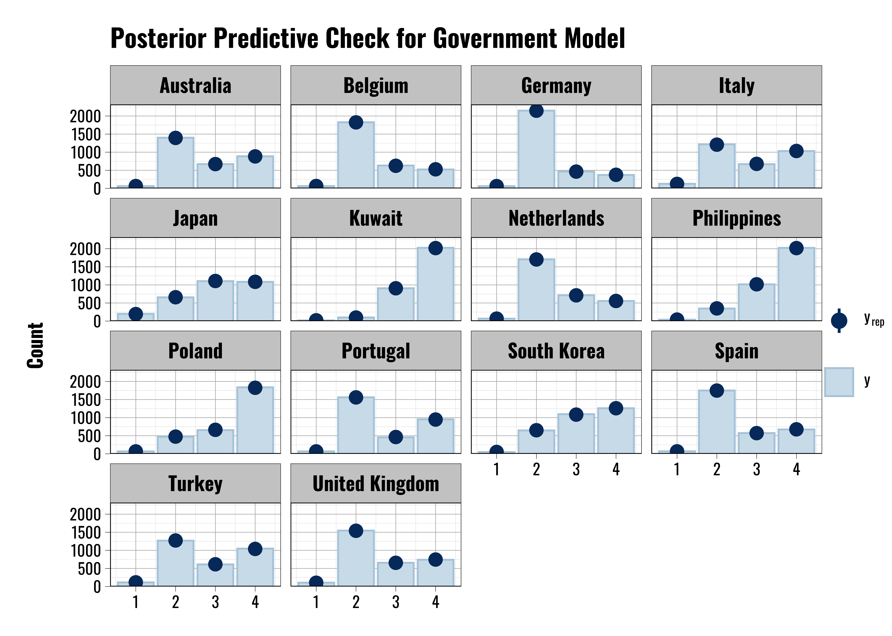
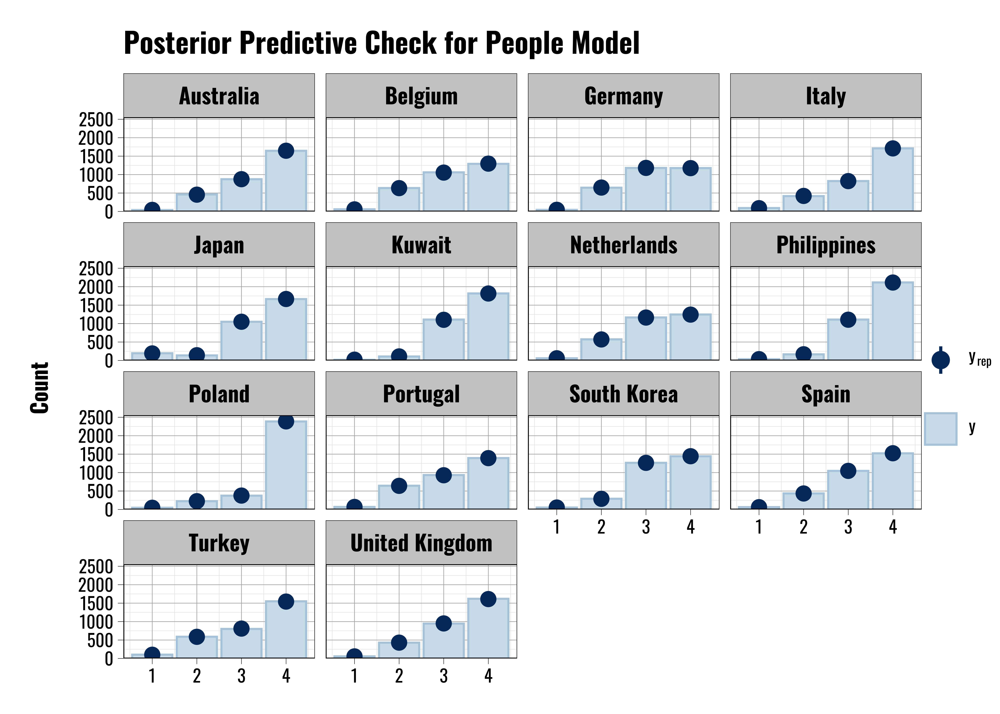
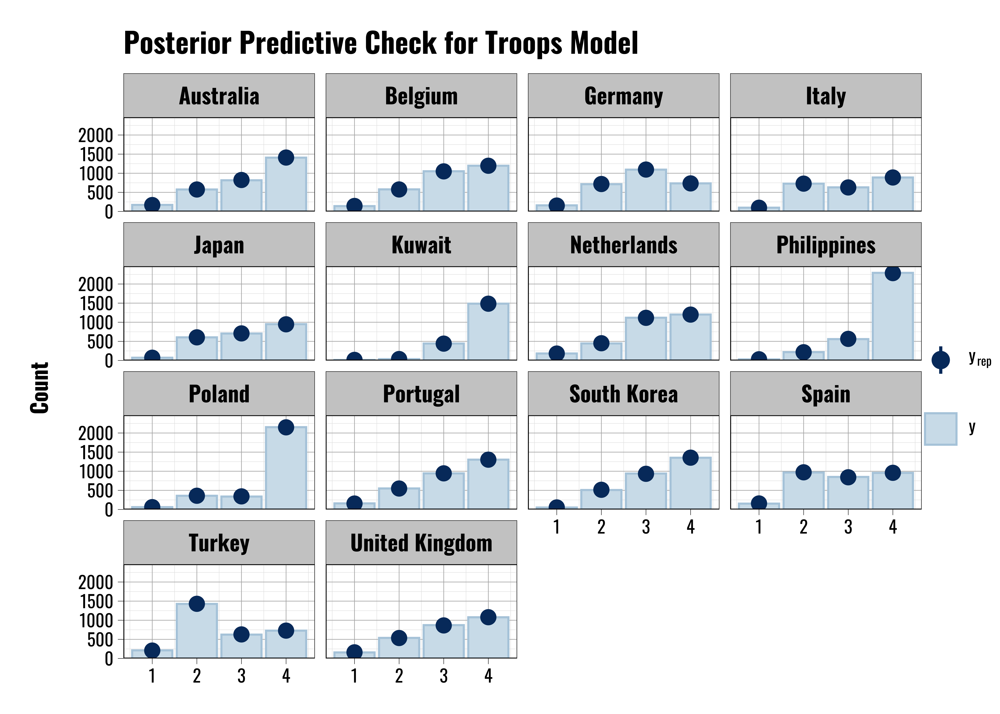
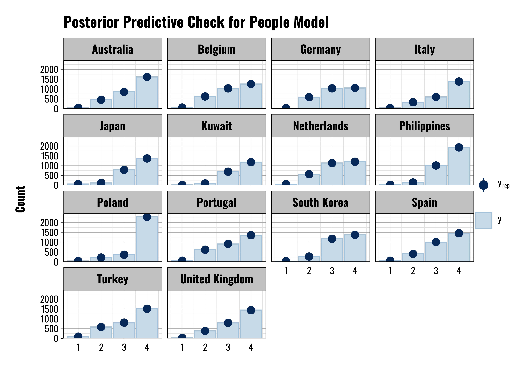
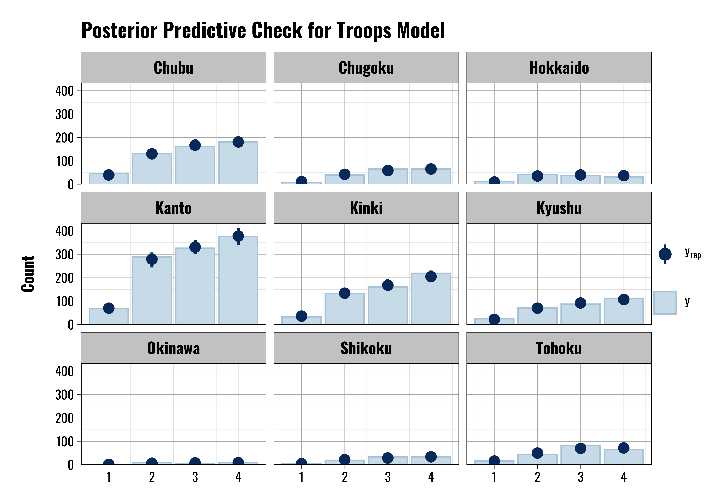

# US Military Deployments and Minority Communities {#minority-chapter}

This chapter provides supplementary information related to Chapter 4 of the book, focusing on how US military deployments interact with and are viewed by minority communities. 

## Descriptive Information

### Prior Specification Tables for Minority Models

<table class="table" style="font-size: 11px; margin-left: auto; margin-right: auto;">
<caption style="font-size: initial !important;">(\#tab:prior-info-crime-troops)Priors specifications for bivariate Troops contact models.</caption>
 <thead>
  <tr>
   <th style="text-align:left;position: sticky; top:0; background-color: #FFFFFF;"> prior </th>
   <th style="text-align:left;position: sticky; top:0; background-color: #FFFFFF;"> class </th>
   <th style="text-align:left;position: sticky; top:0; background-color: #FFFFFF;"> coef </th>
   <th style="text-align:left;position: sticky; top:0; background-color: #FFFFFF;"> group </th>
   <th style="text-align:left;position: sticky; top:0; background-color: #FFFFFF;"> resp </th>
   <th style="text-align:left;position: sticky; top:0; background-color: #FFFFFF;"> dpar </th>
   <th style="text-align:left;position: sticky; top:0; background-color: #FFFFFF;"> nlpar </th>
   <th style="text-align:left;position: sticky; top:0; background-color: #FFFFFF;"> lb </th>
   <th style="text-align:left;position: sticky; top:0; background-color: #FFFFFF;"> ub </th>
   <th style="text-align:left;position: sticky; top:0; background-color: #FFFFFF;"> source </th>
  </tr>
 </thead>
<tbody>
  <tr>
   <td style="text-align:left;"> student_t(3, 0, 2.5) </td>
   <td style="text-align:left;"> Intercept </td>
   <td style="text-align:left;">  </td>
   <td style="text-align:left;">  </td>
   <td style="text-align:left;">  </td>
   <td style="text-align:left;"> mudk </td>
   <td style="text-align:left;">  </td>
   <td style="text-align:left;">  </td>
   <td style="text-align:left;">  </td>
   <td style="text-align:left;"> default </td>
  </tr>
  <tr>
   <td style="text-align:left;"> student_t(3, 0, 2.5) </td>
   <td style="text-align:left;"> Intercept </td>
   <td style="text-align:left;">  </td>
   <td style="text-align:left;">  </td>
   <td style="text-align:left;">  </td>
   <td style="text-align:left;"> muneg </td>
   <td style="text-align:left;">  </td>
   <td style="text-align:left;">  </td>
   <td style="text-align:left;">  </td>
   <td style="text-align:left;"> default </td>
  </tr>
  <tr>
   <td style="text-align:left;"> student_t(3, 0, 2.5) </td>
   <td style="text-align:left;"> Intercept </td>
   <td style="text-align:left;">  </td>
   <td style="text-align:left;">  </td>
   <td style="text-align:left;">  </td>
   <td style="text-align:left;"> mupos </td>
   <td style="text-align:left;">  </td>
   <td style="text-align:left;">  </td>
   <td style="text-align:left;">  </td>
   <td style="text-align:left;"> default </td>
  </tr>
  <tr>
   <td style="text-align:left;"> lkj_corr_cholesky(1) </td>
   <td style="text-align:left;"> L </td>
   <td style="text-align:left;">  </td>
   <td style="text-align:left;">  </td>
   <td style="text-align:left;">  </td>
   <td style="text-align:left;">  </td>
   <td style="text-align:left;">  </td>
   <td style="text-align:left;">  </td>
   <td style="text-align:left;">  </td>
   <td style="text-align:left;"> default </td>
  </tr>
  <tr>
   <td style="text-align:left;">  </td>
   <td style="text-align:left;"> L </td>
   <td style="text-align:left;">  </td>
   <td style="text-align:left;"> country </td>
   <td style="text-align:left;">  </td>
   <td style="text-align:left;">  </td>
   <td style="text-align:left;">  </td>
   <td style="text-align:left;">  </td>
   <td style="text-align:left;">  </td>
   <td style="text-align:left;"> default </td>
  </tr>
  <tr>
   <td style="text-align:left;">  </td>
   <td style="text-align:left;"> b </td>
   <td style="text-align:left;">  </td>
   <td style="text-align:left;">  </td>
   <td style="text-align:left;">  </td>
   <td style="text-align:left;"> mudk </td>
   <td style="text-align:left;">  </td>
   <td style="text-align:left;">  </td>
   <td style="text-align:left;">  </td>
   <td style="text-align:left;"> default </td>
  </tr>
  <tr>
   <td style="text-align:left;">  </td>
   <td style="text-align:left;"> b </td>
   <td style="text-align:left;"> minorityDeclinetoanswer </td>
   <td style="text-align:left;">  </td>
   <td style="text-align:left;">  </td>
   <td style="text-align:left;"> mudk </td>
   <td style="text-align:left;">  </td>
   <td style="text-align:left;">  </td>
   <td style="text-align:left;">  </td>
   <td style="text-align:left;"> default </td>
  </tr>
  <tr>
   <td style="text-align:left;"> normal(-0.28,0.28) </td>
   <td style="text-align:left;"> b </td>
   <td style="text-align:left;"> minorityYes </td>
   <td style="text-align:left;">  </td>
   <td style="text-align:left;">  </td>
   <td style="text-align:left;"> mudk </td>
   <td style="text-align:left;">  </td>
   <td style="text-align:left;">  </td>
   <td style="text-align:left;">  </td>
   <td style="text-align:left;">  </td>
  </tr>
  <tr>
   <td style="text-align:left;">  </td>
   <td style="text-align:left;"> b </td>
   <td style="text-align:left;">  </td>
   <td style="text-align:left;">  </td>
   <td style="text-align:left;">  </td>
   <td style="text-align:left;"> muneg </td>
   <td style="text-align:left;">  </td>
   <td style="text-align:left;">  </td>
   <td style="text-align:left;">  </td>
   <td style="text-align:left;"> default </td>
  </tr>
  <tr>
   <td style="text-align:left;">  </td>
   <td style="text-align:left;"> b </td>
   <td style="text-align:left;"> minorityDeclinetoanswer </td>
   <td style="text-align:left;">  </td>
   <td style="text-align:left;">  </td>
   <td style="text-align:left;"> muneg </td>
   <td style="text-align:left;">  </td>
   <td style="text-align:left;">  </td>
   <td style="text-align:left;">  </td>
   <td style="text-align:left;"> default </td>
  </tr>
  <tr>
   <td style="text-align:left;"> normal(0.1,0.18) </td>
   <td style="text-align:left;"> b </td>
   <td style="text-align:left;"> minorityYes </td>
   <td style="text-align:left;">  </td>
   <td style="text-align:left;">  </td>
   <td style="text-align:left;"> muneg </td>
   <td style="text-align:left;">  </td>
   <td style="text-align:left;">  </td>
   <td style="text-align:left;">  </td>
   <td style="text-align:left;">  </td>
  </tr>
  <tr>
   <td style="text-align:left;">  </td>
   <td style="text-align:left;"> b </td>
   <td style="text-align:left;">  </td>
   <td style="text-align:left;">  </td>
   <td style="text-align:left;">  </td>
   <td style="text-align:left;"> mupos </td>
   <td style="text-align:left;">  </td>
   <td style="text-align:left;">  </td>
   <td style="text-align:left;">  </td>
   <td style="text-align:left;"> default </td>
  </tr>
  <tr>
   <td style="text-align:left;">  </td>
   <td style="text-align:left;"> b </td>
   <td style="text-align:left;"> minorityDeclinetoanswer </td>
   <td style="text-align:left;">  </td>
   <td style="text-align:left;">  </td>
   <td style="text-align:left;"> mupos </td>
   <td style="text-align:left;">  </td>
   <td style="text-align:left;">  </td>
   <td style="text-align:left;">  </td>
   <td style="text-align:left;"> default </td>
  </tr>
  <tr>
   <td style="text-align:left;"> normal(0.04,0.16) </td>
   <td style="text-align:left;"> b </td>
   <td style="text-align:left;"> minorityYes </td>
   <td style="text-align:left;">  </td>
   <td style="text-align:left;">  </td>
   <td style="text-align:left;"> mupos </td>
   <td style="text-align:left;">  </td>
   <td style="text-align:left;">  </td>
   <td style="text-align:left;">  </td>
   <td style="text-align:left;">  </td>
  </tr>
  <tr>
   <td style="text-align:left;"> student_t(3, 0, 2.5) </td>
   <td style="text-align:left;"> sd </td>
   <td style="text-align:left;">  </td>
   <td style="text-align:left;">  </td>
   <td style="text-align:left;">  </td>
   <td style="text-align:left;"> mudk </td>
   <td style="text-align:left;">  </td>
   <td style="text-align:left;"> 0 </td>
   <td style="text-align:left;">  </td>
   <td style="text-align:left;"> default </td>
  </tr>
  <tr>
   <td style="text-align:left;"> student_t(3, 0, 2.5) </td>
   <td style="text-align:left;"> sd </td>
   <td style="text-align:left;">  </td>
   <td style="text-align:left;">  </td>
   <td style="text-align:left;">  </td>
   <td style="text-align:left;"> muneg </td>
   <td style="text-align:left;">  </td>
   <td style="text-align:left;"> 0 </td>
   <td style="text-align:left;">  </td>
   <td style="text-align:left;"> default </td>
  </tr>
  <tr>
   <td style="text-align:left;"> student_t(3, 0, 2.5) </td>
   <td style="text-align:left;"> sd </td>
   <td style="text-align:left;">  </td>
   <td style="text-align:left;">  </td>
   <td style="text-align:left;">  </td>
   <td style="text-align:left;"> mupos </td>
   <td style="text-align:left;">  </td>
   <td style="text-align:left;"> 0 </td>
   <td style="text-align:left;">  </td>
   <td style="text-align:left;"> default </td>
  </tr>
  <tr>
   <td style="text-align:left;">  </td>
   <td style="text-align:left;"> sd </td>
   <td style="text-align:left;">  </td>
   <td style="text-align:left;"> country </td>
   <td style="text-align:left;">  </td>
   <td style="text-align:left;"> mudk </td>
   <td style="text-align:left;">  </td>
   <td style="text-align:left;">  </td>
   <td style="text-align:left;">  </td>
   <td style="text-align:left;"> default </td>
  </tr>
  <tr>
   <td style="text-align:left;">  </td>
   <td style="text-align:left;"> sd </td>
   <td style="text-align:left;"> Intercept </td>
   <td style="text-align:left;"> country </td>
   <td style="text-align:left;">  </td>
   <td style="text-align:left;"> mudk </td>
   <td style="text-align:left;">  </td>
   <td style="text-align:left;">  </td>
   <td style="text-align:left;">  </td>
   <td style="text-align:left;"> default </td>
  </tr>
  <tr>
   <td style="text-align:left;">  </td>
   <td style="text-align:left;"> sd </td>
   <td style="text-align:left;">  </td>
   <td style="text-align:left;"> country </td>
   <td style="text-align:left;">  </td>
   <td style="text-align:left;"> muneg </td>
   <td style="text-align:left;">  </td>
   <td style="text-align:left;">  </td>
   <td style="text-align:left;">  </td>
   <td style="text-align:left;"> default </td>
  </tr>
  <tr>
   <td style="text-align:left;">  </td>
   <td style="text-align:left;"> sd </td>
   <td style="text-align:left;"> Intercept </td>
   <td style="text-align:left;"> country </td>
   <td style="text-align:left;">  </td>
   <td style="text-align:left;"> muneg </td>
   <td style="text-align:left;">  </td>
   <td style="text-align:left;">  </td>
   <td style="text-align:left;">  </td>
   <td style="text-align:left;"> default </td>
  </tr>
  <tr>
   <td style="text-align:left;">  </td>
   <td style="text-align:left;"> sd </td>
   <td style="text-align:left;">  </td>
   <td style="text-align:left;"> country </td>
   <td style="text-align:left;">  </td>
   <td style="text-align:left;"> mupos </td>
   <td style="text-align:left;">  </td>
   <td style="text-align:left;">  </td>
   <td style="text-align:left;">  </td>
   <td style="text-align:left;"> default </td>
  </tr>
  <tr>
   <td style="text-align:left;">  </td>
   <td style="text-align:left;"> sd </td>
   <td style="text-align:left;"> Intercept </td>
   <td style="text-align:left;"> country </td>
   <td style="text-align:left;">  </td>
   <td style="text-align:left;"> mupos </td>
   <td style="text-align:left;">  </td>
   <td style="text-align:left;">  </td>
   <td style="text-align:left;">  </td>
   <td style="text-align:left;"> default </td>
  </tr>
</tbody>
</table>

<table class="table" style="font-size: 11px; margin-left: auto; margin-right: auto;">
<caption style="font-size: initial !important;">(\#tab:prior-info-crime-gov)Priors specifications for bivariate Government contact models.</caption>
 <thead>
  <tr>
   <th style="text-align:left;position: sticky; top:0; background-color: #FFFFFF;"> prior </th>
   <th style="text-align:left;position: sticky; top:0; background-color: #FFFFFF;"> class </th>
   <th style="text-align:left;position: sticky; top:0; background-color: #FFFFFF;"> coef </th>
   <th style="text-align:left;position: sticky; top:0; background-color: #FFFFFF;"> group </th>
   <th style="text-align:left;position: sticky; top:0; background-color: #FFFFFF;"> resp </th>
   <th style="text-align:left;position: sticky; top:0; background-color: #FFFFFF;"> dpar </th>
   <th style="text-align:left;position: sticky; top:0; background-color: #FFFFFF;"> nlpar </th>
   <th style="text-align:left;position: sticky; top:0; background-color: #FFFFFF;"> lb </th>
   <th style="text-align:left;position: sticky; top:0; background-color: #FFFFFF;"> ub </th>
   <th style="text-align:left;position: sticky; top:0; background-color: #FFFFFF;"> source </th>
  </tr>
 </thead>
<tbody>
  <tr>
   <td style="text-align:left;"> student_t(3, 0, 2.5) </td>
   <td style="text-align:left;"> Intercept </td>
   <td style="text-align:left;">  </td>
   <td style="text-align:left;">  </td>
   <td style="text-align:left;">  </td>
   <td style="text-align:left;"> mudk </td>
   <td style="text-align:left;">  </td>
   <td style="text-align:left;">  </td>
   <td style="text-align:left;">  </td>
   <td style="text-align:left;"> default </td>
  </tr>
  <tr>
   <td style="text-align:left;"> student_t(3, 0, 2.5) </td>
   <td style="text-align:left;"> Intercept </td>
   <td style="text-align:left;">  </td>
   <td style="text-align:left;">  </td>
   <td style="text-align:left;">  </td>
   <td style="text-align:left;"> muneg </td>
   <td style="text-align:left;">  </td>
   <td style="text-align:left;">  </td>
   <td style="text-align:left;">  </td>
   <td style="text-align:left;"> default </td>
  </tr>
  <tr>
   <td style="text-align:left;"> student_t(3, 0, 2.5) </td>
   <td style="text-align:left;"> Intercept </td>
   <td style="text-align:left;">  </td>
   <td style="text-align:left;">  </td>
   <td style="text-align:left;">  </td>
   <td style="text-align:left;"> mupos </td>
   <td style="text-align:left;">  </td>
   <td style="text-align:left;">  </td>
   <td style="text-align:left;">  </td>
   <td style="text-align:left;"> default </td>
  </tr>
  <tr>
   <td style="text-align:left;"> lkj_corr_cholesky(1) </td>
   <td style="text-align:left;"> L </td>
   <td style="text-align:left;">  </td>
   <td style="text-align:left;">  </td>
   <td style="text-align:left;">  </td>
   <td style="text-align:left;">  </td>
   <td style="text-align:left;">  </td>
   <td style="text-align:left;">  </td>
   <td style="text-align:left;">  </td>
   <td style="text-align:left;"> default </td>
  </tr>
  <tr>
   <td style="text-align:left;">  </td>
   <td style="text-align:left;"> L </td>
   <td style="text-align:left;">  </td>
   <td style="text-align:left;"> country </td>
   <td style="text-align:left;">  </td>
   <td style="text-align:left;">  </td>
   <td style="text-align:left;">  </td>
   <td style="text-align:left;">  </td>
   <td style="text-align:left;">  </td>
   <td style="text-align:left;"> default </td>
  </tr>
  <tr>
   <td style="text-align:left;">  </td>
   <td style="text-align:left;"> b </td>
   <td style="text-align:left;">  </td>
   <td style="text-align:left;">  </td>
   <td style="text-align:left;">  </td>
   <td style="text-align:left;"> mudk </td>
   <td style="text-align:left;">  </td>
   <td style="text-align:left;">  </td>
   <td style="text-align:left;">  </td>
   <td style="text-align:left;"> default </td>
  </tr>
  <tr>
   <td style="text-align:left;">  </td>
   <td style="text-align:left;"> b </td>
   <td style="text-align:left;"> minorityDeclinetoanswer </td>
   <td style="text-align:left;">  </td>
   <td style="text-align:left;">  </td>
   <td style="text-align:left;"> mudk </td>
   <td style="text-align:left;">  </td>
   <td style="text-align:left;">  </td>
   <td style="text-align:left;">  </td>
   <td style="text-align:left;"> default </td>
  </tr>
  <tr>
   <td style="text-align:left;"> normal(-0.26,0.34) </td>
   <td style="text-align:left;"> b </td>
   <td style="text-align:left;"> minorityYes </td>
   <td style="text-align:left;">  </td>
   <td style="text-align:left;">  </td>
   <td style="text-align:left;"> mudk </td>
   <td style="text-align:left;">  </td>
   <td style="text-align:left;">  </td>
   <td style="text-align:left;">  </td>
   <td style="text-align:left;">  </td>
  </tr>
  <tr>
   <td style="text-align:left;">  </td>
   <td style="text-align:left;"> b </td>
   <td style="text-align:left;">  </td>
   <td style="text-align:left;">  </td>
   <td style="text-align:left;">  </td>
   <td style="text-align:left;"> muneg </td>
   <td style="text-align:left;">  </td>
   <td style="text-align:left;">  </td>
   <td style="text-align:left;">  </td>
   <td style="text-align:left;"> default </td>
  </tr>
  <tr>
   <td style="text-align:left;">  </td>
   <td style="text-align:left;"> b </td>
   <td style="text-align:left;"> minorityDeclinetoanswer </td>
   <td style="text-align:left;">  </td>
   <td style="text-align:left;">  </td>
   <td style="text-align:left;"> muneg </td>
   <td style="text-align:left;">  </td>
   <td style="text-align:left;">  </td>
   <td style="text-align:left;">  </td>
   <td style="text-align:left;"> default </td>
  </tr>
  <tr>
   <td style="text-align:left;"> normal(-0.07,0.16) </td>
   <td style="text-align:left;"> b </td>
   <td style="text-align:left;"> minorityYes </td>
   <td style="text-align:left;">  </td>
   <td style="text-align:left;">  </td>
   <td style="text-align:left;"> muneg </td>
   <td style="text-align:left;">  </td>
   <td style="text-align:left;">  </td>
   <td style="text-align:left;">  </td>
   <td style="text-align:left;">  </td>
  </tr>
  <tr>
   <td style="text-align:left;">  </td>
   <td style="text-align:left;"> b </td>
   <td style="text-align:left;">  </td>
   <td style="text-align:left;">  </td>
   <td style="text-align:left;">  </td>
   <td style="text-align:left;"> mupos </td>
   <td style="text-align:left;">  </td>
   <td style="text-align:left;">  </td>
   <td style="text-align:left;">  </td>
   <td style="text-align:left;"> default </td>
  </tr>
  <tr>
   <td style="text-align:left;">  </td>
   <td style="text-align:left;"> b </td>
   <td style="text-align:left;"> minorityDeclinetoanswer </td>
   <td style="text-align:left;">  </td>
   <td style="text-align:left;">  </td>
   <td style="text-align:left;"> mupos </td>
   <td style="text-align:left;">  </td>
   <td style="text-align:left;">  </td>
   <td style="text-align:left;">  </td>
   <td style="text-align:left;"> default </td>
  </tr>
  <tr>
   <td style="text-align:left;"> normal(0.27,0.18) </td>
   <td style="text-align:left;"> b </td>
   <td style="text-align:left;"> minorityYes </td>
   <td style="text-align:left;">  </td>
   <td style="text-align:left;">  </td>
   <td style="text-align:left;"> mupos </td>
   <td style="text-align:left;">  </td>
   <td style="text-align:left;">  </td>
   <td style="text-align:left;">  </td>
   <td style="text-align:left;">  </td>
  </tr>
  <tr>
   <td style="text-align:left;"> student_t(3, 0, 2.5) </td>
   <td style="text-align:left;"> sd </td>
   <td style="text-align:left;">  </td>
   <td style="text-align:left;">  </td>
   <td style="text-align:left;">  </td>
   <td style="text-align:left;"> mudk </td>
   <td style="text-align:left;">  </td>
   <td style="text-align:left;"> 0 </td>
   <td style="text-align:left;">  </td>
   <td style="text-align:left;"> default </td>
  </tr>
  <tr>
   <td style="text-align:left;"> student_t(3, 0, 2.5) </td>
   <td style="text-align:left;"> sd </td>
   <td style="text-align:left;">  </td>
   <td style="text-align:left;">  </td>
   <td style="text-align:left;">  </td>
   <td style="text-align:left;"> muneg </td>
   <td style="text-align:left;">  </td>
   <td style="text-align:left;"> 0 </td>
   <td style="text-align:left;">  </td>
   <td style="text-align:left;"> default </td>
  </tr>
  <tr>
   <td style="text-align:left;"> student_t(3, 0, 2.5) </td>
   <td style="text-align:left;"> sd </td>
   <td style="text-align:left;">  </td>
   <td style="text-align:left;">  </td>
   <td style="text-align:left;">  </td>
   <td style="text-align:left;"> mupos </td>
   <td style="text-align:left;">  </td>
   <td style="text-align:left;"> 0 </td>
   <td style="text-align:left;">  </td>
   <td style="text-align:left;"> default </td>
  </tr>
  <tr>
   <td style="text-align:left;">  </td>
   <td style="text-align:left;"> sd </td>
   <td style="text-align:left;">  </td>
   <td style="text-align:left;"> country </td>
   <td style="text-align:left;">  </td>
   <td style="text-align:left;"> mudk </td>
   <td style="text-align:left;">  </td>
   <td style="text-align:left;">  </td>
   <td style="text-align:left;">  </td>
   <td style="text-align:left;"> default </td>
  </tr>
  <tr>
   <td style="text-align:left;">  </td>
   <td style="text-align:left;"> sd </td>
   <td style="text-align:left;"> Intercept </td>
   <td style="text-align:left;"> country </td>
   <td style="text-align:left;">  </td>
   <td style="text-align:left;"> mudk </td>
   <td style="text-align:left;">  </td>
   <td style="text-align:left;">  </td>
   <td style="text-align:left;">  </td>
   <td style="text-align:left;"> default </td>
  </tr>
  <tr>
   <td style="text-align:left;">  </td>
   <td style="text-align:left;"> sd </td>
   <td style="text-align:left;">  </td>
   <td style="text-align:left;"> country </td>
   <td style="text-align:left;">  </td>
   <td style="text-align:left;"> muneg </td>
   <td style="text-align:left;">  </td>
   <td style="text-align:left;">  </td>
   <td style="text-align:left;">  </td>
   <td style="text-align:left;"> default </td>
  </tr>
  <tr>
   <td style="text-align:left;">  </td>
   <td style="text-align:left;"> sd </td>
   <td style="text-align:left;"> Intercept </td>
   <td style="text-align:left;"> country </td>
   <td style="text-align:left;">  </td>
   <td style="text-align:left;"> muneg </td>
   <td style="text-align:left;">  </td>
   <td style="text-align:left;">  </td>
   <td style="text-align:left;">  </td>
   <td style="text-align:left;"> default </td>
  </tr>
  <tr>
   <td style="text-align:left;">  </td>
   <td style="text-align:left;"> sd </td>
   <td style="text-align:left;">  </td>
   <td style="text-align:left;"> country </td>
   <td style="text-align:left;">  </td>
   <td style="text-align:left;"> mupos </td>
   <td style="text-align:left;">  </td>
   <td style="text-align:left;">  </td>
   <td style="text-align:left;">  </td>
   <td style="text-align:left;"> default </td>
  </tr>
  <tr>
   <td style="text-align:left;">  </td>
   <td style="text-align:left;"> sd </td>
   <td style="text-align:left;"> Intercept </td>
   <td style="text-align:left;"> country </td>
   <td style="text-align:left;">  </td>
   <td style="text-align:left;"> mupos </td>
   <td style="text-align:left;">  </td>
   <td style="text-align:left;">  </td>
   <td style="text-align:left;">  </td>
   <td style="text-align:left;"> default </td>
  </tr>
</tbody>
</table>

<table class="table" style="font-size: 11px; margin-left: auto; margin-right: auto;">
<caption style="font-size: initial !important;">(\#tab:prior-info-crime-people)Priors specifications for bivariate People contact models.</caption>
 <thead>
  <tr>
   <th style="text-align:left;position: sticky; top:0; background-color: #FFFFFF;"> prior </th>
   <th style="text-align:left;position: sticky; top:0; background-color: #FFFFFF;"> class </th>
   <th style="text-align:left;position: sticky; top:0; background-color: #FFFFFF;"> coef </th>
   <th style="text-align:left;position: sticky; top:0; background-color: #FFFFFF;"> group </th>
   <th style="text-align:left;position: sticky; top:0; background-color: #FFFFFF;"> resp </th>
   <th style="text-align:left;position: sticky; top:0; background-color: #FFFFFF;"> dpar </th>
   <th style="text-align:left;position: sticky; top:0; background-color: #FFFFFF;"> nlpar </th>
   <th style="text-align:left;position: sticky; top:0; background-color: #FFFFFF;"> lb </th>
   <th style="text-align:left;position: sticky; top:0; background-color: #FFFFFF;"> ub </th>
   <th style="text-align:left;position: sticky; top:0; background-color: #FFFFFF;"> source </th>
  </tr>
 </thead>
<tbody>
  <tr>
   <td style="text-align:left;"> student_t(3, 0, 2.5) </td>
   <td style="text-align:left;"> Intercept </td>
   <td style="text-align:left;">  </td>
   <td style="text-align:left;">  </td>
   <td style="text-align:left;">  </td>
   <td style="text-align:left;"> mudk </td>
   <td style="text-align:left;">  </td>
   <td style="text-align:left;">  </td>
   <td style="text-align:left;">  </td>
   <td style="text-align:left;"> default </td>
  </tr>
  <tr>
   <td style="text-align:left;"> student_t(3, 0, 2.5) </td>
   <td style="text-align:left;"> Intercept </td>
   <td style="text-align:left;">  </td>
   <td style="text-align:left;">  </td>
   <td style="text-align:left;">  </td>
   <td style="text-align:left;"> muneg </td>
   <td style="text-align:left;">  </td>
   <td style="text-align:left;">  </td>
   <td style="text-align:left;">  </td>
   <td style="text-align:left;"> default </td>
  </tr>
  <tr>
   <td style="text-align:left;"> student_t(3, 0, 2.5) </td>
   <td style="text-align:left;"> Intercept </td>
   <td style="text-align:left;">  </td>
   <td style="text-align:left;">  </td>
   <td style="text-align:left;">  </td>
   <td style="text-align:left;"> mupos </td>
   <td style="text-align:left;">  </td>
   <td style="text-align:left;">  </td>
   <td style="text-align:left;">  </td>
   <td style="text-align:left;"> default </td>
  </tr>
  <tr>
   <td style="text-align:left;"> lkj_corr_cholesky(1) </td>
   <td style="text-align:left;"> L </td>
   <td style="text-align:left;">  </td>
   <td style="text-align:left;">  </td>
   <td style="text-align:left;">  </td>
   <td style="text-align:left;">  </td>
   <td style="text-align:left;">  </td>
   <td style="text-align:left;">  </td>
   <td style="text-align:left;">  </td>
   <td style="text-align:left;"> default </td>
  </tr>
  <tr>
   <td style="text-align:left;">  </td>
   <td style="text-align:left;"> L </td>
   <td style="text-align:left;">  </td>
   <td style="text-align:left;"> country </td>
   <td style="text-align:left;">  </td>
   <td style="text-align:left;">  </td>
   <td style="text-align:left;">  </td>
   <td style="text-align:left;">  </td>
   <td style="text-align:left;">  </td>
   <td style="text-align:left;"> default </td>
  </tr>
  <tr>
   <td style="text-align:left;">  </td>
   <td style="text-align:left;"> b </td>
   <td style="text-align:left;">  </td>
   <td style="text-align:left;">  </td>
   <td style="text-align:left;">  </td>
   <td style="text-align:left;"> mudk </td>
   <td style="text-align:left;">  </td>
   <td style="text-align:left;">  </td>
   <td style="text-align:left;">  </td>
   <td style="text-align:left;"> default </td>
  </tr>
  <tr>
   <td style="text-align:left;">  </td>
   <td style="text-align:left;"> b </td>
   <td style="text-align:left;"> minorityDeclinetoanswer </td>
   <td style="text-align:left;">  </td>
   <td style="text-align:left;">  </td>
   <td style="text-align:left;"> mudk </td>
   <td style="text-align:left;">  </td>
   <td style="text-align:left;">  </td>
   <td style="text-align:left;">  </td>
   <td style="text-align:left;"> default </td>
  </tr>
  <tr>
   <td style="text-align:left;"> normal(-0.64,0.36) </td>
   <td style="text-align:left;"> b </td>
   <td style="text-align:left;"> minorityYes </td>
   <td style="text-align:left;">  </td>
   <td style="text-align:left;">  </td>
   <td style="text-align:left;"> mudk </td>
   <td style="text-align:left;">  </td>
   <td style="text-align:left;">  </td>
   <td style="text-align:left;">  </td>
   <td style="text-align:left;">  </td>
  </tr>
  <tr>
   <td style="text-align:left;">  </td>
   <td style="text-align:left;"> b </td>
   <td style="text-align:left;">  </td>
   <td style="text-align:left;">  </td>
   <td style="text-align:left;">  </td>
   <td style="text-align:left;"> muneg </td>
   <td style="text-align:left;">  </td>
   <td style="text-align:left;">  </td>
   <td style="text-align:left;">  </td>
   <td style="text-align:left;"> default </td>
  </tr>
  <tr>
   <td style="text-align:left;">  </td>
   <td style="text-align:left;"> b </td>
   <td style="text-align:left;"> minorityDeclinetoanswer </td>
   <td style="text-align:left;">  </td>
   <td style="text-align:left;">  </td>
   <td style="text-align:left;"> muneg </td>
   <td style="text-align:left;">  </td>
   <td style="text-align:left;">  </td>
   <td style="text-align:left;">  </td>
   <td style="text-align:left;"> default </td>
  </tr>
  <tr>
   <td style="text-align:left;"> normal(-0.09,0.19) </td>
   <td style="text-align:left;"> b </td>
   <td style="text-align:left;"> minorityYes </td>
   <td style="text-align:left;">  </td>
   <td style="text-align:left;">  </td>
   <td style="text-align:left;"> muneg </td>
   <td style="text-align:left;">  </td>
   <td style="text-align:left;">  </td>
   <td style="text-align:left;">  </td>
   <td style="text-align:left;">  </td>
  </tr>
  <tr>
   <td style="text-align:left;">  </td>
   <td style="text-align:left;"> b </td>
   <td style="text-align:left;">  </td>
   <td style="text-align:left;">  </td>
   <td style="text-align:left;">  </td>
   <td style="text-align:left;"> mupos </td>
   <td style="text-align:left;">  </td>
   <td style="text-align:left;">  </td>
   <td style="text-align:left;">  </td>
   <td style="text-align:left;"> default </td>
  </tr>
  <tr>
   <td style="text-align:left;">  </td>
   <td style="text-align:left;"> b </td>
   <td style="text-align:left;"> minorityDeclinetoanswer </td>
   <td style="text-align:left;">  </td>
   <td style="text-align:left;">  </td>
   <td style="text-align:left;"> mupos </td>
   <td style="text-align:left;">  </td>
   <td style="text-align:left;">  </td>
   <td style="text-align:left;">  </td>
   <td style="text-align:left;"> default </td>
  </tr>
  <tr>
   <td style="text-align:left;"> normal(0.06,0.14) </td>
   <td style="text-align:left;"> b </td>
   <td style="text-align:left;"> minorityYes </td>
   <td style="text-align:left;">  </td>
   <td style="text-align:left;">  </td>
   <td style="text-align:left;"> mupos </td>
   <td style="text-align:left;">  </td>
   <td style="text-align:left;">  </td>
   <td style="text-align:left;">  </td>
   <td style="text-align:left;">  </td>
  </tr>
  <tr>
   <td style="text-align:left;"> student_t(3, 0, 2.5) </td>
   <td style="text-align:left;"> sd </td>
   <td style="text-align:left;">  </td>
   <td style="text-align:left;">  </td>
   <td style="text-align:left;">  </td>
   <td style="text-align:left;"> mudk </td>
   <td style="text-align:left;">  </td>
   <td style="text-align:left;"> 0 </td>
   <td style="text-align:left;">  </td>
   <td style="text-align:left;"> default </td>
  </tr>
  <tr>
   <td style="text-align:left;"> student_t(3, 0, 2.5) </td>
   <td style="text-align:left;"> sd </td>
   <td style="text-align:left;">  </td>
   <td style="text-align:left;">  </td>
   <td style="text-align:left;">  </td>
   <td style="text-align:left;"> muneg </td>
   <td style="text-align:left;">  </td>
   <td style="text-align:left;"> 0 </td>
   <td style="text-align:left;">  </td>
   <td style="text-align:left;"> default </td>
  </tr>
  <tr>
   <td style="text-align:left;"> student_t(3, 0, 2.5) </td>
   <td style="text-align:left;"> sd </td>
   <td style="text-align:left;">  </td>
   <td style="text-align:left;">  </td>
   <td style="text-align:left;">  </td>
   <td style="text-align:left;"> mupos </td>
   <td style="text-align:left;">  </td>
   <td style="text-align:left;"> 0 </td>
   <td style="text-align:left;">  </td>
   <td style="text-align:left;"> default </td>
  </tr>
  <tr>
   <td style="text-align:left;">  </td>
   <td style="text-align:left;"> sd </td>
   <td style="text-align:left;">  </td>
   <td style="text-align:left;"> country </td>
   <td style="text-align:left;">  </td>
   <td style="text-align:left;"> mudk </td>
   <td style="text-align:left;">  </td>
   <td style="text-align:left;">  </td>
   <td style="text-align:left;">  </td>
   <td style="text-align:left;"> default </td>
  </tr>
  <tr>
   <td style="text-align:left;">  </td>
   <td style="text-align:left;"> sd </td>
   <td style="text-align:left;"> Intercept </td>
   <td style="text-align:left;"> country </td>
   <td style="text-align:left;">  </td>
   <td style="text-align:left;"> mudk </td>
   <td style="text-align:left;">  </td>
   <td style="text-align:left;">  </td>
   <td style="text-align:left;">  </td>
   <td style="text-align:left;"> default </td>
  </tr>
  <tr>
   <td style="text-align:left;">  </td>
   <td style="text-align:left;"> sd </td>
   <td style="text-align:left;">  </td>
   <td style="text-align:left;"> country </td>
   <td style="text-align:left;">  </td>
   <td style="text-align:left;"> muneg </td>
   <td style="text-align:left;">  </td>
   <td style="text-align:left;">  </td>
   <td style="text-align:left;">  </td>
   <td style="text-align:left;"> default </td>
  </tr>
  <tr>
   <td style="text-align:left;">  </td>
   <td style="text-align:left;"> sd </td>
   <td style="text-align:left;"> Intercept </td>
   <td style="text-align:left;"> country </td>
   <td style="text-align:left;">  </td>
   <td style="text-align:left;"> muneg </td>
   <td style="text-align:left;">  </td>
   <td style="text-align:left;">  </td>
   <td style="text-align:left;">  </td>
   <td style="text-align:left;"> default </td>
  </tr>
  <tr>
   <td style="text-align:left;">  </td>
   <td style="text-align:left;"> sd </td>
   <td style="text-align:left;">  </td>
   <td style="text-align:left;"> country </td>
   <td style="text-align:left;">  </td>
   <td style="text-align:left;"> mupos </td>
   <td style="text-align:left;">  </td>
   <td style="text-align:left;">  </td>
   <td style="text-align:left;">  </td>
   <td style="text-align:left;"> default </td>
  </tr>
  <tr>
   <td style="text-align:left;">  </td>
   <td style="text-align:left;"> sd </td>
   <td style="text-align:left;"> Intercept </td>
   <td style="text-align:left;"> country </td>
   <td style="text-align:left;">  </td>
   <td style="text-align:left;"> mupos </td>
   <td style="text-align:left;">  </td>
   <td style="text-align:left;">  </td>
   <td style="text-align:left;">  </td>
   <td style="text-align:left;"> default </td>
  </tr>
</tbody>
</table>

<table class="table" style="font-size: 11px; margin-left: auto; margin-right: auto;">
<caption style="font-size: initial !important;">(\#tab:prior-info-crime-troops-2)Priors specifications for full Troops contact models.</caption>
 <thead>
  <tr>
   <th style="text-align:left;position: sticky; top:0; background-color: #FFFFFF;"> prior </th>
   <th style="text-align:left;position: sticky; top:0; background-color: #FFFFFF;"> class </th>
   <th style="text-align:left;position: sticky; top:0; background-color: #FFFFFF;"> coef </th>
   <th style="text-align:left;position: sticky; top:0; background-color: #FFFFFF;"> group </th>
   <th style="text-align:left;position: sticky; top:0; background-color: #FFFFFF;"> resp </th>
   <th style="text-align:left;position: sticky; top:0; background-color: #FFFFFF;"> dpar </th>
   <th style="text-align:left;position: sticky; top:0; background-color: #FFFFFF;"> nlpar </th>
   <th style="text-align:left;position: sticky; top:0; background-color: #FFFFFF;"> lb </th>
   <th style="text-align:left;position: sticky; top:0; background-color: #FFFFFF;"> ub </th>
   <th style="text-align:left;position: sticky; top:0; background-color: #FFFFFF;"> source </th>
  </tr>
 </thead>
<tbody>
  <tr>
   <td style="text-align:left;"> normal(0,2) </td>
   <td style="text-align:left;"> b </td>
   <td style="text-align:left;">  </td>
   <td style="text-align:left;">  </td>
   <td style="text-align:left;">  </td>
   <td style="text-align:left;"> mudk </td>
   <td style="text-align:left;">  </td>
   <td style="text-align:left;">  </td>
   <td style="text-align:left;">  </td>
   <td style="text-align:left;"> default </td>
  </tr>
  <tr>
   <td style="text-align:left;"> normal(-0.16,0.17) </td>
   <td style="text-align:left;"> b </td>
   <td style="text-align:left;"> age25to34years </td>
   <td style="text-align:left;">  </td>
   <td style="text-align:left;">  </td>
   <td style="text-align:left;"> mudk </td>
   <td style="text-align:left;">  </td>
   <td style="text-align:left;">  </td>
   <td style="text-align:left;">  </td>
   <td style="text-align:left;">  </td>
  </tr>
  <tr>
   <td style="text-align:left;"> normal(-0.41,0.17) </td>
   <td style="text-align:left;"> b </td>
   <td style="text-align:left;"> age35to44years </td>
   <td style="text-align:left;">  </td>
   <td style="text-align:left;">  </td>
   <td style="text-align:left;"> mudk </td>
   <td style="text-align:left;">  </td>
   <td style="text-align:left;">  </td>
   <td style="text-align:left;">  </td>
   <td style="text-align:left;">  </td>
  </tr>
  <tr>
   <td style="text-align:left;"> normal(-0.36,0.18) </td>
   <td style="text-align:left;"> b </td>
   <td style="text-align:left;"> age45to54years </td>
   <td style="text-align:left;">  </td>
   <td style="text-align:left;">  </td>
   <td style="text-align:left;"> mudk </td>
   <td style="text-align:left;">  </td>
   <td style="text-align:left;">  </td>
   <td style="text-align:left;">  </td>
   <td style="text-align:left;">  </td>
  </tr>
  <tr>
   <td style="text-align:left;"> normal(-0.75,0.19) </td>
   <td style="text-align:left;"> b </td>
   <td style="text-align:left;"> age55to64years </td>
   <td style="text-align:left;">  </td>
   <td style="text-align:left;">  </td>
   <td style="text-align:left;"> mudk </td>
   <td style="text-align:left;">  </td>
   <td style="text-align:left;">  </td>
   <td style="text-align:left;">  </td>
   <td style="text-align:left;">  </td>
  </tr>
  <tr>
   <td style="text-align:left;"> normal(-0.98,0.23) </td>
   <td style="text-align:left;"> b </td>
   <td style="text-align:left;"> ageAge65orolder </td>
   <td style="text-align:left;">  </td>
   <td style="text-align:left;">  </td>
   <td style="text-align:left;"> mudk </td>
   <td style="text-align:left;">  </td>
   <td style="text-align:left;">  </td>
   <td style="text-align:left;">  </td>
   <td style="text-align:left;">  </td>
  </tr>
  <tr>
   <td style="text-align:left;"> normal(-0.56,0.3) </td>
   <td style="text-align:left;"> b </td>
   <td style="text-align:left;"> american_inf_1Alittle </td>
   <td style="text-align:left;">  </td>
   <td style="text-align:left;">  </td>
   <td style="text-align:left;"> mudk </td>
   <td style="text-align:left;">  </td>
   <td style="text-align:left;">  </td>
   <td style="text-align:left;">  </td>
   <td style="text-align:left;">  </td>
  </tr>
  <tr>
   <td style="text-align:left;"> normal(-0.25,0.3) </td>
   <td style="text-align:left;"> b </td>
   <td style="text-align:left;"> american_inf_1Alot </td>
   <td style="text-align:left;">  </td>
   <td style="text-align:left;">  </td>
   <td style="text-align:left;"> mudk </td>
   <td style="text-align:left;">  </td>
   <td style="text-align:left;">  </td>
   <td style="text-align:left;">  </td>
   <td style="text-align:left;">  </td>
  </tr>
  <tr>
   <td style="text-align:left;"> normal(0.55,0.32) </td>
   <td style="text-align:left;"> b </td>
   <td style="text-align:left;"> american_inf_1DontknowDdeclinetoanswer </td>
   <td style="text-align:left;">  </td>
   <td style="text-align:left;">  </td>
   <td style="text-align:left;"> mudk </td>
   <td style="text-align:left;">  </td>
   <td style="text-align:left;">  </td>
   <td style="text-align:left;">  </td>
   <td style="text-align:left;">  </td>
  </tr>
  <tr>
   <td style="text-align:left;"> normal(-0.13,0.29) </td>
   <td style="text-align:left;"> b </td>
   <td style="text-align:left;"> american_inf_1Some </td>
   <td style="text-align:left;">  </td>
   <td style="text-align:left;">  </td>
   <td style="text-align:left;"> mudk </td>
   <td style="text-align:left;">  </td>
   <td style="text-align:left;">  </td>
   <td style="text-align:left;">  </td>
   <td style="text-align:left;">  </td>
  </tr>
  <tr>
   <td style="text-align:left;"> normal(2.12,0.18) </td>
   <td style="text-align:left;"> b </td>
   <td style="text-align:left;"> american_inf_2DontknowDdeclinetoanswer </td>
   <td style="text-align:left;">  </td>
   <td style="text-align:left;">  </td>
   <td style="text-align:left;"> mudk </td>
   <td style="text-align:left;">  </td>
   <td style="text-align:left;">  </td>
   <td style="text-align:left;">  </td>
   <td style="text-align:left;">  </td>
  </tr>
  <tr>
   <td style="text-align:left;"> normal(0.33,0.15) </td>
   <td style="text-align:left;"> b </td>
   <td style="text-align:left;"> american_inf_2Negative </td>
   <td style="text-align:left;">  </td>
   <td style="text-align:left;">  </td>
   <td style="text-align:left;"> mudk </td>
   <td style="text-align:left;">  </td>
   <td style="text-align:left;">  </td>
   <td style="text-align:left;">  </td>
   <td style="text-align:left;">  </td>
  </tr>
  <tr>
   <td style="text-align:left;"> normal(0.24,0.18) </td>
   <td style="text-align:left;"> b </td>
   <td style="text-align:left;"> american_inf_2Positive </td>
   <td style="text-align:left;">  </td>
   <td style="text-align:left;">  </td>
   <td style="text-align:left;"> mudk </td>
   <td style="text-align:left;">  </td>
   <td style="text-align:left;">  </td>
   <td style="text-align:left;">  </td>
   <td style="text-align:left;">  </td>
  </tr>
  <tr>
   <td style="text-align:left;"> normal(0.64,0.28) </td>
   <td style="text-align:left;"> b </td>
   <td style="text-align:left;"> american_inf_2Verynegative </td>
   <td style="text-align:left;">  </td>
   <td style="text-align:left;">  </td>
   <td style="text-align:left;"> mudk </td>
   <td style="text-align:left;">  </td>
   <td style="text-align:left;">  </td>
   <td style="text-align:left;">  </td>
   <td style="text-align:left;">  </td>
  </tr>
  <tr>
   <td style="text-align:left;"> normal(0.48,0.41) </td>
   <td style="text-align:left;"> b </td>
   <td style="text-align:left;"> american_inf_2Verypositive </td>
   <td style="text-align:left;">  </td>
   <td style="text-align:left;">  </td>
   <td style="text-align:left;"> mudk </td>
   <td style="text-align:left;">  </td>
   <td style="text-align:left;">  </td>
   <td style="text-align:left;">  </td>
   <td style="text-align:left;">  </td>
  </tr>
  <tr>
   <td style="text-align:left;">  </td>
   <td style="text-align:left;"> b </td>
   <td style="text-align:left;"> basecount_z </td>
   <td style="text-align:left;">  </td>
   <td style="text-align:left;">  </td>
   <td style="text-align:left;"> mudk </td>
   <td style="text-align:left;">  </td>
   <td style="text-align:left;">  </td>
   <td style="text-align:left;">  </td>
   <td style="text-align:left;"> default </td>
  </tr>
  <tr>
   <td style="text-align:left;"> normal(0.44,0.24) </td>
   <td style="text-align:left;"> b </td>
   <td style="text-align:left;"> benefit_persDontknowDdeclinetoanswer </td>
   <td style="text-align:left;">  </td>
   <td style="text-align:left;">  </td>
   <td style="text-align:left;"> mudk </td>
   <td style="text-align:left;">  </td>
   <td style="text-align:left;">  </td>
   <td style="text-align:left;">  </td>
   <td style="text-align:left;">  </td>
  </tr>
  <tr>
   <td style="text-align:left;"> normal(-0.43,0.43) </td>
   <td style="text-align:left;"> b </td>
   <td style="text-align:left;"> benefit_persYes </td>
   <td style="text-align:left;">  </td>
   <td style="text-align:left;">  </td>
   <td style="text-align:left;"> mudk </td>
   <td style="text-align:left;">  </td>
   <td style="text-align:left;">  </td>
   <td style="text-align:left;">  </td>
   <td style="text-align:left;">  </td>
  </tr>
  <tr>
   <td style="text-align:left;"> normal(0.56,0.29) </td>
   <td style="text-align:left;"> b </td>
   <td style="text-align:left;"> contact_persDontknowDdeclinetoanswer </td>
   <td style="text-align:left;">  </td>
   <td style="text-align:left;">  </td>
   <td style="text-align:left;"> mudk </td>
   <td style="text-align:left;">  </td>
   <td style="text-align:left;">  </td>
   <td style="text-align:left;">  </td>
   <td style="text-align:left;">  </td>
  </tr>
  <tr>
   <td style="text-align:left;"> normal(-0.71,0.37) </td>
   <td style="text-align:left;"> b </td>
   <td style="text-align:left;"> contact_persYes </td>
   <td style="text-align:left;">  </td>
   <td style="text-align:left;">  </td>
   <td style="text-align:left;"> mudk </td>
   <td style="text-align:left;">  </td>
   <td style="text-align:left;">  </td>
   <td style="text-align:left;">  </td>
   <td style="text-align:left;">  </td>
  </tr>
  <tr>
   <td style="text-align:left;">  </td>
   <td style="text-align:left;"> b </td>
   <td style="text-align:left;"> ed_z </td>
   <td style="text-align:left;">  </td>
   <td style="text-align:left;">  </td>
   <td style="text-align:left;"> mudk </td>
   <td style="text-align:left;">  </td>
   <td style="text-align:left;">  </td>
   <td style="text-align:left;">  </td>
   <td style="text-align:left;"> default </td>
  </tr>
  <tr>
   <td style="text-align:left;">  </td>
   <td style="text-align:left;"> b </td>
   <td style="text-align:left;"> gdp_z </td>
   <td style="text-align:left;">  </td>
   <td style="text-align:left;">  </td>
   <td style="text-align:left;"> mudk </td>
   <td style="text-align:left;">  </td>
   <td style="text-align:left;">  </td>
   <td style="text-align:left;">  </td>
   <td style="text-align:left;"> default </td>
  </tr>
  <tr>
   <td style="text-align:left;"> normal(0.08,0.11) </td>
   <td style="text-align:left;"> b </td>
   <td style="text-align:left;"> genderFemale </td>
   <td style="text-align:left;">  </td>
   <td style="text-align:left;">  </td>
   <td style="text-align:left;"> mudk </td>
   <td style="text-align:left;">  </td>
   <td style="text-align:left;">  </td>
   <td style="text-align:left;">  </td>
   <td style="text-align:left;">  </td>
  </tr>
  <tr>
   <td style="text-align:left;"> normal(0.08,0.98) </td>
   <td style="text-align:left;"> b </td>
   <td style="text-align:left;"> genderNoneoftheabove </td>
   <td style="text-align:left;">  </td>
   <td style="text-align:left;">  </td>
   <td style="text-align:left;"> mudk </td>
   <td style="text-align:left;">  </td>
   <td style="text-align:left;">  </td>
   <td style="text-align:left;">  </td>
   <td style="text-align:left;">  </td>
  </tr>
  <tr>
   <td style="text-align:left;"> normal(-79.98,60.28) </td>
   <td style="text-align:left;"> b </td>
   <td style="text-align:left;"> genderNonMbinary </td>
   <td style="text-align:left;">  </td>
   <td style="text-align:left;">  </td>
   <td style="text-align:left;"> mudk </td>
   <td style="text-align:left;">  </td>
   <td style="text-align:left;">  </td>
   <td style="text-align:left;">  </td>
   <td style="text-align:left;">  </td>
  </tr>
  <tr>
   <td style="text-align:left;">  </td>
   <td style="text-align:left;"> b </td>
   <td style="text-align:left;"> ideology_z </td>
   <td style="text-align:left;">  </td>
   <td style="text-align:left;">  </td>
   <td style="text-align:left;"> mudk </td>
   <td style="text-align:left;">  </td>
   <td style="text-align:left;">  </td>
   <td style="text-align:left;">  </td>
   <td style="text-align:left;"> default </td>
  </tr>
  <tr>
   <td style="text-align:left;">  </td>
   <td style="text-align:left;"> b </td>
   <td style="text-align:left;"> income.5.cat21M40% </td>
   <td style="text-align:left;">  </td>
   <td style="text-align:left;">  </td>
   <td style="text-align:left;"> mudk </td>
   <td style="text-align:left;">  </td>
   <td style="text-align:left;">  </td>
   <td style="text-align:left;">  </td>
   <td style="text-align:left;"> default </td>
  </tr>
  <tr>
   <td style="text-align:left;">  </td>
   <td style="text-align:left;"> b </td>
   <td style="text-align:left;"> income.5.cat41M60% </td>
   <td style="text-align:left;">  </td>
   <td style="text-align:left;">  </td>
   <td style="text-align:left;"> mudk </td>
   <td style="text-align:left;">  </td>
   <td style="text-align:left;">  </td>
   <td style="text-align:left;">  </td>
   <td style="text-align:left;"> default </td>
  </tr>
  <tr>
   <td style="text-align:left;">  </td>
   <td style="text-align:left;"> b </td>
   <td style="text-align:left;"> income.5.cat61M80% </td>
   <td style="text-align:left;">  </td>
   <td style="text-align:left;">  </td>
   <td style="text-align:left;"> mudk </td>
   <td style="text-align:left;">  </td>
   <td style="text-align:left;">  </td>
   <td style="text-align:left;">  </td>
   <td style="text-align:left;"> default </td>
  </tr>
  <tr>
   <td style="text-align:left;">  </td>
   <td style="text-align:left;"> b </td>
   <td style="text-align:left;"> income.5.cat81M100% </td>
   <td style="text-align:left;">  </td>
   <td style="text-align:left;">  </td>
   <td style="text-align:left;"> mudk </td>
   <td style="text-align:left;">  </td>
   <td style="text-align:left;">  </td>
   <td style="text-align:left;">  </td>
   <td style="text-align:left;"> default </td>
  </tr>
  <tr>
   <td style="text-align:left;">  </td>
   <td style="text-align:left;"> b </td>
   <td style="text-align:left;"> minorityDeclinetoanswer </td>
   <td style="text-align:left;">  </td>
   <td style="text-align:left;">  </td>
   <td style="text-align:left;"> mudk </td>
   <td style="text-align:left;">  </td>
   <td style="text-align:left;">  </td>
   <td style="text-align:left;">  </td>
   <td style="text-align:left;"> default </td>
  </tr>
  <tr>
   <td style="text-align:left;"> normal(-0.28,0.28) </td>
   <td style="text-align:left;"> b </td>
   <td style="text-align:left;"> minorityYes </td>
   <td style="text-align:left;">  </td>
   <td style="text-align:left;">  </td>
   <td style="text-align:left;"> mudk </td>
   <td style="text-align:left;">  </td>
   <td style="text-align:left;">  </td>
   <td style="text-align:left;">  </td>
   <td style="text-align:left;">  </td>
  </tr>
  <tr>
   <td style="text-align:left;">  </td>
   <td style="text-align:left;"> b </td>
   <td style="text-align:left;"> pop_z </td>
   <td style="text-align:left;">  </td>
   <td style="text-align:left;">  </td>
   <td style="text-align:left;"> mudk </td>
   <td style="text-align:left;">  </td>
   <td style="text-align:left;">  </td>
   <td style="text-align:left;">  </td>
   <td style="text-align:left;"> default </td>
  </tr>
  <tr>
   <td style="text-align:left;">  </td>
   <td style="text-align:left;"> b </td>
   <td style="text-align:left;"> troops_crime_persDontknowDdeclinetoanswer </td>
   <td style="text-align:left;">  </td>
   <td style="text-align:left;">  </td>
   <td style="text-align:left;"> mudk </td>
   <td style="text-align:left;">  </td>
   <td style="text-align:left;">  </td>
   <td style="text-align:left;">  </td>
   <td style="text-align:left;"> default </td>
  </tr>
  <tr>
   <td style="text-align:left;">  </td>
   <td style="text-align:left;"> b </td>
   <td style="text-align:left;"> troops_crime_persYes </td>
   <td style="text-align:left;">  </td>
   <td style="text-align:left;">  </td>
   <td style="text-align:left;"> mudk </td>
   <td style="text-align:left;">  </td>
   <td style="text-align:left;">  </td>
   <td style="text-align:left;">  </td>
   <td style="text-align:left;"> default </td>
  </tr>
  <tr>
   <td style="text-align:left;">  </td>
   <td style="text-align:left;"> b </td>
   <td style="text-align:left;"> troops_z </td>
   <td style="text-align:left;">  </td>
   <td style="text-align:left;">  </td>
   <td style="text-align:left;"> mudk </td>
   <td style="text-align:left;">  </td>
   <td style="text-align:left;">  </td>
   <td style="text-align:left;">  </td>
   <td style="text-align:left;"> default </td>
  </tr>
  <tr>
   <td style="text-align:left;"> normal(0,2) </td>
   <td style="text-align:left;"> b </td>
   <td style="text-align:left;">  </td>
   <td style="text-align:left;">  </td>
   <td style="text-align:left;">  </td>
   <td style="text-align:left;"> muneg </td>
   <td style="text-align:left;">  </td>
   <td style="text-align:left;">  </td>
   <td style="text-align:left;">  </td>
   <td style="text-align:left;"> default </td>
  </tr>
  <tr>
   <td style="text-align:left;"> normal(0.21,0.1) </td>
   <td style="text-align:left;"> b </td>
   <td style="text-align:left;"> age25to34years </td>
   <td style="text-align:left;">  </td>
   <td style="text-align:left;">  </td>
   <td style="text-align:left;"> muneg </td>
   <td style="text-align:left;">  </td>
   <td style="text-align:left;">  </td>
   <td style="text-align:left;">  </td>
   <td style="text-align:left;">  </td>
  </tr>
  <tr>
   <td style="text-align:left;"> normal(0.03,0.1) </td>
   <td style="text-align:left;"> b </td>
   <td style="text-align:left;"> age35to44years </td>
   <td style="text-align:left;">  </td>
   <td style="text-align:left;">  </td>
   <td style="text-align:left;"> muneg </td>
   <td style="text-align:left;">  </td>
   <td style="text-align:left;">  </td>
   <td style="text-align:left;">  </td>
   <td style="text-align:left;">  </td>
  </tr>
  <tr>
   <td style="text-align:left;"> normal(-0.19,0.1) </td>
   <td style="text-align:left;"> b </td>
   <td style="text-align:left;"> age45to54years </td>
   <td style="text-align:left;">  </td>
   <td style="text-align:left;">  </td>
   <td style="text-align:left;"> muneg </td>
   <td style="text-align:left;">  </td>
   <td style="text-align:left;">  </td>
   <td style="text-align:left;">  </td>
   <td style="text-align:left;">  </td>
  </tr>
  <tr>
   <td style="text-align:left;"> normal(-0.2,0.1) </td>
   <td style="text-align:left;"> b </td>
   <td style="text-align:left;"> age55to64years </td>
   <td style="text-align:left;">  </td>
   <td style="text-align:left;">  </td>
   <td style="text-align:left;"> muneg </td>
   <td style="text-align:left;">  </td>
   <td style="text-align:left;">  </td>
   <td style="text-align:left;">  </td>
   <td style="text-align:left;">  </td>
  </tr>
  <tr>
   <td style="text-align:left;"> normal(-0.08,0.12) </td>
   <td style="text-align:left;"> b </td>
   <td style="text-align:left;"> ageAge65orolder </td>
   <td style="text-align:left;">  </td>
   <td style="text-align:left;">  </td>
   <td style="text-align:left;"> muneg </td>
   <td style="text-align:left;">  </td>
   <td style="text-align:left;">  </td>
   <td style="text-align:left;">  </td>
   <td style="text-align:left;">  </td>
  </tr>
  <tr>
   <td style="text-align:left;"> normal(-0.51,0.18) </td>
   <td style="text-align:left;"> b </td>
   <td style="text-align:left;"> american_inf_1Alittle </td>
   <td style="text-align:left;">  </td>
   <td style="text-align:left;">  </td>
   <td style="text-align:left;"> muneg </td>
   <td style="text-align:left;">  </td>
   <td style="text-align:left;">  </td>
   <td style="text-align:left;">  </td>
   <td style="text-align:left;">  </td>
  </tr>
  <tr>
   <td style="text-align:left;"> normal(-0.04,0.17) </td>
   <td style="text-align:left;"> b </td>
   <td style="text-align:left;"> american_inf_1Alot </td>
   <td style="text-align:left;">  </td>
   <td style="text-align:left;">  </td>
   <td style="text-align:left;"> muneg </td>
   <td style="text-align:left;">  </td>
   <td style="text-align:left;">  </td>
   <td style="text-align:left;">  </td>
   <td style="text-align:left;">  </td>
  </tr>
  <tr>
   <td style="text-align:left;"> normal(-0.99,0.25) </td>
   <td style="text-align:left;"> b </td>
   <td style="text-align:left;"> american_inf_1DontknowDdeclinetoanswer </td>
   <td style="text-align:left;">  </td>
   <td style="text-align:left;">  </td>
   <td style="text-align:left;"> muneg </td>
   <td style="text-align:left;">  </td>
   <td style="text-align:left;">  </td>
   <td style="text-align:left;">  </td>
   <td style="text-align:left;">  </td>
  </tr>
  <tr>
   <td style="text-align:left;"> normal(-0.34,0.17) </td>
   <td style="text-align:left;"> b </td>
   <td style="text-align:left;"> american_inf_1Some </td>
   <td style="text-align:left;">  </td>
   <td style="text-align:left;">  </td>
   <td style="text-align:left;"> muneg </td>
   <td style="text-align:left;">  </td>
   <td style="text-align:left;">  </td>
   <td style="text-align:left;">  </td>
   <td style="text-align:left;">  </td>
  </tr>
  <tr>
   <td style="text-align:left;"> normal(0.42,0.17) </td>
   <td style="text-align:left;"> b </td>
   <td style="text-align:left;"> american_inf_2DontknowDdeclinetoanswer </td>
   <td style="text-align:left;">  </td>
   <td style="text-align:left;">  </td>
   <td style="text-align:left;"> muneg </td>
   <td style="text-align:left;">  </td>
   <td style="text-align:left;">  </td>
   <td style="text-align:left;">  </td>
   <td style="text-align:left;">  </td>
  </tr>
  <tr>
   <td style="text-align:left;"> normal(1.15,0.07) </td>
   <td style="text-align:left;"> b </td>
   <td style="text-align:left;"> american_inf_2Negative </td>
   <td style="text-align:left;">  </td>
   <td style="text-align:left;">  </td>
   <td style="text-align:left;"> muneg </td>
   <td style="text-align:left;">  </td>
   <td style="text-align:left;">  </td>
   <td style="text-align:left;">  </td>
   <td style="text-align:left;">  </td>
  </tr>
  <tr>
   <td style="text-align:left;"> normal(-0.28,0.1) </td>
   <td style="text-align:left;"> b </td>
   <td style="text-align:left;"> american_inf_2Positive </td>
   <td style="text-align:left;">  </td>
   <td style="text-align:left;">  </td>
   <td style="text-align:left;"> muneg </td>
   <td style="text-align:left;">  </td>
   <td style="text-align:left;">  </td>
   <td style="text-align:left;">  </td>
   <td style="text-align:left;">  </td>
  </tr>
  <tr>
   <td style="text-align:left;"> normal(1.96,0.13) </td>
   <td style="text-align:left;"> b </td>
   <td style="text-align:left;"> american_inf_2Verynegative </td>
   <td style="text-align:left;">  </td>
   <td style="text-align:left;">  </td>
   <td style="text-align:left;"> muneg </td>
   <td style="text-align:left;">  </td>
   <td style="text-align:left;">  </td>
   <td style="text-align:left;">  </td>
   <td style="text-align:left;">  </td>
  </tr>
  <tr>
   <td style="text-align:left;"> normal(-0.2,0.24) </td>
   <td style="text-align:left;"> b </td>
   <td style="text-align:left;"> american_inf_2Verypositive </td>
   <td style="text-align:left;">  </td>
   <td style="text-align:left;">  </td>
   <td style="text-align:left;"> muneg </td>
   <td style="text-align:left;">  </td>
   <td style="text-align:left;">  </td>
   <td style="text-align:left;">  </td>
   <td style="text-align:left;">  </td>
  </tr>
  <tr>
   <td style="text-align:left;">  </td>
   <td style="text-align:left;"> b </td>
   <td style="text-align:left;"> basecount_z </td>
   <td style="text-align:left;">  </td>
   <td style="text-align:left;">  </td>
   <td style="text-align:left;"> muneg </td>
   <td style="text-align:left;">  </td>
   <td style="text-align:left;">  </td>
   <td style="text-align:left;">  </td>
   <td style="text-align:left;"> default </td>
  </tr>
  <tr>
   <td style="text-align:left;"> normal(-0.32,0.2) </td>
   <td style="text-align:left;"> b </td>
   <td style="text-align:left;"> benefit_persDontknowDdeclinetoanswer </td>
   <td style="text-align:left;">  </td>
   <td style="text-align:left;">  </td>
   <td style="text-align:left;"> muneg </td>
   <td style="text-align:left;">  </td>
   <td style="text-align:left;">  </td>
   <td style="text-align:left;">  </td>
   <td style="text-align:left;">  </td>
  </tr>
  <tr>
   <td style="text-align:left;"> normal(-0.44,0.19) </td>
   <td style="text-align:left;"> b </td>
   <td style="text-align:left;"> benefit_persYes </td>
   <td style="text-align:left;">  </td>
   <td style="text-align:left;">  </td>
   <td style="text-align:left;"> muneg </td>
   <td style="text-align:left;">  </td>
   <td style="text-align:left;">  </td>
   <td style="text-align:left;">  </td>
   <td style="text-align:left;">  </td>
  </tr>
  <tr>
   <td style="text-align:left;"> normal(-0.1,0.22) </td>
   <td style="text-align:left;"> b </td>
   <td style="text-align:left;"> contact_persDontknowDdeclinetoanswer </td>
   <td style="text-align:left;">  </td>
   <td style="text-align:left;">  </td>
   <td style="text-align:left;"> muneg </td>
   <td style="text-align:left;">  </td>
   <td style="text-align:left;">  </td>
   <td style="text-align:left;">  </td>
   <td style="text-align:left;">  </td>
  </tr>
  <tr>
   <td style="text-align:left;"> normal(0.25,0.12) </td>
   <td style="text-align:left;"> b </td>
   <td style="text-align:left;"> contact_persYes </td>
   <td style="text-align:left;">  </td>
   <td style="text-align:left;">  </td>
   <td style="text-align:left;"> muneg </td>
   <td style="text-align:left;">  </td>
   <td style="text-align:left;">  </td>
   <td style="text-align:left;">  </td>
   <td style="text-align:left;">  </td>
  </tr>
  <tr>
   <td style="text-align:left;">  </td>
   <td style="text-align:left;"> b </td>
   <td style="text-align:left;"> ed_z </td>
   <td style="text-align:left;">  </td>
   <td style="text-align:left;">  </td>
   <td style="text-align:left;"> muneg </td>
   <td style="text-align:left;">  </td>
   <td style="text-align:left;">  </td>
   <td style="text-align:left;">  </td>
   <td style="text-align:left;"> default </td>
  </tr>
  <tr>
   <td style="text-align:left;">  </td>
   <td style="text-align:left;"> b </td>
   <td style="text-align:left;"> gdp_z </td>
   <td style="text-align:left;">  </td>
   <td style="text-align:left;">  </td>
   <td style="text-align:left;"> muneg </td>
   <td style="text-align:left;">  </td>
   <td style="text-align:left;">  </td>
   <td style="text-align:left;">  </td>
   <td style="text-align:left;"> default </td>
  </tr>
  <tr>
   <td style="text-align:left;"> normal(-0.1,0.06) </td>
   <td style="text-align:left;"> b </td>
   <td style="text-align:left;"> genderFemale </td>
   <td style="text-align:left;">  </td>
   <td style="text-align:left;">  </td>
   <td style="text-align:left;"> muneg </td>
   <td style="text-align:left;">  </td>
   <td style="text-align:left;">  </td>
   <td style="text-align:left;">  </td>
   <td style="text-align:left;">  </td>
  </tr>
  <tr>
   <td style="text-align:left;"> normal(-0.37,0.76) </td>
   <td style="text-align:left;"> b </td>
   <td style="text-align:left;"> genderNoneoftheabove </td>
   <td style="text-align:left;">  </td>
   <td style="text-align:left;">  </td>
   <td style="text-align:left;"> muneg </td>
   <td style="text-align:left;">  </td>
   <td style="text-align:left;">  </td>
   <td style="text-align:left;">  </td>
   <td style="text-align:left;">  </td>
  </tr>
  <tr>
   <td style="text-align:left;"> normal(-0.62,0.76) </td>
   <td style="text-align:left;"> b </td>
   <td style="text-align:left;"> genderNonMbinary </td>
   <td style="text-align:left;">  </td>
   <td style="text-align:left;">  </td>
   <td style="text-align:left;"> muneg </td>
   <td style="text-align:left;">  </td>
   <td style="text-align:left;">  </td>
   <td style="text-align:left;">  </td>
   <td style="text-align:left;">  </td>
  </tr>
  <tr>
   <td style="text-align:left;">  </td>
   <td style="text-align:left;"> b </td>
   <td style="text-align:left;"> ideology_z </td>
   <td style="text-align:left;">  </td>
   <td style="text-align:left;">  </td>
   <td style="text-align:left;"> muneg </td>
   <td style="text-align:left;">  </td>
   <td style="text-align:left;">  </td>
   <td style="text-align:left;">  </td>
   <td style="text-align:left;"> default </td>
  </tr>
  <tr>
   <td style="text-align:left;">  </td>
   <td style="text-align:left;"> b </td>
   <td style="text-align:left;"> income.5.cat21M40% </td>
   <td style="text-align:left;">  </td>
   <td style="text-align:left;">  </td>
   <td style="text-align:left;"> muneg </td>
   <td style="text-align:left;">  </td>
   <td style="text-align:left;">  </td>
   <td style="text-align:left;">  </td>
   <td style="text-align:left;"> default </td>
  </tr>
  <tr>
   <td style="text-align:left;">  </td>
   <td style="text-align:left;"> b </td>
   <td style="text-align:left;"> income.5.cat41M60% </td>
   <td style="text-align:left;">  </td>
   <td style="text-align:left;">  </td>
   <td style="text-align:left;"> muneg </td>
   <td style="text-align:left;">  </td>
   <td style="text-align:left;">  </td>
   <td style="text-align:left;">  </td>
   <td style="text-align:left;"> default </td>
  </tr>
  <tr>
   <td style="text-align:left;">  </td>
   <td style="text-align:left;"> b </td>
   <td style="text-align:left;"> income.5.cat61M80% </td>
   <td style="text-align:left;">  </td>
   <td style="text-align:left;">  </td>
   <td style="text-align:left;"> muneg </td>
   <td style="text-align:left;">  </td>
   <td style="text-align:left;">  </td>
   <td style="text-align:left;">  </td>
   <td style="text-align:left;"> default </td>
  </tr>
  <tr>
   <td style="text-align:left;">  </td>
   <td style="text-align:left;"> b </td>
   <td style="text-align:left;"> income.5.cat81M100% </td>
   <td style="text-align:left;">  </td>
   <td style="text-align:left;">  </td>
   <td style="text-align:left;"> muneg </td>
   <td style="text-align:left;">  </td>
   <td style="text-align:left;">  </td>
   <td style="text-align:left;">  </td>
   <td style="text-align:left;"> default </td>
  </tr>
  <tr>
   <td style="text-align:left;">  </td>
   <td style="text-align:left;"> b </td>
   <td style="text-align:left;"> minorityDeclinetoanswer </td>
   <td style="text-align:left;">  </td>
   <td style="text-align:left;">  </td>
   <td style="text-align:left;"> muneg </td>
   <td style="text-align:left;">  </td>
   <td style="text-align:left;">  </td>
   <td style="text-align:left;">  </td>
   <td style="text-align:left;"> default </td>
  </tr>
  <tr>
   <td style="text-align:left;"> normal(0.1,0.18) </td>
   <td style="text-align:left;"> b </td>
   <td style="text-align:left;"> minorityYes </td>
   <td style="text-align:left;">  </td>
   <td style="text-align:left;">  </td>
   <td style="text-align:left;"> muneg </td>
   <td style="text-align:left;">  </td>
   <td style="text-align:left;">  </td>
   <td style="text-align:left;">  </td>
   <td style="text-align:left;">  </td>
  </tr>
  <tr>
   <td style="text-align:left;">  </td>
   <td style="text-align:left;"> b </td>
   <td style="text-align:left;"> pop_z </td>
   <td style="text-align:left;">  </td>
   <td style="text-align:left;">  </td>
   <td style="text-align:left;"> muneg </td>
   <td style="text-align:left;">  </td>
   <td style="text-align:left;">  </td>
   <td style="text-align:left;">  </td>
   <td style="text-align:left;"> default </td>
  </tr>
  <tr>
   <td style="text-align:left;">  </td>
   <td style="text-align:left;"> b </td>
   <td style="text-align:left;"> troops_crime_persDontknowDdeclinetoanswer </td>
   <td style="text-align:left;">  </td>
   <td style="text-align:left;">  </td>
   <td style="text-align:left;"> muneg </td>
   <td style="text-align:left;">  </td>
   <td style="text-align:left;">  </td>
   <td style="text-align:left;">  </td>
   <td style="text-align:left;"> default </td>
  </tr>
  <tr>
   <td style="text-align:left;">  </td>
   <td style="text-align:left;"> b </td>
   <td style="text-align:left;"> troops_crime_persYes </td>
   <td style="text-align:left;">  </td>
   <td style="text-align:left;">  </td>
   <td style="text-align:left;"> muneg </td>
   <td style="text-align:left;">  </td>
   <td style="text-align:left;">  </td>
   <td style="text-align:left;">  </td>
   <td style="text-align:left;"> default </td>
  </tr>
  <tr>
   <td style="text-align:left;">  </td>
   <td style="text-align:left;"> b </td>
   <td style="text-align:left;"> troops_z </td>
   <td style="text-align:left;">  </td>
   <td style="text-align:left;">  </td>
   <td style="text-align:left;"> muneg </td>
   <td style="text-align:left;">  </td>
   <td style="text-align:left;">  </td>
   <td style="text-align:left;">  </td>
   <td style="text-align:left;"> default </td>
  </tr>
  <tr>
   <td style="text-align:left;"> normal(0,2) </td>
   <td style="text-align:left;"> b </td>
   <td style="text-align:left;">  </td>
   <td style="text-align:left;">  </td>
   <td style="text-align:left;">  </td>
   <td style="text-align:left;"> mupos </td>
   <td style="text-align:left;">  </td>
   <td style="text-align:left;">  </td>
   <td style="text-align:left;">  </td>
   <td style="text-align:left;"> default </td>
  </tr>
  <tr>
   <td style="text-align:left;"> normal(-0.08,0.09) </td>
   <td style="text-align:left;"> b </td>
   <td style="text-align:left;"> age25to34years </td>
   <td style="text-align:left;">  </td>
   <td style="text-align:left;">  </td>
   <td style="text-align:left;"> mupos </td>
   <td style="text-align:left;">  </td>
   <td style="text-align:left;">  </td>
   <td style="text-align:left;">  </td>
   <td style="text-align:left;">  </td>
  </tr>
  <tr>
   <td style="text-align:left;"> normal(-0.06,0.09) </td>
   <td style="text-align:left;"> b </td>
   <td style="text-align:left;"> age35to44years </td>
   <td style="text-align:left;">  </td>
   <td style="text-align:left;">  </td>
   <td style="text-align:left;"> mupos </td>
   <td style="text-align:left;">  </td>
   <td style="text-align:left;">  </td>
   <td style="text-align:left;">  </td>
   <td style="text-align:left;">  </td>
  </tr>
  <tr>
   <td style="text-align:left;"> normal(-0.15,0.09) </td>
   <td style="text-align:left;"> b </td>
   <td style="text-align:left;"> age45to54years </td>
   <td style="text-align:left;">  </td>
   <td style="text-align:left;">  </td>
   <td style="text-align:left;"> mupos </td>
   <td style="text-align:left;">  </td>
   <td style="text-align:left;">  </td>
   <td style="text-align:left;">  </td>
   <td style="text-align:left;">  </td>
  </tr>
  <tr>
   <td style="text-align:left;"> normal(0.06,0.09) </td>
   <td style="text-align:left;"> b </td>
   <td style="text-align:left;"> age55to64years </td>
   <td style="text-align:left;">  </td>
   <td style="text-align:left;">  </td>
   <td style="text-align:left;"> mupos </td>
   <td style="text-align:left;">  </td>
   <td style="text-align:left;">  </td>
   <td style="text-align:left;">  </td>
   <td style="text-align:left;">  </td>
  </tr>
  <tr>
   <td style="text-align:left;"> normal(0.22,0.1) </td>
   <td style="text-align:left;"> b </td>
   <td style="text-align:left;"> ageAge65orolder </td>
   <td style="text-align:left;">  </td>
   <td style="text-align:left;">  </td>
   <td style="text-align:left;"> mupos </td>
   <td style="text-align:left;">  </td>
   <td style="text-align:left;">  </td>
   <td style="text-align:left;">  </td>
   <td style="text-align:left;">  </td>
  </tr>
  <tr>
   <td style="text-align:left;"> normal(0.02,0.17) </td>
   <td style="text-align:left;"> b </td>
   <td style="text-align:left;"> american_inf_1Alittle </td>
   <td style="text-align:left;">  </td>
   <td style="text-align:left;">  </td>
   <td style="text-align:left;"> mupos </td>
   <td style="text-align:left;">  </td>
   <td style="text-align:left;">  </td>
   <td style="text-align:left;">  </td>
   <td style="text-align:left;">  </td>
  </tr>
  <tr>
   <td style="text-align:left;"> normal(0.5,0.17) </td>
   <td style="text-align:left;"> b </td>
   <td style="text-align:left;"> american_inf_1Alot </td>
   <td style="text-align:left;">  </td>
   <td style="text-align:left;">  </td>
   <td style="text-align:left;"> mupos </td>
   <td style="text-align:left;">  </td>
   <td style="text-align:left;">  </td>
   <td style="text-align:left;">  </td>
   <td style="text-align:left;">  </td>
  </tr>
  <tr>
   <td style="text-align:left;"> normal(-0.29,0.23) </td>
   <td style="text-align:left;"> b </td>
   <td style="text-align:left;"> american_inf_1DontknowDdeclinetoanswer </td>
   <td style="text-align:left;">  </td>
   <td style="text-align:left;">  </td>
   <td style="text-align:left;"> mupos </td>
   <td style="text-align:left;">  </td>
   <td style="text-align:left;">  </td>
   <td style="text-align:left;">  </td>
   <td style="text-align:left;">  </td>
  </tr>
  <tr>
   <td style="text-align:left;"> normal(0.15,0.17) </td>
   <td style="text-align:left;"> b </td>
   <td style="text-align:left;"> american_inf_1Some </td>
   <td style="text-align:left;">  </td>
   <td style="text-align:left;">  </td>
   <td style="text-align:left;"> mupos </td>
   <td style="text-align:left;">  </td>
   <td style="text-align:left;">  </td>
   <td style="text-align:left;">  </td>
   <td style="text-align:left;">  </td>
  </tr>
  <tr>
   <td style="text-align:left;"> normal(-0.18,0.17) </td>
   <td style="text-align:left;"> b </td>
   <td style="text-align:left;"> american_inf_2DontknowDdeclinetoanswer </td>
   <td style="text-align:left;">  </td>
   <td style="text-align:left;">  </td>
   <td style="text-align:left;"> mupos </td>
   <td style="text-align:left;">  </td>
   <td style="text-align:left;">  </td>
   <td style="text-align:left;">  </td>
   <td style="text-align:left;">  </td>
  </tr>
  <tr>
   <td style="text-align:left;"> normal(-0.4,0.07) </td>
   <td style="text-align:left;"> b </td>
   <td style="text-align:left;"> american_inf_2Negative </td>
   <td style="text-align:left;">  </td>
   <td style="text-align:left;">  </td>
   <td style="text-align:left;"> mupos </td>
   <td style="text-align:left;">  </td>
   <td style="text-align:left;">  </td>
   <td style="text-align:left;">  </td>
   <td style="text-align:left;">  </td>
  </tr>
  <tr>
   <td style="text-align:left;"> normal(1.17,0.06) </td>
   <td style="text-align:left;"> b </td>
   <td style="text-align:left;"> american_inf_2Positive </td>
   <td style="text-align:left;">  </td>
   <td style="text-align:left;">  </td>
   <td style="text-align:left;"> mupos </td>
   <td style="text-align:left;">  </td>
   <td style="text-align:left;">  </td>
   <td style="text-align:left;">  </td>
   <td style="text-align:left;">  </td>
  </tr>
  <tr>
   <td style="text-align:left;"> normal(-0.61,0.17) </td>
   <td style="text-align:left;"> b </td>
   <td style="text-align:left;"> american_inf_2Verynegative </td>
   <td style="text-align:left;">  </td>
   <td style="text-align:left;">  </td>
   <td style="text-align:left;"> mupos </td>
   <td style="text-align:left;">  </td>
   <td style="text-align:left;">  </td>
   <td style="text-align:left;">  </td>
   <td style="text-align:left;">  </td>
  </tr>
  <tr>
   <td style="text-align:left;"> normal(1.8,0.14) </td>
   <td style="text-align:left;"> b </td>
   <td style="text-align:left;"> american_inf_2Verypositive </td>
   <td style="text-align:left;">  </td>
   <td style="text-align:left;">  </td>
   <td style="text-align:left;"> mupos </td>
   <td style="text-align:left;">  </td>
   <td style="text-align:left;">  </td>
   <td style="text-align:left;">  </td>
   <td style="text-align:left;">  </td>
  </tr>
  <tr>
   <td style="text-align:left;">  </td>
   <td style="text-align:left;"> b </td>
   <td style="text-align:left;"> basecount_z </td>
   <td style="text-align:left;">  </td>
   <td style="text-align:left;">  </td>
   <td style="text-align:left;"> mupos </td>
   <td style="text-align:left;">  </td>
   <td style="text-align:left;">  </td>
   <td style="text-align:left;">  </td>
   <td style="text-align:left;"> default </td>
  </tr>
  <tr>
   <td style="text-align:left;"> normal(-0.26,0.17) </td>
   <td style="text-align:left;"> b </td>
   <td style="text-align:left;"> benefit_persDontknowDdeclinetoanswer </td>
   <td style="text-align:left;">  </td>
   <td style="text-align:left;">  </td>
   <td style="text-align:left;"> mupos </td>
   <td style="text-align:left;">  </td>
   <td style="text-align:left;">  </td>
   <td style="text-align:left;">  </td>
   <td style="text-align:left;">  </td>
  </tr>
  <tr>
   <td style="text-align:left;"> normal(-0.09,0.13) </td>
   <td style="text-align:left;"> b </td>
   <td style="text-align:left;"> benefit_persYes </td>
   <td style="text-align:left;">  </td>
   <td style="text-align:left;">  </td>
   <td style="text-align:left;"> mupos </td>
   <td style="text-align:left;">  </td>
   <td style="text-align:left;">  </td>
   <td style="text-align:left;">  </td>
   <td style="text-align:left;">  </td>
  </tr>
  <tr>
   <td style="text-align:left;"> normal(-0.4,0.2) </td>
   <td style="text-align:left;"> b </td>
   <td style="text-align:left;"> contact_persDontknowDdeclinetoanswer </td>
   <td style="text-align:left;">  </td>
   <td style="text-align:left;">  </td>
   <td style="text-align:left;"> mupos </td>
   <td style="text-align:left;">  </td>
   <td style="text-align:left;">  </td>
   <td style="text-align:left;">  </td>
   <td style="text-align:left;">  </td>
  </tr>
  <tr>
   <td style="text-align:left;"> normal(0.58,0.1) </td>
   <td style="text-align:left;"> b </td>
   <td style="text-align:left;"> contact_persYes </td>
   <td style="text-align:left;">  </td>
   <td style="text-align:left;">  </td>
   <td style="text-align:left;"> mupos </td>
   <td style="text-align:left;">  </td>
   <td style="text-align:left;">  </td>
   <td style="text-align:left;">  </td>
   <td style="text-align:left;">  </td>
  </tr>
  <tr>
   <td style="text-align:left;">  </td>
   <td style="text-align:left;"> b </td>
   <td style="text-align:left;"> ed_z </td>
   <td style="text-align:left;">  </td>
   <td style="text-align:left;">  </td>
   <td style="text-align:left;"> mupos </td>
   <td style="text-align:left;">  </td>
   <td style="text-align:left;">  </td>
   <td style="text-align:left;">  </td>
   <td style="text-align:left;"> default </td>
  </tr>
  <tr>
   <td style="text-align:left;">  </td>
   <td style="text-align:left;"> b </td>
   <td style="text-align:left;"> gdp_z </td>
   <td style="text-align:left;">  </td>
   <td style="text-align:left;">  </td>
   <td style="text-align:left;"> mupos </td>
   <td style="text-align:left;">  </td>
   <td style="text-align:left;">  </td>
   <td style="text-align:left;">  </td>
   <td style="text-align:left;"> default </td>
  </tr>
  <tr>
   <td style="text-align:left;"> normal(-0.05,0.05) </td>
   <td style="text-align:left;"> b </td>
   <td style="text-align:left;"> genderFemale </td>
   <td style="text-align:left;">  </td>
   <td style="text-align:left;">  </td>
   <td style="text-align:left;"> mupos </td>
   <td style="text-align:left;">  </td>
   <td style="text-align:left;">  </td>
   <td style="text-align:left;">  </td>
   <td style="text-align:left;">  </td>
  </tr>
  <tr>
   <td style="text-align:left;"> normal(-1.46,0.7) </td>
   <td style="text-align:left;"> b </td>
   <td style="text-align:left;"> genderNoneoftheabove </td>
   <td style="text-align:left;">  </td>
   <td style="text-align:left;">  </td>
   <td style="text-align:left;"> mupos </td>
   <td style="text-align:left;">  </td>
   <td style="text-align:left;">  </td>
   <td style="text-align:left;">  </td>
   <td style="text-align:left;">  </td>
  </tr>
  <tr>
   <td style="text-align:left;"> normal(-0.41,0.41) </td>
   <td style="text-align:left;"> b </td>
   <td style="text-align:left;"> genderNonMbinary </td>
   <td style="text-align:left;">  </td>
   <td style="text-align:left;">  </td>
   <td style="text-align:left;"> mupos </td>
   <td style="text-align:left;">  </td>
   <td style="text-align:left;">  </td>
   <td style="text-align:left;">  </td>
   <td style="text-align:left;">  </td>
  </tr>
  <tr>
   <td style="text-align:left;">  </td>
   <td style="text-align:left;"> b </td>
   <td style="text-align:left;"> ideology_z </td>
   <td style="text-align:left;">  </td>
   <td style="text-align:left;">  </td>
   <td style="text-align:left;"> mupos </td>
   <td style="text-align:left;">  </td>
   <td style="text-align:left;">  </td>
   <td style="text-align:left;">  </td>
   <td style="text-align:left;"> default </td>
  </tr>
  <tr>
   <td style="text-align:left;">  </td>
   <td style="text-align:left;"> b </td>
   <td style="text-align:left;"> income.5.cat21M40% </td>
   <td style="text-align:left;">  </td>
   <td style="text-align:left;">  </td>
   <td style="text-align:left;"> mupos </td>
   <td style="text-align:left;">  </td>
   <td style="text-align:left;">  </td>
   <td style="text-align:left;">  </td>
   <td style="text-align:left;"> default </td>
  </tr>
  <tr>
   <td style="text-align:left;">  </td>
   <td style="text-align:left;"> b </td>
   <td style="text-align:left;"> income.5.cat41M60% </td>
   <td style="text-align:left;">  </td>
   <td style="text-align:left;">  </td>
   <td style="text-align:left;"> mupos </td>
   <td style="text-align:left;">  </td>
   <td style="text-align:left;">  </td>
   <td style="text-align:left;">  </td>
   <td style="text-align:left;"> default </td>
  </tr>
  <tr>
   <td style="text-align:left;">  </td>
   <td style="text-align:left;"> b </td>
   <td style="text-align:left;"> income.5.cat61M80% </td>
   <td style="text-align:left;">  </td>
   <td style="text-align:left;">  </td>
   <td style="text-align:left;"> mupos </td>
   <td style="text-align:left;">  </td>
   <td style="text-align:left;">  </td>
   <td style="text-align:left;">  </td>
   <td style="text-align:left;"> default </td>
  </tr>
  <tr>
   <td style="text-align:left;">  </td>
   <td style="text-align:left;"> b </td>
   <td style="text-align:left;"> income.5.cat81M100% </td>
   <td style="text-align:left;">  </td>
   <td style="text-align:left;">  </td>
   <td style="text-align:left;"> mupos </td>
   <td style="text-align:left;">  </td>
   <td style="text-align:left;">  </td>
   <td style="text-align:left;">  </td>
   <td style="text-align:left;"> default </td>
  </tr>
  <tr>
   <td style="text-align:left;">  </td>
   <td style="text-align:left;"> b </td>
   <td style="text-align:left;"> minorityDeclinetoanswer </td>
   <td style="text-align:left;">  </td>
   <td style="text-align:left;">  </td>
   <td style="text-align:left;"> mupos </td>
   <td style="text-align:left;">  </td>
   <td style="text-align:left;">  </td>
   <td style="text-align:left;">  </td>
   <td style="text-align:left;"> default </td>
  </tr>
  <tr>
   <td style="text-align:left;"> normal(0.04,0.16) </td>
   <td style="text-align:left;"> b </td>
   <td style="text-align:left;"> minorityYes </td>
   <td style="text-align:left;">  </td>
   <td style="text-align:left;">  </td>
   <td style="text-align:left;"> mupos </td>
   <td style="text-align:left;">  </td>
   <td style="text-align:left;">  </td>
   <td style="text-align:left;">  </td>
   <td style="text-align:left;">  </td>
  </tr>
  <tr>
   <td style="text-align:left;">  </td>
   <td style="text-align:left;"> b </td>
   <td style="text-align:left;"> pop_z </td>
   <td style="text-align:left;">  </td>
   <td style="text-align:left;">  </td>
   <td style="text-align:left;"> mupos </td>
   <td style="text-align:left;">  </td>
   <td style="text-align:left;">  </td>
   <td style="text-align:left;">  </td>
   <td style="text-align:left;"> default </td>
  </tr>
  <tr>
   <td style="text-align:left;">  </td>
   <td style="text-align:left;"> b </td>
   <td style="text-align:left;"> troops_crime_persDontknowDdeclinetoanswer </td>
   <td style="text-align:left;">  </td>
   <td style="text-align:left;">  </td>
   <td style="text-align:left;"> mupos </td>
   <td style="text-align:left;">  </td>
   <td style="text-align:left;">  </td>
   <td style="text-align:left;">  </td>
   <td style="text-align:left;"> default </td>
  </tr>
  <tr>
   <td style="text-align:left;">  </td>
   <td style="text-align:left;"> b </td>
   <td style="text-align:left;"> troops_crime_persYes </td>
   <td style="text-align:left;">  </td>
   <td style="text-align:left;">  </td>
   <td style="text-align:left;"> mupos </td>
   <td style="text-align:left;">  </td>
   <td style="text-align:left;">  </td>
   <td style="text-align:left;">  </td>
   <td style="text-align:left;"> default </td>
  </tr>
  <tr>
   <td style="text-align:left;">  </td>
   <td style="text-align:left;"> b </td>
   <td style="text-align:left;"> troops_z </td>
   <td style="text-align:left;">  </td>
   <td style="text-align:left;">  </td>
   <td style="text-align:left;"> mupos </td>
   <td style="text-align:left;">  </td>
   <td style="text-align:left;">  </td>
   <td style="text-align:left;">  </td>
   <td style="text-align:left;"> default </td>
  </tr>
  <tr>
   <td style="text-align:left;"> normal(0,3) </td>
   <td style="text-align:left;"> Intercept </td>
   <td style="text-align:left;">  </td>
   <td style="text-align:left;">  </td>
   <td style="text-align:left;">  </td>
   <td style="text-align:left;"> mudk </td>
   <td style="text-align:left;">  </td>
   <td style="text-align:left;">  </td>
   <td style="text-align:left;">  </td>
   <td style="text-align:left;"> default </td>
  </tr>
  <tr>
   <td style="text-align:left;"> normal(0,3) </td>
   <td style="text-align:left;"> Intercept </td>
   <td style="text-align:left;">  </td>
   <td style="text-align:left;">  </td>
   <td style="text-align:left;">  </td>
   <td style="text-align:left;"> muneg </td>
   <td style="text-align:left;">  </td>
   <td style="text-align:left;">  </td>
   <td style="text-align:left;">  </td>
   <td style="text-align:left;"> default </td>
  </tr>
  <tr>
   <td style="text-align:left;"> normal(0,3) </td>
   <td style="text-align:left;"> Intercept </td>
   <td style="text-align:left;">  </td>
   <td style="text-align:left;">  </td>
   <td style="text-align:left;">  </td>
   <td style="text-align:left;"> mupos </td>
   <td style="text-align:left;">  </td>
   <td style="text-align:left;">  </td>
   <td style="text-align:left;">  </td>
   <td style="text-align:left;"> default </td>
  </tr>
  <tr>
   <td style="text-align:left;"> lkj_corr_cholesky(1) </td>
   <td style="text-align:left;"> L </td>
   <td style="text-align:left;">  </td>
   <td style="text-align:left;">  </td>
   <td style="text-align:left;">  </td>
   <td style="text-align:left;">  </td>
   <td style="text-align:left;">  </td>
   <td style="text-align:left;">  </td>
   <td style="text-align:left;">  </td>
   <td style="text-align:left;"> default </td>
  </tr>
  <tr>
   <td style="text-align:left;">  </td>
   <td style="text-align:left;"> L </td>
   <td style="text-align:left;">  </td>
   <td style="text-align:left;"> country </td>
   <td style="text-align:left;">  </td>
   <td style="text-align:left;">  </td>
   <td style="text-align:left;">  </td>
   <td style="text-align:left;">  </td>
   <td style="text-align:left;">  </td>
   <td style="text-align:left;"> default </td>
  </tr>
  <tr>
   <td style="text-align:left;"> gamma(1, 1) </td>
   <td style="text-align:left;"> sd </td>
   <td style="text-align:left;">  </td>
   <td style="text-align:left;">  </td>
   <td style="text-align:left;">  </td>
   <td style="text-align:left;"> mudk </td>
   <td style="text-align:left;">  </td>
   <td style="text-align:left;"> 0 </td>
   <td style="text-align:left;">  </td>
   <td style="text-align:left;"> default </td>
  </tr>
  <tr>
   <td style="text-align:left;"> gamma(1, 1) </td>
   <td style="text-align:left;"> sd </td>
   <td style="text-align:left;">  </td>
   <td style="text-align:left;">  </td>
   <td style="text-align:left;">  </td>
   <td style="text-align:left;"> muneg </td>
   <td style="text-align:left;">  </td>
   <td style="text-align:left;"> 0 </td>
   <td style="text-align:left;">  </td>
   <td style="text-align:left;"> default </td>
  </tr>
  <tr>
   <td style="text-align:left;"> gamma(1, 1) </td>
   <td style="text-align:left;"> sd </td>
   <td style="text-align:left;">  </td>
   <td style="text-align:left;">  </td>
   <td style="text-align:left;">  </td>
   <td style="text-align:left;"> mupos </td>
   <td style="text-align:left;">  </td>
   <td style="text-align:left;"> 0 </td>
   <td style="text-align:left;">  </td>
   <td style="text-align:left;"> default </td>
  </tr>
  <tr>
   <td style="text-align:left;"> gamma(1, 1) </td>
   <td style="text-align:left;"> sd </td>
   <td style="text-align:left;">  </td>
   <td style="text-align:left;"> country </td>
   <td style="text-align:left;">  </td>
   <td style="text-align:left;"> mudk </td>
   <td style="text-align:left;">  </td>
   <td style="text-align:left;">  </td>
   <td style="text-align:left;">  </td>
   <td style="text-align:left;"> default </td>
  </tr>
  <tr>
   <td style="text-align:left;">  </td>
   <td style="text-align:left;"> sd </td>
   <td style="text-align:left;"> Intercept </td>
   <td style="text-align:left;"> country </td>
   <td style="text-align:left;">  </td>
   <td style="text-align:left;"> mudk </td>
   <td style="text-align:left;">  </td>
   <td style="text-align:left;">  </td>
   <td style="text-align:left;">  </td>
   <td style="text-align:left;"> default </td>
  </tr>
  <tr>
   <td style="text-align:left;"> gamma(1, 1) </td>
   <td style="text-align:left;"> sd </td>
   <td style="text-align:left;">  </td>
   <td style="text-align:left;"> country </td>
   <td style="text-align:left;">  </td>
   <td style="text-align:left;"> muneg </td>
   <td style="text-align:left;">  </td>
   <td style="text-align:left;">  </td>
   <td style="text-align:left;">  </td>
   <td style="text-align:left;"> default </td>
  </tr>
  <tr>
   <td style="text-align:left;">  </td>
   <td style="text-align:left;"> sd </td>
   <td style="text-align:left;"> Intercept </td>
   <td style="text-align:left;"> country </td>
   <td style="text-align:left;">  </td>
   <td style="text-align:left;"> muneg </td>
   <td style="text-align:left;">  </td>
   <td style="text-align:left;">  </td>
   <td style="text-align:left;">  </td>
   <td style="text-align:left;"> default </td>
  </tr>
  <tr>
   <td style="text-align:left;"> gamma(1, 1) </td>
   <td style="text-align:left;"> sd </td>
   <td style="text-align:left;">  </td>
   <td style="text-align:left;"> country </td>
   <td style="text-align:left;">  </td>
   <td style="text-align:left;"> mupos </td>
   <td style="text-align:left;">  </td>
   <td style="text-align:left;">  </td>
   <td style="text-align:left;">  </td>
   <td style="text-align:left;"> default </td>
  </tr>
  <tr>
   <td style="text-align:left;">  </td>
   <td style="text-align:left;"> sd </td>
   <td style="text-align:left;"> Intercept </td>
   <td style="text-align:left;"> country </td>
   <td style="text-align:left;">  </td>
   <td style="text-align:left;"> mupos </td>
   <td style="text-align:left;">  </td>
   <td style="text-align:left;">  </td>
   <td style="text-align:left;">  </td>
   <td style="text-align:left;"> default </td>
  </tr>
</tbody>
</table>

<table class="table" style="font-size: 11px; margin-left: auto; margin-right: auto;">
<caption style="font-size: initial !important;">(\#tab:prior-info-crime-gov-2)Priors specifications for full Government contact models.</caption>
 <thead>
  <tr>
   <th style="text-align:left;position: sticky; top:0; background-color: #FFFFFF;"> prior </th>
   <th style="text-align:left;position: sticky; top:0; background-color: #FFFFFF;"> class </th>
   <th style="text-align:left;position: sticky; top:0; background-color: #FFFFFF;"> coef </th>
   <th style="text-align:left;position: sticky; top:0; background-color: #FFFFFF;"> group </th>
   <th style="text-align:left;position: sticky; top:0; background-color: #FFFFFF;"> resp </th>
   <th style="text-align:left;position: sticky; top:0; background-color: #FFFFFF;"> dpar </th>
   <th style="text-align:left;position: sticky; top:0; background-color: #FFFFFF;"> nlpar </th>
   <th style="text-align:left;position: sticky; top:0; background-color: #FFFFFF;"> lb </th>
   <th style="text-align:left;position: sticky; top:0; background-color: #FFFFFF;"> ub </th>
   <th style="text-align:left;position: sticky; top:0; background-color: #FFFFFF;"> source </th>
  </tr>
 </thead>
<tbody>
  <tr>
   <td style="text-align:left;"> normal(0,2) </td>
   <td style="text-align:left;"> b </td>
   <td style="text-align:left;">  </td>
   <td style="text-align:left;">  </td>
   <td style="text-align:left;">  </td>
   <td style="text-align:left;"> mudk </td>
   <td style="text-align:left;">  </td>
   <td style="text-align:left;">  </td>
   <td style="text-align:left;">  </td>
   <td style="text-align:left;"> default </td>
  </tr>
  <tr>
   <td style="text-align:left;"> normal(-0.17,0.26) </td>
   <td style="text-align:left;"> b </td>
   <td style="text-align:left;"> age25to34years </td>
   <td style="text-align:left;">  </td>
   <td style="text-align:left;">  </td>
   <td style="text-align:left;"> mudk </td>
   <td style="text-align:left;">  </td>
   <td style="text-align:left;">  </td>
   <td style="text-align:left;">  </td>
   <td style="text-align:left;">  </td>
  </tr>
  <tr>
   <td style="text-align:left;"> normal(0.09,0.25) </td>
   <td style="text-align:left;"> b </td>
   <td style="text-align:left;"> age35to44years </td>
   <td style="text-align:left;">  </td>
   <td style="text-align:left;">  </td>
   <td style="text-align:left;"> mudk </td>
   <td style="text-align:left;">  </td>
   <td style="text-align:left;">  </td>
   <td style="text-align:left;">  </td>
   <td style="text-align:left;">  </td>
  </tr>
  <tr>
   <td style="text-align:left;"> normal(0.1,0.26) </td>
   <td style="text-align:left;"> b </td>
   <td style="text-align:left;"> age45to54years </td>
   <td style="text-align:left;">  </td>
   <td style="text-align:left;">  </td>
   <td style="text-align:left;"> mudk </td>
   <td style="text-align:left;">  </td>
   <td style="text-align:left;">  </td>
   <td style="text-align:left;">  </td>
   <td style="text-align:left;">  </td>
  </tr>
  <tr>
   <td style="text-align:left;"> normal(0.05,0.27) </td>
   <td style="text-align:left;"> b </td>
   <td style="text-align:left;"> age55to64years </td>
   <td style="text-align:left;">  </td>
   <td style="text-align:left;">  </td>
   <td style="text-align:left;"> mudk </td>
   <td style="text-align:left;">  </td>
   <td style="text-align:left;">  </td>
   <td style="text-align:left;">  </td>
   <td style="text-align:left;">  </td>
  </tr>
  <tr>
   <td style="text-align:left;"> normal(-0.17,0.35) </td>
   <td style="text-align:left;"> b </td>
   <td style="text-align:left;"> ageAge65orolder </td>
   <td style="text-align:left;">  </td>
   <td style="text-align:left;">  </td>
   <td style="text-align:left;"> mudk </td>
   <td style="text-align:left;">  </td>
   <td style="text-align:left;">  </td>
   <td style="text-align:left;">  </td>
   <td style="text-align:left;">  </td>
  </tr>
  <tr>
   <td style="text-align:left;"> normal(-1.63,0.42) </td>
   <td style="text-align:left;"> b </td>
   <td style="text-align:left;"> american_inf_1Alittle </td>
   <td style="text-align:left;">  </td>
   <td style="text-align:left;">  </td>
   <td style="text-align:left;"> mudk </td>
   <td style="text-align:left;">  </td>
   <td style="text-align:left;">  </td>
   <td style="text-align:left;">  </td>
   <td style="text-align:left;">  </td>
  </tr>
  <tr>
   <td style="text-align:left;"> normal(-0.98,0.38) </td>
   <td style="text-align:left;"> b </td>
   <td style="text-align:left;"> american_inf_1Alot </td>
   <td style="text-align:left;">  </td>
   <td style="text-align:left;">  </td>
   <td style="text-align:left;"> mudk </td>
   <td style="text-align:left;">  </td>
   <td style="text-align:left;">  </td>
   <td style="text-align:left;">  </td>
   <td style="text-align:left;">  </td>
  </tr>
  <tr>
   <td style="text-align:left;"> normal(0.14,0.38) </td>
   <td style="text-align:left;"> b </td>
   <td style="text-align:left;"> american_inf_1DontknowDdeclinetoanswer </td>
   <td style="text-align:left;">  </td>
   <td style="text-align:left;">  </td>
   <td style="text-align:left;"> mudk </td>
   <td style="text-align:left;">  </td>
   <td style="text-align:left;">  </td>
   <td style="text-align:left;">  </td>
   <td style="text-align:left;">  </td>
  </tr>
  <tr>
   <td style="text-align:left;"> normal(-0.82,0.35) </td>
   <td style="text-align:left;"> b </td>
   <td style="text-align:left;"> american_inf_1Some </td>
   <td style="text-align:left;">  </td>
   <td style="text-align:left;">  </td>
   <td style="text-align:left;"> mudk </td>
   <td style="text-align:left;">  </td>
   <td style="text-align:left;">  </td>
   <td style="text-align:left;">  </td>
   <td style="text-align:left;">  </td>
  </tr>
  <tr>
   <td style="text-align:left;"> normal(2.05,0.25) </td>
   <td style="text-align:left;"> b </td>
   <td style="text-align:left;"> american_inf_2DontknowDdeclinetoanswer </td>
   <td style="text-align:left;">  </td>
   <td style="text-align:left;">  </td>
   <td style="text-align:left;"> mudk </td>
   <td style="text-align:left;">  </td>
   <td style="text-align:left;">  </td>
   <td style="text-align:left;">  </td>
   <td style="text-align:left;">  </td>
  </tr>
  <tr>
   <td style="text-align:left;"> normal(0.38,0.29) </td>
   <td style="text-align:left;"> b </td>
   <td style="text-align:left;"> american_inf_2Negative </td>
   <td style="text-align:left;">  </td>
   <td style="text-align:left;">  </td>
   <td style="text-align:left;"> mudk </td>
   <td style="text-align:left;">  </td>
   <td style="text-align:left;">  </td>
   <td style="text-align:left;">  </td>
   <td style="text-align:left;">  </td>
  </tr>
  <tr>
   <td style="text-align:left;"> normal(-0.05,0.27) </td>
   <td style="text-align:left;"> b </td>
   <td style="text-align:left;"> american_inf_2Positive </td>
   <td style="text-align:left;">  </td>
   <td style="text-align:left;">  </td>
   <td style="text-align:left;"> mudk </td>
   <td style="text-align:left;">  </td>
   <td style="text-align:left;">  </td>
   <td style="text-align:left;">  </td>
   <td style="text-align:left;">  </td>
  </tr>
  <tr>
   <td style="text-align:left;"> normal(1.49,0.47) </td>
   <td style="text-align:left;"> b </td>
   <td style="text-align:left;"> american_inf_2Verynegative </td>
   <td style="text-align:left;">  </td>
   <td style="text-align:left;">  </td>
   <td style="text-align:left;"> mudk </td>
   <td style="text-align:left;">  </td>
   <td style="text-align:left;">  </td>
   <td style="text-align:left;">  </td>
   <td style="text-align:left;">  </td>
  </tr>
  <tr>
   <td style="text-align:left;"> normal(1.01,0.46) </td>
   <td style="text-align:left;"> b </td>
   <td style="text-align:left;"> american_inf_2Verypositive </td>
   <td style="text-align:left;">  </td>
   <td style="text-align:left;">  </td>
   <td style="text-align:left;"> mudk </td>
   <td style="text-align:left;">  </td>
   <td style="text-align:left;">  </td>
   <td style="text-align:left;">  </td>
   <td style="text-align:left;">  </td>
  </tr>
  <tr>
   <td style="text-align:left;">  </td>
   <td style="text-align:left;"> b </td>
   <td style="text-align:left;"> basecount_z </td>
   <td style="text-align:left;">  </td>
   <td style="text-align:left;">  </td>
   <td style="text-align:left;"> mudk </td>
   <td style="text-align:left;">  </td>
   <td style="text-align:left;">  </td>
   <td style="text-align:left;">  </td>
   <td style="text-align:left;"> default </td>
  </tr>
  <tr>
   <td style="text-align:left;"> normal(0.24,0.32) </td>
   <td style="text-align:left;"> b </td>
   <td style="text-align:left;"> benefit_persDontknowDdeclinetoanswer </td>
   <td style="text-align:left;">  </td>
   <td style="text-align:left;">  </td>
   <td style="text-align:left;"> mudk </td>
   <td style="text-align:left;">  </td>
   <td style="text-align:left;">  </td>
   <td style="text-align:left;">  </td>
   <td style="text-align:left;">  </td>
  </tr>
  <tr>
   <td style="text-align:left;"> normal(0.44,0.41) </td>
   <td style="text-align:left;"> b </td>
   <td style="text-align:left;"> benefit_persYes </td>
   <td style="text-align:left;">  </td>
   <td style="text-align:left;">  </td>
   <td style="text-align:left;"> mudk </td>
   <td style="text-align:left;">  </td>
   <td style="text-align:left;">  </td>
   <td style="text-align:left;">  </td>
   <td style="text-align:left;">  </td>
  </tr>
  <tr>
   <td style="text-align:left;"> normal(-0.28,0.39) </td>
   <td style="text-align:left;"> b </td>
   <td style="text-align:left;"> contact_persDontknowDdeclinetoanswer </td>
   <td style="text-align:left;">  </td>
   <td style="text-align:left;">  </td>
   <td style="text-align:left;"> mudk </td>
   <td style="text-align:left;">  </td>
   <td style="text-align:left;">  </td>
   <td style="text-align:left;">  </td>
   <td style="text-align:left;">  </td>
  </tr>
  <tr>
   <td style="text-align:left;"> normal(0,0.38) </td>
   <td style="text-align:left;"> b </td>
   <td style="text-align:left;"> contact_persYes </td>
   <td style="text-align:left;">  </td>
   <td style="text-align:left;">  </td>
   <td style="text-align:left;"> mudk </td>
   <td style="text-align:left;">  </td>
   <td style="text-align:left;">  </td>
   <td style="text-align:left;">  </td>
   <td style="text-align:left;">  </td>
  </tr>
  <tr>
   <td style="text-align:left;">  </td>
   <td style="text-align:left;"> b </td>
   <td style="text-align:left;"> ed_z </td>
   <td style="text-align:left;">  </td>
   <td style="text-align:left;">  </td>
   <td style="text-align:left;"> mudk </td>
   <td style="text-align:left;">  </td>
   <td style="text-align:left;">  </td>
   <td style="text-align:left;">  </td>
   <td style="text-align:left;"> default </td>
  </tr>
  <tr>
   <td style="text-align:left;">  </td>
   <td style="text-align:left;"> b </td>
   <td style="text-align:left;"> gdp_z </td>
   <td style="text-align:left;">  </td>
   <td style="text-align:left;">  </td>
   <td style="text-align:left;"> mudk </td>
   <td style="text-align:left;">  </td>
   <td style="text-align:left;">  </td>
   <td style="text-align:left;">  </td>
   <td style="text-align:left;"> default </td>
  </tr>
  <tr>
   <td style="text-align:left;"> normal(-0.1,0.16) </td>
   <td style="text-align:left;"> b </td>
   <td style="text-align:left;"> genderFemale </td>
   <td style="text-align:left;">  </td>
   <td style="text-align:left;">  </td>
   <td style="text-align:left;"> mudk </td>
   <td style="text-align:left;">  </td>
   <td style="text-align:left;">  </td>
   <td style="text-align:left;">  </td>
   <td style="text-align:left;">  </td>
  </tr>
  <tr>
   <td style="text-align:left;"> normal(-79.93,60.03) </td>
   <td style="text-align:left;"> b </td>
   <td style="text-align:left;"> genderNoneoftheabove </td>
   <td style="text-align:left;">  </td>
   <td style="text-align:left;">  </td>
   <td style="text-align:left;"> mudk </td>
   <td style="text-align:left;">  </td>
   <td style="text-align:left;">  </td>
   <td style="text-align:left;">  </td>
   <td style="text-align:left;">  </td>
  </tr>
  <tr>
   <td style="text-align:left;"> normal(1.7,0.93) </td>
   <td style="text-align:left;"> b </td>
   <td style="text-align:left;"> genderNonMbinary </td>
   <td style="text-align:left;">  </td>
   <td style="text-align:left;">  </td>
   <td style="text-align:left;"> mudk </td>
   <td style="text-align:left;">  </td>
   <td style="text-align:left;">  </td>
   <td style="text-align:left;">  </td>
   <td style="text-align:left;">  </td>
  </tr>
  <tr>
   <td style="text-align:left;">  </td>
   <td style="text-align:left;"> b </td>
   <td style="text-align:left;"> ideology_z </td>
   <td style="text-align:left;">  </td>
   <td style="text-align:left;">  </td>
   <td style="text-align:left;"> mudk </td>
   <td style="text-align:left;">  </td>
   <td style="text-align:left;">  </td>
   <td style="text-align:left;">  </td>
   <td style="text-align:left;"> default </td>
  </tr>
  <tr>
   <td style="text-align:left;">  </td>
   <td style="text-align:left;"> b </td>
   <td style="text-align:left;"> income.5.cat21M40% </td>
   <td style="text-align:left;">  </td>
   <td style="text-align:left;">  </td>
   <td style="text-align:left;"> mudk </td>
   <td style="text-align:left;">  </td>
   <td style="text-align:left;">  </td>
   <td style="text-align:left;">  </td>
   <td style="text-align:left;"> default </td>
  </tr>
  <tr>
   <td style="text-align:left;">  </td>
   <td style="text-align:left;"> b </td>
   <td style="text-align:left;"> income.5.cat41M60% </td>
   <td style="text-align:left;">  </td>
   <td style="text-align:left;">  </td>
   <td style="text-align:left;"> mudk </td>
   <td style="text-align:left;">  </td>
   <td style="text-align:left;">  </td>
   <td style="text-align:left;">  </td>
   <td style="text-align:left;"> default </td>
  </tr>
  <tr>
   <td style="text-align:left;">  </td>
   <td style="text-align:left;"> b </td>
   <td style="text-align:left;"> income.5.cat61M80% </td>
   <td style="text-align:left;">  </td>
   <td style="text-align:left;">  </td>
   <td style="text-align:left;"> mudk </td>
   <td style="text-align:left;">  </td>
   <td style="text-align:left;">  </td>
   <td style="text-align:left;">  </td>
   <td style="text-align:left;"> default </td>
  </tr>
  <tr>
   <td style="text-align:left;">  </td>
   <td style="text-align:left;"> b </td>
   <td style="text-align:left;"> income.5.cat81M100% </td>
   <td style="text-align:left;">  </td>
   <td style="text-align:left;">  </td>
   <td style="text-align:left;"> mudk </td>
   <td style="text-align:left;">  </td>
   <td style="text-align:left;">  </td>
   <td style="text-align:left;">  </td>
   <td style="text-align:left;"> default </td>
  </tr>
  <tr>
   <td style="text-align:left;">  </td>
   <td style="text-align:left;"> b </td>
   <td style="text-align:left;"> minorityDeclinetoanswer </td>
   <td style="text-align:left;">  </td>
   <td style="text-align:left;">  </td>
   <td style="text-align:left;"> mudk </td>
   <td style="text-align:left;">  </td>
   <td style="text-align:left;">  </td>
   <td style="text-align:left;">  </td>
   <td style="text-align:left;"> default </td>
  </tr>
  <tr>
   <td style="text-align:left;"> normal(-0.26,0.34) </td>
   <td style="text-align:left;"> b </td>
   <td style="text-align:left;"> minorityYes </td>
   <td style="text-align:left;">  </td>
   <td style="text-align:left;">  </td>
   <td style="text-align:left;"> mudk </td>
   <td style="text-align:left;">  </td>
   <td style="text-align:left;">  </td>
   <td style="text-align:left;">  </td>
   <td style="text-align:left;">  </td>
  </tr>
  <tr>
   <td style="text-align:left;">  </td>
   <td style="text-align:left;"> b </td>
   <td style="text-align:left;"> pop_z </td>
   <td style="text-align:left;">  </td>
   <td style="text-align:left;">  </td>
   <td style="text-align:left;"> mudk </td>
   <td style="text-align:left;">  </td>
   <td style="text-align:left;">  </td>
   <td style="text-align:left;">  </td>
   <td style="text-align:left;"> default </td>
  </tr>
  <tr>
   <td style="text-align:left;">  </td>
   <td style="text-align:left;"> b </td>
   <td style="text-align:left;"> troops_crime_persDontknowDdeclinetoanswer </td>
   <td style="text-align:left;">  </td>
   <td style="text-align:left;">  </td>
   <td style="text-align:left;"> mudk </td>
   <td style="text-align:left;">  </td>
   <td style="text-align:left;">  </td>
   <td style="text-align:left;">  </td>
   <td style="text-align:left;"> default </td>
  </tr>
  <tr>
   <td style="text-align:left;">  </td>
   <td style="text-align:left;"> b </td>
   <td style="text-align:left;"> troops_crime_persYes </td>
   <td style="text-align:left;">  </td>
   <td style="text-align:left;">  </td>
   <td style="text-align:left;"> mudk </td>
   <td style="text-align:left;">  </td>
   <td style="text-align:left;">  </td>
   <td style="text-align:left;">  </td>
   <td style="text-align:left;"> default </td>
  </tr>
  <tr>
   <td style="text-align:left;">  </td>
   <td style="text-align:left;"> b </td>
   <td style="text-align:left;"> troops_z </td>
   <td style="text-align:left;">  </td>
   <td style="text-align:left;">  </td>
   <td style="text-align:left;"> mudk </td>
   <td style="text-align:left;">  </td>
   <td style="text-align:left;">  </td>
   <td style="text-align:left;">  </td>
   <td style="text-align:left;"> default </td>
  </tr>
  <tr>
   <td style="text-align:left;"> normal(0,2) </td>
   <td style="text-align:left;"> b </td>
   <td style="text-align:left;">  </td>
   <td style="text-align:left;">  </td>
   <td style="text-align:left;">  </td>
   <td style="text-align:left;"> muneg </td>
   <td style="text-align:left;">  </td>
   <td style="text-align:left;">  </td>
   <td style="text-align:left;">  </td>
   <td style="text-align:left;"> default </td>
  </tr>
  <tr>
   <td style="text-align:left;"> normal(-0.19,0.1) </td>
   <td style="text-align:left;"> b </td>
   <td style="text-align:left;"> age25to34years </td>
   <td style="text-align:left;">  </td>
   <td style="text-align:left;">  </td>
   <td style="text-align:left;"> muneg </td>
   <td style="text-align:left;">  </td>
   <td style="text-align:left;">  </td>
   <td style="text-align:left;">  </td>
   <td style="text-align:left;">  </td>
  </tr>
  <tr>
   <td style="text-align:left;"> normal(-0.15,0.1) </td>
   <td style="text-align:left;"> b </td>
   <td style="text-align:left;"> age35to44years </td>
   <td style="text-align:left;">  </td>
   <td style="text-align:left;">  </td>
   <td style="text-align:left;"> muneg </td>
   <td style="text-align:left;">  </td>
   <td style="text-align:left;">  </td>
   <td style="text-align:left;">  </td>
   <td style="text-align:left;">  </td>
  </tr>
  <tr>
   <td style="text-align:left;"> normal(-0.12,0.1) </td>
   <td style="text-align:left;"> b </td>
   <td style="text-align:left;"> age45to54years </td>
   <td style="text-align:left;">  </td>
   <td style="text-align:left;">  </td>
   <td style="text-align:left;"> muneg </td>
   <td style="text-align:left;">  </td>
   <td style="text-align:left;">  </td>
   <td style="text-align:left;">  </td>
   <td style="text-align:left;">  </td>
  </tr>
  <tr>
   <td style="text-align:left;"> normal(0.01,0.1) </td>
   <td style="text-align:left;"> b </td>
   <td style="text-align:left;"> age55to64years </td>
   <td style="text-align:left;">  </td>
   <td style="text-align:left;">  </td>
   <td style="text-align:left;"> muneg </td>
   <td style="text-align:left;">  </td>
   <td style="text-align:left;">  </td>
   <td style="text-align:left;">  </td>
   <td style="text-align:left;">  </td>
  </tr>
  <tr>
   <td style="text-align:left;"> normal(0.17,0.11) </td>
   <td style="text-align:left;"> b </td>
   <td style="text-align:left;"> ageAge65orolder </td>
   <td style="text-align:left;">  </td>
   <td style="text-align:left;">  </td>
   <td style="text-align:left;"> muneg </td>
   <td style="text-align:left;">  </td>
   <td style="text-align:left;">  </td>
   <td style="text-align:left;">  </td>
   <td style="text-align:left;">  </td>
  </tr>
  <tr>
   <td style="text-align:left;"> normal(-0.12,0.17) </td>
   <td style="text-align:left;"> b </td>
   <td style="text-align:left;"> american_inf_1Alittle </td>
   <td style="text-align:left;">  </td>
   <td style="text-align:left;">  </td>
   <td style="text-align:left;"> muneg </td>
   <td style="text-align:left;">  </td>
   <td style="text-align:left;">  </td>
   <td style="text-align:left;">  </td>
   <td style="text-align:left;">  </td>
  </tr>
  <tr>
   <td style="text-align:left;"> normal(0.08,0.17) </td>
   <td style="text-align:left;"> b </td>
   <td style="text-align:left;"> american_inf_1Alot </td>
   <td style="text-align:left;">  </td>
   <td style="text-align:left;">  </td>
   <td style="text-align:left;"> muneg </td>
   <td style="text-align:left;">  </td>
   <td style="text-align:left;">  </td>
   <td style="text-align:left;">  </td>
   <td style="text-align:left;">  </td>
  </tr>
  <tr>
   <td style="text-align:left;"> normal(-0.72,0.22) </td>
   <td style="text-align:left;"> b </td>
   <td style="text-align:left;"> american_inf_1DontknowDdeclinetoanswer </td>
   <td style="text-align:left;">  </td>
   <td style="text-align:left;">  </td>
   <td style="text-align:left;"> muneg </td>
   <td style="text-align:left;">  </td>
   <td style="text-align:left;">  </td>
   <td style="text-align:left;">  </td>
   <td style="text-align:left;">  </td>
  </tr>
  <tr>
   <td style="text-align:left;"> normal(-0.09,0.17) </td>
   <td style="text-align:left;"> b </td>
   <td style="text-align:left;"> american_inf_1Some </td>
   <td style="text-align:left;">  </td>
   <td style="text-align:left;">  </td>
   <td style="text-align:left;"> muneg </td>
   <td style="text-align:left;">  </td>
   <td style="text-align:left;">  </td>
   <td style="text-align:left;">  </td>
   <td style="text-align:left;">  </td>
  </tr>
  <tr>
   <td style="text-align:left;"> normal(0.28,0.15) </td>
   <td style="text-align:left;"> b </td>
   <td style="text-align:left;"> american_inf_2DontknowDdeclinetoanswer </td>
   <td style="text-align:left;">  </td>
   <td style="text-align:left;">  </td>
   <td style="text-align:left;"> muneg </td>
   <td style="text-align:left;">  </td>
   <td style="text-align:left;">  </td>
   <td style="text-align:left;">  </td>
   <td style="text-align:left;">  </td>
  </tr>
  <tr>
   <td style="text-align:left;"> normal(1.58,0.08) </td>
   <td style="text-align:left;"> b </td>
   <td style="text-align:left;"> american_inf_2Negative </td>
   <td style="text-align:left;">  </td>
   <td style="text-align:left;">  </td>
   <td style="text-align:left;"> muneg </td>
   <td style="text-align:left;">  </td>
   <td style="text-align:left;">  </td>
   <td style="text-align:left;">  </td>
   <td style="text-align:left;">  </td>
  </tr>
  <tr>
   <td style="text-align:left;"> normal(-0.4,0.07) </td>
   <td style="text-align:left;"> b </td>
   <td style="text-align:left;"> american_inf_2Positive </td>
   <td style="text-align:left;">  </td>
   <td style="text-align:left;">  </td>
   <td style="text-align:left;"> muneg </td>
   <td style="text-align:left;">  </td>
   <td style="text-align:left;">  </td>
   <td style="text-align:left;">  </td>
   <td style="text-align:left;">  </td>
  </tr>
  <tr>
   <td style="text-align:left;"> normal(2.79,0.2) </td>
   <td style="text-align:left;"> b </td>
   <td style="text-align:left;"> american_inf_2Verynegative </td>
   <td style="text-align:left;">  </td>
   <td style="text-align:left;">  </td>
   <td style="text-align:left;"> muneg </td>
   <td style="text-align:left;">  </td>
   <td style="text-align:left;">  </td>
   <td style="text-align:left;">  </td>
   <td style="text-align:left;">  </td>
  </tr>
  <tr>
   <td style="text-align:left;"> normal(-0.61,0.21) </td>
   <td style="text-align:left;"> b </td>
   <td style="text-align:left;"> american_inf_2Verypositive </td>
   <td style="text-align:left;">  </td>
   <td style="text-align:left;">  </td>
   <td style="text-align:left;"> muneg </td>
   <td style="text-align:left;">  </td>
   <td style="text-align:left;">  </td>
   <td style="text-align:left;">  </td>
   <td style="text-align:left;">  </td>
  </tr>
  <tr>
   <td style="text-align:left;">  </td>
   <td style="text-align:left;"> b </td>
   <td style="text-align:left;"> basecount_z </td>
   <td style="text-align:left;">  </td>
   <td style="text-align:left;">  </td>
   <td style="text-align:left;"> muneg </td>
   <td style="text-align:left;">  </td>
   <td style="text-align:left;">  </td>
   <td style="text-align:left;">  </td>
   <td style="text-align:left;"> default </td>
  </tr>
  <tr>
   <td style="text-align:left;"> normal(-0.52,0.18) </td>
   <td style="text-align:left;"> b </td>
   <td style="text-align:left;"> benefit_persDontknowDdeclinetoanswer </td>
   <td style="text-align:left;">  </td>
   <td style="text-align:left;">  </td>
   <td style="text-align:left;"> muneg </td>
   <td style="text-align:left;">  </td>
   <td style="text-align:left;">  </td>
   <td style="text-align:left;">  </td>
   <td style="text-align:left;">  </td>
  </tr>
  <tr>
   <td style="text-align:left;"> normal(-0.21,0.16) </td>
   <td style="text-align:left;"> b </td>
   <td style="text-align:left;"> benefit_persYes </td>
   <td style="text-align:left;">  </td>
   <td style="text-align:left;">  </td>
   <td style="text-align:left;"> muneg </td>
   <td style="text-align:left;">  </td>
   <td style="text-align:left;">  </td>
   <td style="text-align:left;">  </td>
   <td style="text-align:left;">  </td>
  </tr>
  <tr>
   <td style="text-align:left;"> normal(-0.7,0.21) </td>
   <td style="text-align:left;"> b </td>
   <td style="text-align:left;"> contact_persDontknowDdeclinetoanswer </td>
   <td style="text-align:left;">  </td>
   <td style="text-align:left;">  </td>
   <td style="text-align:left;"> muneg </td>
   <td style="text-align:left;">  </td>
   <td style="text-align:left;">  </td>
   <td style="text-align:left;">  </td>
   <td style="text-align:left;">  </td>
  </tr>
  <tr>
   <td style="text-align:left;"> normal(0.07,0.11) </td>
   <td style="text-align:left;"> b </td>
   <td style="text-align:left;"> contact_persYes </td>
   <td style="text-align:left;">  </td>
   <td style="text-align:left;">  </td>
   <td style="text-align:left;"> muneg </td>
   <td style="text-align:left;">  </td>
   <td style="text-align:left;">  </td>
   <td style="text-align:left;">  </td>
   <td style="text-align:left;">  </td>
  </tr>
  <tr>
   <td style="text-align:left;">  </td>
   <td style="text-align:left;"> b </td>
   <td style="text-align:left;"> ed_z </td>
   <td style="text-align:left;">  </td>
   <td style="text-align:left;">  </td>
   <td style="text-align:left;"> muneg </td>
   <td style="text-align:left;">  </td>
   <td style="text-align:left;">  </td>
   <td style="text-align:left;">  </td>
   <td style="text-align:left;"> default </td>
  </tr>
  <tr>
   <td style="text-align:left;">  </td>
   <td style="text-align:left;"> b </td>
   <td style="text-align:left;"> gdp_z </td>
   <td style="text-align:left;">  </td>
   <td style="text-align:left;">  </td>
   <td style="text-align:left;"> muneg </td>
   <td style="text-align:left;">  </td>
   <td style="text-align:left;">  </td>
   <td style="text-align:left;">  </td>
   <td style="text-align:left;"> default </td>
  </tr>
  <tr>
   <td style="text-align:left;"> normal(0.02,0.05) </td>
   <td style="text-align:left;"> b </td>
   <td style="text-align:left;"> genderFemale </td>
   <td style="text-align:left;">  </td>
   <td style="text-align:left;">  </td>
   <td style="text-align:left;"> muneg </td>
   <td style="text-align:left;">  </td>
   <td style="text-align:left;">  </td>
   <td style="text-align:left;">  </td>
   <td style="text-align:left;">  </td>
  </tr>
  <tr>
   <td style="text-align:left;"> normal(-0.03,0.65) </td>
   <td style="text-align:left;"> b </td>
   <td style="text-align:left;"> genderNoneoftheabove </td>
   <td style="text-align:left;">  </td>
   <td style="text-align:left;">  </td>
   <td style="text-align:left;"> muneg </td>
   <td style="text-align:left;">  </td>
   <td style="text-align:left;">  </td>
   <td style="text-align:left;">  </td>
   <td style="text-align:left;">  </td>
  </tr>
  <tr>
   <td style="text-align:left;"> normal(0.44,0.6) </td>
   <td style="text-align:left;"> b </td>
   <td style="text-align:left;"> genderNonMbinary </td>
   <td style="text-align:left;">  </td>
   <td style="text-align:left;">  </td>
   <td style="text-align:left;"> muneg </td>
   <td style="text-align:left;">  </td>
   <td style="text-align:left;">  </td>
   <td style="text-align:left;">  </td>
   <td style="text-align:left;">  </td>
  </tr>
  <tr>
   <td style="text-align:left;">  </td>
   <td style="text-align:left;"> b </td>
   <td style="text-align:left;"> ideology_z </td>
   <td style="text-align:left;">  </td>
   <td style="text-align:left;">  </td>
   <td style="text-align:left;"> muneg </td>
   <td style="text-align:left;">  </td>
   <td style="text-align:left;">  </td>
   <td style="text-align:left;">  </td>
   <td style="text-align:left;"> default </td>
  </tr>
  <tr>
   <td style="text-align:left;">  </td>
   <td style="text-align:left;"> b </td>
   <td style="text-align:left;"> income.5.cat21M40% </td>
   <td style="text-align:left;">  </td>
   <td style="text-align:left;">  </td>
   <td style="text-align:left;"> muneg </td>
   <td style="text-align:left;">  </td>
   <td style="text-align:left;">  </td>
   <td style="text-align:left;">  </td>
   <td style="text-align:left;"> default </td>
  </tr>
  <tr>
   <td style="text-align:left;">  </td>
   <td style="text-align:left;"> b </td>
   <td style="text-align:left;"> income.5.cat41M60% </td>
   <td style="text-align:left;">  </td>
   <td style="text-align:left;">  </td>
   <td style="text-align:left;"> muneg </td>
   <td style="text-align:left;">  </td>
   <td style="text-align:left;">  </td>
   <td style="text-align:left;">  </td>
   <td style="text-align:left;"> default </td>
  </tr>
  <tr>
   <td style="text-align:left;">  </td>
   <td style="text-align:left;"> b </td>
   <td style="text-align:left;"> income.5.cat61M80% </td>
   <td style="text-align:left;">  </td>
   <td style="text-align:left;">  </td>
   <td style="text-align:left;"> muneg </td>
   <td style="text-align:left;">  </td>
   <td style="text-align:left;">  </td>
   <td style="text-align:left;">  </td>
   <td style="text-align:left;"> default </td>
  </tr>
  <tr>
   <td style="text-align:left;">  </td>
   <td style="text-align:left;"> b </td>
   <td style="text-align:left;"> income.5.cat81M100% </td>
   <td style="text-align:left;">  </td>
   <td style="text-align:left;">  </td>
   <td style="text-align:left;"> muneg </td>
   <td style="text-align:left;">  </td>
   <td style="text-align:left;">  </td>
   <td style="text-align:left;">  </td>
   <td style="text-align:left;"> default </td>
  </tr>
  <tr>
   <td style="text-align:left;">  </td>
   <td style="text-align:left;"> b </td>
   <td style="text-align:left;"> minorityDeclinetoanswer </td>
   <td style="text-align:left;">  </td>
   <td style="text-align:left;">  </td>
   <td style="text-align:left;"> muneg </td>
   <td style="text-align:left;">  </td>
   <td style="text-align:left;">  </td>
   <td style="text-align:left;">  </td>
   <td style="text-align:left;"> default </td>
  </tr>
  <tr>
   <td style="text-align:left;"> normal(-0.07,0.16) </td>
   <td style="text-align:left;"> b </td>
   <td style="text-align:left;"> minorityYes </td>
   <td style="text-align:left;">  </td>
   <td style="text-align:left;">  </td>
   <td style="text-align:left;"> muneg </td>
   <td style="text-align:left;">  </td>
   <td style="text-align:left;">  </td>
   <td style="text-align:left;">  </td>
   <td style="text-align:left;">  </td>
  </tr>
  <tr>
   <td style="text-align:left;">  </td>
   <td style="text-align:left;"> b </td>
   <td style="text-align:left;"> pop_z </td>
   <td style="text-align:left;">  </td>
   <td style="text-align:left;">  </td>
   <td style="text-align:left;"> muneg </td>
   <td style="text-align:left;">  </td>
   <td style="text-align:left;">  </td>
   <td style="text-align:left;">  </td>
   <td style="text-align:left;"> default </td>
  </tr>
  <tr>
   <td style="text-align:left;">  </td>
   <td style="text-align:left;"> b </td>
   <td style="text-align:left;"> troops_crime_persDontknowDdeclinetoanswer </td>
   <td style="text-align:left;">  </td>
   <td style="text-align:left;">  </td>
   <td style="text-align:left;"> muneg </td>
   <td style="text-align:left;">  </td>
   <td style="text-align:left;">  </td>
   <td style="text-align:left;">  </td>
   <td style="text-align:left;"> default </td>
  </tr>
  <tr>
   <td style="text-align:left;">  </td>
   <td style="text-align:left;"> b </td>
   <td style="text-align:left;"> troops_crime_persYes </td>
   <td style="text-align:left;">  </td>
   <td style="text-align:left;">  </td>
   <td style="text-align:left;"> muneg </td>
   <td style="text-align:left;">  </td>
   <td style="text-align:left;">  </td>
   <td style="text-align:left;">  </td>
   <td style="text-align:left;"> default </td>
  </tr>
  <tr>
   <td style="text-align:left;">  </td>
   <td style="text-align:left;"> b </td>
   <td style="text-align:left;"> troops_z </td>
   <td style="text-align:left;">  </td>
   <td style="text-align:left;">  </td>
   <td style="text-align:left;"> muneg </td>
   <td style="text-align:left;">  </td>
   <td style="text-align:left;">  </td>
   <td style="text-align:left;">  </td>
   <td style="text-align:left;"> default </td>
  </tr>
  <tr>
   <td style="text-align:left;"> normal(0,2) </td>
   <td style="text-align:left;"> b </td>
   <td style="text-align:left;">  </td>
   <td style="text-align:left;">  </td>
   <td style="text-align:left;">  </td>
   <td style="text-align:left;"> mupos </td>
   <td style="text-align:left;">  </td>
   <td style="text-align:left;">  </td>
   <td style="text-align:left;">  </td>
   <td style="text-align:left;"> default </td>
  </tr>
  <tr>
   <td style="text-align:left;"> normal(-0.06,0.1) </td>
   <td style="text-align:left;"> b </td>
   <td style="text-align:left;"> age25to34years </td>
   <td style="text-align:left;">  </td>
   <td style="text-align:left;">  </td>
   <td style="text-align:left;"> mupos </td>
   <td style="text-align:left;">  </td>
   <td style="text-align:left;">  </td>
   <td style="text-align:left;">  </td>
   <td style="text-align:left;">  </td>
  </tr>
  <tr>
   <td style="text-align:left;"> normal(0.06,0.1) </td>
   <td style="text-align:left;"> b </td>
   <td style="text-align:left;"> age35to44years </td>
   <td style="text-align:left;">  </td>
   <td style="text-align:left;">  </td>
   <td style="text-align:left;"> mupos </td>
   <td style="text-align:left;">  </td>
   <td style="text-align:left;">  </td>
   <td style="text-align:left;">  </td>
   <td style="text-align:left;">  </td>
  </tr>
  <tr>
   <td style="text-align:left;"> normal(-0.03,0.1) </td>
   <td style="text-align:left;"> b </td>
   <td style="text-align:left;"> age45to54years </td>
   <td style="text-align:left;">  </td>
   <td style="text-align:left;">  </td>
   <td style="text-align:left;"> mupos </td>
   <td style="text-align:left;">  </td>
   <td style="text-align:left;">  </td>
   <td style="text-align:left;">  </td>
   <td style="text-align:left;">  </td>
  </tr>
  <tr>
   <td style="text-align:left;"> normal(0.04,0.1) </td>
   <td style="text-align:left;"> b </td>
   <td style="text-align:left;"> age55to64years </td>
   <td style="text-align:left;">  </td>
   <td style="text-align:left;">  </td>
   <td style="text-align:left;"> mupos </td>
   <td style="text-align:left;">  </td>
   <td style="text-align:left;">  </td>
   <td style="text-align:left;">  </td>
   <td style="text-align:left;">  </td>
  </tr>
  <tr>
   <td style="text-align:left;"> normal(0.15,0.11) </td>
   <td style="text-align:left;"> b </td>
   <td style="text-align:left;"> ageAge65orolder </td>
   <td style="text-align:left;">  </td>
   <td style="text-align:left;">  </td>
   <td style="text-align:left;"> mupos </td>
   <td style="text-align:left;">  </td>
   <td style="text-align:left;">  </td>
   <td style="text-align:left;">  </td>
   <td style="text-align:left;">  </td>
  </tr>
  <tr>
   <td style="text-align:left;"> normal(0.27,0.2) </td>
   <td style="text-align:left;"> b </td>
   <td style="text-align:left;"> american_inf_1Alittle </td>
   <td style="text-align:left;">  </td>
   <td style="text-align:left;">  </td>
   <td style="text-align:left;"> mupos </td>
   <td style="text-align:left;">  </td>
   <td style="text-align:left;">  </td>
   <td style="text-align:left;">  </td>
   <td style="text-align:left;">  </td>
  </tr>
  <tr>
   <td style="text-align:left;"> normal(0.56,0.2) </td>
   <td style="text-align:left;"> b </td>
   <td style="text-align:left;"> american_inf_1Alot </td>
   <td style="text-align:left;">  </td>
   <td style="text-align:left;">  </td>
   <td style="text-align:left;"> mupos </td>
   <td style="text-align:left;">  </td>
   <td style="text-align:left;">  </td>
   <td style="text-align:left;">  </td>
   <td style="text-align:left;">  </td>
  </tr>
  <tr>
   <td style="text-align:left;"> normal(-0.84,0.29) </td>
   <td style="text-align:left;"> b </td>
   <td style="text-align:left;"> american_inf_1DontknowDdeclinetoanswer </td>
   <td style="text-align:left;">  </td>
   <td style="text-align:left;">  </td>
   <td style="text-align:left;"> mupos </td>
   <td style="text-align:left;">  </td>
   <td style="text-align:left;">  </td>
   <td style="text-align:left;">  </td>
   <td style="text-align:left;">  </td>
  </tr>
  <tr>
   <td style="text-align:left;"> normal(0.1,0.2) </td>
   <td style="text-align:left;"> b </td>
   <td style="text-align:left;"> american_inf_1Some </td>
   <td style="text-align:left;">  </td>
   <td style="text-align:left;">  </td>
   <td style="text-align:left;"> mupos </td>
   <td style="text-align:left;">  </td>
   <td style="text-align:left;">  </td>
   <td style="text-align:left;">  </td>
   <td style="text-align:left;">  </td>
  </tr>
  <tr>
   <td style="text-align:left;"> normal(-0.26,0.2) </td>
   <td style="text-align:left;"> b </td>
   <td style="text-align:left;"> american_inf_2DontknowDdeclinetoanswer </td>
   <td style="text-align:left;">  </td>
   <td style="text-align:left;">  </td>
   <td style="text-align:left;"> mupos </td>
   <td style="text-align:left;">  </td>
   <td style="text-align:left;">  </td>
   <td style="text-align:left;">  </td>
   <td style="text-align:left;">  </td>
  </tr>
  <tr>
   <td style="text-align:left;"> normal(-0.01,0.11) </td>
   <td style="text-align:left;"> b </td>
   <td style="text-align:left;"> american_inf_2Negative </td>
   <td style="text-align:left;">  </td>
   <td style="text-align:left;">  </td>
   <td style="text-align:left;"> mupos </td>
   <td style="text-align:left;">  </td>
   <td style="text-align:left;">  </td>
   <td style="text-align:left;">  </td>
   <td style="text-align:left;">  </td>
  </tr>
  <tr>
   <td style="text-align:left;"> normal(1.39,0.07) </td>
   <td style="text-align:left;"> b </td>
   <td style="text-align:left;"> american_inf_2Positive </td>
   <td style="text-align:left;">  </td>
   <td style="text-align:left;">  </td>
   <td style="text-align:left;"> mupos </td>
   <td style="text-align:left;">  </td>
   <td style="text-align:left;">  </td>
   <td style="text-align:left;">  </td>
   <td style="text-align:left;">  </td>
  </tr>
  <tr>
   <td style="text-align:left;"> normal(0.28,0.26) </td>
   <td style="text-align:left;"> b </td>
   <td style="text-align:left;"> american_inf_2Verynegative </td>
   <td style="text-align:left;">  </td>
   <td style="text-align:left;">  </td>
   <td style="text-align:left;"> mupos </td>
   <td style="text-align:left;">  </td>
   <td style="text-align:left;">  </td>
   <td style="text-align:left;">  </td>
   <td style="text-align:left;">  </td>
  </tr>
  <tr>
   <td style="text-align:left;"> normal(2.28,0.14) </td>
   <td style="text-align:left;"> b </td>
   <td style="text-align:left;"> american_inf_2Verypositive </td>
   <td style="text-align:left;">  </td>
   <td style="text-align:left;">  </td>
   <td style="text-align:left;"> mupos </td>
   <td style="text-align:left;">  </td>
   <td style="text-align:left;">  </td>
   <td style="text-align:left;">  </td>
   <td style="text-align:left;">  </td>
  </tr>
  <tr>
   <td style="text-align:left;">  </td>
   <td style="text-align:left;"> b </td>
   <td style="text-align:left;"> basecount_z </td>
   <td style="text-align:left;">  </td>
   <td style="text-align:left;">  </td>
   <td style="text-align:left;"> mupos </td>
   <td style="text-align:left;">  </td>
   <td style="text-align:left;">  </td>
   <td style="text-align:left;">  </td>
   <td style="text-align:left;"> default </td>
  </tr>
  <tr>
   <td style="text-align:left;"> normal(0.04,0.18) </td>
   <td style="text-align:left;"> b </td>
   <td style="text-align:left;"> benefit_persDontknowDdeclinetoanswer </td>
   <td style="text-align:left;">  </td>
   <td style="text-align:left;">  </td>
   <td style="text-align:left;"> mupos </td>
   <td style="text-align:left;">  </td>
   <td style="text-align:left;">  </td>
   <td style="text-align:left;">  </td>
   <td style="text-align:left;">  </td>
  </tr>
  <tr>
   <td style="text-align:left;"> normal(0.32,0.13) </td>
   <td style="text-align:left;"> b </td>
   <td style="text-align:left;"> benefit_persYes </td>
   <td style="text-align:left;">  </td>
   <td style="text-align:left;">  </td>
   <td style="text-align:left;"> mupos </td>
   <td style="text-align:left;">  </td>
   <td style="text-align:left;">  </td>
   <td style="text-align:left;">  </td>
   <td style="text-align:left;">  </td>
  </tr>
  <tr>
   <td style="text-align:left;"> normal(-0.51,0.21) </td>
   <td style="text-align:left;"> b </td>
   <td style="text-align:left;"> contact_persDontknowDdeclinetoanswer </td>
   <td style="text-align:left;">  </td>
   <td style="text-align:left;">  </td>
   <td style="text-align:left;"> mupos </td>
   <td style="text-align:left;">  </td>
   <td style="text-align:left;">  </td>
   <td style="text-align:left;">  </td>
   <td style="text-align:left;">  </td>
  </tr>
  <tr>
   <td style="text-align:left;"> normal(0.11,0.11) </td>
   <td style="text-align:left;"> b </td>
   <td style="text-align:left;"> contact_persYes </td>
   <td style="text-align:left;">  </td>
   <td style="text-align:left;">  </td>
   <td style="text-align:left;"> mupos </td>
   <td style="text-align:left;">  </td>
   <td style="text-align:left;">  </td>
   <td style="text-align:left;">  </td>
   <td style="text-align:left;">  </td>
  </tr>
  <tr>
   <td style="text-align:left;">  </td>
   <td style="text-align:left;"> b </td>
   <td style="text-align:left;"> ed_z </td>
   <td style="text-align:left;">  </td>
   <td style="text-align:left;">  </td>
   <td style="text-align:left;"> mupos </td>
   <td style="text-align:left;">  </td>
   <td style="text-align:left;">  </td>
   <td style="text-align:left;">  </td>
   <td style="text-align:left;"> default </td>
  </tr>
  <tr>
   <td style="text-align:left;">  </td>
   <td style="text-align:left;"> b </td>
   <td style="text-align:left;"> gdp_z </td>
   <td style="text-align:left;">  </td>
   <td style="text-align:left;">  </td>
   <td style="text-align:left;"> mupos </td>
   <td style="text-align:left;">  </td>
   <td style="text-align:left;">  </td>
   <td style="text-align:left;">  </td>
   <td style="text-align:left;"> default </td>
  </tr>
  <tr>
   <td style="text-align:left;"> normal(0.03,0.05) </td>
   <td style="text-align:left;"> b </td>
   <td style="text-align:left;"> genderFemale </td>
   <td style="text-align:left;">  </td>
   <td style="text-align:left;">  </td>
   <td style="text-align:left;"> mupos </td>
   <td style="text-align:left;">  </td>
   <td style="text-align:left;">  </td>
   <td style="text-align:left;">  </td>
   <td style="text-align:left;">  </td>
  </tr>
  <tr>
   <td style="text-align:left;"> normal(-0.79,0.73) </td>
   <td style="text-align:left;"> b </td>
   <td style="text-align:left;"> genderNoneoftheabove </td>
   <td style="text-align:left;">  </td>
   <td style="text-align:left;">  </td>
   <td style="text-align:left;"> mupos </td>
   <td style="text-align:left;">  </td>
   <td style="text-align:left;">  </td>
   <td style="text-align:left;">  </td>
   <td style="text-align:left;">  </td>
  </tr>
  <tr>
   <td style="text-align:left;"> normal(-0.14,0.5) </td>
   <td style="text-align:left;"> b </td>
   <td style="text-align:left;"> genderNonMbinary </td>
   <td style="text-align:left;">  </td>
   <td style="text-align:left;">  </td>
   <td style="text-align:left;"> mupos </td>
   <td style="text-align:left;">  </td>
   <td style="text-align:left;">  </td>
   <td style="text-align:left;">  </td>
   <td style="text-align:left;">  </td>
  </tr>
  <tr>
   <td style="text-align:left;">  </td>
   <td style="text-align:left;"> b </td>
   <td style="text-align:left;"> ideology_z </td>
   <td style="text-align:left;">  </td>
   <td style="text-align:left;">  </td>
   <td style="text-align:left;"> mupos </td>
   <td style="text-align:left;">  </td>
   <td style="text-align:left;">  </td>
   <td style="text-align:left;">  </td>
   <td style="text-align:left;"> default </td>
  </tr>
  <tr>
   <td style="text-align:left;">  </td>
   <td style="text-align:left;"> b </td>
   <td style="text-align:left;"> income.5.cat21M40% </td>
   <td style="text-align:left;">  </td>
   <td style="text-align:left;">  </td>
   <td style="text-align:left;"> mupos </td>
   <td style="text-align:left;">  </td>
   <td style="text-align:left;">  </td>
   <td style="text-align:left;">  </td>
   <td style="text-align:left;"> default </td>
  </tr>
  <tr>
   <td style="text-align:left;">  </td>
   <td style="text-align:left;"> b </td>
   <td style="text-align:left;"> income.5.cat41M60% </td>
   <td style="text-align:left;">  </td>
   <td style="text-align:left;">  </td>
   <td style="text-align:left;"> mupos </td>
   <td style="text-align:left;">  </td>
   <td style="text-align:left;">  </td>
   <td style="text-align:left;">  </td>
   <td style="text-align:left;"> default </td>
  </tr>
  <tr>
   <td style="text-align:left;">  </td>
   <td style="text-align:left;"> b </td>
   <td style="text-align:left;"> income.5.cat61M80% </td>
   <td style="text-align:left;">  </td>
   <td style="text-align:left;">  </td>
   <td style="text-align:left;"> mupos </td>
   <td style="text-align:left;">  </td>
   <td style="text-align:left;">  </td>
   <td style="text-align:left;">  </td>
   <td style="text-align:left;"> default </td>
  </tr>
  <tr>
   <td style="text-align:left;">  </td>
   <td style="text-align:left;"> b </td>
   <td style="text-align:left;"> income.5.cat81M100% </td>
   <td style="text-align:left;">  </td>
   <td style="text-align:left;">  </td>
   <td style="text-align:left;"> mupos </td>
   <td style="text-align:left;">  </td>
   <td style="text-align:left;">  </td>
   <td style="text-align:left;">  </td>
   <td style="text-align:left;"> default </td>
  </tr>
  <tr>
   <td style="text-align:left;">  </td>
   <td style="text-align:left;"> b </td>
   <td style="text-align:left;"> minorityDeclinetoanswer </td>
   <td style="text-align:left;">  </td>
   <td style="text-align:left;">  </td>
   <td style="text-align:left;"> mupos </td>
   <td style="text-align:left;">  </td>
   <td style="text-align:left;">  </td>
   <td style="text-align:left;">  </td>
   <td style="text-align:left;"> default </td>
  </tr>
  <tr>
   <td style="text-align:left;"> normal(0.27,0.18) </td>
   <td style="text-align:left;"> b </td>
   <td style="text-align:left;"> minorityYes </td>
   <td style="text-align:left;">  </td>
   <td style="text-align:left;">  </td>
   <td style="text-align:left;"> mupos </td>
   <td style="text-align:left;">  </td>
   <td style="text-align:left;">  </td>
   <td style="text-align:left;">  </td>
   <td style="text-align:left;">  </td>
  </tr>
  <tr>
   <td style="text-align:left;">  </td>
   <td style="text-align:left;"> b </td>
   <td style="text-align:left;"> pop_z </td>
   <td style="text-align:left;">  </td>
   <td style="text-align:left;">  </td>
   <td style="text-align:left;"> mupos </td>
   <td style="text-align:left;">  </td>
   <td style="text-align:left;">  </td>
   <td style="text-align:left;">  </td>
   <td style="text-align:left;"> default </td>
  </tr>
  <tr>
   <td style="text-align:left;">  </td>
   <td style="text-align:left;"> b </td>
   <td style="text-align:left;"> troops_crime_persDontknowDdeclinetoanswer </td>
   <td style="text-align:left;">  </td>
   <td style="text-align:left;">  </td>
   <td style="text-align:left;"> mupos </td>
   <td style="text-align:left;">  </td>
   <td style="text-align:left;">  </td>
   <td style="text-align:left;">  </td>
   <td style="text-align:left;"> default </td>
  </tr>
  <tr>
   <td style="text-align:left;">  </td>
   <td style="text-align:left;"> b </td>
   <td style="text-align:left;"> troops_crime_persYes </td>
   <td style="text-align:left;">  </td>
   <td style="text-align:left;">  </td>
   <td style="text-align:left;"> mupos </td>
   <td style="text-align:left;">  </td>
   <td style="text-align:left;">  </td>
   <td style="text-align:left;">  </td>
   <td style="text-align:left;"> default </td>
  </tr>
  <tr>
   <td style="text-align:left;">  </td>
   <td style="text-align:left;"> b </td>
   <td style="text-align:left;"> troops_z </td>
   <td style="text-align:left;">  </td>
   <td style="text-align:left;">  </td>
   <td style="text-align:left;"> mupos </td>
   <td style="text-align:left;">  </td>
   <td style="text-align:left;">  </td>
   <td style="text-align:left;">  </td>
   <td style="text-align:left;"> default </td>
  </tr>
  <tr>
   <td style="text-align:left;"> normal(0,3) </td>
   <td style="text-align:left;"> Intercept </td>
   <td style="text-align:left;">  </td>
   <td style="text-align:left;">  </td>
   <td style="text-align:left;">  </td>
   <td style="text-align:left;"> mudk </td>
   <td style="text-align:left;">  </td>
   <td style="text-align:left;">  </td>
   <td style="text-align:left;">  </td>
   <td style="text-align:left;"> default </td>
  </tr>
  <tr>
   <td style="text-align:left;"> normal(0,3) </td>
   <td style="text-align:left;"> Intercept </td>
   <td style="text-align:left;">  </td>
   <td style="text-align:left;">  </td>
   <td style="text-align:left;">  </td>
   <td style="text-align:left;"> muneg </td>
   <td style="text-align:left;">  </td>
   <td style="text-align:left;">  </td>
   <td style="text-align:left;">  </td>
   <td style="text-align:left;"> default </td>
  </tr>
  <tr>
   <td style="text-align:left;"> normal(0,3) </td>
   <td style="text-align:left;"> Intercept </td>
   <td style="text-align:left;">  </td>
   <td style="text-align:left;">  </td>
   <td style="text-align:left;">  </td>
   <td style="text-align:left;"> mupos </td>
   <td style="text-align:left;">  </td>
   <td style="text-align:left;">  </td>
   <td style="text-align:left;">  </td>
   <td style="text-align:left;"> default </td>
  </tr>
  <tr>
   <td style="text-align:left;"> lkj_corr_cholesky(1) </td>
   <td style="text-align:left;"> L </td>
   <td style="text-align:left;">  </td>
   <td style="text-align:left;">  </td>
   <td style="text-align:left;">  </td>
   <td style="text-align:left;">  </td>
   <td style="text-align:left;">  </td>
   <td style="text-align:left;">  </td>
   <td style="text-align:left;">  </td>
   <td style="text-align:left;"> default </td>
  </tr>
  <tr>
   <td style="text-align:left;">  </td>
   <td style="text-align:left;"> L </td>
   <td style="text-align:left;">  </td>
   <td style="text-align:left;"> country </td>
   <td style="text-align:left;">  </td>
   <td style="text-align:left;">  </td>
   <td style="text-align:left;">  </td>
   <td style="text-align:left;">  </td>
   <td style="text-align:left;">  </td>
   <td style="text-align:left;"> default </td>
  </tr>
  <tr>
   <td style="text-align:left;"> gamma(1, 1) </td>
   <td style="text-align:left;"> sd </td>
   <td style="text-align:left;">  </td>
   <td style="text-align:left;">  </td>
   <td style="text-align:left;">  </td>
   <td style="text-align:left;"> mudk </td>
   <td style="text-align:left;">  </td>
   <td style="text-align:left;"> 0 </td>
   <td style="text-align:left;">  </td>
   <td style="text-align:left;"> default </td>
  </tr>
  <tr>
   <td style="text-align:left;"> gamma(1, 1) </td>
   <td style="text-align:left;"> sd </td>
   <td style="text-align:left;">  </td>
   <td style="text-align:left;">  </td>
   <td style="text-align:left;">  </td>
   <td style="text-align:left;"> muneg </td>
   <td style="text-align:left;">  </td>
   <td style="text-align:left;"> 0 </td>
   <td style="text-align:left;">  </td>
   <td style="text-align:left;"> default </td>
  </tr>
  <tr>
   <td style="text-align:left;"> gamma(1, 1) </td>
   <td style="text-align:left;"> sd </td>
   <td style="text-align:left;">  </td>
   <td style="text-align:left;">  </td>
   <td style="text-align:left;">  </td>
   <td style="text-align:left;"> mupos </td>
   <td style="text-align:left;">  </td>
   <td style="text-align:left;"> 0 </td>
   <td style="text-align:left;">  </td>
   <td style="text-align:left;"> default </td>
  </tr>
  <tr>
   <td style="text-align:left;"> gamma(1, 1) </td>
   <td style="text-align:left;"> sd </td>
   <td style="text-align:left;">  </td>
   <td style="text-align:left;"> country </td>
   <td style="text-align:left;">  </td>
   <td style="text-align:left;"> mudk </td>
   <td style="text-align:left;">  </td>
   <td style="text-align:left;">  </td>
   <td style="text-align:left;">  </td>
   <td style="text-align:left;"> default </td>
  </tr>
  <tr>
   <td style="text-align:left;">  </td>
   <td style="text-align:left;"> sd </td>
   <td style="text-align:left;"> Intercept </td>
   <td style="text-align:left;"> country </td>
   <td style="text-align:left;">  </td>
   <td style="text-align:left;"> mudk </td>
   <td style="text-align:left;">  </td>
   <td style="text-align:left;">  </td>
   <td style="text-align:left;">  </td>
   <td style="text-align:left;"> default </td>
  </tr>
  <tr>
   <td style="text-align:left;"> gamma(1, 1) </td>
   <td style="text-align:left;"> sd </td>
   <td style="text-align:left;">  </td>
   <td style="text-align:left;"> country </td>
   <td style="text-align:left;">  </td>
   <td style="text-align:left;"> muneg </td>
   <td style="text-align:left;">  </td>
   <td style="text-align:left;">  </td>
   <td style="text-align:left;">  </td>
   <td style="text-align:left;"> default </td>
  </tr>
  <tr>
   <td style="text-align:left;">  </td>
   <td style="text-align:left;"> sd </td>
   <td style="text-align:left;"> Intercept </td>
   <td style="text-align:left;"> country </td>
   <td style="text-align:left;">  </td>
   <td style="text-align:left;"> muneg </td>
   <td style="text-align:left;">  </td>
   <td style="text-align:left;">  </td>
   <td style="text-align:left;">  </td>
   <td style="text-align:left;"> default </td>
  </tr>
  <tr>
   <td style="text-align:left;"> gamma(1, 1) </td>
   <td style="text-align:left;"> sd </td>
   <td style="text-align:left;">  </td>
   <td style="text-align:left;"> country </td>
   <td style="text-align:left;">  </td>
   <td style="text-align:left;"> mupos </td>
   <td style="text-align:left;">  </td>
   <td style="text-align:left;">  </td>
   <td style="text-align:left;">  </td>
   <td style="text-align:left;"> default </td>
  </tr>
  <tr>
   <td style="text-align:left;">  </td>
   <td style="text-align:left;"> sd </td>
   <td style="text-align:left;"> Intercept </td>
   <td style="text-align:left;"> country </td>
   <td style="text-align:left;">  </td>
   <td style="text-align:left;"> mupos </td>
   <td style="text-align:left;">  </td>
   <td style="text-align:left;">  </td>
   <td style="text-align:left;">  </td>
   <td style="text-align:left;"> default </td>
  </tr>
</tbody>
</table>

<table class="table" style="font-size: 11px; margin-left: auto; margin-right: auto;">
<caption style="font-size: initial !important;">(\#tab:prior-info-crime-people-2)Priors specifications for full People contact models.</caption>
 <thead>
  <tr>
   <th style="text-align:left;position: sticky; top:0; background-color: #FFFFFF;"> prior </th>
   <th style="text-align:left;position: sticky; top:0; background-color: #FFFFFF;"> class </th>
   <th style="text-align:left;position: sticky; top:0; background-color: #FFFFFF;"> coef </th>
   <th style="text-align:left;position: sticky; top:0; background-color: #FFFFFF;"> group </th>
   <th style="text-align:left;position: sticky; top:0; background-color: #FFFFFF;"> resp </th>
   <th style="text-align:left;position: sticky; top:0; background-color: #FFFFFF;"> dpar </th>
   <th style="text-align:left;position: sticky; top:0; background-color: #FFFFFF;"> nlpar </th>
   <th style="text-align:left;position: sticky; top:0; background-color: #FFFFFF;"> lb </th>
   <th style="text-align:left;position: sticky; top:0; background-color: #FFFFFF;"> ub </th>
   <th style="text-align:left;position: sticky; top:0; background-color: #FFFFFF;"> source </th>
  </tr>
 </thead>
<tbody>
  <tr>
   <td style="text-align:left;"> normal(0,2) </td>
   <td style="text-align:left;"> b </td>
   <td style="text-align:left;">  </td>
   <td style="text-align:left;">  </td>
   <td style="text-align:left;">  </td>
   <td style="text-align:left;"> mudk </td>
   <td style="text-align:left;">  </td>
   <td style="text-align:left;">  </td>
   <td style="text-align:left;">  </td>
   <td style="text-align:left;"> default </td>
  </tr>
  <tr>
   <td style="text-align:left;"> normal(0.29,0.26) </td>
   <td style="text-align:left;"> b </td>
   <td style="text-align:left;"> age25to34years </td>
   <td style="text-align:left;">  </td>
   <td style="text-align:left;">  </td>
   <td style="text-align:left;"> mudk </td>
   <td style="text-align:left;">  </td>
   <td style="text-align:left;">  </td>
   <td style="text-align:left;">  </td>
   <td style="text-align:left;">  </td>
  </tr>
  <tr>
   <td style="text-align:left;"> normal(-0.01,0.28) </td>
   <td style="text-align:left;"> b </td>
   <td style="text-align:left;"> age35to44years </td>
   <td style="text-align:left;">  </td>
   <td style="text-align:left;">  </td>
   <td style="text-align:left;"> mudk </td>
   <td style="text-align:left;">  </td>
   <td style="text-align:left;">  </td>
   <td style="text-align:left;">  </td>
   <td style="text-align:left;">  </td>
  </tr>
  <tr>
   <td style="text-align:left;"> normal(0.29,0.28) </td>
   <td style="text-align:left;"> b </td>
   <td style="text-align:left;"> age45to54years </td>
   <td style="text-align:left;">  </td>
   <td style="text-align:left;">  </td>
   <td style="text-align:left;"> mudk </td>
   <td style="text-align:left;">  </td>
   <td style="text-align:left;">  </td>
   <td style="text-align:left;">  </td>
   <td style="text-align:left;">  </td>
  </tr>
  <tr>
   <td style="text-align:left;"> normal(0.29,0.29) </td>
   <td style="text-align:left;"> b </td>
   <td style="text-align:left;"> age55to64years </td>
   <td style="text-align:left;">  </td>
   <td style="text-align:left;">  </td>
   <td style="text-align:left;"> mudk </td>
   <td style="text-align:left;">  </td>
   <td style="text-align:left;">  </td>
   <td style="text-align:left;">  </td>
   <td style="text-align:left;">  </td>
  </tr>
  <tr>
   <td style="text-align:left;"> normal(0.12,0.36) </td>
   <td style="text-align:left;"> b </td>
   <td style="text-align:left;"> ageAge65orolder </td>
   <td style="text-align:left;">  </td>
   <td style="text-align:left;">  </td>
   <td style="text-align:left;"> mudk </td>
   <td style="text-align:left;">  </td>
   <td style="text-align:left;">  </td>
   <td style="text-align:left;">  </td>
   <td style="text-align:left;">  </td>
  </tr>
  <tr>
   <td style="text-align:left;"> normal(-1.06,0.43) </td>
   <td style="text-align:left;"> b </td>
   <td style="text-align:left;"> american_inf_1Alittle </td>
   <td style="text-align:left;">  </td>
   <td style="text-align:left;">  </td>
   <td style="text-align:left;"> mudk </td>
   <td style="text-align:left;">  </td>
   <td style="text-align:left;">  </td>
   <td style="text-align:left;">  </td>
   <td style="text-align:left;">  </td>
  </tr>
  <tr>
   <td style="text-align:left;"> normal(-0.93,0.43) </td>
   <td style="text-align:left;"> b </td>
   <td style="text-align:left;"> american_inf_1Alot </td>
   <td style="text-align:left;">  </td>
   <td style="text-align:left;">  </td>
   <td style="text-align:left;"> mudk </td>
   <td style="text-align:left;">  </td>
   <td style="text-align:left;">  </td>
   <td style="text-align:left;">  </td>
   <td style="text-align:left;">  </td>
  </tr>
  <tr>
   <td style="text-align:left;"> normal(0.1,0.43) </td>
   <td style="text-align:left;"> b </td>
   <td style="text-align:left;"> american_inf_1DontknowDdeclinetoanswer </td>
   <td style="text-align:left;">  </td>
   <td style="text-align:left;">  </td>
   <td style="text-align:left;"> mudk </td>
   <td style="text-align:left;">  </td>
   <td style="text-align:left;">  </td>
   <td style="text-align:left;">  </td>
   <td style="text-align:left;">  </td>
  </tr>
  <tr>
   <td style="text-align:left;"> normal(-0.75,0.4) </td>
   <td style="text-align:left;"> b </td>
   <td style="text-align:left;"> american_inf_1Some </td>
   <td style="text-align:left;">  </td>
   <td style="text-align:left;">  </td>
   <td style="text-align:left;"> mudk </td>
   <td style="text-align:left;">  </td>
   <td style="text-align:left;">  </td>
   <td style="text-align:left;">  </td>
   <td style="text-align:left;">  </td>
  </tr>
  <tr>
   <td style="text-align:left;"> normal(1.81,0.26) </td>
   <td style="text-align:left;"> b </td>
   <td style="text-align:left;"> american_inf_2DontknowDdeclinetoanswer </td>
   <td style="text-align:left;">  </td>
   <td style="text-align:left;">  </td>
   <td style="text-align:left;"> mudk </td>
   <td style="text-align:left;">  </td>
   <td style="text-align:left;">  </td>
   <td style="text-align:left;">  </td>
   <td style="text-align:left;">  </td>
  </tr>
  <tr>
   <td style="text-align:left;"> normal(-0.39,0.3) </td>
   <td style="text-align:left;"> b </td>
   <td style="text-align:left;"> american_inf_2Negative </td>
   <td style="text-align:left;">  </td>
   <td style="text-align:left;">  </td>
   <td style="text-align:left;"> mudk </td>
   <td style="text-align:left;">  </td>
   <td style="text-align:left;">  </td>
   <td style="text-align:left;">  </td>
   <td style="text-align:left;">  </td>
  </tr>
  <tr>
   <td style="text-align:left;"> normal(0.34,0.28) </td>
   <td style="text-align:left;"> b </td>
   <td style="text-align:left;"> american_inf_2Positive </td>
   <td style="text-align:left;">  </td>
   <td style="text-align:left;">  </td>
   <td style="text-align:left;"> mudk </td>
   <td style="text-align:left;">  </td>
   <td style="text-align:left;">  </td>
   <td style="text-align:left;">  </td>
   <td style="text-align:left;">  </td>
  </tr>
  <tr>
   <td style="text-align:left;"> normal(0.14,0.43) </td>
   <td style="text-align:left;"> b </td>
   <td style="text-align:left;"> american_inf_2Verynegative </td>
   <td style="text-align:left;">  </td>
   <td style="text-align:left;">  </td>
   <td style="text-align:left;"> mudk </td>
   <td style="text-align:left;">  </td>
   <td style="text-align:left;">  </td>
   <td style="text-align:left;">  </td>
   <td style="text-align:left;">  </td>
  </tr>
  <tr>
   <td style="text-align:left;"> normal(1.3,0.54) </td>
   <td style="text-align:left;"> b </td>
   <td style="text-align:left;"> american_inf_2Verypositive </td>
   <td style="text-align:left;">  </td>
   <td style="text-align:left;">  </td>
   <td style="text-align:left;"> mudk </td>
   <td style="text-align:left;">  </td>
   <td style="text-align:left;">  </td>
   <td style="text-align:left;">  </td>
   <td style="text-align:left;">  </td>
  </tr>
  <tr>
   <td style="text-align:left;">  </td>
   <td style="text-align:left;"> b </td>
   <td style="text-align:left;"> basecount_z </td>
   <td style="text-align:left;">  </td>
   <td style="text-align:left;">  </td>
   <td style="text-align:left;"> mudk </td>
   <td style="text-align:left;">  </td>
   <td style="text-align:left;">  </td>
   <td style="text-align:left;">  </td>
   <td style="text-align:left;"> default </td>
  </tr>
  <tr>
   <td style="text-align:left;"> normal(0.1,0.34) </td>
   <td style="text-align:left;"> b </td>
   <td style="text-align:left;"> benefit_persDontknowDdeclinetoanswer </td>
   <td style="text-align:left;">  </td>
   <td style="text-align:left;">  </td>
   <td style="text-align:left;"> mudk </td>
   <td style="text-align:left;">  </td>
   <td style="text-align:left;">  </td>
   <td style="text-align:left;">  </td>
   <td style="text-align:left;">  </td>
  </tr>
  <tr>
   <td style="text-align:left;"> normal(0.81,0.41) </td>
   <td style="text-align:left;"> b </td>
   <td style="text-align:left;"> benefit_persYes </td>
   <td style="text-align:left;">  </td>
   <td style="text-align:left;">  </td>
   <td style="text-align:left;"> mudk </td>
   <td style="text-align:left;">  </td>
   <td style="text-align:left;">  </td>
   <td style="text-align:left;">  </td>
   <td style="text-align:left;">  </td>
  </tr>
  <tr>
   <td style="text-align:left;"> normal(0.28,0.39) </td>
   <td style="text-align:left;"> b </td>
   <td style="text-align:left;"> contact_persDontknowDdeclinetoanswer </td>
   <td style="text-align:left;">  </td>
   <td style="text-align:left;">  </td>
   <td style="text-align:left;"> mudk </td>
   <td style="text-align:left;">  </td>
   <td style="text-align:left;">  </td>
   <td style="text-align:left;">  </td>
   <td style="text-align:left;">  </td>
  </tr>
  <tr>
   <td style="text-align:left;"> normal(-0.27,0.43) </td>
   <td style="text-align:left;"> b </td>
   <td style="text-align:left;"> contact_persYes </td>
   <td style="text-align:left;">  </td>
   <td style="text-align:left;">  </td>
   <td style="text-align:left;"> mudk </td>
   <td style="text-align:left;">  </td>
   <td style="text-align:left;">  </td>
   <td style="text-align:left;">  </td>
   <td style="text-align:left;">  </td>
  </tr>
  <tr>
   <td style="text-align:left;">  </td>
   <td style="text-align:left;"> b </td>
   <td style="text-align:left;"> ed_z </td>
   <td style="text-align:left;">  </td>
   <td style="text-align:left;">  </td>
   <td style="text-align:left;"> mudk </td>
   <td style="text-align:left;">  </td>
   <td style="text-align:left;">  </td>
   <td style="text-align:left;">  </td>
   <td style="text-align:left;"> default </td>
  </tr>
  <tr>
   <td style="text-align:left;">  </td>
   <td style="text-align:left;"> b </td>
   <td style="text-align:left;"> gdp_z </td>
   <td style="text-align:left;">  </td>
   <td style="text-align:left;">  </td>
   <td style="text-align:left;"> mudk </td>
   <td style="text-align:left;">  </td>
   <td style="text-align:left;">  </td>
   <td style="text-align:left;">  </td>
   <td style="text-align:left;"> default </td>
  </tr>
  <tr>
   <td style="text-align:left;"> normal(0.16,0.16) </td>
   <td style="text-align:left;"> b </td>
   <td style="text-align:left;"> genderFemale </td>
   <td style="text-align:left;">  </td>
   <td style="text-align:left;">  </td>
   <td style="text-align:left;"> mudk </td>
   <td style="text-align:left;">  </td>
   <td style="text-align:left;">  </td>
   <td style="text-align:left;">  </td>
   <td style="text-align:left;">  </td>
  </tr>
  <tr>
   <td style="text-align:left;"> normal(1.18,1.65) </td>
   <td style="text-align:left;"> b </td>
   <td style="text-align:left;"> genderNoneoftheabove </td>
   <td style="text-align:left;">  </td>
   <td style="text-align:left;">  </td>
   <td style="text-align:left;"> mudk </td>
   <td style="text-align:left;">  </td>
   <td style="text-align:left;">  </td>
   <td style="text-align:left;">  </td>
   <td style="text-align:left;">  </td>
  </tr>
  <tr>
   <td style="text-align:left;"> normal(-79.44,60.23) </td>
   <td style="text-align:left;"> b </td>
   <td style="text-align:left;"> genderNonMbinary </td>
   <td style="text-align:left;">  </td>
   <td style="text-align:left;">  </td>
   <td style="text-align:left;"> mudk </td>
   <td style="text-align:left;">  </td>
   <td style="text-align:left;">  </td>
   <td style="text-align:left;">  </td>
   <td style="text-align:left;">  </td>
  </tr>
  <tr>
   <td style="text-align:left;">  </td>
   <td style="text-align:left;"> b </td>
   <td style="text-align:left;"> ideology_z </td>
   <td style="text-align:left;">  </td>
   <td style="text-align:left;">  </td>
   <td style="text-align:left;"> mudk </td>
   <td style="text-align:left;">  </td>
   <td style="text-align:left;">  </td>
   <td style="text-align:left;">  </td>
   <td style="text-align:left;"> default </td>
  </tr>
  <tr>
   <td style="text-align:left;">  </td>
   <td style="text-align:left;"> b </td>
   <td style="text-align:left;"> income.5.cat21M40% </td>
   <td style="text-align:left;">  </td>
   <td style="text-align:left;">  </td>
   <td style="text-align:left;"> mudk </td>
   <td style="text-align:left;">  </td>
   <td style="text-align:left;">  </td>
   <td style="text-align:left;">  </td>
   <td style="text-align:left;"> default </td>
  </tr>
  <tr>
   <td style="text-align:left;">  </td>
   <td style="text-align:left;"> b </td>
   <td style="text-align:left;"> income.5.cat41M60% </td>
   <td style="text-align:left;">  </td>
   <td style="text-align:left;">  </td>
   <td style="text-align:left;"> mudk </td>
   <td style="text-align:left;">  </td>
   <td style="text-align:left;">  </td>
   <td style="text-align:left;">  </td>
   <td style="text-align:left;"> default </td>
  </tr>
  <tr>
   <td style="text-align:left;">  </td>
   <td style="text-align:left;"> b </td>
   <td style="text-align:left;"> income.5.cat61M80% </td>
   <td style="text-align:left;">  </td>
   <td style="text-align:left;">  </td>
   <td style="text-align:left;"> mudk </td>
   <td style="text-align:left;">  </td>
   <td style="text-align:left;">  </td>
   <td style="text-align:left;">  </td>
   <td style="text-align:left;"> default </td>
  </tr>
  <tr>
   <td style="text-align:left;">  </td>
   <td style="text-align:left;"> b </td>
   <td style="text-align:left;"> income.5.cat81M100% </td>
   <td style="text-align:left;">  </td>
   <td style="text-align:left;">  </td>
   <td style="text-align:left;"> mudk </td>
   <td style="text-align:left;">  </td>
   <td style="text-align:left;">  </td>
   <td style="text-align:left;">  </td>
   <td style="text-align:left;"> default </td>
  </tr>
  <tr>
   <td style="text-align:left;">  </td>
   <td style="text-align:left;"> b </td>
   <td style="text-align:left;"> minorityDeclinetoanswer </td>
   <td style="text-align:left;">  </td>
   <td style="text-align:left;">  </td>
   <td style="text-align:left;"> mudk </td>
   <td style="text-align:left;">  </td>
   <td style="text-align:left;">  </td>
   <td style="text-align:left;">  </td>
   <td style="text-align:left;"> default </td>
  </tr>
  <tr>
   <td style="text-align:left;"> normal(-0.64,0.36) </td>
   <td style="text-align:left;"> b </td>
   <td style="text-align:left;"> minorityYes </td>
   <td style="text-align:left;">  </td>
   <td style="text-align:left;">  </td>
   <td style="text-align:left;"> mudk </td>
   <td style="text-align:left;">  </td>
   <td style="text-align:left;">  </td>
   <td style="text-align:left;">  </td>
   <td style="text-align:left;">  </td>
  </tr>
  <tr>
   <td style="text-align:left;">  </td>
   <td style="text-align:left;"> b </td>
   <td style="text-align:left;"> pop_z </td>
   <td style="text-align:left;">  </td>
   <td style="text-align:left;">  </td>
   <td style="text-align:left;"> mudk </td>
   <td style="text-align:left;">  </td>
   <td style="text-align:left;">  </td>
   <td style="text-align:left;">  </td>
   <td style="text-align:left;"> default </td>
  </tr>
  <tr>
   <td style="text-align:left;">  </td>
   <td style="text-align:left;"> b </td>
   <td style="text-align:left;"> troops_crime_persDontknowDdeclinetoanswer </td>
   <td style="text-align:left;">  </td>
   <td style="text-align:left;">  </td>
   <td style="text-align:left;"> mudk </td>
   <td style="text-align:left;">  </td>
   <td style="text-align:left;">  </td>
   <td style="text-align:left;">  </td>
   <td style="text-align:left;"> default </td>
  </tr>
  <tr>
   <td style="text-align:left;">  </td>
   <td style="text-align:left;"> b </td>
   <td style="text-align:left;"> troops_crime_persYes </td>
   <td style="text-align:left;">  </td>
   <td style="text-align:left;">  </td>
   <td style="text-align:left;"> mudk </td>
   <td style="text-align:left;">  </td>
   <td style="text-align:left;">  </td>
   <td style="text-align:left;">  </td>
   <td style="text-align:left;"> default </td>
  </tr>
  <tr>
   <td style="text-align:left;">  </td>
   <td style="text-align:left;"> b </td>
   <td style="text-align:left;"> troops_z </td>
   <td style="text-align:left;">  </td>
   <td style="text-align:left;">  </td>
   <td style="text-align:left;"> mudk </td>
   <td style="text-align:left;">  </td>
   <td style="text-align:left;">  </td>
   <td style="text-align:left;">  </td>
   <td style="text-align:left;"> default </td>
  </tr>
  <tr>
   <td style="text-align:left;"> normal(0,2) </td>
   <td style="text-align:left;"> b </td>
   <td style="text-align:left;">  </td>
   <td style="text-align:left;">  </td>
   <td style="text-align:left;">  </td>
   <td style="text-align:left;"> muneg </td>
   <td style="text-align:left;">  </td>
   <td style="text-align:left;">  </td>
   <td style="text-align:left;">  </td>
   <td style="text-align:left;"> default </td>
  </tr>
  <tr>
   <td style="text-align:left;"> normal(-0.12,0.1) </td>
   <td style="text-align:left;"> b </td>
   <td style="text-align:left;"> age25to34years </td>
   <td style="text-align:left;">  </td>
   <td style="text-align:left;">  </td>
   <td style="text-align:left;"> muneg </td>
   <td style="text-align:left;">  </td>
   <td style="text-align:left;">  </td>
   <td style="text-align:left;">  </td>
   <td style="text-align:left;">  </td>
  </tr>
  <tr>
   <td style="text-align:left;"> normal(-0.43,0.11) </td>
   <td style="text-align:left;"> b </td>
   <td style="text-align:left;"> age35to44years </td>
   <td style="text-align:left;">  </td>
   <td style="text-align:left;">  </td>
   <td style="text-align:left;"> muneg </td>
   <td style="text-align:left;">  </td>
   <td style="text-align:left;">  </td>
   <td style="text-align:left;">  </td>
   <td style="text-align:left;">  </td>
  </tr>
  <tr>
   <td style="text-align:left;"> normal(-0.36,0.11) </td>
   <td style="text-align:left;"> b </td>
   <td style="text-align:left;"> age45to54years </td>
   <td style="text-align:left;">  </td>
   <td style="text-align:left;">  </td>
   <td style="text-align:left;"> muneg </td>
   <td style="text-align:left;">  </td>
   <td style="text-align:left;">  </td>
   <td style="text-align:left;">  </td>
   <td style="text-align:left;">  </td>
  </tr>
  <tr>
   <td style="text-align:left;"> normal(-0.69,0.12) </td>
   <td style="text-align:left;"> b </td>
   <td style="text-align:left;"> age55to64years </td>
   <td style="text-align:left;">  </td>
   <td style="text-align:left;">  </td>
   <td style="text-align:left;"> muneg </td>
   <td style="text-align:left;">  </td>
   <td style="text-align:left;">  </td>
   <td style="text-align:left;">  </td>
   <td style="text-align:left;">  </td>
  </tr>
  <tr>
   <td style="text-align:left;"> normal(-0.41,0.13) </td>
   <td style="text-align:left;"> b </td>
   <td style="text-align:left;"> ageAge65orolder </td>
   <td style="text-align:left;">  </td>
   <td style="text-align:left;">  </td>
   <td style="text-align:left;"> muneg </td>
   <td style="text-align:left;">  </td>
   <td style="text-align:left;">  </td>
   <td style="text-align:left;">  </td>
   <td style="text-align:left;">  </td>
  </tr>
  <tr>
   <td style="text-align:left;"> normal(-0.44,0.18) </td>
   <td style="text-align:left;"> b </td>
   <td style="text-align:left;"> american_inf_1Alittle </td>
   <td style="text-align:left;">  </td>
   <td style="text-align:left;">  </td>
   <td style="text-align:left;"> muneg </td>
   <td style="text-align:left;">  </td>
   <td style="text-align:left;">  </td>
   <td style="text-align:left;">  </td>
   <td style="text-align:left;">  </td>
  </tr>
  <tr>
   <td style="text-align:left;"> normal(-0.38,0.17) </td>
   <td style="text-align:left;"> b </td>
   <td style="text-align:left;"> american_inf_1Alot </td>
   <td style="text-align:left;">  </td>
   <td style="text-align:left;">  </td>
   <td style="text-align:left;"> muneg </td>
   <td style="text-align:left;">  </td>
   <td style="text-align:left;">  </td>
   <td style="text-align:left;">  </td>
   <td style="text-align:left;">  </td>
  </tr>
  <tr>
   <td style="text-align:left;"> normal(-0.87,0.26) </td>
   <td style="text-align:left;"> b </td>
   <td style="text-align:left;"> american_inf_1DontknowDdeclinetoanswer </td>
   <td style="text-align:left;">  </td>
   <td style="text-align:left;">  </td>
   <td style="text-align:left;"> muneg </td>
   <td style="text-align:left;">  </td>
   <td style="text-align:left;">  </td>
   <td style="text-align:left;">  </td>
   <td style="text-align:left;">  </td>
  </tr>
  <tr>
   <td style="text-align:left;"> normal(-0.65,0.17) </td>
   <td style="text-align:left;"> b </td>
   <td style="text-align:left;"> american_inf_1Some </td>
   <td style="text-align:left;">  </td>
   <td style="text-align:left;">  </td>
   <td style="text-align:left;"> muneg </td>
   <td style="text-align:left;">  </td>
   <td style="text-align:left;">  </td>
   <td style="text-align:left;">  </td>
   <td style="text-align:left;">  </td>
  </tr>
  <tr>
   <td style="text-align:left;"> normal(-0.14,0.2) </td>
   <td style="text-align:left;"> b </td>
   <td style="text-align:left;"> american_inf_2DontknowDdeclinetoanswer </td>
   <td style="text-align:left;">  </td>
   <td style="text-align:left;">  </td>
   <td style="text-align:left;"> muneg </td>
   <td style="text-align:left;">  </td>
   <td style="text-align:left;">  </td>
   <td style="text-align:left;">  </td>
   <td style="text-align:left;">  </td>
  </tr>
  <tr>
   <td style="text-align:left;"> normal(1.15,0.08) </td>
   <td style="text-align:left;"> b </td>
   <td style="text-align:left;"> american_inf_2Negative </td>
   <td style="text-align:left;">  </td>
   <td style="text-align:left;">  </td>
   <td style="text-align:left;"> muneg </td>
   <td style="text-align:left;">  </td>
   <td style="text-align:left;">  </td>
   <td style="text-align:left;">  </td>
   <td style="text-align:left;">  </td>
  </tr>
  <tr>
   <td style="text-align:left;"> normal(-0.28,0.13) </td>
   <td style="text-align:left;"> b </td>
   <td style="text-align:left;"> american_inf_2Positive </td>
   <td style="text-align:left;">  </td>
   <td style="text-align:left;">  </td>
   <td style="text-align:left;"> muneg </td>
   <td style="text-align:left;">  </td>
   <td style="text-align:left;">  </td>
   <td style="text-align:left;">  </td>
   <td style="text-align:left;">  </td>
  </tr>
  <tr>
   <td style="text-align:left;"> normal(1.76,0.12) </td>
   <td style="text-align:left;"> b </td>
   <td style="text-align:left;"> american_inf_2Verynegative </td>
   <td style="text-align:left;">  </td>
   <td style="text-align:left;">  </td>
   <td style="text-align:left;"> muneg </td>
   <td style="text-align:left;">  </td>
   <td style="text-align:left;">  </td>
   <td style="text-align:left;">  </td>
   <td style="text-align:left;">  </td>
  </tr>
  <tr>
   <td style="text-align:left;"> normal(0.36,0.28) </td>
   <td style="text-align:left;"> b </td>
   <td style="text-align:left;"> american_inf_2Verypositive </td>
   <td style="text-align:left;">  </td>
   <td style="text-align:left;">  </td>
   <td style="text-align:left;"> muneg </td>
   <td style="text-align:left;">  </td>
   <td style="text-align:left;">  </td>
   <td style="text-align:left;">  </td>
   <td style="text-align:left;">  </td>
  </tr>
  <tr>
   <td style="text-align:left;">  </td>
   <td style="text-align:left;"> b </td>
   <td style="text-align:left;"> basecount_z </td>
   <td style="text-align:left;">  </td>
   <td style="text-align:left;">  </td>
   <td style="text-align:left;"> muneg </td>
   <td style="text-align:left;">  </td>
   <td style="text-align:left;">  </td>
   <td style="text-align:left;">  </td>
   <td style="text-align:left;"> default </td>
  </tr>
  <tr>
   <td style="text-align:left;"> normal(-0.41,0.22) </td>
   <td style="text-align:left;"> b </td>
   <td style="text-align:left;"> benefit_persDontknowDdeclinetoanswer </td>
   <td style="text-align:left;">  </td>
   <td style="text-align:left;">  </td>
   <td style="text-align:left;"> muneg </td>
   <td style="text-align:left;">  </td>
   <td style="text-align:left;">  </td>
   <td style="text-align:left;">  </td>
   <td style="text-align:left;">  </td>
  </tr>
  <tr>
   <td style="text-align:left;"> normal(-0.13,0.19) </td>
   <td style="text-align:left;"> b </td>
   <td style="text-align:left;"> benefit_persYes </td>
   <td style="text-align:left;">  </td>
   <td style="text-align:left;">  </td>
   <td style="text-align:left;"> muneg </td>
   <td style="text-align:left;">  </td>
   <td style="text-align:left;">  </td>
   <td style="text-align:left;">  </td>
   <td style="text-align:left;">  </td>
  </tr>
  <tr>
   <td style="text-align:left;"> normal(-0.31,0.23) </td>
   <td style="text-align:left;"> b </td>
   <td style="text-align:left;"> contact_persDontknowDdeclinetoanswer </td>
   <td style="text-align:left;">  </td>
   <td style="text-align:left;">  </td>
   <td style="text-align:left;"> muneg </td>
   <td style="text-align:left;">  </td>
   <td style="text-align:left;">  </td>
   <td style="text-align:left;">  </td>
   <td style="text-align:left;">  </td>
  </tr>
  <tr>
   <td style="text-align:left;"> normal(0.04,0.13) </td>
   <td style="text-align:left;"> b </td>
   <td style="text-align:left;"> contact_persYes </td>
   <td style="text-align:left;">  </td>
   <td style="text-align:left;">  </td>
   <td style="text-align:left;"> muneg </td>
   <td style="text-align:left;">  </td>
   <td style="text-align:left;">  </td>
   <td style="text-align:left;">  </td>
   <td style="text-align:left;">  </td>
  </tr>
  <tr>
   <td style="text-align:left;">  </td>
   <td style="text-align:left;"> b </td>
   <td style="text-align:left;"> ed_z </td>
   <td style="text-align:left;">  </td>
   <td style="text-align:left;">  </td>
   <td style="text-align:left;"> muneg </td>
   <td style="text-align:left;">  </td>
   <td style="text-align:left;">  </td>
   <td style="text-align:left;">  </td>
   <td style="text-align:left;"> default </td>
  </tr>
  <tr>
   <td style="text-align:left;">  </td>
   <td style="text-align:left;"> b </td>
   <td style="text-align:left;"> gdp_z </td>
   <td style="text-align:left;">  </td>
   <td style="text-align:left;">  </td>
   <td style="text-align:left;"> muneg </td>
   <td style="text-align:left;">  </td>
   <td style="text-align:left;">  </td>
   <td style="text-align:left;">  </td>
   <td style="text-align:left;"> default </td>
  </tr>
  <tr>
   <td style="text-align:left;"> normal(-0.01,0.06) </td>
   <td style="text-align:left;"> b </td>
   <td style="text-align:left;"> genderFemale </td>
   <td style="text-align:left;">  </td>
   <td style="text-align:left;">  </td>
   <td style="text-align:left;"> muneg </td>
   <td style="text-align:left;">  </td>
   <td style="text-align:left;">  </td>
   <td style="text-align:left;">  </td>
   <td style="text-align:left;">  </td>
  </tr>
  <tr>
   <td style="text-align:left;"> normal(0.23,1.56) </td>
   <td style="text-align:left;"> b </td>
   <td style="text-align:left;"> genderNoneoftheabove </td>
   <td style="text-align:left;">  </td>
   <td style="text-align:left;">  </td>
   <td style="text-align:left;"> muneg </td>
   <td style="text-align:left;">  </td>
   <td style="text-align:left;">  </td>
   <td style="text-align:left;">  </td>
   <td style="text-align:left;">  </td>
  </tr>
  <tr>
   <td style="text-align:left;"> normal(-0.11,0.65) </td>
   <td style="text-align:left;"> b </td>
   <td style="text-align:left;"> genderNonMbinary </td>
   <td style="text-align:left;">  </td>
   <td style="text-align:left;">  </td>
   <td style="text-align:left;"> muneg </td>
   <td style="text-align:left;">  </td>
   <td style="text-align:left;">  </td>
   <td style="text-align:left;">  </td>
   <td style="text-align:left;">  </td>
  </tr>
  <tr>
   <td style="text-align:left;">  </td>
   <td style="text-align:left;"> b </td>
   <td style="text-align:left;"> ideology_z </td>
   <td style="text-align:left;">  </td>
   <td style="text-align:left;">  </td>
   <td style="text-align:left;"> muneg </td>
   <td style="text-align:left;">  </td>
   <td style="text-align:left;">  </td>
   <td style="text-align:left;">  </td>
   <td style="text-align:left;"> default </td>
  </tr>
  <tr>
   <td style="text-align:left;">  </td>
   <td style="text-align:left;"> b </td>
   <td style="text-align:left;"> income.5.cat21M40% </td>
   <td style="text-align:left;">  </td>
   <td style="text-align:left;">  </td>
   <td style="text-align:left;"> muneg </td>
   <td style="text-align:left;">  </td>
   <td style="text-align:left;">  </td>
   <td style="text-align:left;">  </td>
   <td style="text-align:left;"> default </td>
  </tr>
  <tr>
   <td style="text-align:left;">  </td>
   <td style="text-align:left;"> b </td>
   <td style="text-align:left;"> income.5.cat41M60% </td>
   <td style="text-align:left;">  </td>
   <td style="text-align:left;">  </td>
   <td style="text-align:left;"> muneg </td>
   <td style="text-align:left;">  </td>
   <td style="text-align:left;">  </td>
   <td style="text-align:left;">  </td>
   <td style="text-align:left;"> default </td>
  </tr>
  <tr>
   <td style="text-align:left;">  </td>
   <td style="text-align:left;"> b </td>
   <td style="text-align:left;"> income.5.cat61M80% </td>
   <td style="text-align:left;">  </td>
   <td style="text-align:left;">  </td>
   <td style="text-align:left;"> muneg </td>
   <td style="text-align:left;">  </td>
   <td style="text-align:left;">  </td>
   <td style="text-align:left;">  </td>
   <td style="text-align:left;"> default </td>
  </tr>
  <tr>
   <td style="text-align:left;">  </td>
   <td style="text-align:left;"> b </td>
   <td style="text-align:left;"> income.5.cat81M100% </td>
   <td style="text-align:left;">  </td>
   <td style="text-align:left;">  </td>
   <td style="text-align:left;"> muneg </td>
   <td style="text-align:left;">  </td>
   <td style="text-align:left;">  </td>
   <td style="text-align:left;">  </td>
   <td style="text-align:left;"> default </td>
  </tr>
  <tr>
   <td style="text-align:left;">  </td>
   <td style="text-align:left;"> b </td>
   <td style="text-align:left;"> minorityDeclinetoanswer </td>
   <td style="text-align:left;">  </td>
   <td style="text-align:left;">  </td>
   <td style="text-align:left;"> muneg </td>
   <td style="text-align:left;">  </td>
   <td style="text-align:left;">  </td>
   <td style="text-align:left;">  </td>
   <td style="text-align:left;"> default </td>
  </tr>
  <tr>
   <td style="text-align:left;"> normal(-0.09,0.19) </td>
   <td style="text-align:left;"> b </td>
   <td style="text-align:left;"> minorityYes </td>
   <td style="text-align:left;">  </td>
   <td style="text-align:left;">  </td>
   <td style="text-align:left;"> muneg </td>
   <td style="text-align:left;">  </td>
   <td style="text-align:left;">  </td>
   <td style="text-align:left;">  </td>
   <td style="text-align:left;">  </td>
  </tr>
  <tr>
   <td style="text-align:left;">  </td>
   <td style="text-align:left;"> b </td>
   <td style="text-align:left;"> pop_z </td>
   <td style="text-align:left;">  </td>
   <td style="text-align:left;">  </td>
   <td style="text-align:left;"> muneg </td>
   <td style="text-align:left;">  </td>
   <td style="text-align:left;">  </td>
   <td style="text-align:left;">  </td>
   <td style="text-align:left;"> default </td>
  </tr>
  <tr>
   <td style="text-align:left;">  </td>
   <td style="text-align:left;"> b </td>
   <td style="text-align:left;"> troops_crime_persDontknowDdeclinetoanswer </td>
   <td style="text-align:left;">  </td>
   <td style="text-align:left;">  </td>
   <td style="text-align:left;"> muneg </td>
   <td style="text-align:left;">  </td>
   <td style="text-align:left;">  </td>
   <td style="text-align:left;">  </td>
   <td style="text-align:left;"> default </td>
  </tr>
  <tr>
   <td style="text-align:left;">  </td>
   <td style="text-align:left;"> b </td>
   <td style="text-align:left;"> troops_crime_persYes </td>
   <td style="text-align:left;">  </td>
   <td style="text-align:left;">  </td>
   <td style="text-align:left;"> muneg </td>
   <td style="text-align:left;">  </td>
   <td style="text-align:left;">  </td>
   <td style="text-align:left;">  </td>
   <td style="text-align:left;"> default </td>
  </tr>
  <tr>
   <td style="text-align:left;">  </td>
   <td style="text-align:left;"> b </td>
   <td style="text-align:left;"> troops_z </td>
   <td style="text-align:left;">  </td>
   <td style="text-align:left;">  </td>
   <td style="text-align:left;"> muneg </td>
   <td style="text-align:left;">  </td>
   <td style="text-align:left;">  </td>
   <td style="text-align:left;">  </td>
   <td style="text-align:left;"> default </td>
  </tr>
  <tr>
   <td style="text-align:left;"> normal(0,2) </td>
   <td style="text-align:left;"> b </td>
   <td style="text-align:left;">  </td>
   <td style="text-align:left;">  </td>
   <td style="text-align:left;">  </td>
   <td style="text-align:left;"> mupos </td>
   <td style="text-align:left;">  </td>
   <td style="text-align:left;">  </td>
   <td style="text-align:left;">  </td>
   <td style="text-align:left;"> default </td>
  </tr>
  <tr>
   <td style="text-align:left;"> normal(0.01,0.08) </td>
   <td style="text-align:left;"> b </td>
   <td style="text-align:left;"> age25to34years </td>
   <td style="text-align:left;">  </td>
   <td style="text-align:left;">  </td>
   <td style="text-align:left;"> mupos </td>
   <td style="text-align:left;">  </td>
   <td style="text-align:left;">  </td>
   <td style="text-align:left;">  </td>
   <td style="text-align:left;">  </td>
  </tr>
  <tr>
   <td style="text-align:left;"> normal(0.08,0.08) </td>
   <td style="text-align:left;"> b </td>
   <td style="text-align:left;"> age35to44years </td>
   <td style="text-align:left;">  </td>
   <td style="text-align:left;">  </td>
   <td style="text-align:left;"> mupos </td>
   <td style="text-align:left;">  </td>
   <td style="text-align:left;">  </td>
   <td style="text-align:left;">  </td>
   <td style="text-align:left;">  </td>
  </tr>
  <tr>
   <td style="text-align:left;"> normal(0.12,0.08) </td>
   <td style="text-align:left;"> b </td>
   <td style="text-align:left;"> age45to54years </td>
   <td style="text-align:left;">  </td>
   <td style="text-align:left;">  </td>
   <td style="text-align:left;"> mupos </td>
   <td style="text-align:left;">  </td>
   <td style="text-align:left;">  </td>
   <td style="text-align:left;">  </td>
   <td style="text-align:left;">  </td>
  </tr>
  <tr>
   <td style="text-align:left;"> normal(0.26,0.08) </td>
   <td style="text-align:left;"> b </td>
   <td style="text-align:left;"> age55to64years </td>
   <td style="text-align:left;">  </td>
   <td style="text-align:left;">  </td>
   <td style="text-align:left;"> mupos </td>
   <td style="text-align:left;">  </td>
   <td style="text-align:left;">  </td>
   <td style="text-align:left;">  </td>
   <td style="text-align:left;">  </td>
  </tr>
  <tr>
   <td style="text-align:left;"> normal(0.37,0.09) </td>
   <td style="text-align:left;"> b </td>
   <td style="text-align:left;"> ageAge65orolder </td>
   <td style="text-align:left;">  </td>
   <td style="text-align:left;">  </td>
   <td style="text-align:left;"> mupos </td>
   <td style="text-align:left;">  </td>
   <td style="text-align:left;">  </td>
   <td style="text-align:left;">  </td>
   <td style="text-align:left;">  </td>
  </tr>
  <tr>
   <td style="text-align:left;"> normal(-0.27,0.16) </td>
   <td style="text-align:left;"> b </td>
   <td style="text-align:left;"> american_inf_1Alittle </td>
   <td style="text-align:left;">  </td>
   <td style="text-align:left;">  </td>
   <td style="text-align:left;"> mupos </td>
   <td style="text-align:left;">  </td>
   <td style="text-align:left;">  </td>
   <td style="text-align:left;">  </td>
   <td style="text-align:left;">  </td>
  </tr>
  <tr>
   <td style="text-align:left;"> normal(0.38,0.16) </td>
   <td style="text-align:left;"> b </td>
   <td style="text-align:left;"> american_inf_1Alot </td>
   <td style="text-align:left;">  </td>
   <td style="text-align:left;">  </td>
   <td style="text-align:left;"> mupos </td>
   <td style="text-align:left;">  </td>
   <td style="text-align:left;">  </td>
   <td style="text-align:left;">  </td>
   <td style="text-align:left;">  </td>
  </tr>
  <tr>
   <td style="text-align:left;"> normal(-0.7,0.2) </td>
   <td style="text-align:left;"> b </td>
   <td style="text-align:left;"> american_inf_1DontknowDdeclinetoanswer </td>
   <td style="text-align:left;">  </td>
   <td style="text-align:left;">  </td>
   <td style="text-align:left;"> mupos </td>
   <td style="text-align:left;">  </td>
   <td style="text-align:left;">  </td>
   <td style="text-align:left;">  </td>
   <td style="text-align:left;">  </td>
  </tr>
  <tr>
   <td style="text-align:left;"> normal(-0.06,0.15) </td>
   <td style="text-align:left;"> b </td>
   <td style="text-align:left;"> american_inf_1Some </td>
   <td style="text-align:left;">  </td>
   <td style="text-align:left;">  </td>
   <td style="text-align:left;"> mupos </td>
   <td style="text-align:left;">  </td>
   <td style="text-align:left;">  </td>
   <td style="text-align:left;">  </td>
   <td style="text-align:left;">  </td>
  </tr>
  <tr>
   <td style="text-align:left;"> normal(-0.12,0.13) </td>
   <td style="text-align:left;"> b </td>
   <td style="text-align:left;"> american_inf_2DontknowDdeclinetoanswer </td>
   <td style="text-align:left;">  </td>
   <td style="text-align:left;">  </td>
   <td style="text-align:left;"> mupos </td>
   <td style="text-align:left;">  </td>
   <td style="text-align:left;">  </td>
   <td style="text-align:left;">  </td>
   <td style="text-align:left;">  </td>
  </tr>
  <tr>
   <td style="text-align:left;"> normal(-0.53,0.07) </td>
   <td style="text-align:left;"> b </td>
   <td style="text-align:left;"> american_inf_2Negative </td>
   <td style="text-align:left;">  </td>
   <td style="text-align:left;">  </td>
   <td style="text-align:left;"> mupos </td>
   <td style="text-align:left;">  </td>
   <td style="text-align:left;">  </td>
   <td style="text-align:left;">  </td>
   <td style="text-align:left;">  </td>
  </tr>
  <tr>
   <td style="text-align:left;"> normal(1.25,0.06) </td>
   <td style="text-align:left;"> b </td>
   <td style="text-align:left;"> american_inf_2Positive </td>
   <td style="text-align:left;">  </td>
   <td style="text-align:left;">  </td>
   <td style="text-align:left;"> mupos </td>
   <td style="text-align:left;">  </td>
   <td style="text-align:left;">  </td>
   <td style="text-align:left;">  </td>
   <td style="text-align:left;">  </td>
  </tr>
  <tr>
   <td style="text-align:left;"> normal(-0.96,0.12) </td>
   <td style="text-align:left;"> b </td>
   <td style="text-align:left;"> american_inf_2Verynegative </td>
   <td style="text-align:left;">  </td>
   <td style="text-align:left;">  </td>
   <td style="text-align:left;"> mupos </td>
   <td style="text-align:left;">  </td>
   <td style="text-align:left;">  </td>
   <td style="text-align:left;">  </td>
   <td style="text-align:left;">  </td>
  </tr>
  <tr>
   <td style="text-align:left;"> normal(2.14,0.15) </td>
   <td style="text-align:left;"> b </td>
   <td style="text-align:left;"> american_inf_2Verypositive </td>
   <td style="text-align:left;">  </td>
   <td style="text-align:left;">  </td>
   <td style="text-align:left;"> mupos </td>
   <td style="text-align:left;">  </td>
   <td style="text-align:left;">  </td>
   <td style="text-align:left;">  </td>
   <td style="text-align:left;">  </td>
  </tr>
  <tr>
   <td style="text-align:left;">  </td>
   <td style="text-align:left;"> b </td>
   <td style="text-align:left;"> basecount_z </td>
   <td style="text-align:left;">  </td>
   <td style="text-align:left;">  </td>
   <td style="text-align:left;"> mupos </td>
   <td style="text-align:left;">  </td>
   <td style="text-align:left;">  </td>
   <td style="text-align:left;">  </td>
   <td style="text-align:left;"> default </td>
  </tr>
  <tr>
   <td style="text-align:left;"> normal(-0.12,0.15) </td>
   <td style="text-align:left;"> b </td>
   <td style="text-align:left;"> benefit_persDontknowDdeclinetoanswer </td>
   <td style="text-align:left;">  </td>
   <td style="text-align:left;">  </td>
   <td style="text-align:left;"> mupos </td>
   <td style="text-align:left;">  </td>
   <td style="text-align:left;">  </td>
   <td style="text-align:left;">  </td>
   <td style="text-align:left;">  </td>
  </tr>
  <tr>
   <td style="text-align:left;"> normal(0.04,0.12) </td>
   <td style="text-align:left;"> b </td>
   <td style="text-align:left;"> benefit_persYes </td>
   <td style="text-align:left;">  </td>
   <td style="text-align:left;">  </td>
   <td style="text-align:left;"> mupos </td>
   <td style="text-align:left;">  </td>
   <td style="text-align:left;">  </td>
   <td style="text-align:left;">  </td>
   <td style="text-align:left;">  </td>
  </tr>
  <tr>
   <td style="text-align:left;"> normal(-0.48,0.18) </td>
   <td style="text-align:left;"> b </td>
   <td style="text-align:left;"> contact_persDontknowDdeclinetoanswer </td>
   <td style="text-align:left;">  </td>
   <td style="text-align:left;">  </td>
   <td style="text-align:left;"> mupos </td>
   <td style="text-align:left;">  </td>
   <td style="text-align:left;">  </td>
   <td style="text-align:left;">  </td>
   <td style="text-align:left;">  </td>
  </tr>
  <tr>
   <td style="text-align:left;"> normal(0.21,0.09) </td>
   <td style="text-align:left;"> b </td>
   <td style="text-align:left;"> contact_persYes </td>
   <td style="text-align:left;">  </td>
   <td style="text-align:left;">  </td>
   <td style="text-align:left;"> mupos </td>
   <td style="text-align:left;">  </td>
   <td style="text-align:left;">  </td>
   <td style="text-align:left;">  </td>
   <td style="text-align:left;">  </td>
  </tr>
  <tr>
   <td style="text-align:left;">  </td>
   <td style="text-align:left;"> b </td>
   <td style="text-align:left;"> ed_z </td>
   <td style="text-align:left;">  </td>
   <td style="text-align:left;">  </td>
   <td style="text-align:left;"> mupos </td>
   <td style="text-align:left;">  </td>
   <td style="text-align:left;">  </td>
   <td style="text-align:left;">  </td>
   <td style="text-align:left;"> default </td>
  </tr>
  <tr>
   <td style="text-align:left;">  </td>
   <td style="text-align:left;"> b </td>
   <td style="text-align:left;"> gdp_z </td>
   <td style="text-align:left;">  </td>
   <td style="text-align:left;">  </td>
   <td style="text-align:left;"> mupos </td>
   <td style="text-align:left;">  </td>
   <td style="text-align:left;">  </td>
   <td style="text-align:left;">  </td>
   <td style="text-align:left;"> default </td>
  </tr>
  <tr>
   <td style="text-align:left;"> normal(0.08,0.04) </td>
   <td style="text-align:left;"> b </td>
   <td style="text-align:left;"> genderFemale </td>
   <td style="text-align:left;">  </td>
   <td style="text-align:left;">  </td>
   <td style="text-align:left;"> mupos </td>
   <td style="text-align:left;">  </td>
   <td style="text-align:left;">  </td>
   <td style="text-align:left;">  </td>
   <td style="text-align:left;">  </td>
  </tr>
  <tr>
   <td style="text-align:left;"> normal(1.76,0.88) </td>
   <td style="text-align:left;"> b </td>
   <td style="text-align:left;"> genderNoneoftheabove </td>
   <td style="text-align:left;">  </td>
   <td style="text-align:left;">  </td>
   <td style="text-align:left;"> mupos </td>
   <td style="text-align:left;">  </td>
   <td style="text-align:left;">  </td>
   <td style="text-align:left;">  </td>
   <td style="text-align:left;">  </td>
  </tr>
  <tr>
   <td style="text-align:left;"> normal(-0.53,0.4) </td>
   <td style="text-align:left;"> b </td>
   <td style="text-align:left;"> genderNonMbinary </td>
   <td style="text-align:left;">  </td>
   <td style="text-align:left;">  </td>
   <td style="text-align:left;"> mupos </td>
   <td style="text-align:left;">  </td>
   <td style="text-align:left;">  </td>
   <td style="text-align:left;">  </td>
   <td style="text-align:left;">  </td>
  </tr>
  <tr>
   <td style="text-align:left;">  </td>
   <td style="text-align:left;"> b </td>
   <td style="text-align:left;"> ideology_z </td>
   <td style="text-align:left;">  </td>
   <td style="text-align:left;">  </td>
   <td style="text-align:left;"> mupos </td>
   <td style="text-align:left;">  </td>
   <td style="text-align:left;">  </td>
   <td style="text-align:left;">  </td>
   <td style="text-align:left;"> default </td>
  </tr>
  <tr>
   <td style="text-align:left;">  </td>
   <td style="text-align:left;"> b </td>
   <td style="text-align:left;"> income.5.cat21M40% </td>
   <td style="text-align:left;">  </td>
   <td style="text-align:left;">  </td>
   <td style="text-align:left;"> mupos </td>
   <td style="text-align:left;">  </td>
   <td style="text-align:left;">  </td>
   <td style="text-align:left;">  </td>
   <td style="text-align:left;"> default </td>
  </tr>
  <tr>
   <td style="text-align:left;">  </td>
   <td style="text-align:left;"> b </td>
   <td style="text-align:left;"> income.5.cat41M60% </td>
   <td style="text-align:left;">  </td>
   <td style="text-align:left;">  </td>
   <td style="text-align:left;"> mupos </td>
   <td style="text-align:left;">  </td>
   <td style="text-align:left;">  </td>
   <td style="text-align:left;">  </td>
   <td style="text-align:left;"> default </td>
  </tr>
  <tr>
   <td style="text-align:left;">  </td>
   <td style="text-align:left;"> b </td>
   <td style="text-align:left;"> income.5.cat61M80% </td>
   <td style="text-align:left;">  </td>
   <td style="text-align:left;">  </td>
   <td style="text-align:left;"> mupos </td>
   <td style="text-align:left;">  </td>
   <td style="text-align:left;">  </td>
   <td style="text-align:left;">  </td>
   <td style="text-align:left;"> default </td>
  </tr>
  <tr>
   <td style="text-align:left;">  </td>
   <td style="text-align:left;"> b </td>
   <td style="text-align:left;"> income.5.cat81M100% </td>
   <td style="text-align:left;">  </td>
   <td style="text-align:left;">  </td>
   <td style="text-align:left;"> mupos </td>
   <td style="text-align:left;">  </td>
   <td style="text-align:left;">  </td>
   <td style="text-align:left;">  </td>
   <td style="text-align:left;"> default </td>
  </tr>
  <tr>
   <td style="text-align:left;">  </td>
   <td style="text-align:left;"> b </td>
   <td style="text-align:left;"> minorityDeclinetoanswer </td>
   <td style="text-align:left;">  </td>
   <td style="text-align:left;">  </td>
   <td style="text-align:left;"> mupos </td>
   <td style="text-align:left;">  </td>
   <td style="text-align:left;">  </td>
   <td style="text-align:left;">  </td>
   <td style="text-align:left;"> default </td>
  </tr>
  <tr>
   <td style="text-align:left;"> normal(0.06,0.14) </td>
   <td style="text-align:left;"> b </td>
   <td style="text-align:left;"> minorityYes </td>
   <td style="text-align:left;">  </td>
   <td style="text-align:left;">  </td>
   <td style="text-align:left;"> mupos </td>
   <td style="text-align:left;">  </td>
   <td style="text-align:left;">  </td>
   <td style="text-align:left;">  </td>
   <td style="text-align:left;">  </td>
  </tr>
  <tr>
   <td style="text-align:left;">  </td>
   <td style="text-align:left;"> b </td>
   <td style="text-align:left;"> pop_z </td>
   <td style="text-align:left;">  </td>
   <td style="text-align:left;">  </td>
   <td style="text-align:left;"> mupos </td>
   <td style="text-align:left;">  </td>
   <td style="text-align:left;">  </td>
   <td style="text-align:left;">  </td>
   <td style="text-align:left;"> default </td>
  </tr>
  <tr>
   <td style="text-align:left;">  </td>
   <td style="text-align:left;"> b </td>
   <td style="text-align:left;"> troops_crime_persDontknowDdeclinetoanswer </td>
   <td style="text-align:left;">  </td>
   <td style="text-align:left;">  </td>
   <td style="text-align:left;"> mupos </td>
   <td style="text-align:left;">  </td>
   <td style="text-align:left;">  </td>
   <td style="text-align:left;">  </td>
   <td style="text-align:left;"> default </td>
  </tr>
  <tr>
   <td style="text-align:left;">  </td>
   <td style="text-align:left;"> b </td>
   <td style="text-align:left;"> troops_crime_persYes </td>
   <td style="text-align:left;">  </td>
   <td style="text-align:left;">  </td>
   <td style="text-align:left;"> mupos </td>
   <td style="text-align:left;">  </td>
   <td style="text-align:left;">  </td>
   <td style="text-align:left;">  </td>
   <td style="text-align:left;"> default </td>
  </tr>
  <tr>
   <td style="text-align:left;">  </td>
   <td style="text-align:left;"> b </td>
   <td style="text-align:left;"> troops_z </td>
   <td style="text-align:left;">  </td>
   <td style="text-align:left;">  </td>
   <td style="text-align:left;"> mupos </td>
   <td style="text-align:left;">  </td>
   <td style="text-align:left;">  </td>
   <td style="text-align:left;">  </td>
   <td style="text-align:left;"> default </td>
  </tr>
  <tr>
   <td style="text-align:left;"> normal(0,3) </td>
   <td style="text-align:left;"> Intercept </td>
   <td style="text-align:left;">  </td>
   <td style="text-align:left;">  </td>
   <td style="text-align:left;">  </td>
   <td style="text-align:left;"> mudk </td>
   <td style="text-align:left;">  </td>
   <td style="text-align:left;">  </td>
   <td style="text-align:left;">  </td>
   <td style="text-align:left;"> default </td>
  </tr>
  <tr>
   <td style="text-align:left;"> normal(0,3) </td>
   <td style="text-align:left;"> Intercept </td>
   <td style="text-align:left;">  </td>
   <td style="text-align:left;">  </td>
   <td style="text-align:left;">  </td>
   <td style="text-align:left;"> muneg </td>
   <td style="text-align:left;">  </td>
   <td style="text-align:left;">  </td>
   <td style="text-align:left;">  </td>
   <td style="text-align:left;"> default </td>
  </tr>
  <tr>
   <td style="text-align:left;"> normal(0,3) </td>
   <td style="text-align:left;"> Intercept </td>
   <td style="text-align:left;">  </td>
   <td style="text-align:left;">  </td>
   <td style="text-align:left;">  </td>
   <td style="text-align:left;"> mupos </td>
   <td style="text-align:left;">  </td>
   <td style="text-align:left;">  </td>
   <td style="text-align:left;">  </td>
   <td style="text-align:left;"> default </td>
  </tr>
  <tr>
   <td style="text-align:left;"> lkj_corr_cholesky(1) </td>
   <td style="text-align:left;"> L </td>
   <td style="text-align:left;">  </td>
   <td style="text-align:left;">  </td>
   <td style="text-align:left;">  </td>
   <td style="text-align:left;">  </td>
   <td style="text-align:left;">  </td>
   <td style="text-align:left;">  </td>
   <td style="text-align:left;">  </td>
   <td style="text-align:left;"> default </td>
  </tr>
  <tr>
   <td style="text-align:left;">  </td>
   <td style="text-align:left;"> L </td>
   <td style="text-align:left;">  </td>
   <td style="text-align:left;"> country </td>
   <td style="text-align:left;">  </td>
   <td style="text-align:left;">  </td>
   <td style="text-align:left;">  </td>
   <td style="text-align:left;">  </td>
   <td style="text-align:left;">  </td>
   <td style="text-align:left;"> default </td>
  </tr>
  <tr>
   <td style="text-align:left;"> gamma(1, 1) </td>
   <td style="text-align:left;"> sd </td>
   <td style="text-align:left;">  </td>
   <td style="text-align:left;">  </td>
   <td style="text-align:left;">  </td>
   <td style="text-align:left;"> mudk </td>
   <td style="text-align:left;">  </td>
   <td style="text-align:left;"> 0 </td>
   <td style="text-align:left;">  </td>
   <td style="text-align:left;"> default </td>
  </tr>
  <tr>
   <td style="text-align:left;"> gamma(1, 1) </td>
   <td style="text-align:left;"> sd </td>
   <td style="text-align:left;">  </td>
   <td style="text-align:left;">  </td>
   <td style="text-align:left;">  </td>
   <td style="text-align:left;"> muneg </td>
   <td style="text-align:left;">  </td>
   <td style="text-align:left;"> 0 </td>
   <td style="text-align:left;">  </td>
   <td style="text-align:left;"> default </td>
  </tr>
  <tr>
   <td style="text-align:left;"> gamma(1, 1) </td>
   <td style="text-align:left;"> sd </td>
   <td style="text-align:left;">  </td>
   <td style="text-align:left;">  </td>
   <td style="text-align:left;">  </td>
   <td style="text-align:left;"> mupos </td>
   <td style="text-align:left;">  </td>
   <td style="text-align:left;"> 0 </td>
   <td style="text-align:left;">  </td>
   <td style="text-align:left;"> default </td>
  </tr>
  <tr>
   <td style="text-align:left;"> gamma(1, 1) </td>
   <td style="text-align:left;"> sd </td>
   <td style="text-align:left;">  </td>
   <td style="text-align:left;"> country </td>
   <td style="text-align:left;">  </td>
   <td style="text-align:left;"> mudk </td>
   <td style="text-align:left;">  </td>
   <td style="text-align:left;">  </td>
   <td style="text-align:left;">  </td>
   <td style="text-align:left;"> default </td>
  </tr>
  <tr>
   <td style="text-align:left;">  </td>
   <td style="text-align:left;"> sd </td>
   <td style="text-align:left;"> Intercept </td>
   <td style="text-align:left;"> country </td>
   <td style="text-align:left;">  </td>
   <td style="text-align:left;"> mudk </td>
   <td style="text-align:left;">  </td>
   <td style="text-align:left;">  </td>
   <td style="text-align:left;">  </td>
   <td style="text-align:left;"> default </td>
  </tr>
  <tr>
   <td style="text-align:left;"> gamma(1, 1) </td>
   <td style="text-align:left;"> sd </td>
   <td style="text-align:left;">  </td>
   <td style="text-align:left;"> country </td>
   <td style="text-align:left;">  </td>
   <td style="text-align:left;"> muneg </td>
   <td style="text-align:left;">  </td>
   <td style="text-align:left;">  </td>
   <td style="text-align:left;">  </td>
   <td style="text-align:left;"> default </td>
  </tr>
  <tr>
   <td style="text-align:left;">  </td>
   <td style="text-align:left;"> sd </td>
   <td style="text-align:left;"> Intercept </td>
   <td style="text-align:left;"> country </td>
   <td style="text-align:left;">  </td>
   <td style="text-align:left;"> muneg </td>
   <td style="text-align:left;">  </td>
   <td style="text-align:left;">  </td>
   <td style="text-align:left;">  </td>
   <td style="text-align:left;"> default </td>
  </tr>
  <tr>
   <td style="text-align:left;"> gamma(1, 1) </td>
   <td style="text-align:left;"> sd </td>
   <td style="text-align:left;">  </td>
   <td style="text-align:left;"> country </td>
   <td style="text-align:left;">  </td>
   <td style="text-align:left;"> mupos </td>
   <td style="text-align:left;">  </td>
   <td style="text-align:left;">  </td>
   <td style="text-align:left;">  </td>
   <td style="text-align:left;"> default </td>
  </tr>
  <tr>
   <td style="text-align:left;">  </td>
   <td style="text-align:left;"> sd </td>
   <td style="text-align:left;"> Intercept </td>
   <td style="text-align:left;"> country </td>
   <td style="text-align:left;">  </td>
   <td style="text-align:left;"> mupos </td>
   <td style="text-align:left;">  </td>
   <td style="text-align:left;">  </td>
   <td style="text-align:left;">  </td>
   <td style="text-align:left;"> default </td>
  </tr>
</tbody>
</table>

<table class="table" style="font-size: 11px; margin-left: auto; margin-right: auto;">
<caption style="font-size: initial !important;">(\#tab:prior-info-crime-troops-japan)Priors specifications for full Japan Troops contact models.</caption>
 <thead>
  <tr>
   <th style="text-align:left;position: sticky; top:0; background-color: #FFFFFF;"> prior </th>
   <th style="text-align:left;position: sticky; top:0; background-color: #FFFFFF;"> class </th>
   <th style="text-align:left;position: sticky; top:0; background-color: #FFFFFF;"> coef </th>
   <th style="text-align:left;position: sticky; top:0; background-color: #FFFFFF;"> group </th>
   <th style="text-align:left;position: sticky; top:0; background-color: #FFFFFF;"> resp </th>
   <th style="text-align:left;position: sticky; top:0; background-color: #FFFFFF;"> dpar </th>
   <th style="text-align:left;position: sticky; top:0; background-color: #FFFFFF;"> nlpar </th>
   <th style="text-align:left;position: sticky; top:0; background-color: #FFFFFF;"> lb </th>
   <th style="text-align:left;position: sticky; top:0; background-color: #FFFFFF;"> ub </th>
   <th style="text-align:left;position: sticky; top:0; background-color: #FFFFFF;"> source </th>
  </tr>
 </thead>
<tbody>
  <tr>
   <td style="text-align:left;"> normal(0, 1) </td>
   <td style="text-align:left;"> b </td>
   <td style="text-align:left;">  </td>
   <td style="text-align:left;">  </td>
   <td style="text-align:left;">  </td>
   <td style="text-align:left;"> mudk </td>
   <td style="text-align:left;">  </td>
   <td style="text-align:left;">  </td>
   <td style="text-align:left;">  </td>
   <td style="text-align:left;">  </td>
  </tr>
  <tr>
   <td style="text-align:left;">  </td>
   <td style="text-align:left;"> b </td>
   <td style="text-align:left;"> minorityDeclinetoanswer </td>
   <td style="text-align:left;">  </td>
   <td style="text-align:left;">  </td>
   <td style="text-align:left;"> mudk </td>
   <td style="text-align:left;">  </td>
   <td style="text-align:left;">  </td>
   <td style="text-align:left;">  </td>
   <td style="text-align:left;">  </td>
  </tr>
  <tr>
   <td style="text-align:left;">  </td>
   <td style="text-align:left;"> b </td>
   <td style="text-align:left;"> minorityYes </td>
   <td style="text-align:left;">  </td>
   <td style="text-align:left;">  </td>
   <td style="text-align:left;"> mudk </td>
   <td style="text-align:left;">  </td>
   <td style="text-align:left;">  </td>
   <td style="text-align:left;">  </td>
   <td style="text-align:left;">  </td>
  </tr>
  <tr>
   <td style="text-align:left;"> normal(0, 1) </td>
   <td style="text-align:left;"> b </td>
   <td style="text-align:left;">  </td>
   <td style="text-align:left;">  </td>
   <td style="text-align:left;">  </td>
   <td style="text-align:left;"> muneg </td>
   <td style="text-align:left;">  </td>
   <td style="text-align:left;">  </td>
   <td style="text-align:left;">  </td>
   <td style="text-align:left;">  </td>
  </tr>
  <tr>
   <td style="text-align:left;">  </td>
   <td style="text-align:left;"> b </td>
   <td style="text-align:left;"> minorityDeclinetoanswer </td>
   <td style="text-align:left;">  </td>
   <td style="text-align:left;">  </td>
   <td style="text-align:left;"> muneg </td>
   <td style="text-align:left;">  </td>
   <td style="text-align:left;">  </td>
   <td style="text-align:left;">  </td>
   <td style="text-align:left;">  </td>
  </tr>
  <tr>
   <td style="text-align:left;">  </td>
   <td style="text-align:left;"> b </td>
   <td style="text-align:left;"> minorityYes </td>
   <td style="text-align:left;">  </td>
   <td style="text-align:left;">  </td>
   <td style="text-align:left;"> muneg </td>
   <td style="text-align:left;">  </td>
   <td style="text-align:left;">  </td>
   <td style="text-align:left;">  </td>
   <td style="text-align:left;">  </td>
  </tr>
  <tr>
   <td style="text-align:left;"> normal(0, 1) </td>
   <td style="text-align:left;"> b </td>
   <td style="text-align:left;">  </td>
   <td style="text-align:left;">  </td>
   <td style="text-align:left;">  </td>
   <td style="text-align:left;"> mupos </td>
   <td style="text-align:left;">  </td>
   <td style="text-align:left;">  </td>
   <td style="text-align:left;">  </td>
   <td style="text-align:left;">  </td>
  </tr>
  <tr>
   <td style="text-align:left;">  </td>
   <td style="text-align:left;"> b </td>
   <td style="text-align:left;"> minorityDeclinetoanswer </td>
   <td style="text-align:left;">  </td>
   <td style="text-align:left;">  </td>
   <td style="text-align:left;"> mupos </td>
   <td style="text-align:left;">  </td>
   <td style="text-align:left;">  </td>
   <td style="text-align:left;">  </td>
   <td style="text-align:left;">  </td>
  </tr>
  <tr>
   <td style="text-align:left;">  </td>
   <td style="text-align:left;"> b </td>
   <td style="text-align:left;"> minorityYes </td>
   <td style="text-align:left;">  </td>
   <td style="text-align:left;">  </td>
   <td style="text-align:left;"> mupos </td>
   <td style="text-align:left;">  </td>
   <td style="text-align:left;">  </td>
   <td style="text-align:left;">  </td>
   <td style="text-align:left;">  </td>
  </tr>
  <tr>
   <td style="text-align:left;"> normal(0, 5) </td>
   <td style="text-align:left;"> Intercept </td>
   <td style="text-align:left;">  </td>
   <td style="text-align:left;">  </td>
   <td style="text-align:left;">  </td>
   <td style="text-align:left;"> mudk </td>
   <td style="text-align:left;">  </td>
   <td style="text-align:left;">  </td>
   <td style="text-align:left;">  </td>
   <td style="text-align:left;">  </td>
  </tr>
  <tr>
   <td style="text-align:left;"> normal(0, 5) </td>
   <td style="text-align:left;"> Intercept </td>
   <td style="text-align:left;">  </td>
   <td style="text-align:left;">  </td>
   <td style="text-align:left;">  </td>
   <td style="text-align:left;"> muneg </td>
   <td style="text-align:left;">  </td>
   <td style="text-align:left;">  </td>
   <td style="text-align:left;">  </td>
   <td style="text-align:left;">  </td>
  </tr>
  <tr>
   <td style="text-align:left;"> normal(0, 5) </td>
   <td style="text-align:left;"> Intercept </td>
   <td style="text-align:left;">  </td>
   <td style="text-align:left;">  </td>
   <td style="text-align:left;">  </td>
   <td style="text-align:left;"> mupos </td>
   <td style="text-align:left;">  </td>
   <td style="text-align:left;">  </td>
   <td style="text-align:left;">  </td>
   <td style="text-align:left;">  </td>
  </tr>
  <tr>
   <td style="text-align:left;"> lkj_corr_cholesky(1) </td>
   <td style="text-align:left;"> L </td>
   <td style="text-align:left;">  </td>
   <td style="text-align:left;">  </td>
   <td style="text-align:left;">  </td>
   <td style="text-align:left;">  </td>
   <td style="text-align:left;">  </td>
   <td style="text-align:left;">  </td>
   <td style="text-align:left;">  </td>
   <td style="text-align:left;">  </td>
  </tr>
  <tr>
   <td style="text-align:left;">  </td>
   <td style="text-align:left;"> L </td>
   <td style="text-align:left;">  </td>
   <td style="text-align:left;"> province </td>
   <td style="text-align:left;">  </td>
   <td style="text-align:left;">  </td>
   <td style="text-align:left;">  </td>
   <td style="text-align:left;">  </td>
   <td style="text-align:left;">  </td>
   <td style="text-align:left;">  </td>
  </tr>
  <tr>
   <td style="text-align:left;"> student_t(3, 0, 2.5) </td>
   <td style="text-align:left;"> sd </td>
   <td style="text-align:left;">  </td>
   <td style="text-align:left;">  </td>
   <td style="text-align:left;">  </td>
   <td style="text-align:left;"> mudk </td>
   <td style="text-align:left;">  </td>
   <td style="text-align:left;"> 0 </td>
   <td style="text-align:left;">  </td>
   <td style="text-align:left;">  </td>
  </tr>
  <tr>
   <td style="text-align:left;"> student_t(3, 0, 2.5) </td>
   <td style="text-align:left;"> sd </td>
   <td style="text-align:left;">  </td>
   <td style="text-align:left;">  </td>
   <td style="text-align:left;">  </td>
   <td style="text-align:left;"> muneg </td>
   <td style="text-align:left;">  </td>
   <td style="text-align:left;"> 0 </td>
   <td style="text-align:left;">  </td>
   <td style="text-align:left;">  </td>
  </tr>
  <tr>
   <td style="text-align:left;"> student_t(3, 0, 2.5) </td>
   <td style="text-align:left;"> sd </td>
   <td style="text-align:left;">  </td>
   <td style="text-align:left;">  </td>
   <td style="text-align:left;">  </td>
   <td style="text-align:left;"> mupos </td>
   <td style="text-align:left;">  </td>
   <td style="text-align:left;"> 0 </td>
   <td style="text-align:left;">  </td>
   <td style="text-align:left;">  </td>
  </tr>
  <tr>
   <td style="text-align:left;">  </td>
   <td style="text-align:left;"> sd </td>
   <td style="text-align:left;">  </td>
   <td style="text-align:left;"> province </td>
   <td style="text-align:left;">  </td>
   <td style="text-align:left;"> mudk </td>
   <td style="text-align:left;">  </td>
   <td style="text-align:left;">  </td>
   <td style="text-align:left;">  </td>
   <td style="text-align:left;">  </td>
  </tr>
  <tr>
   <td style="text-align:left;">  </td>
   <td style="text-align:left;"> sd </td>
   <td style="text-align:left;"> Intercept </td>
   <td style="text-align:left;"> province </td>
   <td style="text-align:left;">  </td>
   <td style="text-align:left;"> mudk </td>
   <td style="text-align:left;">  </td>
   <td style="text-align:left;">  </td>
   <td style="text-align:left;">  </td>
   <td style="text-align:left;">  </td>
  </tr>
  <tr>
   <td style="text-align:left;">  </td>
   <td style="text-align:left;"> sd </td>
   <td style="text-align:left;"> minorityDeclinetoanswer </td>
   <td style="text-align:left;"> province </td>
   <td style="text-align:left;">  </td>
   <td style="text-align:left;"> mudk </td>
   <td style="text-align:left;">  </td>
   <td style="text-align:left;">  </td>
   <td style="text-align:left;">  </td>
   <td style="text-align:left;">  </td>
  </tr>
  <tr>
   <td style="text-align:left;">  </td>
   <td style="text-align:left;"> sd </td>
   <td style="text-align:left;"> minorityYes </td>
   <td style="text-align:left;"> province </td>
   <td style="text-align:left;">  </td>
   <td style="text-align:left;"> mudk </td>
   <td style="text-align:left;">  </td>
   <td style="text-align:left;">  </td>
   <td style="text-align:left;">  </td>
   <td style="text-align:left;">  </td>
  </tr>
  <tr>
   <td style="text-align:left;">  </td>
   <td style="text-align:left;"> sd </td>
   <td style="text-align:left;">  </td>
   <td style="text-align:left;"> province </td>
   <td style="text-align:left;">  </td>
   <td style="text-align:left;"> muneg </td>
   <td style="text-align:left;">  </td>
   <td style="text-align:left;">  </td>
   <td style="text-align:left;">  </td>
   <td style="text-align:left;">  </td>
  </tr>
  <tr>
   <td style="text-align:left;">  </td>
   <td style="text-align:left;"> sd </td>
   <td style="text-align:left;"> Intercept </td>
   <td style="text-align:left;"> province </td>
   <td style="text-align:left;">  </td>
   <td style="text-align:left;"> muneg </td>
   <td style="text-align:left;">  </td>
   <td style="text-align:left;">  </td>
   <td style="text-align:left;">  </td>
   <td style="text-align:left;">  </td>
  </tr>
  <tr>
   <td style="text-align:left;">  </td>
   <td style="text-align:left;"> sd </td>
   <td style="text-align:left;"> minorityDeclinetoanswer </td>
   <td style="text-align:left;"> province </td>
   <td style="text-align:left;">  </td>
   <td style="text-align:left;"> muneg </td>
   <td style="text-align:left;">  </td>
   <td style="text-align:left;">  </td>
   <td style="text-align:left;">  </td>
   <td style="text-align:left;">  </td>
  </tr>
  <tr>
   <td style="text-align:left;">  </td>
   <td style="text-align:left;"> sd </td>
   <td style="text-align:left;"> minorityYes </td>
   <td style="text-align:left;"> province </td>
   <td style="text-align:left;">  </td>
   <td style="text-align:left;"> muneg </td>
   <td style="text-align:left;">  </td>
   <td style="text-align:left;">  </td>
   <td style="text-align:left;">  </td>
   <td style="text-align:left;">  </td>
  </tr>
  <tr>
   <td style="text-align:left;">  </td>
   <td style="text-align:left;"> sd </td>
   <td style="text-align:left;">  </td>
   <td style="text-align:left;"> province </td>
   <td style="text-align:left;">  </td>
   <td style="text-align:left;"> mupos </td>
   <td style="text-align:left;">  </td>
   <td style="text-align:left;">  </td>
   <td style="text-align:left;">  </td>
   <td style="text-align:left;">  </td>
  </tr>
  <tr>
   <td style="text-align:left;">  </td>
   <td style="text-align:left;"> sd </td>
   <td style="text-align:left;"> Intercept </td>
   <td style="text-align:left;"> province </td>
   <td style="text-align:left;">  </td>
   <td style="text-align:left;"> mupos </td>
   <td style="text-align:left;">  </td>
   <td style="text-align:left;">  </td>
   <td style="text-align:left;">  </td>
   <td style="text-align:left;">  </td>
  </tr>
  <tr>
   <td style="text-align:left;">  </td>
   <td style="text-align:left;"> sd </td>
   <td style="text-align:left;"> minorityDeclinetoanswer </td>
   <td style="text-align:left;"> province </td>
   <td style="text-align:left;">  </td>
   <td style="text-align:left;"> mupos </td>
   <td style="text-align:left;">  </td>
   <td style="text-align:left;">  </td>
   <td style="text-align:left;">  </td>
   <td style="text-align:left;">  </td>
  </tr>
  <tr>
   <td style="text-align:left;">  </td>
   <td style="text-align:left;"> sd </td>
   <td style="text-align:left;"> minorityYes </td>
   <td style="text-align:left;"> province </td>
   <td style="text-align:left;">  </td>
   <td style="text-align:left;"> mupos </td>
   <td style="text-align:left;">  </td>
   <td style="text-align:left;">  </td>
   <td style="text-align:left;">  </td>
   <td style="text-align:left;">  </td>
  </tr>
</tbody>
</table>

<table class="table" style="font-size: 11px; margin-left: auto; margin-right: auto;">
<caption style="font-size: initial !important;">(\#tab:prior-info-crime-gov-japan)Priors specifications for full Japan Government contact models.</caption>
 <thead>
  <tr>
   <th style="text-align:left;position: sticky; top:0; background-color: #FFFFFF;"> prior </th>
   <th style="text-align:left;position: sticky; top:0; background-color: #FFFFFF;"> class </th>
   <th style="text-align:left;position: sticky; top:0; background-color: #FFFFFF;"> coef </th>
   <th style="text-align:left;position: sticky; top:0; background-color: #FFFFFF;"> group </th>
   <th style="text-align:left;position: sticky; top:0; background-color: #FFFFFF;"> resp </th>
   <th style="text-align:left;position: sticky; top:0; background-color: #FFFFFF;"> dpar </th>
   <th style="text-align:left;position: sticky; top:0; background-color: #FFFFFF;"> nlpar </th>
   <th style="text-align:left;position: sticky; top:0; background-color: #FFFFFF;"> lb </th>
   <th style="text-align:left;position: sticky; top:0; background-color: #FFFFFF;"> ub </th>
   <th style="text-align:left;position: sticky; top:0; background-color: #FFFFFF;"> source </th>
  </tr>
 </thead>
<tbody>
  <tr>
   <td style="text-align:left;"> normal(0, 1) </td>
   <td style="text-align:left;"> b </td>
   <td style="text-align:left;">  </td>
   <td style="text-align:left;">  </td>
   <td style="text-align:left;">  </td>
   <td style="text-align:left;"> mudk </td>
   <td style="text-align:left;">  </td>
   <td style="text-align:left;">  </td>
   <td style="text-align:left;">  </td>
   <td style="text-align:left;">  </td>
  </tr>
  <tr>
   <td style="text-align:left;">  </td>
   <td style="text-align:left;"> b </td>
   <td style="text-align:left;"> minorityDeclinetoanswer </td>
   <td style="text-align:left;">  </td>
   <td style="text-align:left;">  </td>
   <td style="text-align:left;"> mudk </td>
   <td style="text-align:left;">  </td>
   <td style="text-align:left;">  </td>
   <td style="text-align:left;">  </td>
   <td style="text-align:left;">  </td>
  </tr>
  <tr>
   <td style="text-align:left;">  </td>
   <td style="text-align:left;"> b </td>
   <td style="text-align:left;"> minorityYes </td>
   <td style="text-align:left;">  </td>
   <td style="text-align:left;">  </td>
   <td style="text-align:left;"> mudk </td>
   <td style="text-align:left;">  </td>
   <td style="text-align:left;">  </td>
   <td style="text-align:left;">  </td>
   <td style="text-align:left;">  </td>
  </tr>
  <tr>
   <td style="text-align:left;"> normal(0, 1) </td>
   <td style="text-align:left;"> b </td>
   <td style="text-align:left;">  </td>
   <td style="text-align:left;">  </td>
   <td style="text-align:left;">  </td>
   <td style="text-align:left;"> muneg </td>
   <td style="text-align:left;">  </td>
   <td style="text-align:left;">  </td>
   <td style="text-align:left;">  </td>
   <td style="text-align:left;">  </td>
  </tr>
  <tr>
   <td style="text-align:left;">  </td>
   <td style="text-align:left;"> b </td>
   <td style="text-align:left;"> minorityDeclinetoanswer </td>
   <td style="text-align:left;">  </td>
   <td style="text-align:left;">  </td>
   <td style="text-align:left;"> muneg </td>
   <td style="text-align:left;">  </td>
   <td style="text-align:left;">  </td>
   <td style="text-align:left;">  </td>
   <td style="text-align:left;">  </td>
  </tr>
  <tr>
   <td style="text-align:left;">  </td>
   <td style="text-align:left;"> b </td>
   <td style="text-align:left;"> minorityYes </td>
   <td style="text-align:left;">  </td>
   <td style="text-align:left;">  </td>
   <td style="text-align:left;"> muneg </td>
   <td style="text-align:left;">  </td>
   <td style="text-align:left;">  </td>
   <td style="text-align:left;">  </td>
   <td style="text-align:left;">  </td>
  </tr>
  <tr>
   <td style="text-align:left;"> normal(0, 1) </td>
   <td style="text-align:left;"> b </td>
   <td style="text-align:left;">  </td>
   <td style="text-align:left;">  </td>
   <td style="text-align:left;">  </td>
   <td style="text-align:left;"> mupos </td>
   <td style="text-align:left;">  </td>
   <td style="text-align:left;">  </td>
   <td style="text-align:left;">  </td>
   <td style="text-align:left;">  </td>
  </tr>
  <tr>
   <td style="text-align:left;">  </td>
   <td style="text-align:left;"> b </td>
   <td style="text-align:left;"> minorityDeclinetoanswer </td>
   <td style="text-align:left;">  </td>
   <td style="text-align:left;">  </td>
   <td style="text-align:left;"> mupos </td>
   <td style="text-align:left;">  </td>
   <td style="text-align:left;">  </td>
   <td style="text-align:left;">  </td>
   <td style="text-align:left;">  </td>
  </tr>
  <tr>
   <td style="text-align:left;">  </td>
   <td style="text-align:left;"> b </td>
   <td style="text-align:left;"> minorityYes </td>
   <td style="text-align:left;">  </td>
   <td style="text-align:left;">  </td>
   <td style="text-align:left;"> mupos </td>
   <td style="text-align:left;">  </td>
   <td style="text-align:left;">  </td>
   <td style="text-align:left;">  </td>
   <td style="text-align:left;">  </td>
  </tr>
  <tr>
   <td style="text-align:left;"> normal(0, 5) </td>
   <td style="text-align:left;"> Intercept </td>
   <td style="text-align:left;">  </td>
   <td style="text-align:left;">  </td>
   <td style="text-align:left;">  </td>
   <td style="text-align:left;"> mudk </td>
   <td style="text-align:left;">  </td>
   <td style="text-align:left;">  </td>
   <td style="text-align:left;">  </td>
   <td style="text-align:left;">  </td>
  </tr>
  <tr>
   <td style="text-align:left;"> normal(0, 5) </td>
   <td style="text-align:left;"> Intercept </td>
   <td style="text-align:left;">  </td>
   <td style="text-align:left;">  </td>
   <td style="text-align:left;">  </td>
   <td style="text-align:left;"> muneg </td>
   <td style="text-align:left;">  </td>
   <td style="text-align:left;">  </td>
   <td style="text-align:left;">  </td>
   <td style="text-align:left;">  </td>
  </tr>
  <tr>
   <td style="text-align:left;"> normal(0, 5) </td>
   <td style="text-align:left;"> Intercept </td>
   <td style="text-align:left;">  </td>
   <td style="text-align:left;">  </td>
   <td style="text-align:left;">  </td>
   <td style="text-align:left;"> mupos </td>
   <td style="text-align:left;">  </td>
   <td style="text-align:left;">  </td>
   <td style="text-align:left;">  </td>
   <td style="text-align:left;">  </td>
  </tr>
  <tr>
   <td style="text-align:left;"> lkj_corr_cholesky(1) </td>
   <td style="text-align:left;"> L </td>
   <td style="text-align:left;">  </td>
   <td style="text-align:left;">  </td>
   <td style="text-align:left;">  </td>
   <td style="text-align:left;">  </td>
   <td style="text-align:left;">  </td>
   <td style="text-align:left;">  </td>
   <td style="text-align:left;">  </td>
   <td style="text-align:left;">  </td>
  </tr>
  <tr>
   <td style="text-align:left;">  </td>
   <td style="text-align:left;"> L </td>
   <td style="text-align:left;">  </td>
   <td style="text-align:left;"> province </td>
   <td style="text-align:left;">  </td>
   <td style="text-align:left;">  </td>
   <td style="text-align:left;">  </td>
   <td style="text-align:left;">  </td>
   <td style="text-align:left;">  </td>
   <td style="text-align:left;">  </td>
  </tr>
  <tr>
   <td style="text-align:left;"> student_t(3, 0, 2.5) </td>
   <td style="text-align:left;"> sd </td>
   <td style="text-align:left;">  </td>
   <td style="text-align:left;">  </td>
   <td style="text-align:left;">  </td>
   <td style="text-align:left;"> mudk </td>
   <td style="text-align:left;">  </td>
   <td style="text-align:left;"> 0 </td>
   <td style="text-align:left;">  </td>
   <td style="text-align:left;">  </td>
  </tr>
  <tr>
   <td style="text-align:left;"> student_t(3, 0, 2.5) </td>
   <td style="text-align:left;"> sd </td>
   <td style="text-align:left;">  </td>
   <td style="text-align:left;">  </td>
   <td style="text-align:left;">  </td>
   <td style="text-align:left;"> muneg </td>
   <td style="text-align:left;">  </td>
   <td style="text-align:left;"> 0 </td>
   <td style="text-align:left;">  </td>
   <td style="text-align:left;">  </td>
  </tr>
  <tr>
   <td style="text-align:left;"> student_t(3, 0, 2.5) </td>
   <td style="text-align:left;"> sd </td>
   <td style="text-align:left;">  </td>
   <td style="text-align:left;">  </td>
   <td style="text-align:left;">  </td>
   <td style="text-align:left;"> mupos </td>
   <td style="text-align:left;">  </td>
   <td style="text-align:left;"> 0 </td>
   <td style="text-align:left;">  </td>
   <td style="text-align:left;">  </td>
  </tr>
  <tr>
   <td style="text-align:left;">  </td>
   <td style="text-align:left;"> sd </td>
   <td style="text-align:left;">  </td>
   <td style="text-align:left;"> province </td>
   <td style="text-align:left;">  </td>
   <td style="text-align:left;"> mudk </td>
   <td style="text-align:left;">  </td>
   <td style="text-align:left;">  </td>
   <td style="text-align:left;">  </td>
   <td style="text-align:left;">  </td>
  </tr>
  <tr>
   <td style="text-align:left;">  </td>
   <td style="text-align:left;"> sd </td>
   <td style="text-align:left;"> Intercept </td>
   <td style="text-align:left;"> province </td>
   <td style="text-align:left;">  </td>
   <td style="text-align:left;"> mudk </td>
   <td style="text-align:left;">  </td>
   <td style="text-align:left;">  </td>
   <td style="text-align:left;">  </td>
   <td style="text-align:left;">  </td>
  </tr>
  <tr>
   <td style="text-align:left;">  </td>
   <td style="text-align:left;"> sd </td>
   <td style="text-align:left;"> minorityDeclinetoanswer </td>
   <td style="text-align:left;"> province </td>
   <td style="text-align:left;">  </td>
   <td style="text-align:left;"> mudk </td>
   <td style="text-align:left;">  </td>
   <td style="text-align:left;">  </td>
   <td style="text-align:left;">  </td>
   <td style="text-align:left;">  </td>
  </tr>
  <tr>
   <td style="text-align:left;">  </td>
   <td style="text-align:left;"> sd </td>
   <td style="text-align:left;"> minorityYes </td>
   <td style="text-align:left;"> province </td>
   <td style="text-align:left;">  </td>
   <td style="text-align:left;"> mudk </td>
   <td style="text-align:left;">  </td>
   <td style="text-align:left;">  </td>
   <td style="text-align:left;">  </td>
   <td style="text-align:left;">  </td>
  </tr>
  <tr>
   <td style="text-align:left;">  </td>
   <td style="text-align:left;"> sd </td>
   <td style="text-align:left;">  </td>
   <td style="text-align:left;"> province </td>
   <td style="text-align:left;">  </td>
   <td style="text-align:left;"> muneg </td>
   <td style="text-align:left;">  </td>
   <td style="text-align:left;">  </td>
   <td style="text-align:left;">  </td>
   <td style="text-align:left;">  </td>
  </tr>
  <tr>
   <td style="text-align:left;">  </td>
   <td style="text-align:left;"> sd </td>
   <td style="text-align:left;"> Intercept </td>
   <td style="text-align:left;"> province </td>
   <td style="text-align:left;">  </td>
   <td style="text-align:left;"> muneg </td>
   <td style="text-align:left;">  </td>
   <td style="text-align:left;">  </td>
   <td style="text-align:left;">  </td>
   <td style="text-align:left;">  </td>
  </tr>
  <tr>
   <td style="text-align:left;">  </td>
   <td style="text-align:left;"> sd </td>
   <td style="text-align:left;"> minorityDeclinetoanswer </td>
   <td style="text-align:left;"> province </td>
   <td style="text-align:left;">  </td>
   <td style="text-align:left;"> muneg </td>
   <td style="text-align:left;">  </td>
   <td style="text-align:left;">  </td>
   <td style="text-align:left;">  </td>
   <td style="text-align:left;">  </td>
  </tr>
  <tr>
   <td style="text-align:left;">  </td>
   <td style="text-align:left;"> sd </td>
   <td style="text-align:left;"> minorityYes </td>
   <td style="text-align:left;"> province </td>
   <td style="text-align:left;">  </td>
   <td style="text-align:left;"> muneg </td>
   <td style="text-align:left;">  </td>
   <td style="text-align:left;">  </td>
   <td style="text-align:left;">  </td>
   <td style="text-align:left;">  </td>
  </tr>
  <tr>
   <td style="text-align:left;">  </td>
   <td style="text-align:left;"> sd </td>
   <td style="text-align:left;">  </td>
   <td style="text-align:left;"> province </td>
   <td style="text-align:left;">  </td>
   <td style="text-align:left;"> mupos </td>
   <td style="text-align:left;">  </td>
   <td style="text-align:left;">  </td>
   <td style="text-align:left;">  </td>
   <td style="text-align:left;">  </td>
  </tr>
  <tr>
   <td style="text-align:left;">  </td>
   <td style="text-align:left;"> sd </td>
   <td style="text-align:left;"> Intercept </td>
   <td style="text-align:left;"> province </td>
   <td style="text-align:left;">  </td>
   <td style="text-align:left;"> mupos </td>
   <td style="text-align:left;">  </td>
   <td style="text-align:left;">  </td>
   <td style="text-align:left;">  </td>
   <td style="text-align:left;">  </td>
  </tr>
  <tr>
   <td style="text-align:left;">  </td>
   <td style="text-align:left;"> sd </td>
   <td style="text-align:left;"> minorityDeclinetoanswer </td>
   <td style="text-align:left;"> province </td>
   <td style="text-align:left;">  </td>
   <td style="text-align:left;"> mupos </td>
   <td style="text-align:left;">  </td>
   <td style="text-align:left;">  </td>
   <td style="text-align:left;">  </td>
   <td style="text-align:left;">  </td>
  </tr>
  <tr>
   <td style="text-align:left;">  </td>
   <td style="text-align:left;"> sd </td>
   <td style="text-align:left;"> minorityYes </td>
   <td style="text-align:left;"> province </td>
   <td style="text-align:left;">  </td>
   <td style="text-align:left;"> mupos </td>
   <td style="text-align:left;">  </td>
   <td style="text-align:left;">  </td>
   <td style="text-align:left;">  </td>
   <td style="text-align:left;">  </td>
  </tr>
</tbody>
</table>

<table class="table" style="font-size: 11px; margin-left: auto; margin-right: auto;">
<caption style="font-size: initial !important;">(\#tab:prior-info-crime-people-japan)Priors specifications for full Japan People contact models.</caption>
 <thead>
  <tr>
   <th style="text-align:left;position: sticky; top:0; background-color: #FFFFFF;"> prior </th>
   <th style="text-align:left;position: sticky; top:0; background-color: #FFFFFF;"> class </th>
   <th style="text-align:left;position: sticky; top:0; background-color: #FFFFFF;"> coef </th>
   <th style="text-align:left;position: sticky; top:0; background-color: #FFFFFF;"> group </th>
   <th style="text-align:left;position: sticky; top:0; background-color: #FFFFFF;"> resp </th>
   <th style="text-align:left;position: sticky; top:0; background-color: #FFFFFF;"> dpar </th>
   <th style="text-align:left;position: sticky; top:0; background-color: #FFFFFF;"> nlpar </th>
   <th style="text-align:left;position: sticky; top:0; background-color: #FFFFFF;"> lb </th>
   <th style="text-align:left;position: sticky; top:0; background-color: #FFFFFF;"> ub </th>
   <th style="text-align:left;position: sticky; top:0; background-color: #FFFFFF;"> source </th>
  </tr>
 </thead>
<tbody>
  <tr>
   <td style="text-align:left;"> normal(0, 1) </td>
   <td style="text-align:left;"> b </td>
   <td style="text-align:left;">  </td>
   <td style="text-align:left;">  </td>
   <td style="text-align:left;">  </td>
   <td style="text-align:left;"> mudk </td>
   <td style="text-align:left;">  </td>
   <td style="text-align:left;">  </td>
   <td style="text-align:left;">  </td>
   <td style="text-align:left;">  </td>
  </tr>
  <tr>
   <td style="text-align:left;">  </td>
   <td style="text-align:left;"> b </td>
   <td style="text-align:left;"> minorityDeclinetoanswer </td>
   <td style="text-align:left;">  </td>
   <td style="text-align:left;">  </td>
   <td style="text-align:left;"> mudk </td>
   <td style="text-align:left;">  </td>
   <td style="text-align:left;">  </td>
   <td style="text-align:left;">  </td>
   <td style="text-align:left;">  </td>
  </tr>
  <tr>
   <td style="text-align:left;">  </td>
   <td style="text-align:left;"> b </td>
   <td style="text-align:left;"> minorityYes </td>
   <td style="text-align:left;">  </td>
   <td style="text-align:left;">  </td>
   <td style="text-align:left;"> mudk </td>
   <td style="text-align:left;">  </td>
   <td style="text-align:left;">  </td>
   <td style="text-align:left;">  </td>
   <td style="text-align:left;">  </td>
  </tr>
  <tr>
   <td style="text-align:left;"> normal(0, 1) </td>
   <td style="text-align:left;"> b </td>
   <td style="text-align:left;">  </td>
   <td style="text-align:left;">  </td>
   <td style="text-align:left;">  </td>
   <td style="text-align:left;"> muneg </td>
   <td style="text-align:left;">  </td>
   <td style="text-align:left;">  </td>
   <td style="text-align:left;">  </td>
   <td style="text-align:left;">  </td>
  </tr>
  <tr>
   <td style="text-align:left;">  </td>
   <td style="text-align:left;"> b </td>
   <td style="text-align:left;"> minorityDeclinetoanswer </td>
   <td style="text-align:left;">  </td>
   <td style="text-align:left;">  </td>
   <td style="text-align:left;"> muneg </td>
   <td style="text-align:left;">  </td>
   <td style="text-align:left;">  </td>
   <td style="text-align:left;">  </td>
   <td style="text-align:left;">  </td>
  </tr>
  <tr>
   <td style="text-align:left;">  </td>
   <td style="text-align:left;"> b </td>
   <td style="text-align:left;"> minorityYes </td>
   <td style="text-align:left;">  </td>
   <td style="text-align:left;">  </td>
   <td style="text-align:left;"> muneg </td>
   <td style="text-align:left;">  </td>
   <td style="text-align:left;">  </td>
   <td style="text-align:left;">  </td>
   <td style="text-align:left;">  </td>
  </tr>
  <tr>
   <td style="text-align:left;"> normal(0, 1) </td>
   <td style="text-align:left;"> b </td>
   <td style="text-align:left;">  </td>
   <td style="text-align:left;">  </td>
   <td style="text-align:left;">  </td>
   <td style="text-align:left;"> mupos </td>
   <td style="text-align:left;">  </td>
   <td style="text-align:left;">  </td>
   <td style="text-align:left;">  </td>
   <td style="text-align:left;">  </td>
  </tr>
  <tr>
   <td style="text-align:left;">  </td>
   <td style="text-align:left;"> b </td>
   <td style="text-align:left;"> minorityDeclinetoanswer </td>
   <td style="text-align:left;">  </td>
   <td style="text-align:left;">  </td>
   <td style="text-align:left;"> mupos </td>
   <td style="text-align:left;">  </td>
   <td style="text-align:left;">  </td>
   <td style="text-align:left;">  </td>
   <td style="text-align:left;">  </td>
  </tr>
  <tr>
   <td style="text-align:left;">  </td>
   <td style="text-align:left;"> b </td>
   <td style="text-align:left;"> minorityYes </td>
   <td style="text-align:left;">  </td>
   <td style="text-align:left;">  </td>
   <td style="text-align:left;"> mupos </td>
   <td style="text-align:left;">  </td>
   <td style="text-align:left;">  </td>
   <td style="text-align:left;">  </td>
   <td style="text-align:left;">  </td>
  </tr>
  <tr>
   <td style="text-align:left;"> normal(0, 5) </td>
   <td style="text-align:left;"> Intercept </td>
   <td style="text-align:left;">  </td>
   <td style="text-align:left;">  </td>
   <td style="text-align:left;">  </td>
   <td style="text-align:left;"> mudk </td>
   <td style="text-align:left;">  </td>
   <td style="text-align:left;">  </td>
   <td style="text-align:left;">  </td>
   <td style="text-align:left;">  </td>
  </tr>
  <tr>
   <td style="text-align:left;"> normal(0, 5) </td>
   <td style="text-align:left;"> Intercept </td>
   <td style="text-align:left;">  </td>
   <td style="text-align:left;">  </td>
   <td style="text-align:left;">  </td>
   <td style="text-align:left;"> muneg </td>
   <td style="text-align:left;">  </td>
   <td style="text-align:left;">  </td>
   <td style="text-align:left;">  </td>
   <td style="text-align:left;">  </td>
  </tr>
  <tr>
   <td style="text-align:left;"> normal(0, 5) </td>
   <td style="text-align:left;"> Intercept </td>
   <td style="text-align:left;">  </td>
   <td style="text-align:left;">  </td>
   <td style="text-align:left;">  </td>
   <td style="text-align:left;"> mupos </td>
   <td style="text-align:left;">  </td>
   <td style="text-align:left;">  </td>
   <td style="text-align:left;">  </td>
   <td style="text-align:left;">  </td>
  </tr>
  <tr>
   <td style="text-align:left;"> lkj_corr_cholesky(1) </td>
   <td style="text-align:left;"> L </td>
   <td style="text-align:left;">  </td>
   <td style="text-align:left;">  </td>
   <td style="text-align:left;">  </td>
   <td style="text-align:left;">  </td>
   <td style="text-align:left;">  </td>
   <td style="text-align:left;">  </td>
   <td style="text-align:left;">  </td>
   <td style="text-align:left;">  </td>
  </tr>
  <tr>
   <td style="text-align:left;">  </td>
   <td style="text-align:left;"> L </td>
   <td style="text-align:left;">  </td>
   <td style="text-align:left;"> province </td>
   <td style="text-align:left;">  </td>
   <td style="text-align:left;">  </td>
   <td style="text-align:left;">  </td>
   <td style="text-align:left;">  </td>
   <td style="text-align:left;">  </td>
   <td style="text-align:left;">  </td>
  </tr>
  <tr>
   <td style="text-align:left;"> student_t(3, 0, 2.5) </td>
   <td style="text-align:left;"> sd </td>
   <td style="text-align:left;">  </td>
   <td style="text-align:left;">  </td>
   <td style="text-align:left;">  </td>
   <td style="text-align:left;"> mudk </td>
   <td style="text-align:left;">  </td>
   <td style="text-align:left;"> 0 </td>
   <td style="text-align:left;">  </td>
   <td style="text-align:left;">  </td>
  </tr>
  <tr>
   <td style="text-align:left;"> student_t(3, 0, 2.5) </td>
   <td style="text-align:left;"> sd </td>
   <td style="text-align:left;">  </td>
   <td style="text-align:left;">  </td>
   <td style="text-align:left;">  </td>
   <td style="text-align:left;"> muneg </td>
   <td style="text-align:left;">  </td>
   <td style="text-align:left;"> 0 </td>
   <td style="text-align:left;">  </td>
   <td style="text-align:left;">  </td>
  </tr>
  <tr>
   <td style="text-align:left;"> student_t(3, 0, 2.5) </td>
   <td style="text-align:left;"> sd </td>
   <td style="text-align:left;">  </td>
   <td style="text-align:left;">  </td>
   <td style="text-align:left;">  </td>
   <td style="text-align:left;"> mupos </td>
   <td style="text-align:left;">  </td>
   <td style="text-align:left;"> 0 </td>
   <td style="text-align:left;">  </td>
   <td style="text-align:left;">  </td>
  </tr>
  <tr>
   <td style="text-align:left;">  </td>
   <td style="text-align:left;"> sd </td>
   <td style="text-align:left;">  </td>
   <td style="text-align:left;"> province </td>
   <td style="text-align:left;">  </td>
   <td style="text-align:left;"> mudk </td>
   <td style="text-align:left;">  </td>
   <td style="text-align:left;">  </td>
   <td style="text-align:left;">  </td>
   <td style="text-align:left;">  </td>
  </tr>
  <tr>
   <td style="text-align:left;">  </td>
   <td style="text-align:left;"> sd </td>
   <td style="text-align:left;"> Intercept </td>
   <td style="text-align:left;"> province </td>
   <td style="text-align:left;">  </td>
   <td style="text-align:left;"> mudk </td>
   <td style="text-align:left;">  </td>
   <td style="text-align:left;">  </td>
   <td style="text-align:left;">  </td>
   <td style="text-align:left;">  </td>
  </tr>
  <tr>
   <td style="text-align:left;">  </td>
   <td style="text-align:left;"> sd </td>
   <td style="text-align:left;"> minorityDeclinetoanswer </td>
   <td style="text-align:left;"> province </td>
   <td style="text-align:left;">  </td>
   <td style="text-align:left;"> mudk </td>
   <td style="text-align:left;">  </td>
   <td style="text-align:left;">  </td>
   <td style="text-align:left;">  </td>
   <td style="text-align:left;">  </td>
  </tr>
  <tr>
   <td style="text-align:left;">  </td>
   <td style="text-align:left;"> sd </td>
   <td style="text-align:left;"> minorityYes </td>
   <td style="text-align:left;"> province </td>
   <td style="text-align:left;">  </td>
   <td style="text-align:left;"> mudk </td>
   <td style="text-align:left;">  </td>
   <td style="text-align:left;">  </td>
   <td style="text-align:left;">  </td>
   <td style="text-align:left;">  </td>
  </tr>
  <tr>
   <td style="text-align:left;">  </td>
   <td style="text-align:left;"> sd </td>
   <td style="text-align:left;">  </td>
   <td style="text-align:left;"> province </td>
   <td style="text-align:left;">  </td>
   <td style="text-align:left;"> muneg </td>
   <td style="text-align:left;">  </td>
   <td style="text-align:left;">  </td>
   <td style="text-align:left;">  </td>
   <td style="text-align:left;">  </td>
  </tr>
  <tr>
   <td style="text-align:left;">  </td>
   <td style="text-align:left;"> sd </td>
   <td style="text-align:left;"> Intercept </td>
   <td style="text-align:left;"> province </td>
   <td style="text-align:left;">  </td>
   <td style="text-align:left;"> muneg </td>
   <td style="text-align:left;">  </td>
   <td style="text-align:left;">  </td>
   <td style="text-align:left;">  </td>
   <td style="text-align:left;">  </td>
  </tr>
  <tr>
   <td style="text-align:left;">  </td>
   <td style="text-align:left;"> sd </td>
   <td style="text-align:left;"> minorityDeclinetoanswer </td>
   <td style="text-align:left;"> province </td>
   <td style="text-align:left;">  </td>
   <td style="text-align:left;"> muneg </td>
   <td style="text-align:left;">  </td>
   <td style="text-align:left;">  </td>
   <td style="text-align:left;">  </td>
   <td style="text-align:left;">  </td>
  </tr>
  <tr>
   <td style="text-align:left;">  </td>
   <td style="text-align:left;"> sd </td>
   <td style="text-align:left;"> minorityYes </td>
   <td style="text-align:left;"> province </td>
   <td style="text-align:left;">  </td>
   <td style="text-align:left;"> muneg </td>
   <td style="text-align:left;">  </td>
   <td style="text-align:left;">  </td>
   <td style="text-align:left;">  </td>
   <td style="text-align:left;">  </td>
  </tr>
  <tr>
   <td style="text-align:left;">  </td>
   <td style="text-align:left;"> sd </td>
   <td style="text-align:left;">  </td>
   <td style="text-align:left;"> province </td>
   <td style="text-align:left;">  </td>
   <td style="text-align:left;"> mupos </td>
   <td style="text-align:left;">  </td>
   <td style="text-align:left;">  </td>
   <td style="text-align:left;">  </td>
   <td style="text-align:left;">  </td>
  </tr>
  <tr>
   <td style="text-align:left;">  </td>
   <td style="text-align:left;"> sd </td>
   <td style="text-align:left;"> Intercept </td>
   <td style="text-align:left;"> province </td>
   <td style="text-align:left;">  </td>
   <td style="text-align:left;"> mupos </td>
   <td style="text-align:left;">  </td>
   <td style="text-align:left;">  </td>
   <td style="text-align:left;">  </td>
   <td style="text-align:left;">  </td>
  </tr>
  <tr>
   <td style="text-align:left;">  </td>
   <td style="text-align:left;"> sd </td>
   <td style="text-align:left;"> minorityDeclinetoanswer </td>
   <td style="text-align:left;"> province </td>
   <td style="text-align:left;">  </td>
   <td style="text-align:left;"> mupos </td>
   <td style="text-align:left;">  </td>
   <td style="text-align:left;">  </td>
   <td style="text-align:left;">  </td>
   <td style="text-align:left;">  </td>
  </tr>
  <tr>
   <td style="text-align:left;">  </td>
   <td style="text-align:left;"> sd </td>
   <td style="text-align:left;"> minorityYes </td>
   <td style="text-align:left;"> province </td>
   <td style="text-align:left;">  </td>
   <td style="text-align:left;"> mupos </td>
   <td style="text-align:left;">  </td>
   <td style="text-align:left;">  </td>
   <td style="text-align:left;">  </td>
   <td style="text-align:left;">  </td>
  </tr>
</tbody>
</table>

### Posterior Predictive Check Figures

(\#fig:posterior-check-crime-troops)Posterior predictive checks for bivariate contact models and attitudes towards the US troops outcome variable.

(\#fig:posterior-check-crime-gov)Posterior predictive checks for bivariate contact models and attitudes towards the US government outcome variable.

(\#fig:posterior-check-crime-people)Posterior predictive checks for bivaraite contact models and attitudes towards the US people outcome variable.

(\#fig:posterior-check-crime-troops-2)Posterior predictive checks for full contact models and attitudes towards the US troops outcome variable.

(\#fig:posterior-check-crime-gov-2)Posterior predictive checks for full contact models and attitudes towards the US government outcome variable.

(\#fig:posterior-check-crime-people-2)Posterior predictive checks for full contact models and attitudes towards the US people outcome variable.

(\#fig:posterior-check-crime-troops-2-japan)Posterior predictive checks for contact models and attitudes towards the US troops outcome variable. Models look at Japan only and contain varying effects for minority status across provinces.

(\#fig:posterior-check-crime-gov-2-japan)Posterior predictive checks for contact models and attitudes towards the US government outcome variable. Models look at Japan only and contain varying effects for minority status across provinces.

(\#fig:posterior-check-crime-people-2-japan)Posterior predictive checks for contact models and attitudes towards the US people outcome variable. Models look at Japan only and contain varying effects for minority status across provinces.

