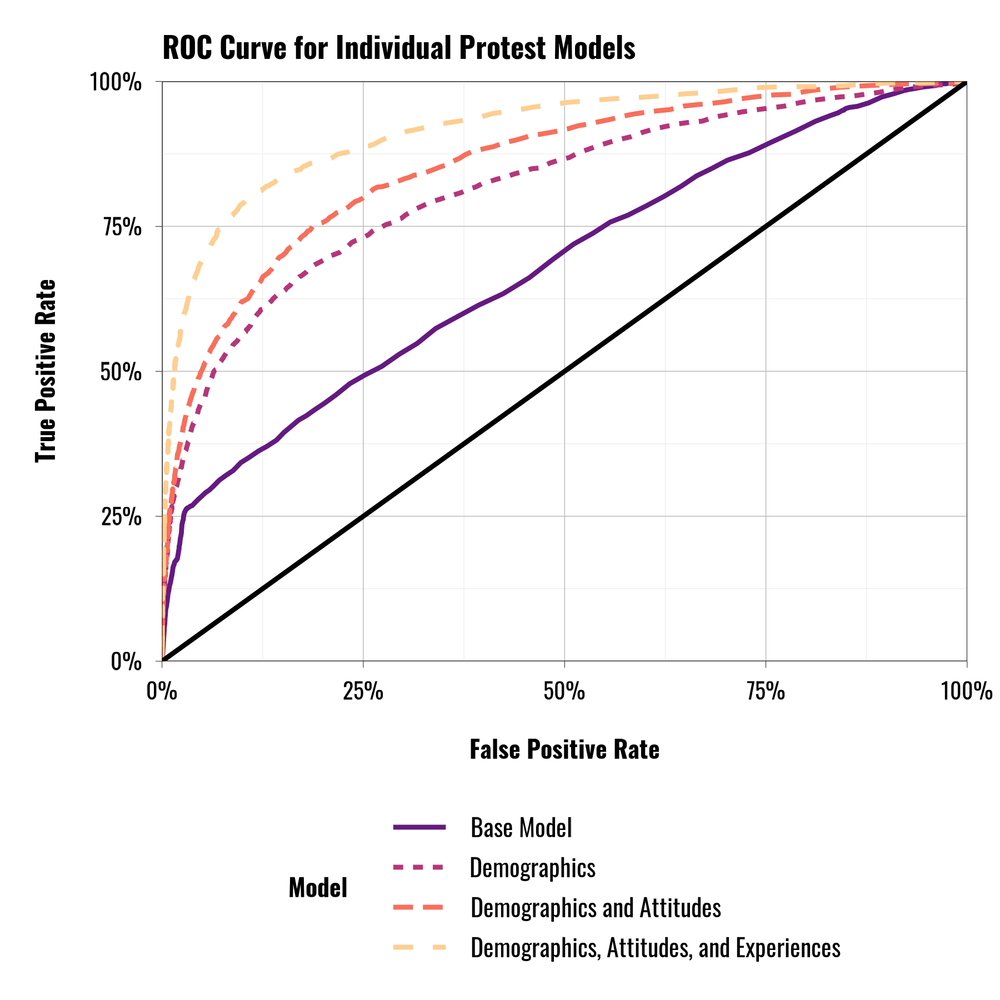
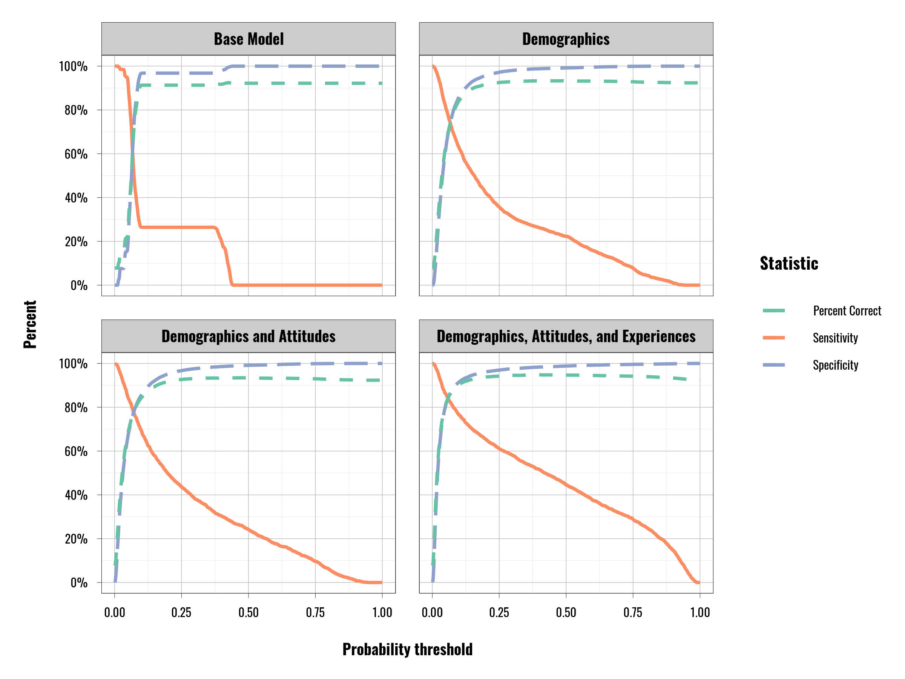
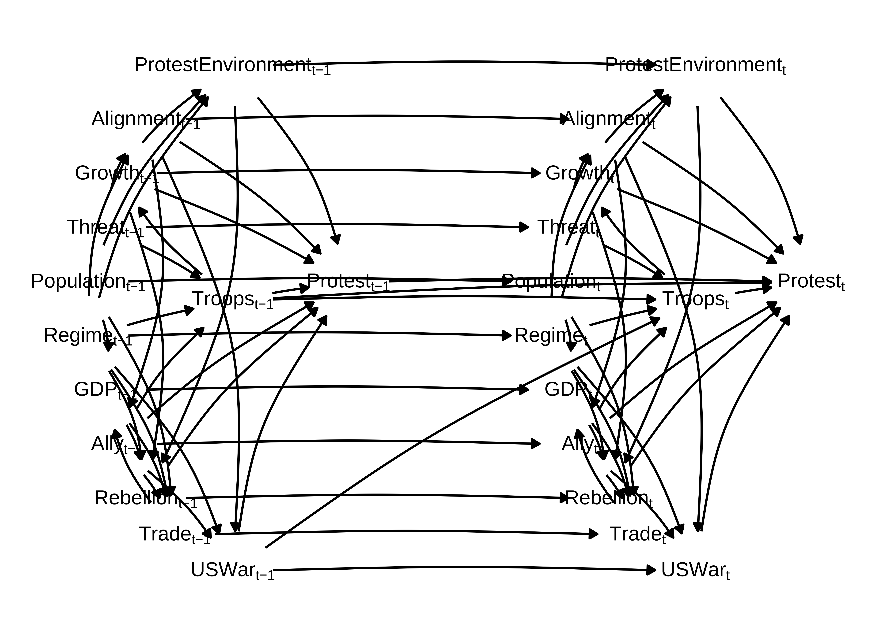
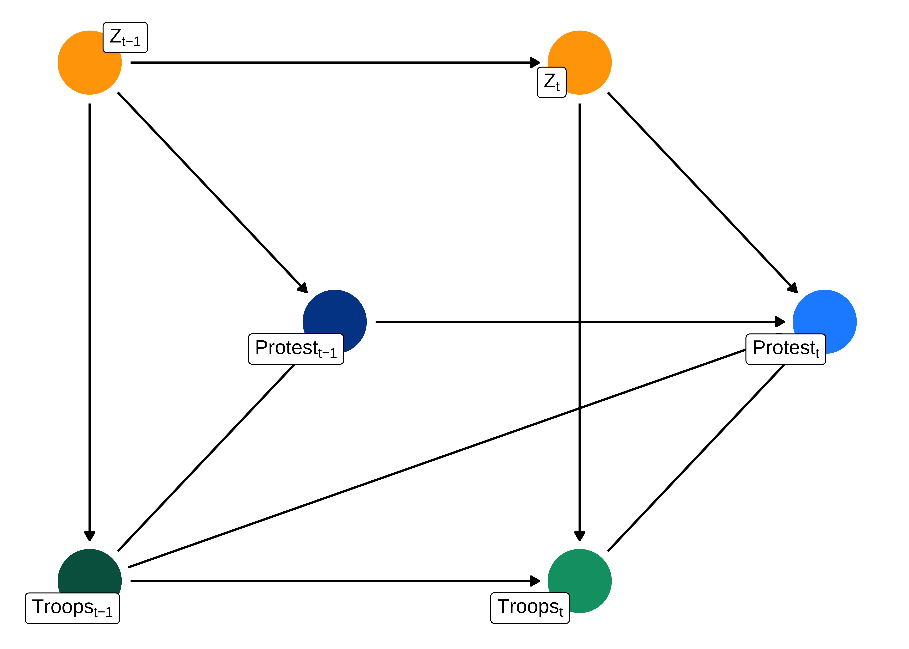

# Deployments and Protest Activity

This chapter provides supplementary information on the book chapter dealing with individual protest behavior and anti-US protest activity at the aggregate level. Mirroring the main manuscript, we will first present supplementary information on the micro-level protest section and then present supplementary information on the macro-level protest section.

## Micro-Level Protest

The individual-level models consist of four separate models that build on one another. We Our focus here is to better understand the individual correlates of protest but also to understand the overall predictive performance of the models. More specifically, while we expect that the models will generally provide a better prediction with the addition of more predictor variables, we are interested in the relative gains from adding particular "blocks" of predictors. These blocks are described in the table below.

<table class="table" style="font-size: 9px; margin-left: auto; margin-right: auto;border-bottom: 0;">
<caption style="font-size: initial !important;">(\#tab:individual-level-summary-table)Predictive Model Specification for Individual Protest Activity \label{tab:protestpredictionvariables}</caption>
 <thead>
  <tr>
   <th style="text-align:left;font-weight: bold;"> Base Model </th>
   <th style="text-align:left;font-weight: bold;"> Demographics </th>
   <th style="text-align:left;font-weight: bold;"> Demographics and Attitudes </th>
   <th style="text-align:left;font-weight: bold;"> Demographics, Attitudes, and Experiences </th>
  </tr>
 </thead>
<tbody>
  <tr>
   <td style="text-align:left;width: 3.0cm; "> Base Count </td>
   <td style="text-align:left;width: 3.0cm; "> Age </td>
   <td style="text-align:left;width: 3.0cm; "> Age </td>
   <td style="text-align:left;width: 3.0cm; "> Age </td>
  </tr>
  <tr>
   <td style="text-align:left;width: 3.0cm; "> GDP </td>
   <td style="text-align:left;width: 3.0cm; "> Education </td>
   <td style="text-align:left;width: 3.0cm; "> Education </td>
   <td style="text-align:left;width: 3.0cm; "> Education </td>
  </tr>
  <tr>
   <td style="text-align:left;width: 3.0cm; "> Population </td>
   <td style="text-align:left;width: 3.0cm; "> Ideology </td>
   <td style="text-align:left;width: 3.0cm; "> Ideology </td>
   <td style="text-align:left;width: 3.0cm; "> Ideology </td>
  </tr>
  <tr>
   <td style="text-align:left;width: 3.0cm; "> Troops in country </td>
   <td style="text-align:left;width: 3.0cm; "> Gender </td>
   <td style="text-align:left;width: 3.0cm; "> Gender </td>
   <td style="text-align:left;width: 3.0cm; "> Gender </td>
  </tr>
  <tr>
   <td style="text-align:left;width: 3.0cm; ">  </td>
   <td style="text-align:left;width: 3.0cm; "> Income </td>
   <td style="text-align:left;width: 3.0cm; "> Income </td>
   <td style="text-align:left;width: 3.0cm; "> Income </td>
  </tr>
  <tr>
   <td style="text-align:left;width: 3.0cm; ">  </td>
   <td style="text-align:left;width: 3.0cm; "> Minority Status </td>
   <td style="text-align:left;width: 3.0cm; "> Minority Status </td>
   <td style="text-align:left;width: 3.0cm; "> Minority Status </td>
  </tr>
  <tr>
   <td style="text-align:left;width: 3.0cm; ">  </td>
   <td style="text-align:left;width: 3.0cm; "> Base Count </td>
   <td style="text-align:left;width: 3.0cm; "> Attitude towards US military presence </td>
   <td style="text-align:left;width: 3.0cm; "> Attitude towards US military presence </td>
  </tr>
  <tr>
   <td style="text-align:left;width: 3.0cm; ">  </td>
   <td style="text-align:left;width: 3.0cm; "> GDP </td>
   <td style="text-align:left;width: 3.0cm; "> Assessment of US influence (Quantity) </td>
   <td style="text-align:left;width: 3.0cm; "> Personal contact </td>
  </tr>
  <tr>
   <td style="text-align:left;width: 3.0cm; ">  </td>
   <td style="text-align:left;width: 3.0cm; "> Population </td>
   <td style="text-align:left;width: 3.0cm; "> Assessment of US influence (Quality) </td>
   <td style="text-align:left;width: 3.0cm; "> Network Contact </td>
  </tr>
  <tr>
   <td style="text-align:left;width: 3.0cm; ">  </td>
   <td style="text-align:left;width: 3.0cm; "> Troops in country </td>
   <td style="text-align:left;width: 3.0cm; "> Base Count </td>
   <td style="text-align:left;width: 3.0cm; "> Personal benefits </td>
  </tr>
  <tr>
   <td style="text-align:left;width: 3.0cm; ">  </td>
   <td style="text-align:left;width: 3.0cm; ">  </td>
   <td style="text-align:left;width: 3.0cm; "> GDP </td>
   <td style="text-align:left;width: 3.0cm; "> Network benefits </td>
  </tr>
  <tr>
   <td style="text-align:left;width: 3.0cm; ">  </td>
   <td style="text-align:left;width: 3.0cm; ">  </td>
   <td style="text-align:left;width: 3.0cm; "> Population </td>
   <td style="text-align:left;width: 3.0cm; "> Personal experience with troops and crime </td>
  </tr>
  <tr>
   <td style="text-align:left;width: 3.0cm; ">  </td>
   <td style="text-align:left;width: 3.0cm; ">  </td>
   <td style="text-align:left;width: 3.0cm; "> Troops in country </td>
   <td style="text-align:left;width: 3.0cm; "> Network experience with crime </td>
  </tr>
  <tr>
   <td style="text-align:left;width: 3.0cm; ">  </td>
   <td style="text-align:left;width: 3.0cm; ">  </td>
   <td style="text-align:left;width: 3.0cm; ">  </td>
   <td style="text-align:left;width: 3.0cm; "> Assessment of US influence (Quantity) </td>
  </tr>
  <tr>
   <td style="text-align:left;width: 3.0cm; ">  </td>
   <td style="text-align:left;width: 3.0cm; ">  </td>
   <td style="text-align:left;width: 3.0cm; ">  </td>
   <td style="text-align:left;width: 3.0cm; "> Assessment of US influence (Quality) </td>
  </tr>
  <tr>
   <td style="text-align:left;width: 3.0cm; ">  </td>
   <td style="text-align:left;width: 3.0cm; ">  </td>
   <td style="text-align:left;width: 3.0cm; ">  </td>
   <td style="text-align:left;width: 3.0cm; "> Base Count </td>
  </tr>
  <tr>
   <td style="text-align:left;width: 3.0cm; ">  </td>
   <td style="text-align:left;width: 3.0cm; ">  </td>
   <td style="text-align:left;width: 3.0cm; ">  </td>
   <td style="text-align:left;width: 3.0cm; "> GDP </td>
  </tr>
  <tr>
   <td style="text-align:left;width: 3.0cm; ">  </td>
   <td style="text-align:left;width: 3.0cm; ">  </td>
   <td style="text-align:left;width: 3.0cm; ">  </td>
   <td style="text-align:left;width: 3.0cm; "> Population </td>
  </tr>
  <tr>
   <td style="text-align:left;width: 3.0cm; ">  </td>
   <td style="text-align:left;width: 3.0cm; ">  </td>
   <td style="text-align:left;width: 3.0cm; ">  </td>
   <td style="text-align:left;width: 3.0cm; "> Troops in country </td>
  </tr>
</tbody>
<tfoot><tr><td style="padding: 0; " colspan="100%">
1 Each model include varyings intercepts for country and year. All models also include the primary predictor variables as varying coefficients across the country grouping.</td></tr></tfoot>
</table>

In each of these models we estimate both population average or "fixed" effects, and also estimate varying effects for the primary predictors by country. This means that we are relaxing the assumption that there is a constant relationship between predictor variables and protest across countries.^[We add an additional layer of flexibility to the models by allowing correlation between all of the varying or ``random'' effects to vary as well. This relaxes the assumption that the correlation between these effects is 0 and allows the model to estimate each instead.] Table \@ref(tab:individual-level-summary-table) provides an overview of the specifications of these five models. The varying coefficients vary by country only and not by year. 

Our focus in using these models is to assess how good they are at predicting actual protest behavior. To do this, we divide our data into two samples: a training sample and a test sample This step helps to ensure that we are not overfitting our model to the particular data that we have collected. In other words, it ensures that the model is indeed a general one and not just one that works only with the data from the specific individuals we surveyed. This step also allows us to assess how well our model can predict protest when we test it out on "new" data that were not used to estimate the model (the "test sample" that we referred to earlier). 

Because we know some characteristics of the underlying populations, we group our opinion data according to the individual representative characteristics (age, income, gender, and respondent's country). We then randomly assign 80\% of the observations to the training data and the remaining 20\% to the test data. Given the relative infrequency of some response categories for questions like religious or gender self-identification, we opted to give more weight to the training data in order to give the model more information.  This ensures that both the training data and the test data are representative of these same variables. We use the training data to fit the models we present below. Once we fit the models, we use the test data to assess how accurate the models are at predicting protest.

In the main text we present a series of initial predictive diagnostics. When assessing the primary models we predict protest responses as being a "Yes" if the median predicted probability value is $\geq$ 0.50 and "No" if the median value is less than this threshold. This represents a fairly conservative assessment tool, but in this appendix we explore alternative prediction thresholds.

To put it differently, setting too high a barrier for inclusion in the "Yes" category is also problematic as it means we miss an increasingly large share of cases. There are practical considerations in devising such a threshold as well. For example, if we found that the true probability of protesting were to be a 10\% chance, then we would be wrong nine of ten times. However, our model provides information that these cases stand out from even lower-probability observations. 

Part of the decision calculus in choosing a threshold is judging the utility of having more false-positive or false-negatives and how that informs decision-making or policymaking. If a policymaker wants to guard against protests, then increasing the number of false positives to capture the true positives is worthwhile. However, if the event itself is non-consequential or involves a severe policy response, then we should up our threshold and accept a higher number of false negatives. For example, suppose individuals who did not protest were subject to intensive surveillance or harassment because authorities *believed* they were involved in protests. In that case, this sort of policy response could easily backfire and become a self-fulfilling prophecy that makes protest behavior *more likely*. 

Looking at Table \@ref(tab:percent-correct-targeted), we can see that lower classification thresholds generate relatively comparable figures for specificity and overall correct predictions across all models while yielding much better performance on the sensitivity metric. Using a lower probability threshold for determining which observations fall into the "Yes" category can thus improve overall predictive accuracy.

Table \@ref{tab:percent-correct-targeted} shows the models' predictive accuracy when we use 0.10 as the probability threshold for predicting individuals' protest experience. In general, the overall percent of observations correctly predicted remains fairly high but has declined slightly. We also see the false positive rate has increased, which we should expect from having a much lower threshold. More importantly, the sensitivity score has increased substantially across each model. The minimum here is approximately 41\%, with a high of 77\%. In other words, using a lower probability threshold, our final model is correctly classifying three-quarters of cases where individuals report having participated in anti-US protest events. Again, this increase does come with a cost. The lower overall rate of correct predictions results from the slight decrease in the correct predictions of ``No'' responses. The increased false-positive rate also reflects this. 

(\#fig:protest-roc-plot)Receiver operating characteristic curve plot for individual-level protest models.

From the curves presented in Figure \@ref{fig:protest-roc-plot} we can see that there is indeed substantial variation in model performance when we account for the full range of probability thresholds. Ideally, we would want to see a model's curve spike up to 100\% immediately on the left side of the figure, but none of the models come close to this ideal type. The Intercept Only model performs the worst of the five, as we expect. Again, however, we see substantial improvements as we add demographic variables, and then demographic, attitudinal, and experiential variables. Ss this figure helps to make clearer, the relative performance of the three more complex models---including the one allowing for varying coefficient estimates---is nearly identical, with a very slight edge to the varying coefficient model. Ultimately, all of the models perform better than a simple random assignment mechanism. Still, some are clearly doing a better job of accurately classifying cases of protest involvement while sacrificing less in generating a larger share of false positives.

(\#fig:fig-pvalue-comparison)Figuring showing the percent predicted correctly, sensitivity, and specificity across different prediction categorization probability thresholds.

The disadvantage of the ROC plot is that it obscures the specific probability values and the trade-off between the different aspects of model performance that we seek to maximize. Figure \@ref(fig:protest-pvalue-compare) plots the sensitivity, specificity, and percent predicted correctly figures across the range of possible classification probability thresholds. In general, higher probability thresholds make it more difficult for a given observation to make it into the "Yes" category. Conversely, lower thresholds mean that we are more likely to classify observations as "Yes". This is a seemingly trivial point, but it is worth reiterating because there is nothing special about the 0.50 threshold we use above---it is simply a convention of sorts and seemingly "neutral". But as we can see from Figure \@ref(fig:protest-pvalue-compare) the trade-offs associated with moving between various probability thresholds are not all equal. In this case, our initial na\"{i}ve threshold of 0.50 sacrifices a considerable amount of performance on the sensitivity metric for relatively little gain on the specificity and overall correct prediction metrics. The percent of cases predicted correctly actually starts to decline slightly as we increase the probability threshold.

As one last check on our models' performance, Figure \@ref(fig:ppcheck-individual-protest) shows the results of a set of posterior predictive checks using the five protest models discussed in this section. We generate 1,000 simulated data sets for each model, each containing simulated predicted Yes/No values for the outcome variable. For each data, set we take the mean value of these predictions, giving us the proportion of each simulated data set where the model predicts individuals to have responded "Yes" to the outcome variable question. The light blue histograms in each panel show the distribution of these predicted proportion values. The dark line shows the actual proportion of "Yes" responses in the real survey data. The narrow bands on the X-axis somewhat mask the fact that the actual distribution of simulated values is fairly narrow in every case. All five models produce reasonably close approximations of the real data, though the mean values are slightly below the actual mean value in every panel except the Intercept Only model. The model including only respondents' demographic characteristics produces the closest set of simulated values, though with slightly greater dispersion than the other more complex and fully specified models. 

## Macro-Level Protest

In the book's main text we show a series of models that examine the predictors of anti-US and anti-US military protest events for a sample of country-years ranging from 1990--2018. We are fundamentally interested in exploring whether the presence of US military forces in another country *causes* an increase in protest activity directed at the United States, or more narrowly, at the US military forces in the host country. While this may seem obvious, the identification of actual causal effects is a fairly complicated task. The presence of US military forces in a state may coincide with several other types of events that could explain both the US military presence and the outbreak of protests. Furthermore, the outbreak of protests at any given point in time may be driven by an accumulation of historic factors that pre-date the observed time period. Our purpose in this section is to elaborate upon the analytical tools and the process we use to deal with these issues.

While the first set of macro-level protest models we present in the book provide a useful starting point in exploring the relationship between the presence of US military deployments and protest activity, we cannot make causal claims on the basis of these results. Basic regression models typically only provide estimates of short-term effects. Further, while the US has a expansive military footprint, the histories of these deployments are highly variable across countries. This can severely bias the estimates from our model as not every country has an equal opportunity of experiencing US military deployments—both in terms of hosting them and the size of those deployments. Finally, as is often the case, the relationship between military deployments and protest events may suffer from confounding effects. Other variables may exert a causal effect on both of our variables of interest. Accordingly, modeling protest events as a function of military deployments and adjusting for many other variables will not yield results that have any meaningful interpretation as causal effects. 

To address these problems, we estimate a marginal structural model (MSM) to estimate the causal effects of US miliary deployments on protest [@Robinsetal2000,@BlackwellGlynn2018]. These models have a relatively long history of use in fields like biostatistics and epidemiology and can be used to help estimate causal effects in observational studies where exposure to treatments varies across space and time. We can also use this to help us estimate the contemporaneous effect of treatment and the more general effect of a particular treatment history. However, MSMs require us to do some additional work before estimating the effects of troop deployments and their histories on the outcome of interest. There will likely be systematic differences between the individual countries that receive troop deployments or larger deployments and those that receive no or smaller deployments.

Figure \@ref(fig:dagtroops) presents a directed acyclic graph (DAG) depicting the basic contemporaneous relationships between the variables of interest and their relationships between two time periods, $t$ and $t+1$ (which is the period directly following t). To ease interpretation, we present a simplified version of the full DAG. We condense most of the time-variant and time-invariant predictor variables down to the time-invariant covariates ($Z$ terms). We also only present two periods, but the chain of events theoretically runs back to the first observation of $t$ in the series. The light blue node represents the outcome of interest (protests), while the light green node represents the treatment of interest (troops). Any node connected to another indicates a proposed causal relationship, and the direction of the arrow represents the direction of that relationship. Additionally, troop deployments in a given period (what we refer to as time $t$) are heavily dependent on deployments in the previous period (time $t-1$). Deployments at time $t-1$ are also likely to affect other predictor variables in subsequent periods. We must estimate a series of structural weights for each observation for the final regression model to resolve this. We calculate these weights using the formula found in the Appendix section \@ref{eq:structuralweights}.

More simply, the weights shown in Equation \@ref(eq:structuralweights) are a form of propensity score that we can use to re-balance the observations in our data. This is simply a variant of the inverse probability of treatment (IPTW) weighting method.^[For more information on estimating propensity scores see: @ImbensRubin2015 Chapter 13] Normally, estimating propensity scores is a relatively straightforward process as it is commonly used to estimate scores in data where the treatment, and often the outcome, are binary (meaning 0 or 1) variables. The fact that our treatment (the number of US troops present in a country) is continuous (meaning that it can, in theory, take on any integer value that is 0 or greater) complicates this process slightly.^[For a fuller discussion of estimating the inverse probability of treatment weights for MSMs, estimating these weights for continuous treatment variables, or estimating weights for a continuous treatment in the presence of multilevel/grouped data using multilevel models see the following works: @ColeHernan2008,@vanderwalGEskus2011,@Naimietal2014,@SchulerChuCoffman2016] 

To generate these weights we first have to estimate two separate models wherein troop deployments themselves are the outcome of interest. The first of these models (the numerator) is relatively straightforward to estimate. Here we are running a regression model wherein we predict the size of the troop deployments in country $i$ at time $t$ as a function of a one-unit lag of the troop deployment variable, the cumulative sum of troop deployments in the country $i$ from the beginning of its series up through time $t-2$, and a range of time-invariant covariates, $Z$. In cases where researchers are working with just a binary treatment variable and only a single period, using ``1'' as the numerator is often all that is required. However, since we are dealing with a continuous treatment variable, generating the numerator using this regression-based approach can help to stabilize the resulting weights by ensuring that the ratios are not enormous.\cite{ColeHernan2008}

The second model (the denominator) is more complicated. In most respects, it is identical to the numerator, except the gamma ($\gamma$) term, which denotes a vector of covariates---the key here is that these covariates have to be sufficient to meet the sequential ignorability criteria. In essence, this requires that there is no unmeasured confounding between the treatment (troops) and the outcome (protests\index{protest}).\cite[The language on this point can be confusing given that these techniques were developed across several different literatures and disciplines and compounded by the fact that they often did not speak to one another. To put it in slightly different terms using language from Pearl, this set of covariates must ensure that Pr$ (Y_{it} \Perp X_{it} | \gamma, Z_{i}) $.][That is, the outcome is conditionally independent of the treatment, conditional upon the time-varying covariates ($\gamma$) and the time-invariant covariates ($Z$).]{Pearl2009} We will return to this below, but once we have both of these models, we then generate two sets of predicted values and residuals for each observation in the data set---one using the numerator and one using the denominator. For each set of predictions and residuals, we calculate the probability of the actual observed value of troops in country $i$ at time $t$ using the predictions and the standard deviation of the residuals as the mean and standard deviation of a normal probability density function. We then divide the values generated using the numerator figures by the values generated by the numerator. The actual structural weight for any given observation is the cumulative product of these ratios for country $i$ from the beginning of that country's series up through time $t$. 

But, as we note above, estimating the second model is complicated because we need a set of covariates that ensure there is no unmeasured confounding between the treatment and outcome variables. To aid in this process, we turn to another tool---directed acyclic graphs (DAGs). Like with MSMs, scholars from other disciplines have more commonly used DAGs (such as computer science and epidemiology), and they serve a variety of useful purposes. First, they help make explicit the wider array of theorized causal relationships between various predictor variables. Second, assuming a well-developed theoretical model, they can also help to identify sources of confounding and bias.\cite[See:][Keele et al. offer a fuller discussion of DAGs and their applications.]{Pearl2009,MorganWinship2015,KeeleStevensonElwert2020} Related, they can be used to identify which variables need to be adjusted for in a statistical model to close off the ``back-door'' paths between the treatment variable and the outcome that serve as the sources of confounding in the model, but also to ensure that we do not adjust for variables that may open up such informational pathways between the treatment and outcome and introduce additional sources of bias (i.e. collider bias).\cite[][we use the {\tt dagitty} package in {\tt R } to build our DAG and to identify possible adjustment sets.]{Pearl2009,Textoretal2016}

\begin{figure}[t]
	\centering\includegraphics[scale=0.8]{../../Figures/Chapter-Protests/fig-dag-protest-simple.png}
	\caption{Directed Acyclic Graph (DAG) showing the theoretical model of protest\index{protest} across time periods.}
	\label{fig:dagtroops}
\end{figure}

Using this model as our starting point, we can generate several adjustment sets---variables that will ensure there is no unmeasured confounding when included in the model. Notably, this rests entirely on the notion that we have the ``right'' theoretical model. We can use many possible adjustment sets given the current model, but they all accomplish the same basic task. If we have included causal relationships in our theoretical model that do not exist, or if we have omitted key causal relationships that \textit{do} exist, then the implications of the model and our ability to isolate causal effects may change. How these changes would affect our ability to assess the causal relationships we are proposing depends entirely on the specific connections that would change. Assuming for present purposes that our model is sufficient, we can now estimate the denominator described in Equation \ref{eq:structuralweights}.

Once we have calculated the structural weights using this method, we can now estimate the average treatment effect (ATE) of troop deployments on protest\index{protest} activity. To do so, we estimate a series of multilevel negative binomial regressions predicting the number of protests\index{protest} in a country year using the troop deployment variable and treatment history (i.e. the cumulative sum of deployments through time $t-2$) as predictor variables.\cite[For more information on the use of multilevel models for causal inference see:][]{Hill2013}  Notably, these models weight the observations according to the structural weights we calculated above. US military deployments are generally stable \textit{within} countries, with substantial variation \textit{between} countries. For example, Germany's\index{Germany} troop levels are high and relatively stable over the period that we study. In other cases, troop levels are low but also relatively stable. There are, however, some cases where troop levels increase and decrease radically at various points throughout 1990--2018. These sudden changes are typically associated with large military operations, like the 1999 war in Kosovo\index{Kosovo} or the 2003 Iraq War\index{Iraq War}. This extreme variability makes estimating the outcome models somewhat difficult because we have extremely large weights for a small set of observations. To address this problem, we estimate the models multiple times using several different truncation points for the weights to better assess the sensitivity of our estimates to the weighted sample. The weights effectively create a pseudo sample of data by replicating observations according to their score. For example, an observation with a score of 4 would be copied four times when we run the model. Given these cases where we see very rapid and extreme changes in US military deployment levels, we encounter a situation where the weights are often enormous (such as weighting scores of 50,000$+$). There is some question about the proper size of the weights and how to deal with very large or very small weights. Because we are dealing with some exceptionally large weights, we estimate our outcome model multiple times using different truncation points to cut down on the number of extreme values and to assess how sensitive our estimates of the ATE are to changes in the weights.\footnote{There is no clearly ``correct'' way to deal with extreme weight values. Cole and Hernan note that in the context of binary treatment variables, the average of the weights should be approximately 1. Still, beyond this, there is relatively little guidance of which we are aware \cite{ColeHernan2008}. One approach is to trim weight scores, which we employ here. Specifically, we set multiple thresholds at 10, 50, 500, 1,000, 5,000, and 10,000. Observations, where the calculated weight falls above the threshold reset to the maximum threshold. For example, when estimating our models using the 500 threshold, a structural weight calculated to be 1,000 would be re-coded to be 500. This approach is useful in that it does not require us to throw away data. There is a clear gain in efficiency due to increasing the effective number of observations, but too few or too many pseudo observations can bias the estimates. Hence, we present all of these points to assess bias and sensitivity.} We display this information below in the results section.

## Protest DAG

The 

(\#fig:protest-dag)Simplified Directed Acyclic Graph (DAG) illustrating the theoretical relationships between the treatment, confounders, and outcome variables.

(\#fig:unnamed-chunk-1)Simplified Directed Acyclic Graph (DAG) illustrating the theoretical relationships between the treatment, confounders, and outcome variables.

